# Browser History Analysis Using Browser History Viewer

This workflow demonstrates practical browser artifact analysis using **Browser History Viewer (BHV)** to examine web browsing history, cached images, downloaded files, and surrounding user activity.

In this investigation, I will be analyzing browser history artifacts from a Windows system to determine what browsers were used, what websites were visited, whether the user accessed social media platforms, what cached web content was preserved, and how a suspicious downloaded file likely reached the system. The goal is not only to answer the lab questions, but to understand how browser artifacts can help reconstruct user behavior and support a forensic conclusion. We were able to acquire key browser files via KAPE, and I am to analyze them and discover the malicious site that hosted the malware so we can take defensive measures and block it. The main tool used in this workflow is:

- **Browser History Viewer (BHV)** — a forensic analysis tool used to parse and review browser artifacts from multiple web browsers in one interface. Browser artifacts can include visited URLs, page titles, timestamps, cached images, browser profiles, and local file references. These records are useful because they can show what websites a user visited, what web content was loaded, what files were downloaded, and what activity occurred immediately before or after a suspicious event.

The scenario is that an employee system has been provided for review. The company has a policy against employees visiting social media sites on corporate devices, and a suspicious file was downloaded to the system. I am responsible for reviewing the browser artifacts to determine which browsers were used, identify policy-related activity, examine cached web content, and reconstruct the likely path that led to the suspicious download.

> **Workflow vs Execution vs Writeup (Terminology Used Here)**  
> - **Workflows** refer to repeatable digital forensic tasks such as memory acquisition, process memory dumping, disk imaging, and artifact collection.  
> - **Executions** refer to the hands-on use of forensic tools such as FTK Imager, ProcDump, and KAPE to acquire evidence.  
> - **Writeups** document acquisition steps, analyst observations, tool usage, evidence handling decisions, and forensic reasoning.

> 👉 For a **detailed, step-by-step walkthrough of how this workflow was executed — complete with screenshot placeholders**, see the **[Step-by-Step Execution](#step-by-step-execution)** section below.

The main tool used is: **Browser History Viewer (BHV)**. See the **[Environment and Execution Context](#environment-and-execution-context)** section below.

---

### Overview

This project focused on examining browser artifacts to reconstruct activity associated with web browsing and a suspicious file download.

1. The investigation began by loading a browser history capture into Browser History Viewer. A browser history capture is a collected set of browser artifacts from a system. Instead of manually opening each browser's database or cache location, BHV allows an analyst to load the capture and review browser activity from multiple browsers in one place.

<blockquote>
This matters because users may use more than one browser. If an analyst only checks Chrome, for example, they may miss activity stored in Edge or Internet Explorer artifacts. Reviewing the full capture helps avoid an incomplete investigation.
</blockquote>

2. The investigation then moved into browser profile identification. The **Web Browser (Profile)** column was reviewed to determine which browsers were represented in the evidence. This step established the scope of browser activity available for analysis.

<blockquote>
This matters because the browser name helps explain where the artifact came from. It also allows an analyst to determine whether the same activity occurred in one browser or across multiple browsers.
</blockquote>

3. Website history was then reviewed to identify social media activity and suspicious web activity. Website history records are useful because they preserve URLs, page titles, timestamps, and visit counts. These records can show what websites were accessed and when.

4. Cached images were reviewed to recover visual content loaded by the browser. Cached images can preserve evidence of webpage content even when the analyst does not have access to the live page.

5. Finally, download-related browser records were examined to identify a suspicious file, determine where it was saved, locate the hosting URL, and reconstruct the most likely user activity that led to the download.

This workflow demonstrates how browser history, cached content, and download artifacts can be analyzed separately and then correlated together to reconstruct user activity.

> **Workflow vs Execution vs Writeup (Terminology Used Here)**  
> - **Workflows** refer to repeatable digital forensic procedures, such as reviewing website history, analyzing cached images, or correlating download activity.  
> - **Executions** refer to the hands-on use of a forensic tool such as Browser History Viewer against provided evidence.  
> - **Writeups** document the analyst's process, observations, reasoning, tool usage, and conclusions.

> 👉 For this workflow, the goal was not only to record answers. The goal was to understand what each browser artifact revealed, why each artifact was examined, and how the findings supported the overall reconstruction of suspicious activity.

---

### Purpose and Analyst Focus

#### ▶ Purpose

The purpose of this workflow is to demonstrate how browser artifacts can be used to reconstruct user activity, identify policy violations, recover cached web content, and investigate a suspicious file download.

Rather than treating each browser record as an isolated answer, this workflow uses browser artifacts as evidence. Each artifact type contributes a different part of the investigation.

For example:

- Browser profile information helped identify which browsers were used.
- Website history helped identify visited websites and social media activity.
- Cached images helped recover visual content viewed or loaded by the browser.
- Download-related records helped identify the suspicious file and where it was downloaded from.
- Timeline analysis helped infer the likely source of the malicious URL.

This type of artifact correlation is important because browser history alone may show that a URL was visited, but surrounding activity can explain how the user likely arrived there.

#### ▶ Analyst Focus

The analyst focus is on understanding what evidence can be extracted from browser artifacts and how that evidence supports a forensic conclusion.

This includes:

- understanding what Browser History Viewer is used for,
- loading a browser history capture,
- identifying browser profiles represented in the evidence,
- reviewing website history records,
- interpreting URLs, page titles, timestamps, and visit counts,
- identifying social media activity from web history,
- understanding what cached images are,
- using cached image timestamps and filenames to locate relevant visual content,
- using keyword filtering to reduce noise,
- identifying downloaded files from browser records,
- distinguishing between local file paths and remote URLs,
- correlating download activity with surrounding browser activity,
- identifying the likely source of a malicious URL,
- identifying the domain where the suspicious file was downloaded from,
- documenting browser-based findings in a repeatable forensic workflow.

The goal is not just to click through Browser History Viewer and copy answers. The goal is to understand what each browser artifact proves, what it does not prove, and why the next step in the workflow makes sense.

---

### What This Workflow Demonstrates

This workflow demonstrates how to:

- Load a browser history capture into Browser History Viewer.
- Review browser activity across multiple browser profiles.
- Identify browsers used on a system.
- Analyze website history records.
- Identify social media sites visited by a user.
- Understand why social media activity may matter in a corporate investigation.
- Review cached image artifacts.
- Locate cached images by timestamp and filename.
- Use cached visual content to recover webpage evidence.
- Filter browser history by keyword.
- Identify YouTube activity from browser records.
- Identify local file references associated with downloads.
- Identify a suspicious downloaded ZIP file.
- Trace a downloaded file back to a remote hosting URL.
- Review surrounding browser activity to infer the likely delivery source.
- Identify the external domain hosting a suspicious file.
- Correlate browser artifacts into one activity timeline.

This workflow also demonstrates an important digital forensics concept: browser artifacts can show both direct evidence and contextual evidence. A download URL may show where a file came from, while the surrounding history may help explain how the user likely reached that URL.

---

### Investigation and Digital Forensics Relevance

Web browsers are one of the most important sources of user activity evidence on modern systems. Users access email, cloud storage, social media, search engines, communication platforms, and file downloads through browsers.

Because of this, browser artifacts can be especially useful during digital forensic investigations.

Browser history can reveal what websites were visited. Cached images can preserve visual evidence from webpages. Download records can reveal what files were obtained from the internet and where those files were saved. Browser profile information can show which browser generated the evidence.

The table below summarizes the role of each artifact source in this workflow:

| Artifact | What It Can Reveal | Why It Matters |
|---|---|---|
| Browser Profile Records | Browser used to generate the activity | Helps identify the browser source of evidence |
| Website History | URLs, page titles, timestamps, visit counts | Helps reconstruct user browsing activity |
| Cached Images | Webpage images stored locally by the browser | Helps recover visual evidence from viewed webpages |
| Download Records | Downloaded filenames, local paths, source URLs | Helps determine how suspicious files reached the system |
| Timeline Context | Activity immediately before and after a download | Helps infer the likely delivery source or user path |

These artifacts are useful because they support different investigative questions:

- What browsers were used?
- What sites did the employee visit?
- Was there social media activity?
- What visual webpage content was cached?
- What suspicious file was downloaded?
- Where was the file downloaded from?
- What activity occurred immediately before the download?
- What is the likely source of the malicious URL?

By moving from browser profile identification to website history, cached images, download artifacts, and timeline correlation, the workflow follows a logical evidence path:

1. Identify the browser sources.
2. Review user web activity.
3. Identify policy-related browsing.
4. Recover cached visual content.
5. Identify the suspicious download.
6. Trace the download to a hosting URL.
7. Correlate the surrounding timeline.
8. Document the likely source and malicious domain.

---

### Environment and Execution Context

This section documents the tools, evidence sources, and execution environment used during the workflow.

**Note:** Each section is collapsible. Click the ▶ arrow to expand and view details on software, evidence sources, workflow scope, and the high-level execution map.

<details>
<summary><strong>▶ Environment & Platform</strong><br>
</summary><br>

The workflow was performed in a Windows-based forensic training environment.

The primary evidence directory was:

```text
C:\Users\IEUser\Desktop\Windows Investigation Two
```

The relevant evidence folder was:

```text
C:\Users\IEUser\Desktop\Windows Investigation Two\Capture
```

Browser History Viewer was launched from the lab environment and used to load the provided browser history capture.

> **Note:** Relationship to Browser Artifacts and Forensic Evidence:
>
> Browser artifacts are records created by web browsers during normal user activity. These artifacts may include browsing history, cached files, download records, cookies, form data, and profile-specific metadata. Even if a user closes the browser or deletes a file after downloading it, browser artifacts may still preserve evidence of the activity.
>
> In a real-world investigation, analysts would normally examine these artifacts from a forensic image or collected evidence package rather than directly from a live system. This helps preserve evidence integrity and prevents accidental changes to the original device.

The artifacts examined in this workflow would normally be extracted from browser profile locations within a forensic image. For example:

| Artifact | What It May Contain |
|---|---|
| Website History | Visited URLs, page titles, visit timestamps, visit counts |
| Cached Images | Images retrieved and stored by the browser while loading webpages |
| Download Records | Downloaded filenames, source URLs, local save paths, timestamps |
| Browser Profiles | Browser-specific activity tied to Chrome, Edge, Internet Explorer, or other profiles |

> **Note:** This workflow focuses on the browser artifact analysis portion of the investigation rather than forensic acquisition. In a real investigation, a tool such as FTK Imager, Magnet Acquire, EnCase Imager, or another acquisition utility may be used first to preserve the source evidence before analysis.

The workflow focuses on analyzing three main evidence areas within Browser History Viewer:

- Website history
- Cached images
- Download-related browser records

Together, these artifacts provide valuable insight into user behavior, policy violations, webmail access, suspicious downloads, and possible malware delivery paths.

</details>

<details>
<summary><strong>▶ Evidence Sources Reviewed</strong><br>
</summary><br>

The following evidence sources were reviewed:

| Evidence Source | Purpose |
|---|---|
| Browser history capture | Load browser artifacts into BHV |
| Website History tab | Review visited URLs, page titles, timestamps, browser profiles, and visit counts |
| Cached Images tab | Review locally cached web images and associated metadata |
| URL records | Identify visited websites and suspicious download sources |
| Local file references | Identify downloaded files and local save paths |

Each evidence source contributed a different part of the overall user activity reconstruction.

</details>

<details>
<summary><strong>▶ Tooling Used</strong><br>
</summary><br>

The tool used during execution was:

- **Browser History Viewer (BHV)** — used to parse and review browser history, cached images, browser profiles, URL records, and download-related artifacts.

</details>

<details>
<summary><strong>▶ Workflow Map (High-Level)</strong><br>
</summary><br>

1. Launch Browser History Viewer.
2. Load the provided browser history capture.
3. Select the `Capture` folder from the Windows Investigation Two evidence directory.
4. Review the Website History tab.
5. Identify browsers represented in the `Web Browser (Profile)` column.
6. Review website history for social media activity.
7. Use URL and title records to identify visited social platforms.
8. Review the Cached Images tab.
9. Locate cached image activity by timestamp and filename.
10. Review the selected cached image to extract email-related visual evidence.
11. Use keyword filtering to locate YouTube history records.
12. Identify the full YouTube music video URL.
13. Review local file references to identify downloaded files.
14. Identify the suspicious downloaded ZIP file.
15. Search for the suspicious filename to locate the remote hosting URL.
16. Review browser activity around the download timestamp.
17. Correlate Outlook webmail activity with the download event.
18. Identify the likely source of the malicious URL.
19. Identify the domain where the malware was downloaded from.
20. Summarize findings and correlate browser artifacts.

</details>

---

### Step-by-Step Execution

This section documents the workflow in the same order an analyst would realistically perform the browser artifact review.

The workflow begins with loading the browser history capture because BHV needs to parse the evidence before records can be reviewed. It then moves into browser identification, website history analysis, cached image review, keyword filtering, download analysis, and timeline correlation.

**Note:** Each section is collapsible. Click the ▶ arrow to expand and view the detailed steps.

<details>
<summary><strong>▶ Phase 1 — Load Browser History Capture into Browser History Viewer</strong><br>
→ preparing browser artifacts for analysis
</summary><br>

This phase focused on loading the provided browser history capture into Browser History Viewer.

<blockquote>
I started by loading the browser history capture because browser artifacts are not useful until they are parsed into a readable format. Browser History Viewer provides a single interface for reviewing activity from multiple browsers, which makes it easier to compare activity across browser profiles and timelines.
</blockquote>

##### 🔷 Phase 1.1 — Review the Evidence Directory

Before loading the browser artifacts into Browser History Viewer, I reviewed the contents of the provided evidence directory.

The capture folder contained browser-related data associated with multiple web browsers, including:
- Chrome
- Edge
- Firefox
- Internet Explorer

This was useful because it provided an initial indication of the browser sources available within the evidence set.

At this stage, I was not concluding that all four browsers had necessarily been used by the employee. The presence of browser-related artifacts only indicated that data associated with those browsers existed within the capture.

The purpose of this review was to understand the scope of the available evidence before loading it into Browser History Viewer.

<blockquote> This distinction is important because the presence of browser artifacts does not automatically prove browser usage. Additional analysis is required to determine whether activity records actually exist for a particular browser profile. </blockquote>

<p align="left">
  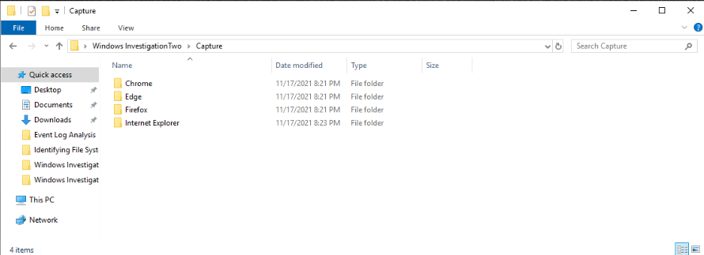<br>
  <em>Figure 1: Viewing all web browsers that have been used by the employee</em>
</p>

> **Note:** Before loading the artifacts into Browser History Viewer, I reviewed the contents of the browser capture. Each browser folder contained two primary directories:
>
> ```text
> Cache
> History
> ```
>
> The **Cache** directory stores temporary web content downloaded by the browser, such as images, webpage graphics, icons, scripts, style sheets (CSS), and other resources used to render webpages. These artifacts can sometimes preserve evidence of content that was viewed by the user.
>
> The **History** directory contains browser artifacts that record user activity and browser state information. Examples observed within the evidence included:
>
> - **Cookies** — Small files created by websites that store session information, authentication data, user preferences, and tracking information.
> - **Current Session** — Information about the browser's currently active session, including open windows and browsing state.
> - **Current Tabs** — Records of tabs that were open during the active browser session.
> - **Favicons** — Small website icons associated with browser tabs, bookmarks, and visited websites that can sometimes help identify previously accessed sites.
> - **History** — Records of visited URLs, page titles, visit timestamps, and browsing activity.
> - **Last Session** — Information preserved from the browser session immediately prior to the current session.
> - **Last Tabs** — Records of tabs that were open during the previous browser session.
> - **Login Data** — Browser-stored website credential information and authentication-related data.
> - **Preferences** — Browser configuration settings and user-customized options.
> - **Top Sites** — Records identifying websites that were visited most frequently by the user.
> - **Web Data** — Browser-generated information such as autofill entries, form data, saved addresses, and other user-generated web content.
>
> While Browser History Viewer parses and presents this information in a more accessible format, understanding the underlying artifacts helps explain where the evidence originates and what types of user activity may be recoverable during a browser forensic investigation.

##### 🔷 Phase 1.2 — Open Browser History Viewer

Browser History Viewer was opened from the virtual environment.

Once the application loaded, I selected:

```text
File > Load History
```

This option tells BHV that I want to import a browser history capture for analysis.

<p align="left">
  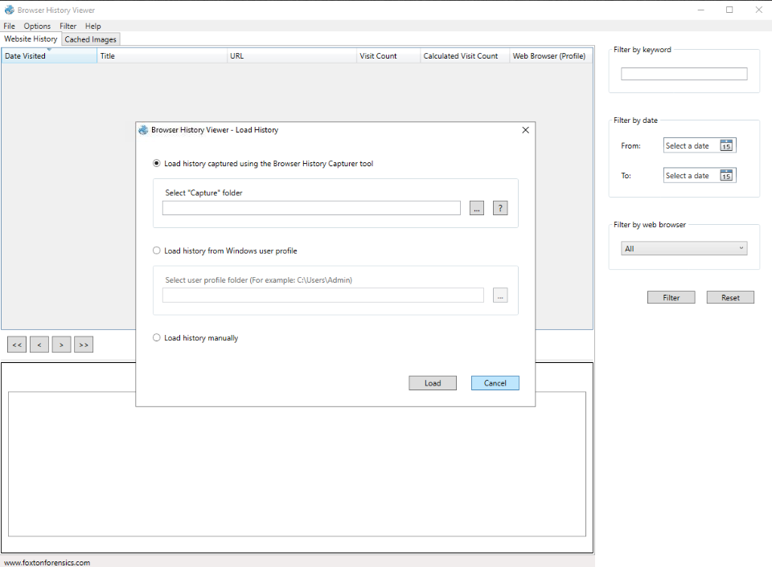<br>
  <em>Figure 2: Opening the Load History option in Browser History Viewer.</em>
</p>

##### 🔷 Phase 1.3 — Select the Capture folder

When prompted to load the history capture, I selected the option to browse for a folder and navigated to the evidence directory:

```text
C:\Users\IEUser\Desktop\Windows Investigation Two\Capture
```

The `Capture` folder contained the browser artifacts provided for the lab.

<p align="left">
  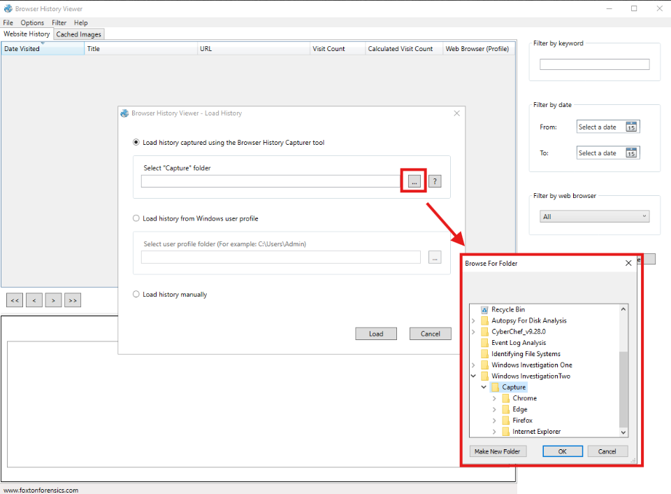<br>
  <em>Figure 3: Selecting the Capture folder for browser history analysis.</em>
</p>

##### 🔷 Phase 1.4 — Confirm that records loaded

After the capture loaded, BHV displayed browser activity in the main table.

The Website History tab showed columns such as:

- `Date Visited`
- `Title`
- `URL`
- `Visit Count`
- `Calculated Visit Count`
- `Web Browser (Profile)`

These fields provided the foundation for the investigation.

<p align="left">
  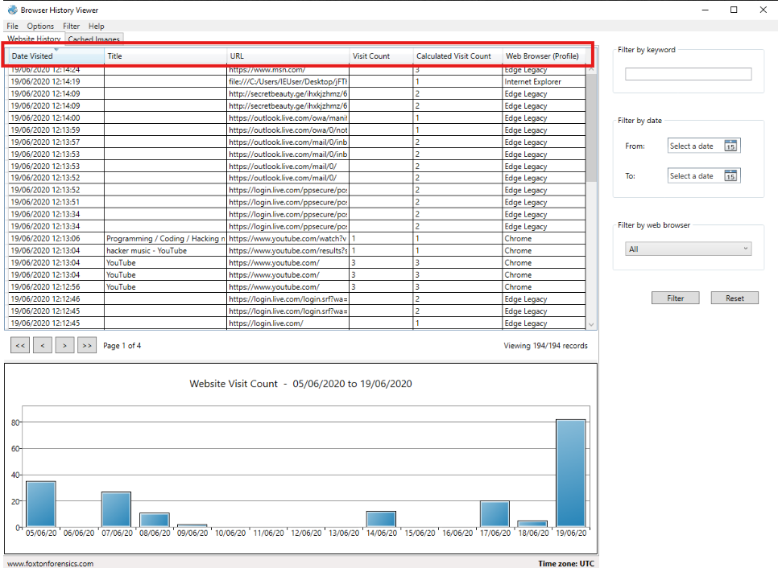<br>
  <em>Figure 4: Confirming records loaded.</em>
</p>

<blockquote>
At this stage, I was not trying to answer only one question. I was confirming that the evidence loaded correctly and identifying which fields would be useful for the rest of the analysis.
</blockquote>

##### 🔷 Phase 1.5 — Phase 1 findings

The browser history capture loaded successfully into BHV and provided access to website history and cached image records.

| Item | Finding |
|---|---|
| Tool used | Browser History Viewer |
| Evidence folder | `C:\Users\IEUser\Desktop\Windows Investigation Two\Capture` |
| Primary evidence views | Website History, Cached Images |

</details>


<!--


<details>
<summary><strong>▶ Phase 2 — Identify Browsers Used on the System</strong><br>
→ determining the browser sources represented in the evidence
</summary><br>

This phase focused on identifying which web browsers were used by the employee.

<blockquote>
Before reviewing individual websites, I needed to determine which browsers were represented in the evidence. This matters because browser artifacts are profile-specific. Activity from Chrome, Edge, and Internet Explorer may be stored separately, and an investigation can be incomplete if one browser source is overlooked.
</blockquote>

##### 🔷 Phase 2.1 — Review the Web Browser Profile column

In the Website History tab, I reviewed the far-right column labeled:

```text
Web Browser (Profile)
```

This column identifies which browser profile generated each record.

The browser profile values observed included:

```text
Chrome
Edge Legacy
Internet Explorer
```

##### 🔷 Phase 2.2 — Normalize browser names

The lab asked for simplified browser names.

Because BHV displayed `Edge Legacy`, I normalized that value to:

```text
Edge
```

This is important because forensic tools may display browser profile names in a more technical or version-specific format than the answer expected by the investigation question.

For example:

| Tool Display Name | Simplified Name |
|---|---|
| `Chrome` | Chrome |
| `Edge Legacy` | Edge |
| `Internet Explorer` | Internet Explorer |

##### 🔷 Phase 2.3 — Phase 2 findings

The browsers used by the employee, listed alphabetically, were:

```text
Chrome
Edge
Internet Explorer
```

| Question | Finding |
|---|---|
| Web browsers used | `Chrome`, `Edge`, `Internet Explorer` |

<blockquote>
This phase established the browser scope of the investigation. The evidence was not limited to one browser, so later activity needed to be reviewed with awareness that records could come from Chrome, Edge, or Internet Explorer.
</blockquote>

</details>


-->


<details>
<summary><strong>▶ Phase 2 — Review Website History for Social Media Activity</strong><br>
→ identifying policy-related web browsing activity
</summary><br>

This phase focused on identifying social media websites visited by the employee.

<blockquote>
The company policy prohibited employees from visiting social media sites on corporate devices. Because website history records show visited URLs and page titles, they were the correct artifact source to review for policy-related browsing activity.
</blockquote>

##### 🔷 Phase 2.1 — Understand what Website History can show

Website history records can provide evidence of user browsing activity.

Important fields include:

| Field | Why It Matters |
|---|---|
| `Date Visited` | Shows when the website activity occurred |
| `Title` | May show the page title displayed by the browser |
| `URL` | Shows the web resource accessed |
| `Visit Count` | May indicate repeated access |
| `Web Browser (Profile)` | Shows which browser generated the record |

For social media analysis, the most important fields were:

```text
Title
URL
```

The `URL` field was especially important because it shows domains and paths visited by the user.

##### 🔷 Phase 2.2 — Review URLs for known social media domains

I reviewed the URL column for domains associated with social platforms.

The following social media platforms were identified:

```text
Discord
Facebook
Reddit
Twitter
YouTube
```

<p align="left">
  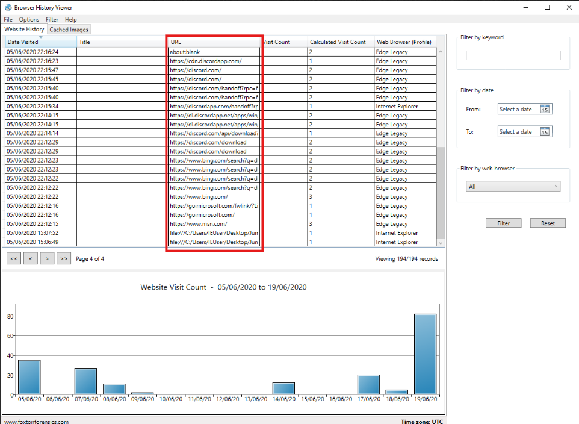<br>
  <em>Figure 5: Reviewing browser history records for social media activity.</em>
</p>

##### 🔷 Phase 2.3 — Validate platform classification when needed

Some platforms are obvious social media sites, while others may require interpretation.

For example, YouTube can be viewed as a video-sharing website, but it is also commonly classified as a social media platform because users can publish content, subscribe to channels, comment, share videos, and interact through the platform.

This validation matters because policy investigations depend on how the organization defines prohibited activity. If a platform fits the organization's definition of social media, it should be documented.

##### 🔷 Phase 2.4 — Phase 2 findings

The social media sites visited by the employee, listed alphabetically, were:

```text
Discord
Facebook
Reddit
Twitter
YouTube
```

<blockquote>
This phase demonstrated how browser history can support acceptable-use or policy investigations. The evidence showed that multiple social media platforms were accessed from the corporate device.
</blockquote>

</details>

<details>
<summary><strong>▶ Phase 3 — Analyze Cached Images</strong><br>
→ recovering visual content preserved by the browser
</summary><br>

This phase focused on reviewing cached images to locate a specific image artifact and extract information from it.

<blockquote>
Website history can show that a webpage was visited, but it does not always show what the page looked like. Cached images can preserve visual content loaded by the browser, which may reveal information that is not obvious from URL records alone.
</blockquote>

##### 🔷 Phase 3.1 — Understand what cached images are

Cached images are copies of images that a browser stores locally after loading webpages.

Browsers cache images to improve performance. If a user revisits a page, the browser can load some content from local storage rather than downloading everything again.

From a forensic perspective, cached images can be useful because they may preserve:

- webpage graphics,
- profile pictures,
- email previews,
- thumbnails,
- advertisements,
- embedded content,
- screenshots or rendered webpage elements.

This means cached images can sometimes show evidence of what the user saw or what content was loaded during browsing.

##### 🔷 Phase 3.2 — Open the Cached Images tab

In BHV, I selected the [Cached Images] tab.

This displayed cached image records with metadata such as:

- `Last Fetched`
- `Filename`
- `URL`
- `Fetch Count`
- `File Size (Bytes)`
- `Web Browser (Profile)`

<p align="left">
  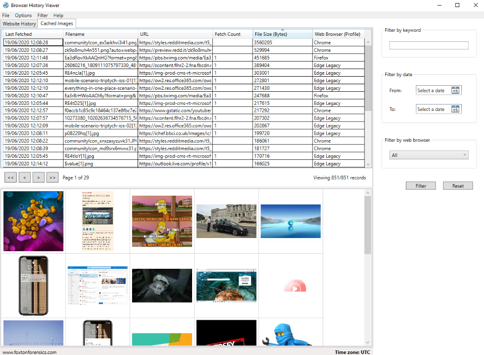<br>
  <em>Figure 6: Reviewing cached image records and available filtering options.</em>
</p>

##### 🔷 Phase 3.3 — Locate the image by timestamp and filename

The investigation provided two key identifiers:

```text
Last Fetched: 19/06/2020 12:12:10
Filename: everything-in-one-place-scenario-base[1].png
```

These two values were used together to locate the correct cached image.

There are multiple ways to locate a specific cached image within Browser History Viewer. An analyst could use the Filter by date option to narrow the results to a particular timeframe, or use the Filter by keyword feature to search for a known filename or portion of a filename.

Because the filename was already known, I chose to use the Filter by keyword field and searched for:

`everything-in-one-place-scenario-base[1].png`

This immediately reduced the results to the relevant cached image record, making it easier to identify the correct artifact without manually reviewing hundreds of cached image entries.

The resulting record showed:

```
Last Fetched: 19/06/2020 12:12:10
Filename: everything-in-one-place-scenario-base[1].png
Browser Profile: Edge Legacy
```

This mattered because cached image datasets can contain hundreds or thousands of records. A filename alone may not always be unique, and a timestamp alone may return multiple records. Using both values reduces the chance of selecting the wrong artifact.

<p align="left">
  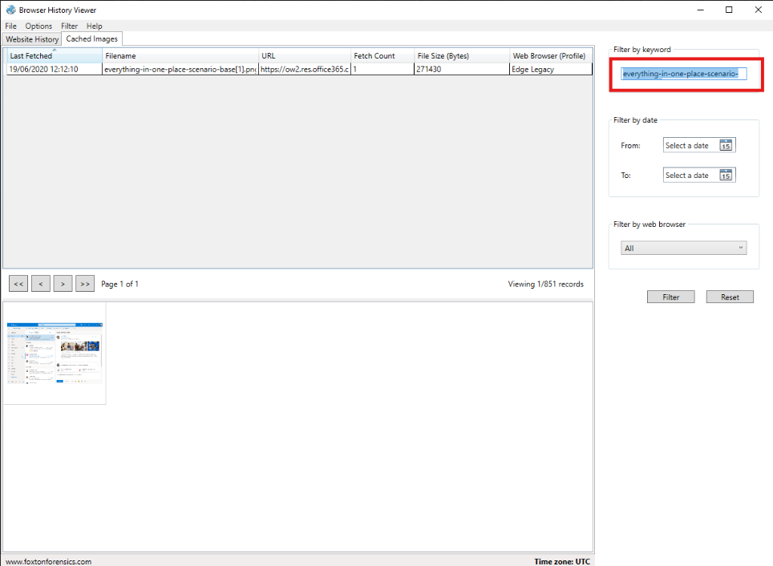<br>
  <em>Figure 7: Locating the cached image by timestamp and filename.</em>
</p>

##### 🔷 Phase 3.4 — Review the cached image content

After selecting the cached image record, I reviewed the corresponding image preview in the lower panel of BHV.

The relevant cached image showed an email-related visual. For practice and testing purposes, I documented the subject line of the third email.

The third email subject line was identified as:

```text
Your Upcoming Stay
```

<p align="left">
  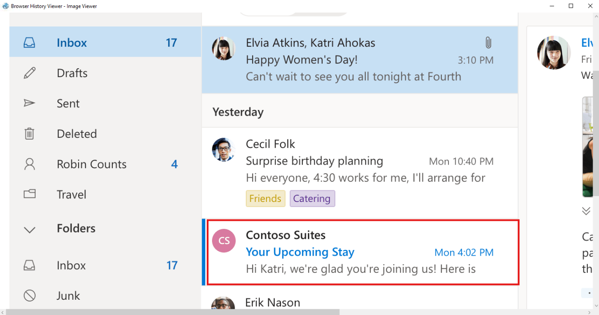<br>
  <em>Figure 8: Reviewing cached image content.</em>
</p>

##### 🔷 Phase 3.5 — Phase 3 findings

Cached image analysis produced the following finding:

| Question | Finding |
|---|---|
| Subject line of the third email | `Everything in one place` |

<blockquote>
This phase showed why cached images can be valuable. The answer was not found by only reading URL history. It required reviewing visual content preserved by the browser cache.
</blockquote>

</details>

<details>
<summary><strong>▶ Phase 4 — Filter Website History for YouTube Activity</strong><br>
→ identifying the full URL of a music video
</summary><br>

This phase focused on using keyword filtering to locate YouTube-related browsing activity.

Earlier analysis identified multiple social media platforms within the employee's browsing history. Rather than continuing to manually review every URL, I used Browser History Viewer's filtering capabilities to focus on specific activity of interest.

Keyword filtering is useful because browser history records often contain hundreds or thousands of entries. By searching for a known keyword, investigators can quickly isolate activity associated with a particular website or service.

For this phase, I searched for YouTube-related activity to demonstrate how filtering can be used to identify specific browsing behavior within a larger dataset.

<blockquote>
Browser history datasets can contain many records. Instead of manually reviewing every URL, keyword filtering allows the analyst to isolate activity related to a specific service or domain. Since the question involved YouTube, filtering for YouTube reduced noise and made the relevant record easier to locate.
</blockquote>

##### 🔷 Phase 4.1 — Return to Website History

I returned to the [Website History] tab.

This tab contains the visited URLs and page titles needed to identify the YouTube video.

##### 🔷 Phase 4.2 — Use keyword filtering

In the **Filter by keyword** box, I entered:

```text
youtube
```

This filtered the displayed records to entries containing the keyword in the title or URL.

<p align="left">
  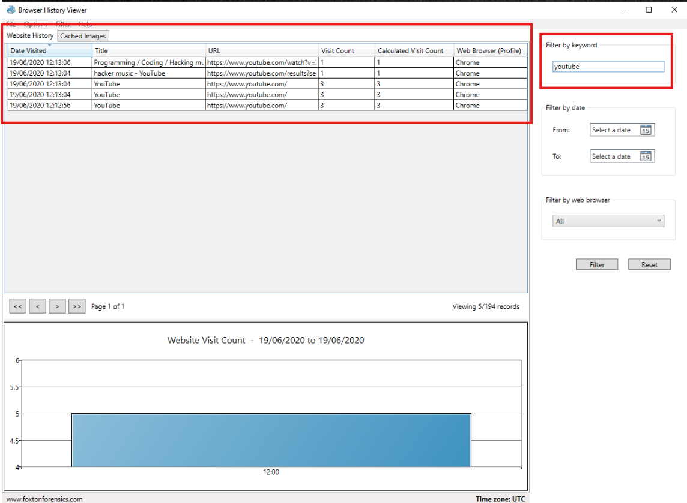<br>
  <em>Figure 9: Filtering website history for YouTube activity.</em>
</p>

##### 🔷 Phase 4.3 — Identify the music video URL

The filtered results showed a YouTube page title associated with music:

```text
Programming / Coding / Hacking music vol.18 [ANONYMOUS HEADQUARTERS]
```

The corresponding URL was identified as:

```text
https://www.youtube.com/watch?v=7-VfaG9ZN_U
```

<p align="left">
  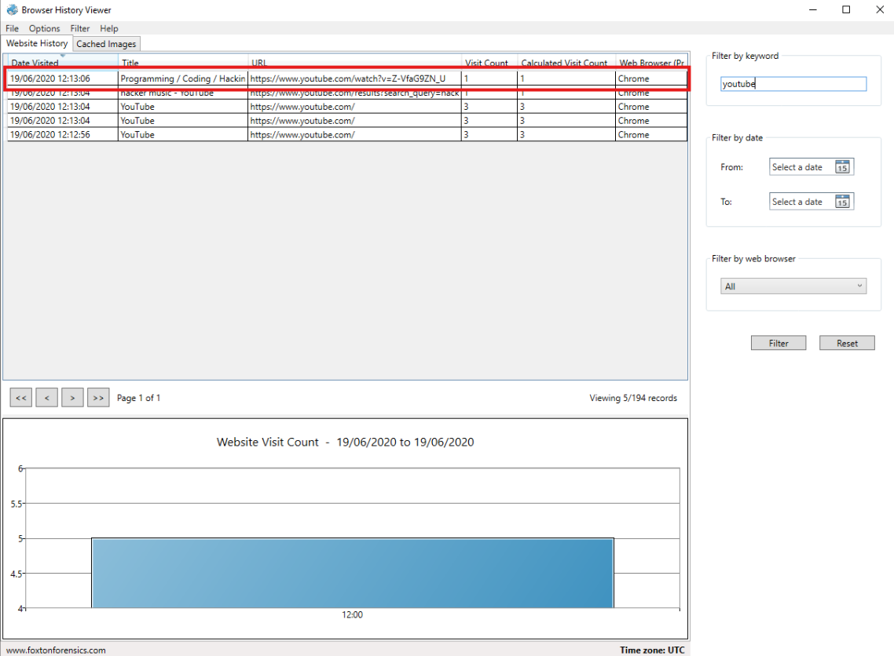<br>
  <em>Figure 10: Identifying the YouTube music video URL.</em>
</p>

> **Note:** The first result was selected because it contains a direct YouTube video URL (`youtube.com/watch?v=`), indicating that the user actually viewed a specific video. The title also references a music video:
>
> ```text
> Programming / Coding / Hacking music vol.18 [ANONYMOUS HEADQUARTERS]
> ```
>
> The second result may appear related at first glance, but it represents a YouTube search URL rather than a video page:
>
> ```text
> youtube.com/results?search_query=hacker+music
> ```
>
> This record indicates that the user searched YouTube for the phrase **"hacker music"**. While useful for understanding user activity, it does not answer the question because it does not identify a specific video. The remaining records only show visits to the general YouTube homepage and likewise do not contain the full URL of the music video being viewed.

##### 🔷 Phase 4.4 — Phase 4 findings

| Question | Finding |
|---|---|
| Full URL of the YouTube music video | `https://www.youtube.com/watch?v=7-VfaG9ZN_U` |

<blockquote>
This phase demonstrated how filtering can turn a large browser history dataset into a focused evidence review. Rather than scrolling through every URL, the keyword filter isolated records related to YouTube and allowed the relevant video URL to be identified.
</blockquote>

</details>

<details>
<summary><strong>▶ Phase 5 — Identify the Suspicious Downloaded File</strong><br>
→ locating local file references and suspicious download activity
</summary><br>

This phase focused on identifying the malicious file downloaded by the employee.

Up to this point, the investigation focused on understanding the employee's browsing activity through website history records and cached web content. While this information helped establish what websites were visited and what content was viewed, browser artifacts can also provide evidence of files downloaded from the internet.

Downloaded files are often of particular interest during forensic investigations because they can reveal how software, documents, or potentially malicious content reached a system. Browser history records may preserve both the local file path where a download was saved and the remote URL where the file originated.

With this in mind, I shifted focus from general browsing activity to download-related artifacts to determine whether any suspicious files had been obtained and, if so, where they originated from.

<blockquote>
After reviewing browsing and cached content, I shifted focus to download activity. Download records are important because they can show what file was obtained from the internet and where it was saved on the local system. In malware investigations, this can help identify the initial file that introduced suspicious content to the host.
</blockquote>

##### 🔷 Phase 5.1 — Understand local file references in browser history

Some browser records show URLs beginning with:

```text
file:///
```

This prefix indicates a local file reference rather than a normal website URL.

For example, a normal website URL may look like:

```text
https://example.com/file.zip
```

A local file reference may look like:

```text
file:///C:/Users/IEUser/Desktop/file.zip
```

This is important because browser history may preserve both:

- the remote URL where the file was downloaded from,
- the local path where the downloaded file was saved.

##### 🔷 Phase 5.2 — Review recent local file references

To identify files that had been downloaded or accessed locally, I filtered the Website History records for entries containing the `file:///` prefix. This allowed me to focus specifically on local file references rather than standard web browsing activity.

<p align="left">
  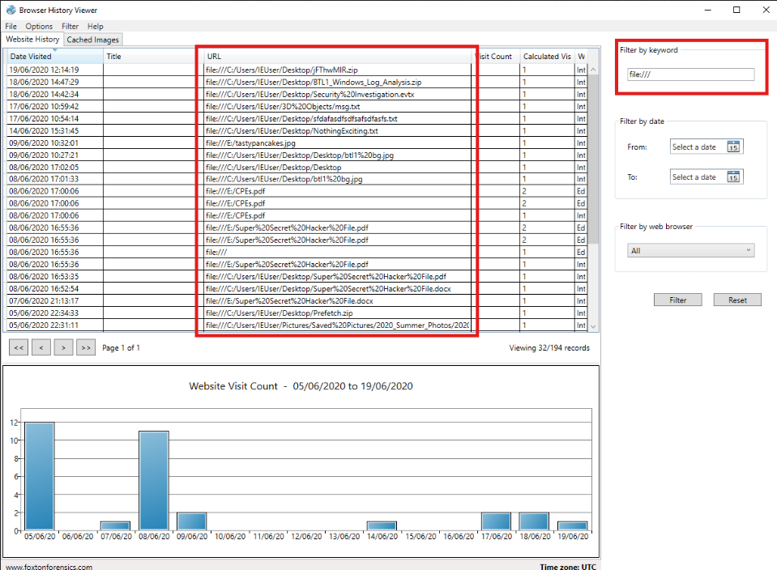<br>
  <em>Figure 11: Searching any recent local file downloads.</em>
</p>

The results contained numerous local files, including images (`.jpg`), documents (`.pdf`, `.txt`), and archive files (`.zip`). Rather than selecting the first ZIP file arbitrarily, I reviewed the results chronologically using the **Date Visited** column and looked for files that appeared unusual or potentially relevant to the investigation.

One entry immediately stood out:

```text
file:///C:/Users/IEUser/Desktop/fThwMIR.zip
```

<p align="left">
  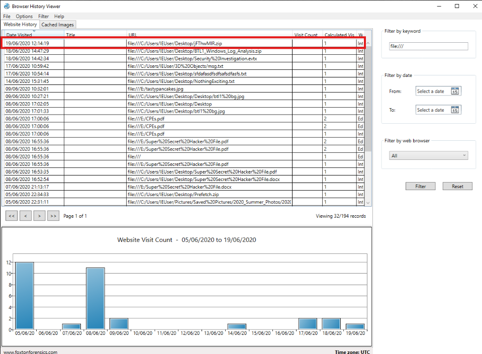<br>
  <em>Figure 12: Identifying the suspicious downloaded ZIP file from local file references.</em>
</p>

The file was the most recently accessed local ZIP archive in the results, was saved directly to the user's Desktop, and had a seemingly random filename that provided no obvious indication of its purpose or origin. While these characteristics alone do not prove maliciousness, they made the file a strong candidate for further investigation.

The suspicious filename identified was `fThwMIR.zip` and the corresponding local file path was `file:///C:/Users/IEUser/Desktop/fThwMIR.zip`.

##### 🔷 Phase 5.3 — Interpret why the file was suspicious

At this stage of the investigation, the browser history contained numerous local file references, including images, documents, PDF files, and archive files. Based on the available evidence alone, it was not possible to definitively determine which file, if any, was malicious. One file that attracted attention was:

```text
fThwMIR.zip
```

The filename stood out because it appeared randomly generated or nonsensical:

This does not automatically prove the file is malicious. However, in a forensic investigation, an unusual ZIP filename downloaded to a user's Desktop is worth investigating further.

The file was also suspicious because it appeared in the context of browser download activity, meaning it was likely obtained from an external source.

##### 🔷 Phase 5.4 — Phase 5 findings

| Question | Finding |
|---|---|
| Malicious file downloaded | `fThwMIR.zip` |
| Local save path | `file:///C:/Users/IEUser/Desktop/fThwMIR.zip` |

<blockquote>
This phase identified the suspicious downloaded file. However, identifying the local filename only answers part of the question. The next step was to determine where the file came from and what activity led to the download.
</blockquote>

</details>

<details>
<summary><strong>▶ Phase 6 — Trace the Suspicious File to Its Remote Source</strong><br>
→ identifying the hosting URL for the downloaded ZIP file
</summary><br>

This phase focused on tracing the suspicious ZIP file back to the remote URL where it was downloaded from.

<blockquote>
A local file path tells us where the file existed on the system, but it does not fully explain how it arrived there. To understand the delivery path, I needed to identify the remote URL associated with the download.
</blockquote>

##### 🔷 Phase 6.1 — Review Browser Activity Around the Download Event

After identifying:

```text
fThwMIR.zip
```

I wanted to determine where the file originated. Rather than continuing to focus on the local file path, I shifted attention to the surrounding browser activity to identify any records associated with the download.

The local file reference showed that the file existed on the user's Desktop and was accessed at:

```
19/06/2020 12:14:19
```

Using this timestamp as a reference point, I cleared the previous filters and reviewed browser history records occurring immediately before and after the download event.

This approach is useful because browser history often preserves multiple artifacts related to the same activity. A local file reference may show where a file was saved on the system, while nearby browser records may reveal the website or URL responsible for delivering the file.


##### 🔷 Phase 6.2 — Identify the Download Source URL

Reviewing records around the download timestamp revealed several entries associated with the domain: `secretbeauty.ge`. Two of these entries contained the full URL associated with the downloaded ZIP file:

```text
http://secretbeauty.ge/ihxkjzhmz/6h/DRj/FThwMIR.zip
```

The timing of this record closely aligned with the local file reference for fThwMIR.zip, allowing the two artifacts to be correlated.

<p align="left">
  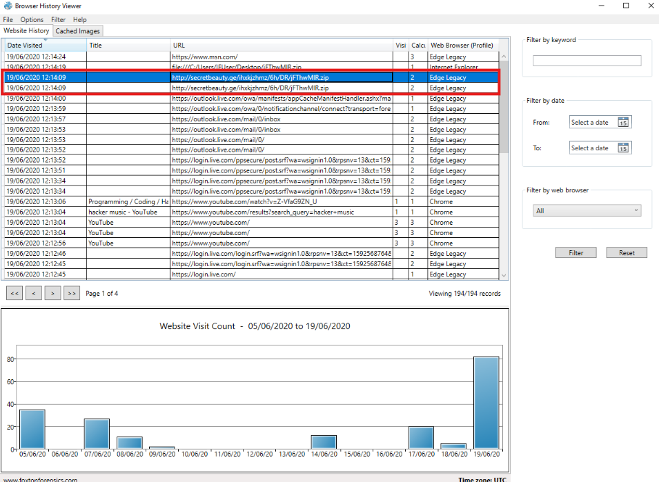<br>
  <em>Figure 13: Correlating the local file reference with the remote download URL.</em>
</p>

It is important to understand why two different records appear in the browser history:

- The `file:///` entry represents a local file reference, indicating where the downloaded file was saved on the system.
- The `http://` entry represents a remote web resource, showing the location from which the file was downloaded.

Together, these artifacts establish both the destination of the download and its source.

##### 🔷 Phase 6.3 — Interpret the remote URL

The remote URL was significant because it identified the external infrastructure hosting the downloaded file.

Breaking down the URL:

```text
http://
```

indicates the scheme used to access the resource.

```text
secretbeauty.ge
```

is the domain hosting the file.

```text
/ihxkjzhmz/6h/DRj/
```

is the path on the web server.

```text
FThwMIR.zip
```

is the downloaded file.

By correlating the local file reference with the remote URL, it was possible to establish both where the file was saved and where it originated. This type of correlation is valuable during investigations because it helps connect user activity on the endpoint with external infrastructure involved in the download.


##### 🔷 Phase 6.4 — Identify the Likely Source of the Malicious URL

After identifying the remote download URL, I reviewed browser activity immediately preceding the download event.

The timeline showed multiple records associated with Microsoft's authentication service and Outlook webmail:

```text
login.live.com
outlook.live.com
```

<p align="left">
  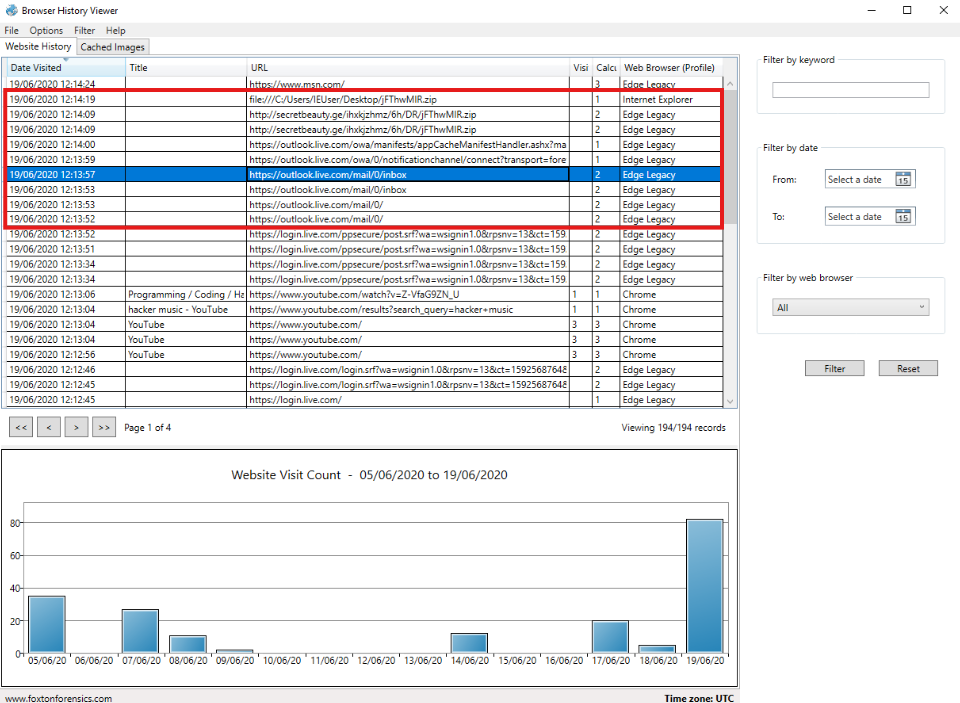<br>
  <em>Figure 14: Identifying the source of the malicious URL.</em>
</p>

These records occurred only seconds before the user accessed the secretbeauty.ge download URL and subsequently downloaded `fThwMIR.zip`.

Based on the available browser history, the most likely explanation is that the user encountered the malicious URL while using Outlook webmail. While the browser artifacts do not conclusively prove that the link was contained within an email, the close proximity of the Outlook activity to the download event strongly suggests that Outlook was the delivery mechanism through which the user reached the malicious URL.

Therefore, the likely source of the malicious URL was `outlook.live.com`

<blockquote> It is important to distinguish between the source of the malicious URL and the domain hosting the downloaded file. Outlook webmail appears to be where the user encountered the link, while `secretbeauty.ge` was the domain that hosted the downloaded ZIP archive. </blockquote>


##### 🔷 Phase 6.5 — Phase 6 findings

| Question | Finding |
|---|---|
| Remote download URL | `http://secretbeauty.ge/ihxkjzhmz/6h/DRj/FThwMIR.zip` |
| Download domain | `secretbeauty.ge` |

<blockquote>
This phase connected the local downloaded file to the remote infrastructure that hosted it. This is an important step in malware investigations because the hosting domain can be documented as an indicator of compromise or used for further threat intelligence enrichment.
</blockquote>

</details>

<details>
<summary><strong>▶ Phase 7 — Reconstruct Activity Around the Download Event</strong><br>
→ identifying the likely source of the malicious URL
</summary><br>

This phase focused on reviewing browser activity immediately before the suspicious file download.

<blockquote>
After identifying the suspicious download URL, I needed to understand how the user likely reached it. The best way to do this with the available evidence was to examine the browser timeline around the download timestamp.
</blockquote>

##### 🔷 Phase 7.1 — Locate the download timestamp

The suspicious download activity occurred around:

```text
19/06/2020 12:14:09
```

At this timestamp, BHV showed activity related to the suspicious ZIP file:

```text
http://secretbeauty.ge/ihxkjzhmz/6h/DRj/FThwMIR.zip
file:///C:/Users/IEUser/Desktop/fThwMIR.zip
```

This showed both the remote download URL and the local file reference.

##### 🔷 Phase 7.2 — Review surrounding browser history

After clearing filters, I reviewed the Website History records around the download timestamp.

The surrounding activity showed a sequence involving Microsoft login and Outlook webmail activity before the suspicious download.

The activity included records associated with:

```text
login.live.com
outlook.live.com
```

##### 🔷 Phase 7.3 — Interpret the likely activity sequence

The browser timeline suggested the following likely sequence:

1. The user accessed Microsoft's login service.
2. The user accessed Outlook webmail.
3. The suspicious ZIP file was downloaded shortly afterward.
4. The downloaded ZIP file appeared as a local file on the Desktop.

This sequence suggested that the malicious URL likely came from webmail activity.

The likely source of the malicious URL was:

```text
Outlook webmail
```

or more specifically:

```text
outlook.live.com
```

##### 🔷 Phase 7.4 — Avoid overstating the evidence

It is important not to overstate this finding.

The browser artifacts show that Outlook activity occurred immediately before the download, and the timing strongly suggests the malicious URL may have been accessed from an email. However, without direct access to the email inbox or message contents, the browser history alone does not prove the URL was inside an email.

A more careful conclusion is:

```text
Based on the browser timeline, the malicious URL likely originated from Outlook webmail activity.
```

This is stronger than guessing, but more accurate than claiming the email was confirmed.

##### 🔷 Phase 7.5 — Phase 7 findings

| Question | Finding |
|---|---|
| Likely source of malicious URL | `Outlook webmail` / `outlook.live.com` |
| Supporting context | Microsoft login and Outlook activity occurred immediately before the download |

<blockquote>
This phase demonstrated the importance of timeline correlation. The download URL showed where the file came from, but the surrounding history helped explain how the user likely encountered the link.
</blockquote>

</details>

<details>
<summary><strong>▶ Phase 8 — Identify the Malware Download Domain</strong><br>
→ documenting source infrastructure
</summary><br>

This phase focused on identifying the domain where the malware was downloaded from.

<blockquote>
After tracing the suspicious file to its remote URL, the final infrastructure-focused step was to extract the domain name. Domains are commonly documented as indicators because they can be searched, blocked, enriched, or correlated with other activity.
</blockquote>

##### 🔷 Phase 8.1 — Extract the domain from the download URL

The full remote URL was:

```text
http://secretbeauty.ge/ihxkjzhmz/6h/DRj/FThwMIR.zip
```

The domain portion of the URL was:

```text
secretbeauty.ge
```

##### 🔷 Phase 8.2 — Understand why the domain matters

The domain is useful because it can support additional investigation.

For example, an analyst may use the domain to:

- search logs for other systems that contacted it,
- block the domain at a firewall or proxy,
- enrich it using threat intelligence tools,
- determine whether the domain appears in known malicious infrastructure reports,
- document the file's external hosting location.

##### 🔷 Phase 8.3 — Phase 8 findings

| Question | Finding |
|---|---|
| Malware download domain | `secretbeauty.ge` |

<blockquote>
This phase converted a full download URL into a concise infrastructure indicator. The full URL explains exactly what was downloaded, while the domain provides a broader indicator that can be searched across other data sources.
</blockquote>

</details>

---

### Artifact Correlation

The most important part of this workflow was not simply collecting separate answers. The stronger forensic value came from correlating browser artifacts together.

Each artifact source answered a different part of the activity chain.

#### Browser Profile Artifacts

Browser profile information showed:

- which browsers were represented in the evidence,
- which browser generated specific records,
- whether activity occurred across multiple browsers.

Findings:

```text
Chrome
Edge
Internet Explorer
```

Browser profile artifacts helped answer:

- What browsers were used?
- Which browser generated a specific activity record?
- Was the evidence limited to one browser or spread across multiple browsers?

#### Website History Artifacts

Website history records showed:

- visited websites,
- page titles,
- timestamps,
- visit counts,
- local file references,
- remote download URLs.

Findings:

```text
Discord
Facebook
Reddit
Twitter
YouTube
https://www.youtube.com/watch?v=7-iV6GZN_U
file:///C:/Users/IEUser/Desktop/fThwMIR.zip
http://secretbeauty.ge/ihxkjzhmz/6h/DRj/FThwMIR.zip
```

Website history artifacts helped answer:

- What sites were visited?
- Was there social media activity?
- What YouTube video was accessed?
- What suspicious file appeared on the system?
- Where was the file downloaded from?

#### Cached Image Artifacts

Cached image artifacts showed:

- visual content loaded by the browser,
- image filenames,
- fetch timestamps,
- browser source information.

Findings:

```text
everything-in-one-place-scenario-base[1].png
Everything in one place
```

Cached image artifacts helped answer:

- What visual content was preserved?
- What was visible in the cached email-related image?
- What subject line appeared in the relevant cached content?

#### Timeline Context

Timeline analysis showed:

- webmail login activity,
- Outlook activity,
- suspicious download activity,
- local file access after download.

Findings:

```text
login.live.com
outlook.live.com
secretbeauty.ge
fThwMIR.zip
```

Timeline context helped answer:

- What happened immediately before the download?
- What service likely exposed the user to the malicious URL?
- How did the suspicious file likely reach the system?

#### Combined Interpretation

Digital forensic investigations rarely rely on a single artifact. Instead, investigators correlate multiple artifact sources to build a more complete picture of activity that occurred on a system.

Each artifact examined during this investigation answered a different question:

* **Browser profile records** helped identify which browsers were used.
* **Website history records** helped identify visited sites, social media activity, and download URLs.
* **Cached image records** helped recover visual content preserved by the browser.
* **Timeline analysis** helped reconstruct the likely delivery path of the suspicious file.

When analyzed together, the artifacts supported the following activity reconstruction.

##### 1. Browser Activity Was Present Across Multiple Browsers

The investigation began by reviewing the `Web Browser (Profile)` column.

The evidence showed activity from:

```text
Chrome
Edge
Internet Explorer
```

This established that the employee used multiple browsers on the system. From a forensic perspective, this mattered because browser activity was not isolated to one application. Any complete review needed to account for all browser profiles represented in the capture.

##### 2. The Employee Accessed Multiple Social Media Platforms

Website history records showed visits to several social media platforms:

```text
Discord
Facebook
Reddit
Twitter
YouTube
```

This was relevant because the company had a policy against employees visiting social media websites on corporate devices.

The browser artifacts therefore provided evidence of policy-related activity.

##### 3. Cached Images Preserved Additional Web Evidence

The Cached Images tab contained an image artifact with the filename:

```text
everything-in-one-place-scenario-base[1].png
```

At the relevant timestamp, the cached image preserved email-related visual content. Reviewing the image revealed the subject line:

```text
Everything in one place
```

This showed that cached images can provide evidence that is not obvious from URL records alone.

##### 4. YouTube Activity Was Identified Through Keyword Filtering

Using the keyword filter for:

```text
youtube
```

the investigation identified a music-related YouTube record:

```text
Programming / Coding / Hacking music vol.18 [ANONYMOUS HEADQUARTERS]
```

The full URL was:

```text
https://www.youtube.com/watch?v=7-iV6GZN_U
```

This demonstrated how filtering can isolate relevant activity within a larger browser history dataset.

##### 5. A Suspicious ZIP File Was Downloaded

Website history records showed a local file reference to:

```text
file:///C:/Users/IEUser/Desktop/fThwMIR.zip
```

The filename appeared unusual and was located on the user's Desktop, making it worth investigating further.

A local file reference alone showed that the file existed or was accessed locally, but it did not fully explain where the file came from.

##### 6. The Suspicious File Was Traced to a Remote URL

Searching for the filename revealed the remote URL:

```text
http://secretbeauty.ge/ihxkjzhmz/6h/DRj/FThwMIR.zip
```

This connected the local file to an external hosting location.

The domain extracted from the URL was:

```text
secretbeauty.ge
```

This domain was documented as the malware download domain.

##### 7. Timeline Analysis Suggested Webmail as the Likely Source

Browser activity around the download timestamp showed Microsoft login and Outlook webmail activity immediately before the suspicious ZIP file was downloaded.

The relevant services included:

```text
login.live.com
outlook.live.com
```

Based on the available browser history, the most likely explanation was that the user encountered the malicious URL through Outlook webmail.

However, the browser history alone did not prove the URL was contained inside an email. A careful forensic conclusion is that the URL likely originated from Outlook webmail activity based on timestamp proximity and surrounding browser records.

##### Overall Conclusion

No single browser artifact provided the full story.

Instead, the investigation relied on correlating browser profile data, website history records, cached images, download activity, and timeline context.

| Artifact Type | Question Answered | Key Finding |
|---|---|---|
| Browser Profile Records | Which browsers were used? | Chrome, Edge, Internet Explorer |
| Website History | What sites were visited? | Discord, Facebook, Reddit, Twitter, YouTube |
| Cached Images | What visual web content was preserved? | Third email subject: `Everything in one place` |
| Website History Filtering | What YouTube music video was accessed? | `https://www.youtube.com/watch?v=7-iV6GZN_U` |
| Download Records | What suspicious file was downloaded? | `fThwMIR.zip` |
| Remote URL Records | Where was the file downloaded from? | `http://secretbeauty.ge/ihxkjzhmz/6h/DRj/FThwMIR.zip` |
| Timeline Context | What was the likely source of the malicious URL? | Outlook webmail activity |
| Domain Extraction | What domain hosted the file? | `secretbeauty.ge` |

Taken together, these artifacts demonstrated how browser data can be used to reconstruct user behavior, identify policy violations, recover cached evidence, investigate suspicious downloads, and infer the likely path of malware delivery.

---

### Evidence Examination Summary

| Task | Artifact Source | Tool | Finding |
|---|---|---|---|
| Identify browsers used | Browser profile records | Browser History Viewer | `Chrome`, `Edge`, `Internet Explorer` |
| Identify social media sites visited | Website history | Browser History Viewer | `Discord`, `Facebook`, `Reddit`, `Twitter`, `YouTube` |
| Identify third email subject line | Cached images | Browser History Viewer | `Everything in one place` |
| Identify YouTube music video URL | Website history filtering | Browser History Viewer | `https://www.youtube.com/watch?v=7-iV6GZN_U` |
| Identify malicious file | Website history / local file reference | Browser History Viewer | `fThwMIR.zip` |
| Identify likely source of malicious URL | Timeline correlation | Browser History Viewer | `Outlook webmail` / `outlook.live.com` |
| Identify malware download domain | Remote download URL | Browser History Viewer | `secretbeauty.ge` |

---

### What I Learned (Skills Demonstrated)

Through this workflow, I learned how to:

- Load browser history evidence into Browser History Viewer.
- Understand what browser history artifacts are and why they matter.
- Identify browsers used on a system from browser profile records.
- Review website history records for URLs, page titles, timestamps, and visit counts.
- Identify social media activity from browser artifacts.
- Understand how browser history can support acceptable-use policy investigations.
- Review cached image artifacts.
- Understand why cached images can preserve visual evidence.
- Locate cached images using timestamps and filenames.
- Extract relevant information from cached visual content.
- Use keyword filtering to isolate browser activity.
- Identify a specific YouTube video URL from filtered results.
- Recognize local file references using the `file:///` prefix.
- Identify suspicious downloaded files from browser records.
- Trace a local downloaded file back to a remote hosting URL.
- Extract a domain from a full URL.
- Review surrounding browser activity to reconstruct a timeline.
- Infer a likely delivery source while avoiding overstating the evidence.
- Correlate browser profiles, website history, cached images, and download records.
- Document a repeatable browser artifact analysis workflow.

This workflow strengthened my understanding that browser artifacts can provide both direct and contextual evidence. A URL can show what was visited. A cached image can show what content was loaded. A local file reference can show what was downloaded. A timeline can help explain how the activity likely occurred. Correlating these artifacts together allows an analyst to reconstruct user behavior with more confidence.

---

### Final Conclusion

This workflow demonstrated how Browser History Viewer can be used to analyze browser artifacts and reconstruct user activity on a Windows system.

The browser profile records showed that the employee used Chrome, Edge, and Internet Explorer. Website history records showed visits to multiple social media platforms, including Discord, Facebook, Reddit, Twitter, and YouTube. Cached image analysis recovered visual evidence from the browser cache and identified the third email subject line as `Everything in one place`.

The investigation also identified a suspicious downloaded file named `fThwMIR.zip`. Browser history records showed that the file was saved locally to the user's Desktop and was downloaded from the remote URL:

```text
http://secretbeauty.ge/ihxkjzhmz/6h/DRj/FThwMIR.zip
```

The malware download domain was:

```text
secretbeauty.ge
```

Timeline analysis showed Microsoft login and Outlook webmail activity immediately before the suspicious download. Based on the available evidence, the malicious URL most likely originated from Outlook webmail activity, although the browser history alone does not prove the URL was contained inside an email.

The final key findings were:

```text
Browsers used: Chrome, Edge, Internet Explorer
Social media sites visited: Discord, Facebook, Reddit, Twitter, YouTube
Third email subject line: Everything in one place
YouTube music video URL: https://www.youtube.com/watch?v=7-iV6GZN_U
Suspicious downloaded file: fThwMIR.zip
Likely malicious URL source: Outlook webmail / outlook.live.com
Malware download domain: secretbeauty.ge
```

Together, these artifacts showed how browser history, cached images, download records, and timeline context can be correlated to support a browser-based forensic investigation.
