# Data Acquisition Using FTK Imager, ProcDump, and KAPE

This workflow demonstrates practical digital forensic data acquisition using FTK Imager, ProcDump, and KAPE to collect evidence from local and remote Windows systems. The workflow focuses on acquiring volatile memory, process-specific memory, a forensic disk image, and browser-related artifacts that can be preserved for later analysis.

The main tools used are: **FTK Imager**, **ProcDump**, **PowerShell**, **Remote Desktop Protocol (RDP)**, and **KAPE**. See **[Environment and Execution Context](#environment-and-execution-context)** section below.

### Overview

This project focused on foundational digital forensic acquisition activities. Unlike a forensic analysis workflow, where the main objective is to examine evidence and draw conclusions, this workflow focused on collecting evidence in a structured and repeatable way so that it can be analyzed later.

1. The first portion of the lab involved two forms of memory acquisition. First, FTK Imager was used to capture a full memory dump from the analysis host. This demonstrated how an examiner can preserve volatile system memory before it is lost through rebooting, shutdown, process termination, or normal system activity. Second, ProcDump was used from an elevated PowerShell session to acquire the memory of a specific running process. In the lab, Calculator was used as a benign example process, but the same workflow could be applied to a suspicious process during a real incident response investigation.

2. The second portion of the lab involved creating a forensic disk image using FTK Imager. A secondary physical drive was selected as the evidence source, and the image was saved in E01 format. This demonstrated how an examiner can preserve a storage device for later analysis using tools such as Autopsy, EnCase, FTK, X-Ways, or other forensic platforms. FTK Imager also generated hash values after acquisition, which supports evidence integrity validation.

3. The third portion of the lab involved using KAPE to collect artifacts from a remote Windows host. The remote host was accessed using RDP, the KAPE folder was copied to the remote system, and gkape was configured to collect Chrome and Chrome extension artifacts from the remote host's C drive. The output folder was then copied back to the analyst workstation. This demonstrated a targeted triage-style acquisition workflow where selected artifacts are collected from a remote endpoint instead of imaging an entire disk.

This workflow demonstrates that data acquisition can involve multiple evidence sources, including full memory, process memory, disk images, and targeted forensic artifacts. Each source preserves a different type of evidence and supports a different part of a future investigation.

> **Workflow vs Execution vs Writeup (Terminology Used Here)**  
> - **Workflows** refer to repeatable digital forensic tasks such as memory acquisition, process memory dumping, disk imaging, and artifact collection.  
> - **Executions** refer to the hands-on use of forensic tools such as FTK Imager, ProcDump, and KAPE to acquire evidence.  
> - **Writeups** document acquisition steps, analyst observations, tool usage, evidence handling decisions, and forensic reasoning.

> 👉 For a **detailed, step-by-step walkthrough of how this workflow was executed — complete with screenshot placeholders**, see the **[Step-by-Step Execution](#step-by-step-execution)** section below.

---

### Purpose and Analyst Focus

#### ▶ Purpose

The purpose of this workflow is to demonstrate how different forms of digital evidence can be acquired before deeper forensic analysis begins.

This matters because evidence must often be preserved before an analyst can examine it. If acquisition is performed poorly, evidence may be incomplete, altered, overwritten, or unavailable later. In digital forensics and incident response, the acquisition phase helps preserve the current state of a system, application, drive, or artifact set so that later analysis can be performed using dedicated tools. This memory acquisition demonstration focused on capturing volatile system memory using FTK Imager. This matters because memory is temporary and may contain evidence that is not stored on disk in the same form.

- The ProcDump exercise focused on acquiring the memory of a specific process from PowerShell. This matters because an analyst may not always need or be able to capture all physical memory. In some cases, preserving one process is faster, more targeted, and more relevant to the investigation.
- The disk imaging exercise focused on creating a forensic image of a secondary physical drive using FTK Imager. This matters because disk images preserve storage media for later examination while allowing analysts to work from a copy instead of the original source.
- The KAPE exercise focused on collecting browser-related artifacts from a remote Windows host. This matters because incident responders often need to collect high-value artifacts quickly from remote systems without immediately imaging the entire disk.

#### ▶ Analyst Focus

The analyst focus is on understanding how acquisition tools preserve different categories of evidence.

This includes:

- using FTK Imager to capture volatile memory,
- understanding why memory acquisition should be performed before evidence is lost,
- opening PowerShell with administrative privileges,
- navigating to the folder containing acquisition tools,
- launching a benign process to practice process memory acquisition,
- using PowerShell to enumerate processes,
- filtering process output to locate a target process,
- identifying the Process ID required by ProcDump,
- using ProcDump to acquire process-specific memory,
- understanding why process memory can be useful during malware and incident response investigations,
- using FTK Imager to create a forensic disk image,
- selecting a physical drive as the evidence source,
- saving the forensic image in E01 format,
- reviewing the importance of hash values for integrity validation,
- using RDP to access a remote Windows host,
- copying KAPE to a remote system for artifact acquisition,
- configuring KAPE target source and target destination paths,
- selecting Chrome and Chrome extension targets,
- collecting browser artifacts from the remote host,
- transferring acquired evidence back to the analyst workstation.

The goal is not just to click through the lab steps. The goal is to understand what type of evidence each tool collects, why that evidence matters, and how the acquisition output can support later forensic analysis.

---

### What This Workflow Demonstrates

This workflow demonstrates how to:

- Launch FTK Imager from an acquisition tools directory.
- Capture a full memory dump from a Windows analysis host.
- Understand why volatile memory should be preserved before rebooting or shutting down a system.
- Open PowerShell with administrative privileges.
- Navigate to a tool directory from the PowerShell command line.
- Launch Calculator as a benign demonstration process.
- Use `Get-Process` to list running processes.
- Use `findstr` to filter PowerShell output for a specific process.
- Locate the Process ID for a target process.
- Use ProcDump to create a full memory dump of a specific process.
- Understand why ProcDump requires a PID when dumping a running process.
- Understand the difference between full memory acquisition and process-specific memory acquisition.
- Use FTK Imager to create a forensic disk image.
- Select a physical drive as the evidence source.
- Configure forensic image output in E01 format.
- Document why image hashes matter for evidence integrity.
- Connect to a remote Windows host using RDP.
- Transfer acquisition tooling to a remote host.
- Launch gkape and configure target options.
- Set a target source and destination in KAPE.
- Select browser-related targets for acquisition.
- Collect Chrome and Chrome extension artifacts.
- Copy collected evidence back to the analyst workstation.
- Explain how acquisition supports later analysis in tools such as Volatility, Autopsy, EnCase, and other forensic platforms.

This workflow also demonstrates the difference between broad acquisition and targeted acquisition. FTK Imager can be used to capture large evidence sources such as memory or disks, while ProcDump and KAPE can be used to collect more targeted evidence such as process memory or selected artifact categories.

---

### Investigation and Digital Forensics Relevance

Data acquisition is one of the earliest and most important stages of a digital forensic investigation.

Before an analyst can determine what happened on a system, they need reliable evidence to examine. That evidence may exist in memory, on disk, inside specific processes, or in user and application artifacts. Each acquisition method answers a different investigative need.

Memory acquisition helps answer questions such as:

- What processes were running at the time of capture?
- Were there suspicious network connections?
- Was malware running only in memory?
- Were credentials, keys, injected code, or command history present in volatile memory?
- What was the system state before shutdown or reboot?

Process memory acquisition helps answer questions such as:

- What was loaded inside a specific process?
- Did a process contain suspicious strings, injected code, or unpacked malware?
- Was a suspicious program running in memory even if its disk artifact was deleted?
- Can the analyst preserve a targeted process for later analysis without capturing all RAM?

Disk acquisition helps answer questions such as:

- What files exist on the drive?
- What deleted artifacts may still be recoverable?
- What registry hives, event logs, user files, and application data exist?
- Can the original storage media be preserved while analysis is performed on a forensic copy?

Artifact acquisition helps answer questions such as:

- What browser artifacts exist on a remote host?
- What Chrome history, cache, session, or extension data can be collected?
- Can high-value artifacts be acquired quickly without imaging the entire disk?
- Can evidence be staged and transferred back to the analyst workstation for later review?

These acquisition methods matter because investigations often depend on collecting the right evidence at the right time. Some evidence is stable and may remain on disk. Other evidence is volatile and can disappear quickly. A good acquisition workflow helps preserve both.

This workflow is especially important because it connects four core forensic acquisition concepts:

| Concept | Meaning | Why It Matters |
|---|---|---|
| Volatile Memory Acquisition | Capturing RAM from a live system | Preserves evidence that may disappear after shutdown or reboot |
| Process Memory Acquisition | Dumping memory from a specific running process | Allows targeted analysis of suspicious or relevant processes |
| Disk Imaging | Creating a forensic copy of storage media | Preserves a complete evidence source for later analysis |
| Artifact Collection | Collecting selected forensic artifacts from a system | Supports faster triage and targeted evidence gathering |

---

### Environment and Execution Context

This section documents the tools, systems, acquisition targets, and execution environment used during the workflow.

**Note:** Each section is collapsible. Click the ▶ arrow to expand and view details on platform, tools, acquisition targets, workflow scope, and the high-level execution map.

<details>
<summary><strong>▶ Environment & Platform</strong><br>
</summary><br>

The workflow was performed in a Windows-based lab environment using an analysis workstation and a remote Windows host.

The analysis workstation contained an **Acquisition Tools** folder on the Desktop. This folder included tools used during the lab, including FTK Imager, ProcDump, and KAPE.

A remote system was accessed using Remote Desktop Protocol (RDP). The remote system was used for the KAPE artifact acquisition portion of the workflow.

The lab environment was structured to demonstrate acquisition rather than analysis. The evidence collected in this workflow was intended to be passed to later analysis tools such as Autopsy, EnCase, Volatility, or other forensic platforms.

</details>

<details>
<summary><strong>▶ Acquisition Sources Reviewed</strong><br>
</summary><br>

The following acquisition sources were used:

| Source | Purpose |
|---|---|
| Analysis host physical memory | Used for full memory acquisition using FTK Imager |
| Calculator process | Used as a benign target process for ProcDump process memory acquisition |
| Secondary physical drive | Used for forensic disk imaging with FTK Imager |
| Remote host C drive | Used as the target source for KAPE browser artifact collection |

The Calculator process was used only as a safe demonstration target. In a real-world investigation, this same process memory acquisition method could be used against suspicious processes or malware running on a compromised endpoint.

</details>

<details>
<summary><strong>▶ Tooling Used</strong><br>
</summary><br>

The tools used during execution included:

- **FTK Imager** — used to capture physical memory and create a forensic disk image.
- **ProcDump** — used to generate a full memory dump of a specific running process.
- **PowerShell** — used to launch Calculator, enumerate running processes, identify a PID, and execute ProcDump.
- **Remote Desktop Protocol (RDP)** — used to access the remote Windows host.
- **KAPE / gkape** — used to collect Chrome and Chrome extension artifacts from the remote host.
- **Windows File Explorer** — used to copy KAPE to the remote host and transfer the output folder back to the analyst workstation.

</details>

<details>
<summary><strong>▶ Evidence and Output Files Created</strong><br>
</summary><br>

The workflow produced or demonstrated the creation of the following evidence outputs:

| Output | Created By | Purpose |
|---|---|---|
| Memory dump | FTK Imager | Full volatile memory capture from the analysis host |
| Process dump (`.dmp`) | ProcDump | Full memory dump of the selected Calculator process |
| Disk image (`.E01`) | FTK Imager | Forensic image of the selected secondary physical drive |
| KAPE output folder | KAPE | Browser artifact collection from the remote host |

Some files were deleted as part of the lab instructions after acquisition was demonstrated. In a real forensic workflow, acquired evidence would normally be preserved, hashed, documented, and stored securely.

</details>

<details>
<summary><strong>▶ Workflow Scope</strong><br>
</summary><br>

This workflow was focused on acquisition only.

The workflow did not perform deep analysis of the acquired memory, disk image, process dump, or browser artifacts. Instead, the purpose was to demonstrate how these data sources can be acquired and prepared for later examination.

Out-of-scope activities included:

- analyzing the memory dump with Volatility,
- examining the disk image with Autopsy or EnCase,
- parsing browser history in detail,
- identifying malware behavior,
- producing incident conclusions.

Those activities would occur in later analysis-focused workflows.

</details>

<details>
<summary><strong>▶ Workflow Map (High-Level)</strong><br>
</summary><br>

1. Launch FTK Imager from the Acquisition Tools folder.
2. Use FTK Imager to capture physical memory from the analysis host.
3. Confirm that the memory dump was created on the Desktop.
4. Delete the demonstration memory dump after confirming the acquisition process.
5. Open PowerShell as Administrator.
6. Navigate to the Acquisition Tools folder.
7. Launch Calculator as a benign target process.
8. Use `Get-Process` to list running processes.
9. Use `findstr` to filter for Calculator-related process output.
10. Identify the Calculator process PID.
11. Use ProcDump with the `-ma` option to create a full memory dump of the Calculator process.
12. Confirm that the `.dmp` file was created in the tool folder.
13. Launch FTK Imager again.
14. Use FTK Imager to create a disk image from a secondary physical drive.
15. Select E01 as the image output format.
16. Save the disk image to the Desktop using the configured filename.
17. Review the imaging process and hash generation.
18. Connect to the remote Windows host using RDP.
19. Copy the KAPE folder to the remote host.
20. Launch gkape on the remote host.
21. Configure KAPE target source as the remote host's C drive.
22. Configure KAPE target destination as a Desktop output folder.
23. Select Chrome and Chrome Extensions as collection targets.
24. Execute KAPE collection.
25. Review the KAPE output folder.
26. Copy the output folder back to the analyst workstation.

</details>

---

### Step-by-Step Execution

This section documents the workflow in the same order an analyst would realistically perform acquisition tasks during a basic DFIR evidence collection process.

The workflow begins with volatile memory acquisition because RAM can change quickly and may be lost if the system is restarted or powered off. It then moves into process-specific memory acquisition using ProcDump, followed by forensic disk imaging using FTK Imager. The workflow ends with remote artifact collection using KAPE.

**Note:** Each section is collapsible. Click the ▶ arrow to expand and view the detailed steps.

<details>
<summary><strong>▶ Task One — Acquire Memory Using FTK Imager and ProcDump</strong><br>
→ capturing full system memory, then dumping memory from a specific running process
</summary><br>

This task focused on two related acquisition methods: full memory acquisition using FTK Imager and process-specific memory acquisition using ProcDump.

<blockquote>
I started with memory acquisition because memory is volatile. A system's RAM can contain evidence that may not exist on disk in the same form, and that evidence can disappear after shutdown, reboot, process termination, or normal system activity. This task demonstrated both a broad memory acquisition method and a targeted process memory acquisition method.
</blockquote>

##### 🔷 Task 1.1 — Launch FTK Imager from the Acquisition Tools folder

FTK Imager was opened from the **Acquisition Tools** folder on the Desktop.

This tool was used for the first acquisition task because FTK Imager supports capturing physical memory from a live Windows system.

<p align="left">
  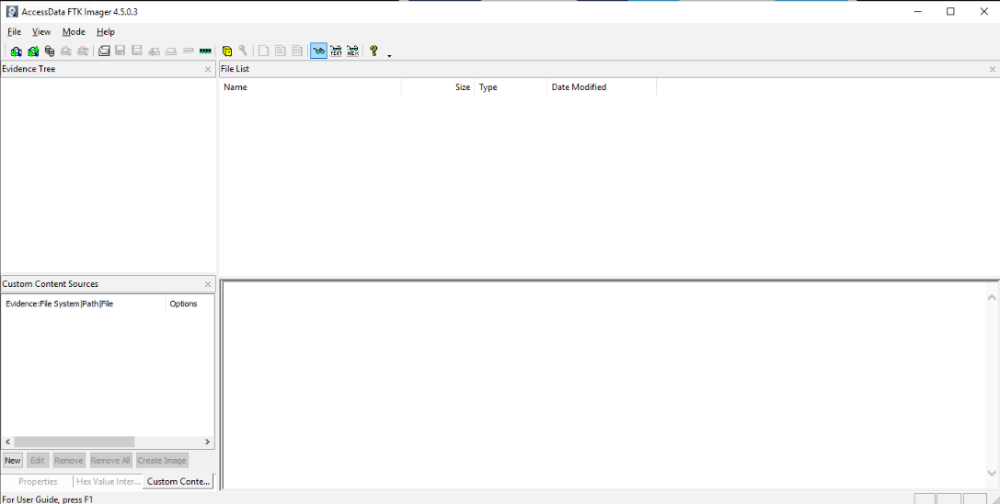<br>
  <em>Figure 1: Opening FTK Imager from the Acquisition Tools folder.</em>
</p>

##### 🔷 Task 1.2 — Open the Capture Memory option

Inside FTK Imager, I selected:

```text
File > Capture Memory
```

This opened the memory capture configuration window.

The destination path was set to the Desktop so the resulting memory dump could be easily located after acquisition.

Note: Physical memory (RAM) is considered volatile evidence because its contents can change constantly and are typically lost when a system is powered off or rebooted.

<p align="left">
  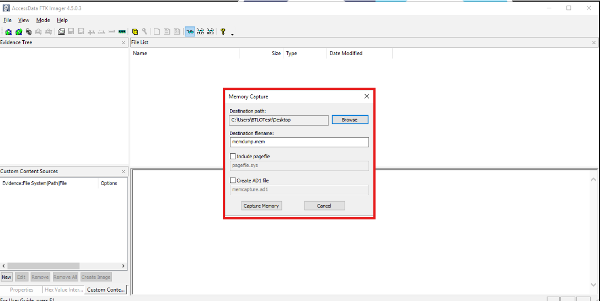<br>
  <em>Figure 2: Configuring the memory capture destination in FTK Imager.</em>
</p>

##### 🔷 Task 1.3 — Capture system memory

After configuring the destination path, I started the memory capture process.

FTK Imager created a memory dump from the analysis host and wrote it to the selected output location.

<p align="left">
  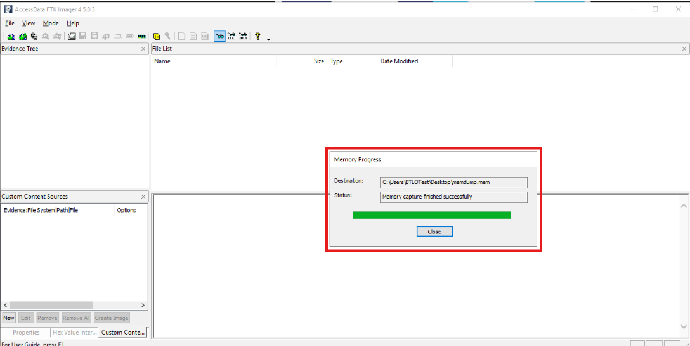<br>
  <em>Figure 3: FTK Imager capturing physical memory from the analysis host.</em>
</p>

##### 🔷 Task 1.4 — Confirm the memory dump output

After acquisition completed, the memory dump file was visible on the Desktop.

In this lab, the memory dump was deleted after confirming the acquisition process because this exercise is focused on demonstrating the acquisition method rather than preserving the file for analysis.

<p align="left">
  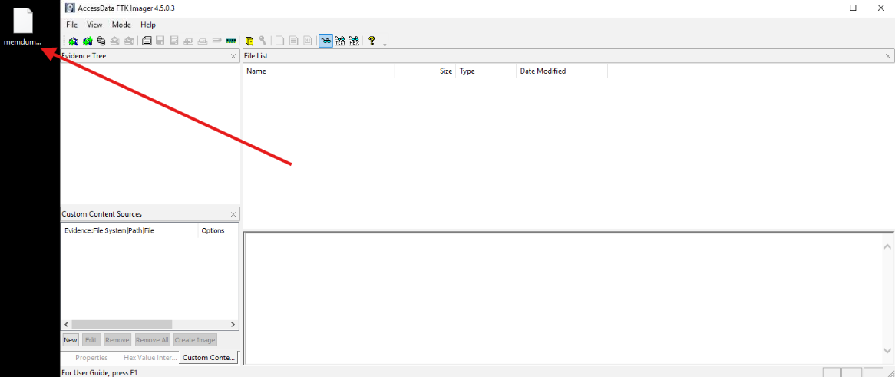<br>
  <em>Figure 4: Confirming the FTK Imager memory dump output on the Desktop.</em>
</p>

##### 🔷 Task 1.5 — Explain why full memory acquisition matters

Physical memory acquisition preserves the live system state at a point in time.

A full memory image may contain:

- running process data,
- active network connection data,
- loaded DLLs,
- command-line arguments,
- encryption keys,
- injected code,
- malware artifacts,
- user activity remnants.

Note: A DLL (Dynamic Link Library) is a file containing code that can be shared and used by multiple applications while they are running.

A memory dump collected with FTK Imager can later be analyzed using memory forensics tools such as Volatility.

<blockquote>
This step demonstrated broad volatile evidence acquisition. FTK Imager captured the memory of the system as a whole, which is useful when an analyst needs a complete view of what was running on a host at the time of acquisition.
</blockquote>

##### 🔷 Task 1.6 — Open PowerShell as Administrator

After completing the FTK Imager memory capture, I moved to a second memory acquisition method using ProcDump.

PowerShell was opened from the Start menu by searching for **PowerShell**, right-clicking **Windows PowerShell**, and selecting **Run as Administrator**.

Administrative privileges were used because dumping process memory may require elevated access to inspect another process and write its memory contents to disk.

<p align="left">
  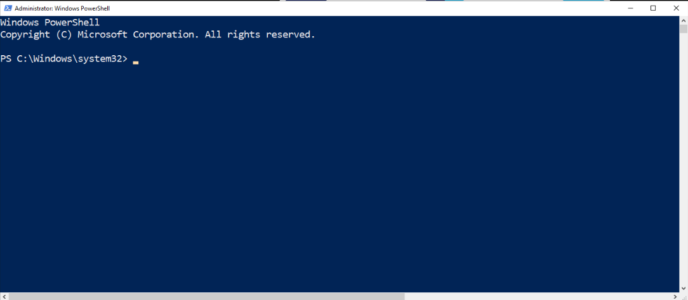<br>
  <em>Figure 5: Opening PowerShell with administrative privileges.</em>
</p>

##### 🔷 Task 1.7 — Navigate to the Acquisition Tools folder

In PowerShell, I navigated to the folder containing ProcDump.

The lab used the **Acquisition Tools** folder on the Desktop as the location for acquisition utilities.

The command was:

```powershell
cd "C:\Users\BTLOTest\Desktop\Acquisition Tools"
```

Depending on the username and current working directory, the path may vary. The key objective was to move into the directory where `procdump.exe` was located.

The quotation marks are useful because the folder name contains a space. Without quotation marks, PowerShell may interpret `Acquisition` and `Tools` as separate path elements or arguments.

<p align="left">
  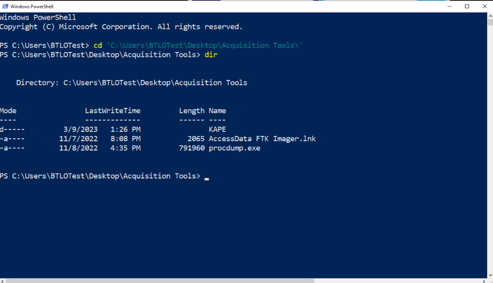<br>
  <em>Figure 6: Navigating to the Acquisition Tools folder in PowerShell.</em>
</p>

##### 🔷 Task 1.8 — Launch Calculator as a benign process target

Calculator was launched from the Start menu or directly from PowerShell using:

```powershell
calc
```

Calculator was not suspicious in this lab. It was used as a safe, simple process to demonstrate the same technique that could be used against a suspicious process in a real investigation.

<p align="left">
  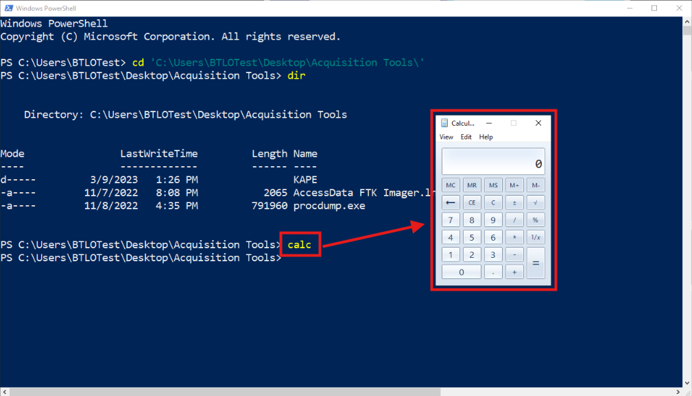<br>
  <em>Figure 7: Launching Calculator as a benign process memory acquisition target.</em>
</p>

##### 🔷 Task 1.9 — Use Get-Process to understand running process output

Before filtering for Calculator, I could run:

```powershell
Get-Process
```

This command lists running processes on the system. The output includes process-related values such as process name, CPU usage, process memory usage, and the process ID.

For this specific demonstration, I used `Get-Process` to see process-related values against the calculator and the PID.

```powershell
Get-Process | findstr -I calc
```

This command can be broken down as follows:

```text
Get-Process
```

lists all running processes.

```text
|
```

pipes the output of `Get-Process` into another command.

```text
findstr
```

searches text output for a matching string.

```text
-I
```

makes the search case-insensitive.

```text
calc
```

is the string being searched for.

The purpose of this command was to quickly locate the Calculator process without manually reviewing every running process.

This matters because ProcDump needs a specific process identifier to know which running process should be dumped.

<p align="left">
  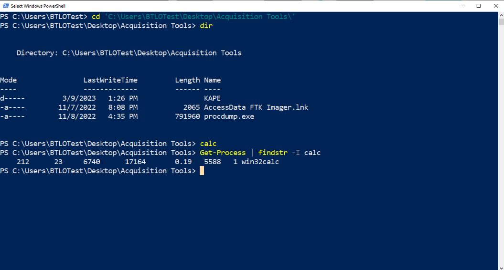<br>
  <em>Figure 8: Running Get-Process to review active process information for the calculator.</em>
</p>

##### 🔷 Task 1.10 — Identify the Calculator PID

The filtered output showed the process entry related to Calculator.

The key value needed from the output was the Process ID.

```text
212 23 6740 17164 0.19 5588 1 win32calc
```

In this row of output, the value 5588 is the PID for the calculator application.

The PID is important because it uniquely identifies the running process instance at that moment. If Calculator is closed and reopened, Windows may assign a different PID.

Note: PID stands for Process Identifier, which is a unique number Windows assigns to each running process.

##### 🔷 Task 1.11 — Run ProcDump against the Calculator PID

After identifying the Calculator PID, I used ProcDump to create a full memory dump of that process.

Note: ProcDump is a Microsoft Sysinternals utility commonly used to capture process memory for troubleshooting, malware analysis, and incident response investigations.

The command was:

```powershell
.\procdump.exe -ma <PID>
```

For example, if the Calculator PID was `5588`, the command would be:

```powershell
.\procdump.exe -ma 5588
```

This command can be broken down as follows:

```text
.\procdump.exe
```

runs ProcDump from the current directory.

```text
-ma
```

tells ProcDump to create a full memory dump of the target process.

```text
<PID>
```

tells ProcDump which process to dump.

This created a `.dmp` file in the current folder.

<p align="left">
  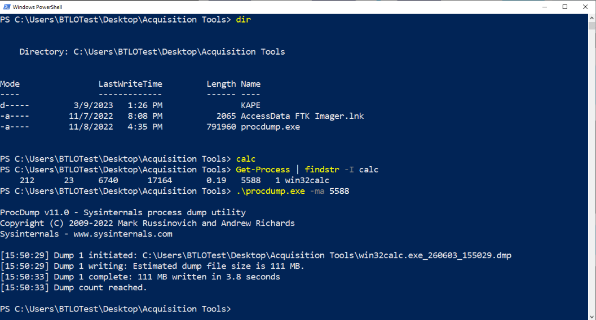<br>
  <em>Figure 9: Running ProcDump against the Calculator PID to create a full process dump.</em>
</p>

##### 🔷 Task 1.12 — Confirm the ProcDump output file

After ProcDump completed, a `.dmp` file was created in the Acquisition Tools folder.

This file represented the memory contents of Calculator at the time of acquisition.

<p align="left">
  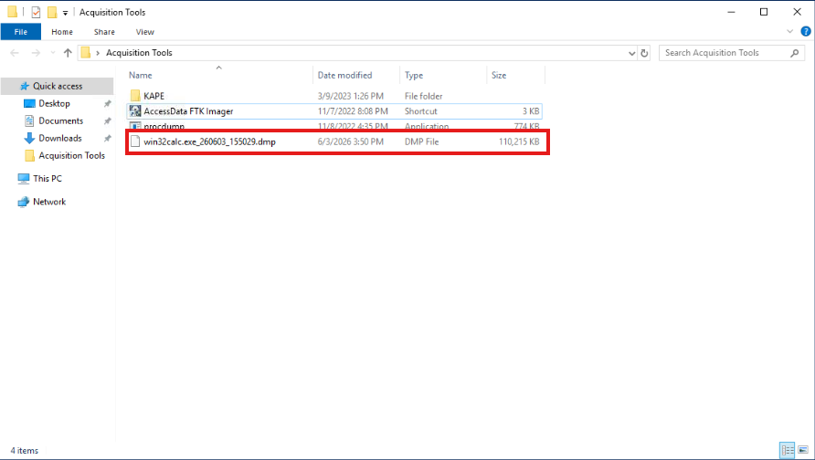<br>
  <em>Figure 10: Confirming the process dump file created by ProcDump.</em>
</p>

##### 🔷 Task 1.13 — Explain why process memory acquisition matters

Process-specific memory acquisition is useful when an analyst wants to preserve the memory of one running process instead of capturing all system memory.

In a real DFIR engagement, an analyst could use this technique against:

- malware running on a host,
- a suspicious PowerShell process,
- an unknown executable,
- a browser process involved in credential theft,
- a process suspected of injection,
- a process communicating with suspicious infrastructure.

A process dump may contain information that is not visible from the file on disk. For example, malware may unpack itself in memory, decrypt configuration data, inject code into another process, or store command-and-control details in memory.

<blockquote>
This task reinforced the difference between full memory acquisition and targeted process acquisition. FTK Imager captured the memory state of the whole system, while ProcDump focused on one process identified by PID. In incident response, both methods are useful depending on scope, urgency, evidence volatility, and the suspected activity.
</blockquote>

</details>

<details>
<summary><strong>▶ Task Two — Create a Forensic Disk Image with FTK Imager</strong><br>
→ acquiring a secondary physical drive in E01 format
</summary><br>

This task focused on using FTK Imager to create a forensic image of a secondary physical drive.

<blockquote>
After practicing memory acquisition, I moved into disk acquisition. Disk imaging is a core forensic activity because it allows an examiner to preserve a copy of a storage device and perform later analysis against the copy instead of the original evidence source.
</blockquote>

##### 🔷 Task 2.1 — Launch FTK Imager and start disk image creation

FTK Imager was launched again from the Acquisition Tools folder. The purpose was to use FTK Imager to take a disk image from a secondary 20 GB storage volume attached to the machine.

Inside FTK Imager, I selected:

```text
File > Create Disk Image
```

This opened the disk image creation wizard. Because this was a physical, secondary drive attached to the machine, I selected `Physical Drive`. The source evidence type selected was:

```text
Physical Drive
```

This option was selected because I was imaging a secondary physical storage volume attached to the analysis machine.

<p align="left">
  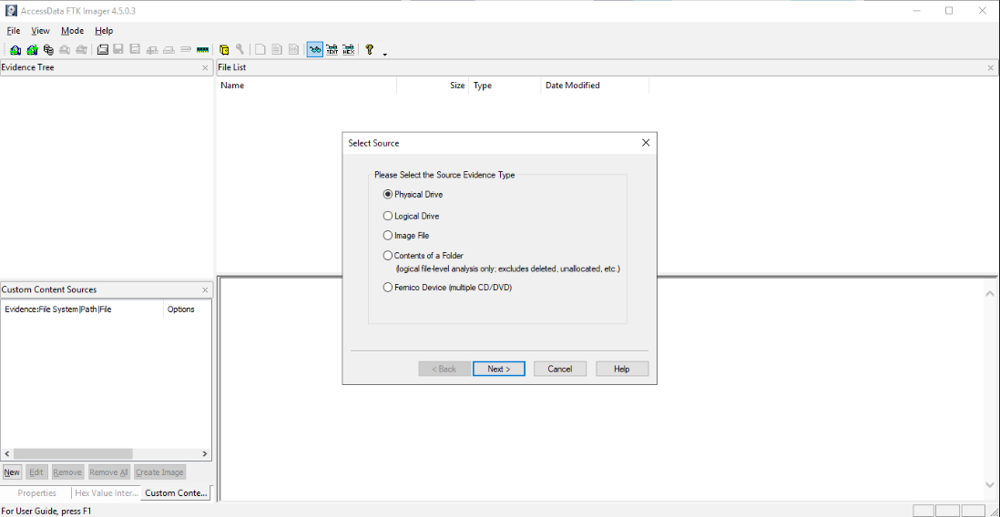<br>
  <em>Figure 11: Opening the Create Disk Image option in FTK Imager.</em>
</p>

##### 🔷 Task 2.2 — Select the secondary drive

The selected drive was approximately 21 GB in size.

This secondary drive was used instead of a much larger disk so that the lab could demonstrate the imaging process without requiring excessive acquisition time.

<p align="left">
  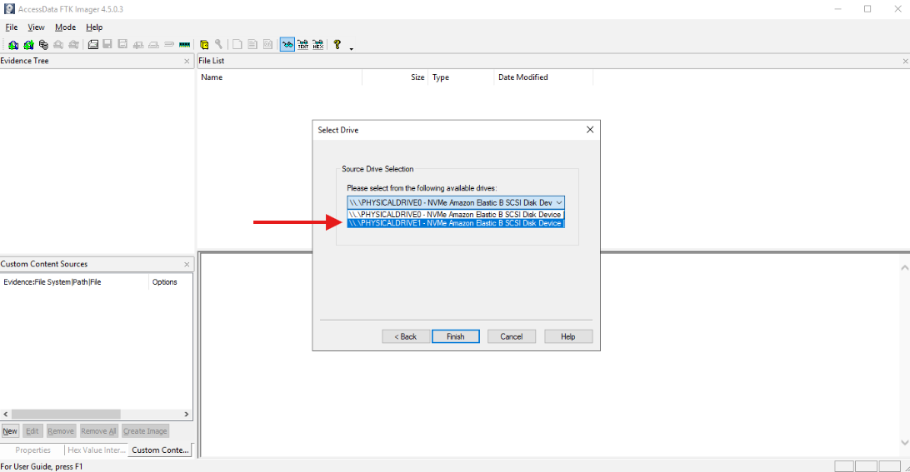<br>
  <em>Figure 12: Selecting the secondary 21 GB physical drive for imaging.</em>
</p>

##### 🔷 Task 2.3 — Add an image destination

After selecting the source drive, I clicked **Add** to configure the image destination.

The image type was configured as:

```text
E01
```

E01 is a forensic image format commonly associated with EnCase and supported by many forensic analysis tools.

Note: Unlike a raw image format, E01 supports metadata, compression, and built-in integrity verification features.

<p align="left">
  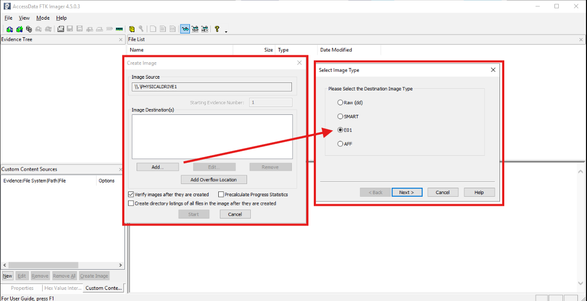<br>
  <em>Figure 13: Configuring the disk image output type as E01.</em>
</p>

##### 🔷 Task 2.4 — Review case information fields

FTK Imager prompted for case-related details.

In this lab, the case information fields were left blank.

In a real forensic investigation, this is useful to abide by the chain of custody. These fields could be used to document:

- case number,
- evidence number,
- examiner name,
- acquisition notes,
- description of the evidence source.

<p align="left">
  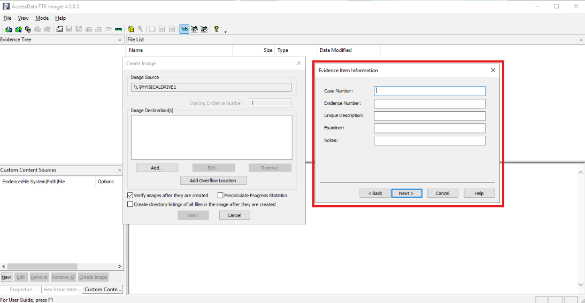<br>
  <em>Figure 14: Reviewing optional case information fields in FTK Imager.</em>
</p>

##### 🔷 Task 2.5 — Configure output location and filename

The output location was configured as the Desktop.

The output filename was set to:

```text
DiskImage
```

This produced an E01 image file using the configured filename.

<p align="left">
  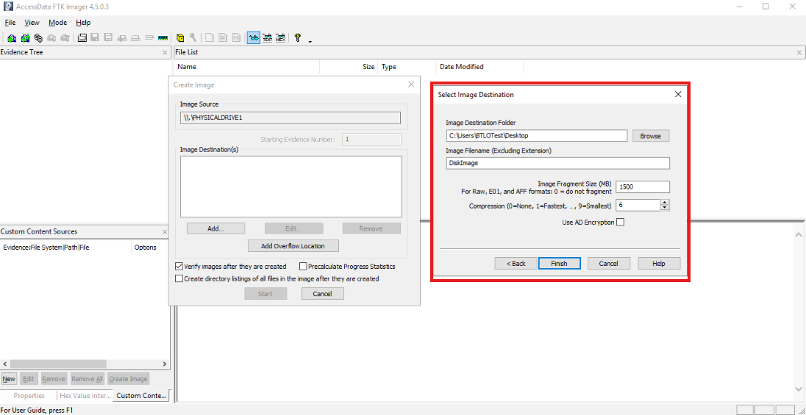<br>
  <em>Figure 15: Configuring the disk image destination and filename.</em>
</p>

##### 🔷 Task 2.6 — Start the disk imaging process

After confirming the image configuration, the acquisition was started.

FTK Imager began reading from the selected physical drive and writing the forensic image to the configured destination.

<p align="left">
  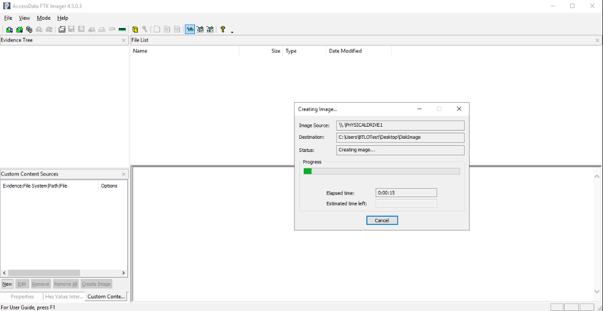<br>
  <em>Figure 16: FTK Imager creating the forensic image of the selected drive.</em>
</p>

##### 🔷 Task 2.7 — Review hash values after acquisition

After the disk image was completed, FTK Imager generated hash values for integrity purposes. So in the future analysts can ensure that the disk image, or any copies of it, are the exact same as when it was acquired. This allows analysts to prove or disprove claims of data tampering or corruption.

Hash values are important because they allow an analyst to verify whether the forensic image remains unchanged after acquisition.

The exact hash values should be recorded from the completed acquisition output.

<p align="left">
  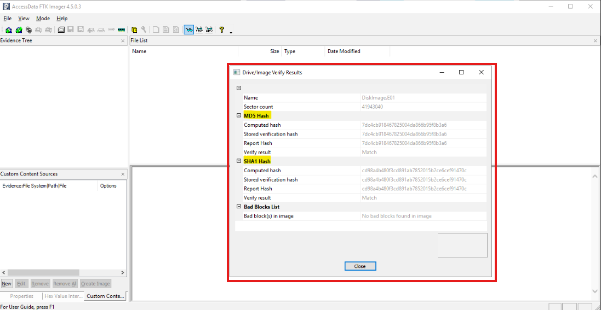<br>
  <em>Figure 17: Reviewing FTK Imager hash values after disk acquisition.</em>
</p>

##### 🔷 Task 2.8 — Explain why disk imaging and hashing matter

Disk imaging allows an analyst to preserve a copy of the original storage source for later analysis.

This matters because analysis should generally be performed on a forensic copy rather than the original evidence whenever possible. A forensic image can be loaded into tools such as Autopsy, EnCase, FTK, X-Ways, or other platforms for examination.

Hashing supports evidence integrity. If the image is copied, transferred, or analyzed later, the hash can be recalculated and compared against the original value.

If the hash values match, the image is likely unchanged. If they do not match, that may indicate corruption, modification, or another integrity issue.

<blockquote>
This task reinforced that acquisition is not only about creating a copy. It is also about proving that the copy remained consistent from the time it was acquired. Hash values help support that integrity claim and are a key part of defensible evidence handling.
</blockquote>

</details>

<details>
<summary><strong>▶ Task Three — Collect Remote Browser Artifacts with KAPE</strong><br>
→ using RDP and KAPE to acquire Chrome artifacts from a remote host
</summary><br>

This task focused on collecting browser-related artifacts from a remote Windows host using KAPE.

<blockquote>
After completing local memory and disk acquisition, I moved into remote artifact collection. This task simulated a common DFIR need: collecting high-value artifacts from another endpoint without immediately acquiring the entire disk. KAPE was used to target specific browser artifacts from the remote host's C drive.
</blockquote>

##### 🔷 Task 3.1 — Open Remote Desktop (RDP)

Remote Desktop was opened from the Windows Start menu.

Note: Remote Desktop Protocol (RDP) allows an analyst to remotely view and interact with another Windows system as though they were physically sitting in front of it.

The private, ephemeral IP address (10.0.3.243) for this remote environment was entered into the RDP connection window.

<p align="left">
  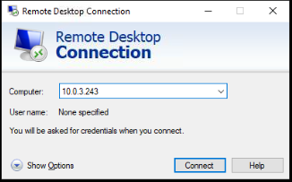<br>
  <em>Figure 18: Opening Remote Desktop to connect to the remote Windows host.</em>
</p>

##### 🔷 Task 3.2 — Authenticate to the remote host

I entered credentials to authenticate to the remote system.

<p align="left">
  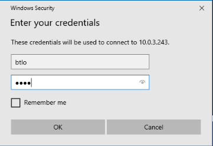<br>
  <em>Figure 19: Authenticating to the remote host</em>
</p>

After authentication, the remote Windows desktop was available through the RDP session.

##### 🔷 Task 3.3 — Copy the KAPE folder from the current workstation to the remote system

After connecting to the remote host, I minimized the RDP window and returned to the virtual machine I was working from.

The KAPE folder was located inside the Acquisition Tools folder on the Desktop. The KAPE folder was then copied and pasted from the analysis workstation and on to the Desktop of the remote host.

<p align="left">
  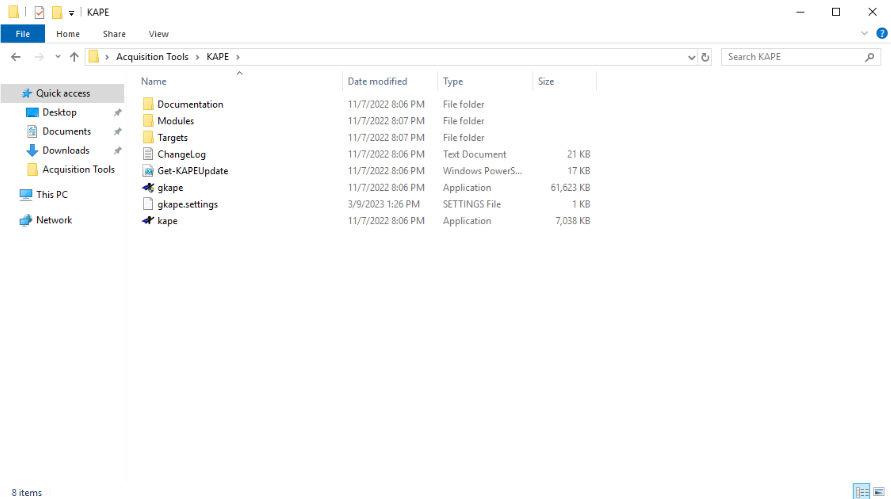<br>
  <em>Figure 20: Finding the KAPE folder from the Acquisition Tools directory from current virtual machine</em>
</p>

<p align="left">
  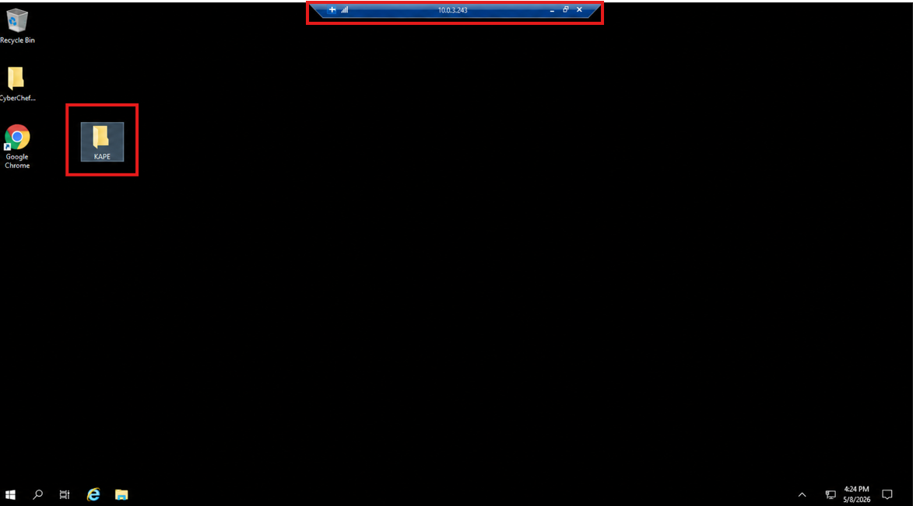<br>
  <em>Figure 21: Copying and pasting the KAPE folder from the Acquisition Tools directory from current virtual machine to remote machine.</em>
</p>

This allowed KAPE to run locally on the remote system and collect artifacts from that host's file system.

##### 🔷 Task 3.4 — Launch gkape on the remote host

On the remote host, the copied KAPE folder was opened. The graphical version of KAPE, `gkape`, was launched.

This interface was used to configure the target source, target destination, and collection targets.

<p align="left">
  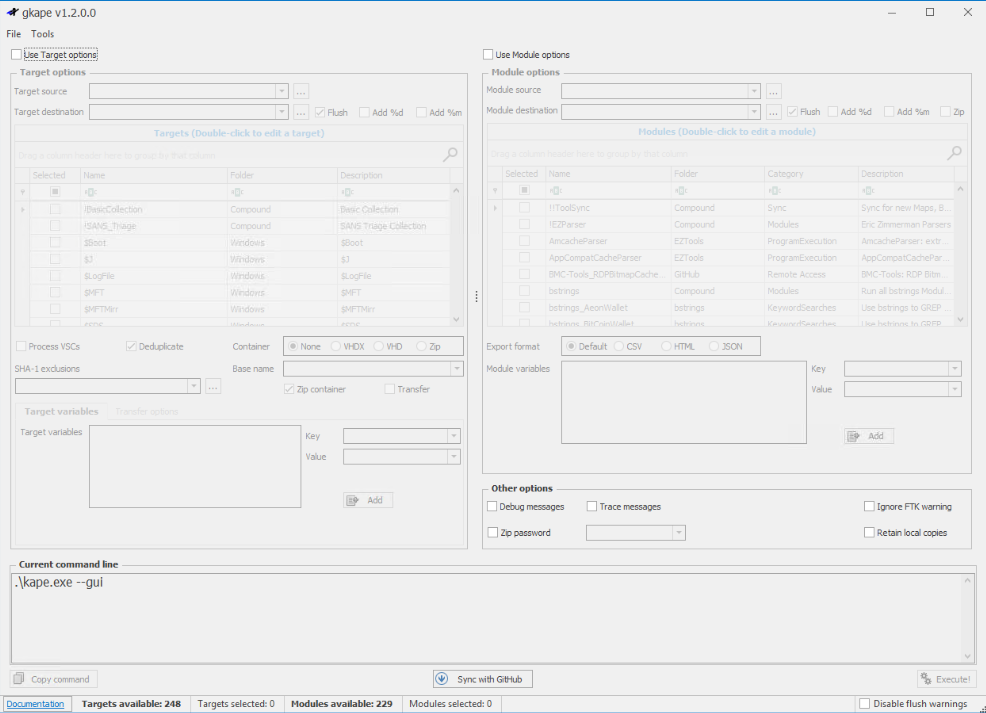<br>
  <em>Figure 22: Launching gkape on the remote Windows host.</em>
</p>

##### 🔷 Task 3.5 — Enable Target options

Inside gkape, the option to use Target options was enabled.

This allowed KAPE to collect selected artifacts from the configured Target Source and write them to the configured Target Destination.

Note: KAPE does not scan the entire drive looking for browser artifacts. Instead, it uses predefined artifact definitions that tell it where specific evidence is normally stored. When Chrome is selected as a target, KAPE automatically checks known Chrome artifact locations beneath the specified source drive.

The Target Source was configured as the remote host's C drive.

```text
Target Source: C:\
```

This instructed KAPE to search the remote host's main system drive for the selected artifacts.

<p align="left">
  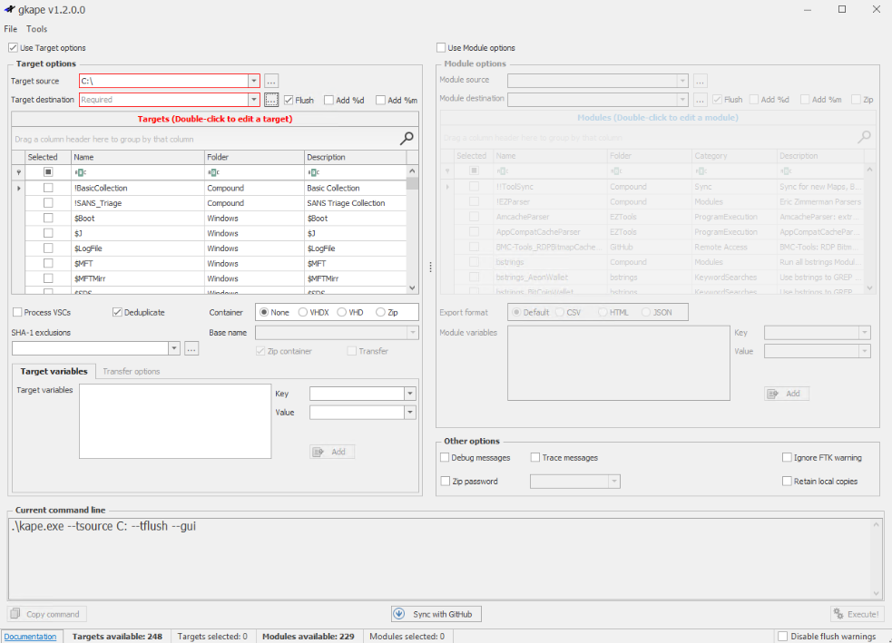<br>
  <em>Figure 23: Configuring the KAPE Target Source as the remote host C drive.</em>
</p>

##### 🔷 Task 3.6 — Configure Target Destination

The Target Destination was configured as an output folder on the remote host Desktop.

A new folder named `output` was created and selected.

```text
Target Destination: Desktop\output
```

This folder was used to store the artifacts collected by KAPE.

<p align="left">
  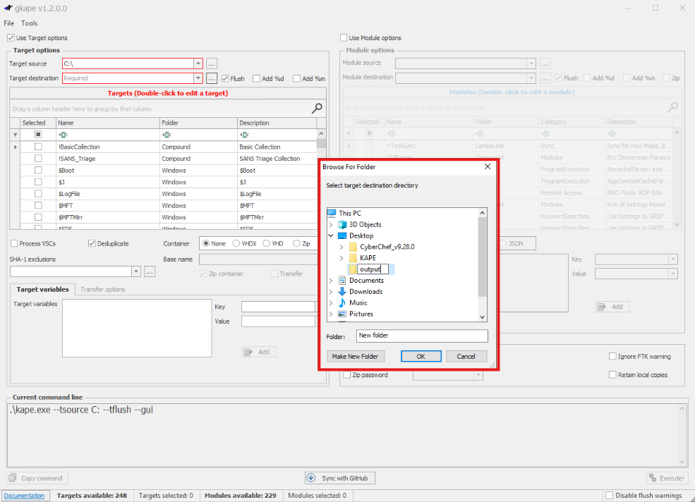<br>
  <em>Figure 24: Configuring the KAPE output destination folder.</em>
</p>

##### 🔷 Task 3.7 — Select Chrome and Chrome Extensions targets

The target search option was used to search for browser-related collection targets.

The selected targets were:

```text
Chrome
Chrome Extensions
```

These targets instructed KAPE to collect Chrome browser artifacts and extension-related data from the remote host.

<p align="left">
  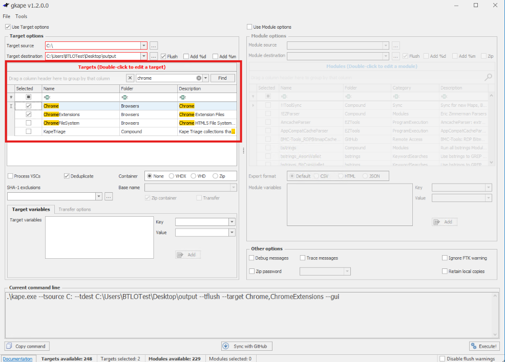<br>
  <em>Figure 25: Selecting Chrome and Chrome Extensions targets in KAPE.</em>
</p>

##### 🔷 Task 3.8 — Execute the KAPE collection

After configuring the source, destination, and targets, I clicked the [Execute] button.

KAPE displayed a warning prompt about overwriting data. The prompt was acknowledged so the acquisition could continue. KAPE then collected the selected browser artifacts from the remote host.

After KAPE finished running, a completion window was displayed.

The command prompt window was closed, and gkape was closed after the acquisition completed.

<p align="left">
  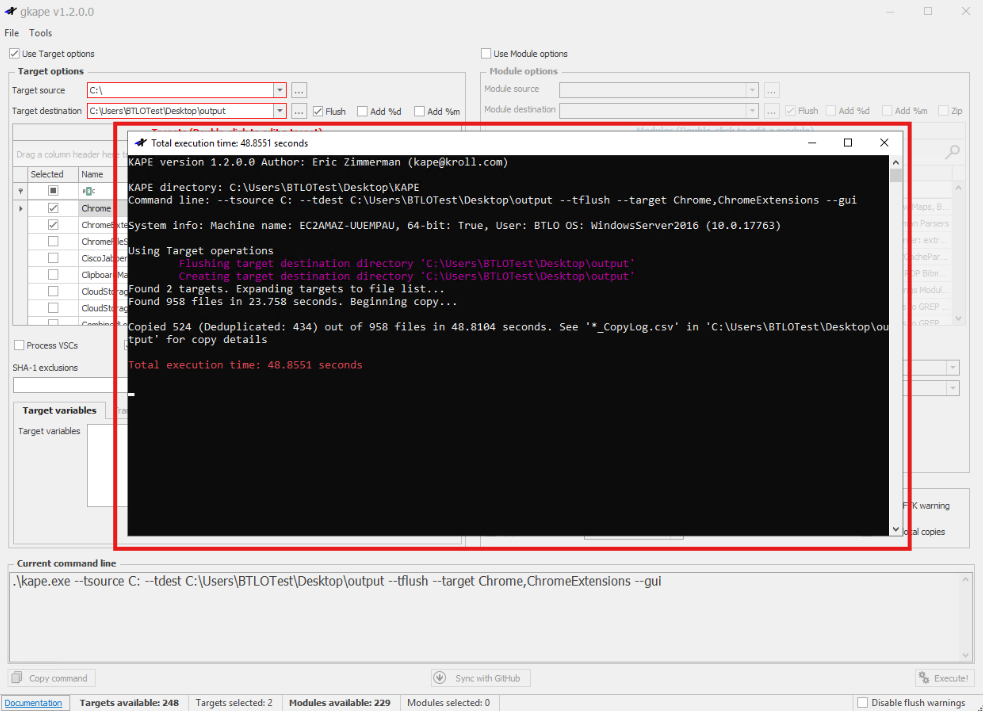<br>
  <em>Figure 26: Confirming completion of the KAPE collection.</em>
</p>

##### 🔷 Task 3.9 — Review the KAPE output folder

The output folder was opened on the remote host.

Inside the output folder, the collected artifacts were organized into subfolders created by KAPE.

The collected data represented browser-related evidence from the remote host's C drive.

<p align="left">
  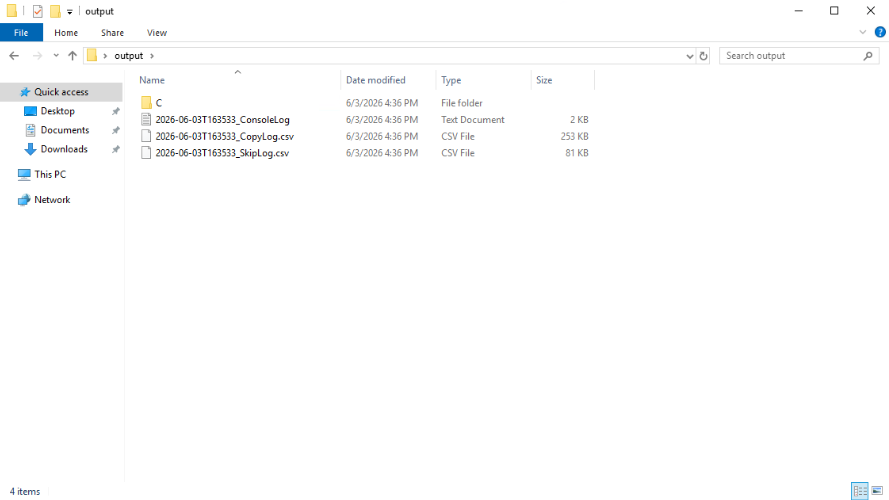<br>
  <em>Figure 27: Reviewing the KAPE output folder and collected artifact structure.</em>
</p>

<p align="left">
  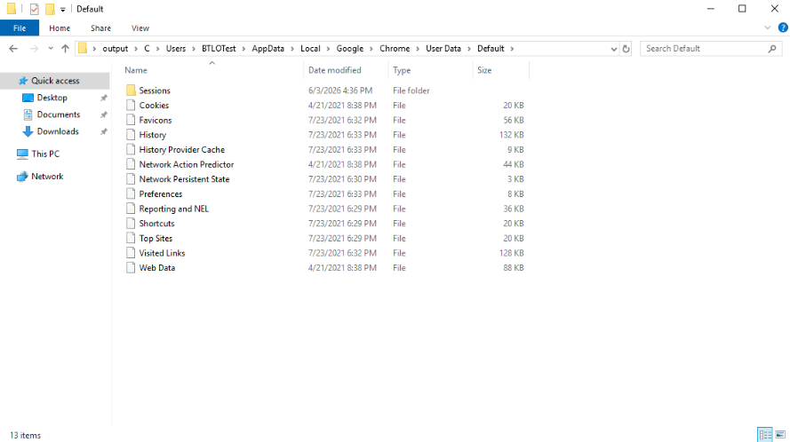<br>
  <em>Figure 28: Reviewing the KAPE output folder and collected artifact structure.</em>
</p>

The screenshots directly above shows part of the browser artifacts collected by KAPE from the remote system. After selecting the Chrome and Chrome Extensions targets, KAPE copied files from Chrome's user profile directory located under:

```
C:\Users\BTLOTest\AppData\Local\Google\Chrome\User Data\Default
```

The collected artifacts include several files commonly examined during browser forensics, such as History, Cookies, Favicons, Visited Links, Web Data, and the Sessions folder. This directly relates to an earlier concept that KAPE does not "discover" browser history on its own. Instead, it knows the default locations where Chrome stores user activity and automatically collects those files. For example:
- The History file is a SQLite database that contains records of visited websites, timestamps, downloads, and other browsing activity. 
- The Cookies file contains website cookie data, while the Sessions folder may contain information related to open or recently opened browser tabs and browsing sessions. 

This demonstrates how KAPE can retrieve browser-related evidence simply by targeting the system's C: drive, because Chrome stores these artifacts as files on disk within the user's profile directory. These collected artifacts can later be analyzed with forensic tools to reconstruct browsing activity, identify visited websites, review download history, and examine user behavior on the system.

##### 🔷 Task 3.10 — Copy the KAPE output back to the analyst workstation

After confirming that the output folder was created, the folder was copied from the remote host.

The RDP session was minimized, and the output folder was pasted onto the analyst workstation Desktop.

This completed the remote artifact acquisition process.

<p align="left">
  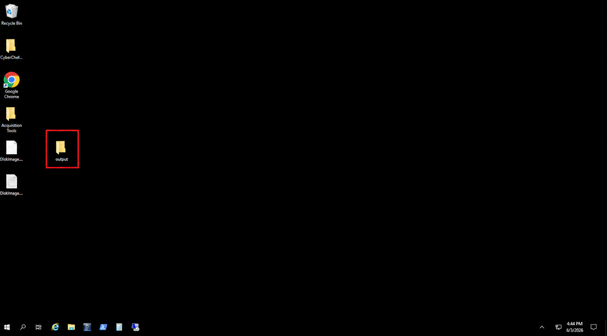<br>
  <em>Figure 29: Copying the KAPE output folder back to the original workstation device.</em>
</p>

##### 🔷 Task 3.11 — Explain why targeted artifact collection matters

KAPE is useful because it allows an analyst to collect targeted forensic artifacts quickly.

Instead of imaging an entire disk, KAPE can collect specific artifacts that are commonly useful during triage, including browser artifacts, event logs, registry hives, prefetch files, link files, jump lists, and other evidence sources depending on selected targets.

In this lab, the selected targets focused on Chrome and Chrome extensions.

Potential browser-related artifacts may support future analysis of:

- browsing history,
- downloads,
- visited URLs,
- browser profile data,
- extensions installed by the user,
- extension configuration files,
- session-related artifacts.

<blockquote>
This task reinforced that not every acquisition requires a full disk image. In many incident response situations, analysts need fast triage data from a remote host. KAPE supports this by collecting high-value artifacts from known locations and organizing them for later analysis.
</blockquote>

</details>

---

### Evidence Acquisition Summary

The workflow acquired or demonstrated acquisition across four evidence categories: full memory, process memory, disk image, and remote browser artifacts.

| Task | Source | Acquisition Method | Tool | Output |
|---|---|---|---|---|
| Task 1 | Analysis host physical memory | Full memory acquisition | FTK Imager | Memory dump |
| Task 1 | Calculator process | Process-specific memory acquisition | ProcDump | `.dmp` process dump |
| Task 2 | Secondary physical drive | Forensic disk imaging | FTK Imager | E01 forensic disk image and hash values |
| Task 3 | Remote host C drive | Targeted artifact collection | KAPE | Browser artifact output folder |

The workflow demonstrated that evidence acquisition is not limited to one tool or one evidence source. Different acquisition methods preserve different types of evidence and support different investigation needs.

---

### What I Learned (Skills Demonstrated)

Through this workflow, I learned how to:

- Use FTK Imager to capture volatile system memory.
- Explain why volatile memory should be acquired before shutdown or reboot.
- Open PowerShell with administrative privileges.
- Navigate to a tools directory from PowerShell.
- Launch a benign process for acquisition practice.
- Use `Get-Process` to identify running processes.
- Use `findstr` to filter command output.
- Identify a process ID for a target process.
- Understand why ProcDump requires a PID.
- Use ProcDump to acquire process-specific memory.
- Explain why process memory may be useful during malware or incident response investigations.
- Use FTK Imager to create a forensic disk image from a physical drive.
- Select E01 as a forensic image output format.
- Understand how forensic image formats support later analysis.
- Recognize the importance of hash values for evidence integrity.
- Connect to a remote Windows host using RDP.
- Copy acquisition tooling to a remote system.
- Configure KAPE target source and destination paths.
- Select browser-related KAPE targets.
- Collect Chrome and Chrome extension artifacts.
- Transfer acquired artifacts back to the analyst workstation.
- Differentiate between memory acquisition, process acquisition, disk imaging, and artifact collection.
- Explain how acquisition supports later forensic analysis workflows.

This workflow strengthened my understanding that digital forensic investigations depend on properly acquired evidence. Before an analyst can examine browser history, parse memory, review disk contents, or reconstruct activity, the relevant evidence must first be collected and preserved. FTK Imager, ProcDump, and KAPE each support a different acquisition need, and together they demonstrate a practical foundation for DFIR evidence collection.

---

### Key Takeaways

This workflow showed that acquisition is the foundation of digital forensic analysis.

FTK Imager was useful for broad evidence acquisition, including full memory capture and physical disk imaging. ProcDump was useful for targeted process memory acquisition. KAPE was useful for targeted artifact collection from a remote host.

The most important lesson from this workflow is that acquisition choices should match the type of evidence needed:

- If volatile system state matters, capture memory.
- If one suspicious process matters, acquire process memory.
- If a full storage source must be preserved, create a forensic disk image.
- If rapid triage artifacts are needed, use targeted collection with a tool like KAPE.

Together, these methods support a structured evidence acquisition process that prepares data for later forensic analysis.
