# Disk Image Forensics and Artifact Analysis Using Autopsy

### Overview

This workflow demonstrates practical disk image forensics and artifact analysis using **Autopsy** to examine a forensic disk image from a suspect laptop.

In this investigation, I will be analyzing a disk image to identify operating system information, determine the system hostname, review web download artifacts, recover download source URLs, examine Recent Documents / shortcut artifacts, navigate the virtual filesystem, inspect directory metadata, and review local operating system account information. The goal is not only to answer the required investigation questions, but to understand how Autopsy can be used to examine disk-based evidence and correlate multiple artifact sources during a forensic investigation.

The scenario is that a laptop disk image has been provided for review. I am responsible for creating an Autopsy case, adding the disk image as a data source, selecting relevant ingest modules, reviewing parsed artifacts, and interpreting the findings recovered from the disk image.

This project focused on analyzing a Windows disk image to recover host-based artifacts related to operating system configuration, browser downloads, recent document activity, filesystem navigation, installed program directories, and local user account activity.

This workflow demonstrates how multiple disk artifacts can be analyzed separately and then correlated together to better understand activity on a Windows system.

> **Workflow vs Execution vs Writeup (Terminology Used Here)**  
> - **Workflows** refer to repeatable digital forensic procedures such as disk image analysis, artifact review, filesystem examination, browser download analysis, shortcut artifact interpretation, and account activity review.  
> - **Executions** refer to hands-on use of Autopsy to create a case, ingest a disk image, review parsed artifacts, navigate the virtual filesystem, and document findings.  
> - **Writeups** document investigative findings, analyst reasoning, evidence interpretation, tool usage, and forensic conclusions.

> 👉 For a **detailed, step-by-step walkthrough of how this workflow was executed — complete with screenshots**, see the **[Step-by-Step Execution](#step-by-step-execution)** section below.

---

### Purpose and Analyst Focus

#### ▶ Purpose

The purpose of this workflow is to demonstrate how a forensic disk image can be examined using Autopsy to recover operating system information, browser download activity, shortcut artifacts, filesystem metadata, and local account information.

Rather than treating each Autopsy view as a separate answer source, this workflow uses Autopsy output as evidence. Each artifact type contributes a different part of the disk image investigation.

For example:

- Operating system information helped identify the suspect laptop's OS and version.
- Hostname information helped identify the system name associated with the disk image.
- Web download artifacts helped identify files downloaded from the internet.
- URL records helped determine the source of downloaded content.
- Recent Documents artifacts helped identify a file path associated with a recently accessed image.
- Filesystem navigation helped locate installed application directories and inspect folder metadata.
- OS Account artifacts helped identify local user accounts and account access timestamps.

This type of artifact correlation is important because disk images contain many different evidence sources. A single artifact may answer one question, but multiple artifacts can provide broader context about the system, user activity, and file access.

#### ▶ Analyst Focus

The analyst focus is on understanding what evidence can be extracted from a disk image and how Autopsy helps organize that evidence for forensic review.

This includes:

- understanding what a forensic disk image is,
- understanding what an Autopsy case is,
- creating a new Autopsy case,
- selecting a base directory for case storage,
- adding a disk image as a data source,
- understanding why ingest modules are selected,
- allowing Autopsy to parse and process the disk image,
- reviewing operating system information,
- identifying the system hostname,
- reviewing web download records,
- interpreting download timestamps,
- identifying the filename associated with a specific download time,
- identifying a full URL associated with a download record,
- understanding Recent Documents artifacts,
- understanding how `.lnk` shortcut files can preserve file access evidence,
- using Recent Documents to recover the original path of `Pier.jpg`,
- navigating the virtual filesystem within Autopsy,
- understanding partitions and volumes,
- locating installed application directories,
- reviewing folder size metadata,
- reviewing local operating system accounts,
- identifying the last accessed timestamp for the Administrator account,
- documenting disk-based findings in a repeatable forensic workflow.

The goal is not just to click through Autopsy and copy values. The goal is to understand what each artifact proves, what it does not prove, and why each artifact source is useful during a forensic investigation.

---

### What This Workflow Demonstrates

This workflow demonstrates how to:

- Open Autopsy from a forensic analysis environment.
- Create a new Autopsy case.
- Configure a base directory for case output.
- Add a disk image as a data source.
- Select and run ingest modules.
- Understand why ingest modules help parse useful forensic artifacts.
- Review operating system information from parsed artifacts.
- Identify the operating system and version of a suspect laptop.
- Identify the hostname of the system.
- Review web download artifacts.
- Locate a downloaded file by timestamp.
- Recover the full URL associated with a downloaded file.
- Review Recent Documents artifacts.
- Understand the forensic value of Windows shortcut (`.lnk`) files.
- Recover the original path of a recently accessed file.
- Navigate the virtual filesystem inside Autopsy.
- Identify volumes and partitions within a disk image.
- Browse into `Program Files`.
- Locate the `GIMP 2` application directory.
- Determine the size of a directory named `lib`.
- Review OS Account artifacts.
- Identify when a local Administrator account was last accessed.
- Correlate operating system artifacts, browser artifacts, Recent Documents, filesystem metadata, and account information.

This workflow also demonstrates an important disk forensics concept: forensic tools like Autopsy do not only show files. They also parse artifacts, extract metadata, organize evidence into categories, and help analysts move between high-level artifact views and low-level filesystem navigation.

---

### Investigation and Digital Forensics Relevance

Disk images are valuable because they preserve the contents and structure of a storage device for forensic examination. A forensic disk image allows analysts to review files, metadata, partitions, user activity artifacts, application data, browser records, operating system configuration, and account information without modifying the original system.

During digital forensic investigations, this distinction is important.

A live system may change as it is used. Files may be modified, timestamps may update, caches may change, and user activity may continue. A forensic image provides a preserved evidence source that can be analyzed repeatedly while maintaining the integrity of the original data.

The table below summarizes the role of each artifact source in this workflow:

| Artifact | What It Can Reveal | Why It Matters |
|---|---|---|
| Operating System Information | OS name, OS version, system metadata | Helps identify the environment being analyzed |
| Hostname Artifact | System name | Helps identify or correlate the device |
| Web Downloads | Downloaded filenames, timestamps, source URLs | Helps reconstruct internet-based file acquisition |
| Recent Documents | Recently accessed files and shortcut metadata | Helps identify files opened or accessed by the user |
| LNK Files | Original file paths, target metadata, timestamps | Helps reconstruct file access and original locations |
| Virtual Filesystem | Partitions, directories, files, metadata | Helps analysts browse the disk as structured evidence |
| Directory Metadata | Folder size and filesystem attributes | Helps confirm file and folder properties |
| OS Accounts | Local users and account timestamps | Helps identify accounts and account activity |

These artifacts are useful because they support different investigative questions:

- What operating system was installed?
- What was the hostname of the system?
- What files were downloaded from the web?
- What URL was used to download a file?
- What documents or images were recently accessed?
- Where was a recently accessed file originally located?
- What files and folders exist in the filesystem?
- What was the size of a specific application directory?
- What local accounts existed on the system?
- When was the local Administrator account last accessed?

By moving from case creation to evidence ingestion, artifact review, filesystem navigation, and account analysis, the workflow follows a logical disk forensic investigation path:

1. Create the case.
2. Add the disk image.
3. Select ingest modules.
4. Allow Autopsy to process artifacts.
5. Review operating system information.
6. Review browser download artifacts.
7. Review Recent Documents / LNK artifacts.
8. Navigate the virtual filesystem.
9. Review account artifacts.
10. Correlate findings.

> **Note:** Relationship to Disk Forensics and Evidence Analysis:
>
> Disk forensics focuses on examining evidence stored on a storage device or disk image. This can include files, directories, deleted files, filesystem metadata, browser artifacts, operating system artifacts, user account records, registry-derived artifacts, application data, and shortcut files.
>
> Unlike memory forensics, which focuses on volatile runtime data, disk forensics focuses on persistent evidence that remains stored on the device.
>
> In a real-world investigation, analysts normally work from a forensic image rather than the original device. This helps preserve evidence integrity and allows the same image to be reviewed multiple times without altering the source evidence.

The artifacts examined in this workflow come from a disk image and are parsed using Autopsy. For example:

| Artifact | What It May Contain |
|---|---|
| Operating System Information | OS name, version, system metadata |
| Web Downloads | Downloaded filename, source URL, access timestamp |
| Recent Documents | Recently accessed files, shortcut records, target paths |
| Virtual Filesystem | Volumes, folders, files, sizes, paths |
| OS Accounts | Local account names and access timestamps |

> **Note:** This workflow focuses on disk image analysis and artifact interpretation. It does not cover physical acquisition of the laptop, write blockers, chain of custody documentation, full registry analysis, deleted file carving, or malware reverse engineering. The goal is to use the provided disk image to extract and interpret artifacts through Autopsy.

The workflow focuses on six main areas of analysis within Autopsy:

- Case creation and evidence ingestion
- Operating system identification
- Hostname identification
- Web download artifact analysis
- Recent Documents / LNK artifact analysis
- Virtual filesystem and OS account review

Together, these artifacts provide useful insight into system identity, user activity, downloaded content, file access, filesystem structure, and local account activity.

---

### Environment and Execution Context

This section documents the tools, evidence sources, and execution environment used during the workflow.

**Note:** Each section is collapsible. Click the ▶ arrow to expand and view details on software, evidence sources, workflow scope, and the high-level execution map.

<details>
<summary><strong>▶ Environment & Platform</strong><br>
</summary><br>

The workflow was performed in a Windows-based forensic analysis environment.

Autopsy was opened from the Desktop inside the folder:

```text
Autopsy For Disk Analysis
```

The disk image was located in:

```text
Autopsy For Disk Analysis\Laptop Image
```

The disk image selected for analysis was:

```text
Craig Tucker Desktop.E01
```

Autopsy was used to create a new case, select a base directory, add the image as a data source, run ingest modules, and review parsed artifacts.

</details>

<details>
<summary><strong>▶ Evidence Sources Reviewed</strong><br>
</summary><br>

The primary evidence source reviewed was:

| Evidence Source | Purpose |
|---|---|
| `Craig Tucker Desktop.E01` | Forensic disk image analyzed using Autopsy |

The disk image was used to recover operating system, browser, Recent Documents, filesystem, and account artifacts.

The following artifact categories were reviewed:

| Artifact Category | Purpose |
|---|---|
| Operating System Information | Identify OS and version |
| Hostname | Identify system name |
| Web Downloads | Identify downloaded files and source URLs |
| Recent Documents | Identify recently accessed files and shortcut target paths |
| Virtual Filesystem | Browse partitions, directories, and file metadata |
| OS Accounts | Review local account information and access timestamps |

Each evidence source contributed a different part of the overall disk image investigation.

</details>

<details>
<summary><strong>▶ Tooling Used</strong><br>
</summary><br>

The primary tool used during execution was:

- **Autopsy** — a digital forensics platform used to create cases, ingest disk images, parse artifacts, browse filesystems, review metadata, and analyze user and system activity from forensic evidence sources.

The Autopsy features used during this workflow included:

| Feature / View | Purpose |
|---|---|
| New Case Wizard | Create a case container for the investigation |
| Base Directory Selection | Choose where case output will be stored |
| Add Data Source | Add the disk image to the case |
| Ingest Modules | Parse artifacts from the disk image |
| Data Artifacts | Review parsed forensic artifacts |
| Operating System Information | Identify OS and hostname information |
| Web Downloads | Review downloaded files and URLs |
| Recent Documents | Review shortcut-based recent file access |
| Virtual Filesystem | Navigate volumes, files, and directories |
| OS Accounts | Review local account information |

</details>

<details>
<summary><strong>▶ Workflow Map (High-Level)</strong><br>
</summary><br>

1. Open the `Autopsy For Disk Analysis` folder on the Desktop.
2. Launch Autopsy.
3. Select `Create New Case`.
4. Name the case.
5. Select an empty base directory.
6. Create a new folder on the Desktop for the case base directory.
7. Finish case creation.
8. Click `Add Data Source`.
9. Leave the host option as the default selection.
10. Select the disk image data source option.
11. Browse to `Autopsy For Disk Analysis > Laptop Image`.
12. Select `Craig Tucker Desktop.E01`.
13. Continue to ingest module selection.
14. Deselect all ingest modules.
15. Select the required ingest modules.
16. Allow Autopsy to import and process the disk image.
17. Review `Data Artifacts > Operating System Information`.
18. Identify the operating system and version.
19. Identify the hostname.
20. Review `Data Artifacts > Web Downloads`.
21. Locate the downloaded file associated with `2013-12-18 20:05:57 GMT`.
22. Locate the download record associated with `2013-12-18 03:02:50 GMT`.
23. Identify the full URL from the `URL` column.
24. Review `Recent Documents`.
25. Locate `Pier.lnk`.
26. Identify the full path associated with `Pier.jpg`.
27. Open `vol2` in the virtual filesystem.
28. Navigate to `Program Files > GIMP 2`.
29. Identify the size of the `lib` directory.
30. Review `OS Accounts`.
31. Identify the last accessed timestamp for the local Administrator account.
32. Summarize and correlate findings.

1. The investigation began by creating a new Autopsy case. Autopsy cases act as containers for evidence, processed results, settings, and generated analysis artifacts.

<blockquote>
This matters because forensic work needs to be organized and repeatable. A case structure allows the analyst to keep evidence, extracted artifacts, and analysis results together without changing the original disk image.
</blockquote>

2. The disk image was then added as a data source. Adding a data source tells Autopsy which evidence item should be processed and analyzed.

<blockquote>
This matters because the disk image is the primary evidence source. Until it is added, Autopsy does not have any filesystem or artifact data to parse.
</blockquote>

3. Ingest modules were selected to process the disk image and extract artifacts of interest. Ingest modules allow Autopsy to automatically identify and organize evidence.

4. Operating system information was reviewed to determine the OS version and hostname of the suspect laptop.

5. Web download artifacts were reviewed to identify downloaded files and recover download source URLs.

6. Recent Documents artifacts were examined to recover the full path associated with `Pier.jpg`.

7. The virtual filesystem was reviewed to navigate the disk image as if browsing the original system.

8. OS Accounts artifacts were reviewed to identify the last accessed timestamp for the local Administrator account.

</details>

---

### Step-by-Step Execution

This section documents the workflow in the same order an analyst would realistically perform disk image analysis in Autopsy.

The workflow begins with case creation because Autopsy needs a case container before evidence can be imported. It then moves into disk image ingestion, ingest module selection, artifact review, virtual filesystem navigation, and account analysis.

**Note:** Each section is collapsible. Click the ▶ arrow to expand and view the detailed steps.

<details>
<summary><strong>▶ Phase 1 — Create a New Autopsy Case</strong><br>
→ preparing a structured case container for disk image analysis
</summary><br>

This phase focused on creating a new Autopsy case for the disk image investigation.

<blockquote>
I started by creating a case because Autopsy organizes forensic work into cases. A case stores the evidence source, analysis results, extracted artifacts, settings, and generated output. This prevents the analysis from becoming scattered across unrelated folders and keeps the investigation structured.
</blockquote>

##### 🔷 Phase 1.1 — Open Autopsy

I began by opening the folder on the Desktop named:

```text
Autopsy For Disk Analysis
```

Inside that folder, I launched Autopsy. After Autopsy opened, I was prompted to either open an existing case or create a new one. For this workflow, I selected `New Case`.

<p align="left">
  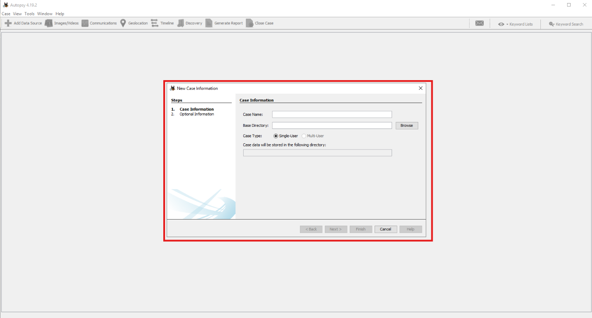<br>
  <em>Figure 1: Creating a new Autopsy case for disk image analysis.</em>
</p>

##### 🔷 Phase 1.2 — Understand why a new case is created

A case is the container Autopsy uses to store the analysis.

The case may include:

- case metadata,
- data source references,
- ingest results,
- extracted artifacts,
- generated reports,
- analysis settings,
- hash databases or temporary files,
- examiner notes depending on workflow.

This matters because forensic investigations need to be organized. If multiple evidence sources are analyzed, a case helps keep them grouped together.

##### 🔷 Phase 1.3 — Name the case

Autopsy asked for case information. The case name can be chosen by the analyst. In a real investigation, the name would normally follow an internal naming convention, such as a case number, incident ID, or evidence tracking number.

For this workflow, any descriptive case name could be used. I used "Peter_Ahn" which is my personal first and last name.

<blockquote>
The case name is primarily for organization. The name itself does not change the evidence. It helps the analyst identify the case later.
</blockquote>

##### 🔷 Phase 1.4 — Select a base directory

Autopsy then asked for a Base Directory.

The Base Directory is where Autopsy stores the case files and generated output. I clicked `Browse` and navigated to the Desktop.

Because the base directory needed to be empty, I created a new folder named "Peter_Ahn_Laptop_Image" using the icon in the top-right corner of the file picker.

<p align="left">
  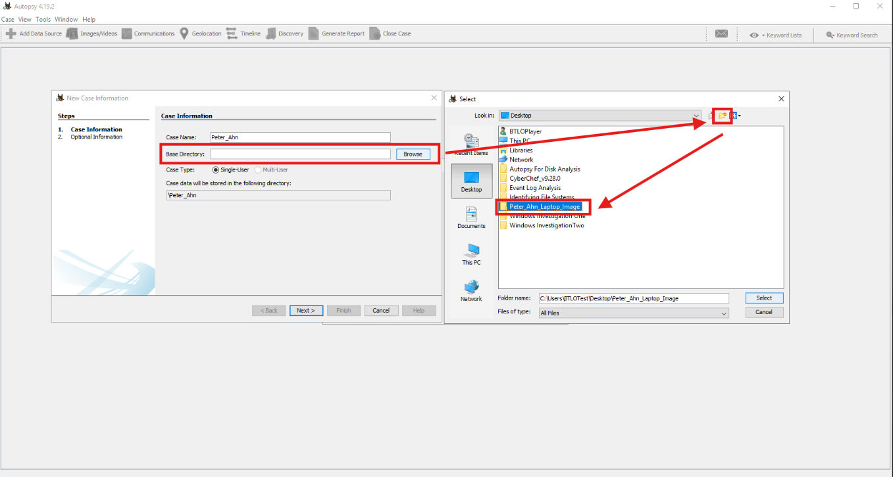<br>
  <em>Figure 2: Creating and selecting an empty base directory for the Autopsy case.</em>
</p>

> **Note:** Why the base directory must be empty:
>
> Autopsy writes case files, internal databases, extracted artifacts, and processing output into the selected base directory.
>
> Using an empty folder prevents case data from mixing with unrelated files and reduces the risk of confusion during analysis.

##### 🔷 Phase 1.5 — Complete case creation

After selecting the base directory, I continued through the case creation process. Autopsy created the case and opened the main interface. At this point, the case existed, but no evidence had been added yet.

##### 🔷 Phase 1.6 — Phase 1 findings

The Autopsy case was created successfully.

| Item | Finding |
|---|---|
| Tool used | Autopsy |
| Case action | Create New Case |
| Base directory requirement | Empty folder |
| Evidence added yet? | No |
| Next step | Add Data Source |

</details>

<details>
<summary><strong>▶ Phase 2 — Add the Disk Image as a Data Source</strong><br>
→ importing the forensic evidence source into Autopsy
</summary><br>

This phase focused on adding the suspect laptop disk image into the Autopsy case.

<blockquote>
After creating the case, I needed to add the disk image as a data source. The case is only the container. The disk image is the actual evidence being analyzed.
</blockquote>

##### 🔷 Phase 2.1 — Understand data sources in Autopsy

A data source is an evidence item added to an Autopsy case. Examples of data sources may include:

- disk images,
- local disks,
- logical files,
- virtual machine images,
- mobile device extractions,
- collections of files.

In this workflow, the data source was a forensic disk image. A disk image preserves the contents of a storage device in a file that can be analyzed without modifying the original source disk.

##### 🔷 Phase 2.2 — Start the Add Data Source process

In the top-left corner of Autopsy, I clicked `Add Data Source`. Autopsy then asked me to select a host. I left the default host option (`Generate a new host name based on data source name`) selected and clicked `Next`.

<blockquote>
The host selection allows Autopsy to associate evidence with a system or device. In workflows with multiple devices, host separation can help organize evidence. In this workflow, the default host option was sufficient.
</blockquote>

##### 🔷 Phase 2.3 — Select the disk image data source type

Autopsy then asked what type of data source should be added. I left the first option selected because the evidence was a disk image. I clicked `Next` and browsed to `Desktop > Autopsy For Disk Analysis > Laptop Image`.

Inside that directory, I selected the disk image file, `Craig Tucker Desktop.E01`.

<p align="left">
  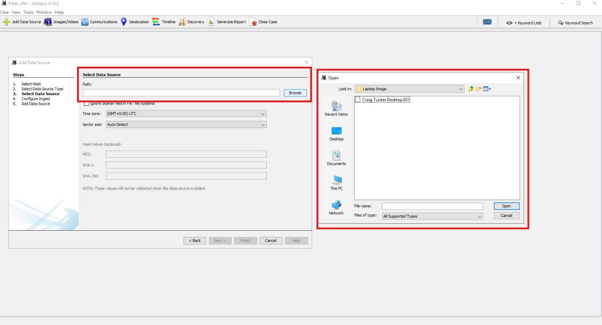<br>
  <em>Figure 3: Selecting the forensic disk image as the data source.</em>
</p>


##### 🔷 Phase 2.4 — Understand the E01 image format

The `.E01` format is commonly associated with forensic disk images. An E01 image can store disk data along with metadata such as case information, examiner information, acquisition notes, and integrity-related information depending on how the image was created. For the analyst, the important point is that the E01 image serves as the evidence source Autopsy will parse.

##### 🔷 Phase 2.5 — Phase 2 findings

The suspect laptop disk image was added to the Autopsy case.

| Item | Finding |
|---|---|
| Data source type | Disk image |
| Evidence directory | `Autopsy For Disk Analysis > Laptop Image` |
| Disk image | `Craig Tucker Desktop.E01` |
| Host option | Default |
| Next step | Configure ingest modules |

</details>

<details>
<summary><strong>▶ Phase 3 — Configure Ingest Modules</strong><br>
→ selecting automated artifact processing options
</summary><br>

This phase focused on selecting Autopsy ingest modules before processing the disk image.

<blockquote>
Ingest modules tell Autopsy what types of processing to perform against the evidence. Instead of manually parsing every artifact from scratch, ingest modules help extract and organize evidence into useful categories.
</blockquote>

##### 🔷 Phase 3.1 — Understand ingest modules

Ingest modules are processing components that Autopsy runs against a data source.

Depending on the selected modules, Autopsy can identify or extract:

- recent activity,
- web artifacts,
- operating system information,
- account information,
- file types,
- hash values,
- keyword hits,
- embedded files,
- EXIF metadata,
- email artifacts,
- registry-derived artifacts.

Selecting the right ingest modules matters because unnecessary modules can increase processing time, while missing modules may prevent useful artifacts from being parsed.

##### 🔷 Phase 3.2 — Deselect all modules first

When Autopsy displayed the ingest module selection screen, I clicked `Deselect All`. This cleared the default selection. Starting from a blank selection made it easier to choose only the modules needed for this workflow.

##### 🔷 Phase 3.3 — Select the required modules

Before processing the disk image, I reviewed the available ingest modules to determine which one would provide the most relevant artifacts for the investigation. After deselecting all modules, I only selected the module `Recent Activity` because the workflow focused on identifying operating system information, browser download activity, recently accessed files, and user account artifacts.

The Recent Activity module is designed to parse and organize activity-based evidence from the disk image, making it easier to review artifacts that may otherwise require manual examination of multiple files and locations throughout the filesystem.

Examples of artifacts commonly recovered by this module include:

- operating system information,
- hostname information,
- browser download records,
- recently accessed documents,
- user activity artifacts,
- account-related information.

These artifact types aligned directly with the investigative objectives of the workflow, allowing Autopsy to automatically identify and organize relevant evidence before manual analysis began. The selected module was used to process the disk image and recover the artifacts needed for the investigation.


<p align="left">
  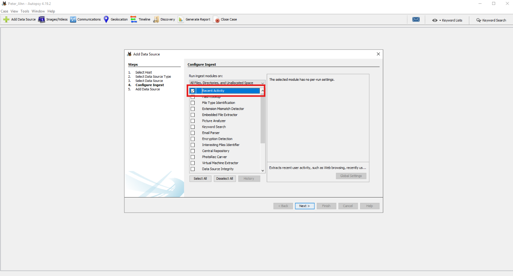<br>
  <em>Figure 4: Selecting the required ingest modules before processing the disk image.</em>
</p>

##### 🔷 Phase 3.4 — Run ingest processing

After selecting the required ingest modules, I continued through the wizard. Autopsy began importing and processing the disk image. The ingest process took several minutes to complete.

<blockquote>
Ingest can take time because Autopsy is parsing the disk image, extracting metadata, identifying artifacts, and organizing evidence into categories that can be reviewed through the interface.
</blockquote>

##### 🔷 Phase 3.5 — Understand why processing time matters

A larger disk image, more selected modules, or more complex evidence source can increase processing time. During this workflow, I allowed Autopsy to process the disk image before beginning the artifact review. This was important because reviewing artifacts before ingest completes may result in incomplete or missing data.

##### 🔷 Phase 3.6 — Phase 3 findings

The disk image was processed using selected ingest modules.

| Item | Finding |
|---|---|
| Ingest configuration | Deselect All, then select required modules |
| Processing action | Import and process disk image |
| Processing time | Several minutes |
| Next step | Review parsed artifacts |

</details>

<details>
<summary><strong>▶ Phase 4 — Identify Operating System Information</strong><br>
→ determining the OS version and hostname from parsed artifacts
</summary><br>

This phase focused on reviewing operating system information recovered from the disk image.

<blockquote>
Before reviewing user activity, I wanted to establish system context. Operating system information and hostname artifacts help identify what type of system was analyzed and provide device-level context for the rest of the evidence.
</blockquote>

##### 🔷 Phase 4.1 — Understand operating system information artifacts

Operating system information artifacts can include details such as:

- operating system name,
- operating system version,
- installation paths,
- system name,
- hostname,
- product information,
- system configuration metadata.

These artifacts help establish the environment being examined.

For example, knowing that a system is running a specific Windows version helps the analyst interpret related artifacts, default paths, user profile structures, and application locations.

##### 🔷 Phase 4.2 — Open Operating System Information

In Autopsy, I navigated to `Data Artifacts > Operating System Information`. This view displayed parsed operating system information recovered from the disk image.

##### 🔷 Phase 4.3 — Identify the operating system and version

After opening the Operating System Information artifact, I reviewed the available fields to determine which column contained information about the installed operating system.

The table contains several operating system–related records extracted during ingest processing. To determine the installed operating system, I looked for a field that explicitly identified the operating system product rather than fields describing the hostname, processor architecture, timestamps, or file paths.

The most useful field for this purpose was under the column `Program Name` which contains the human-readable operating system name recovered from the system. Selecting the relevant entry also populated additional details in the lower pane, allowing the operating system information to be reviewed in greater detail.

<p align="left">
  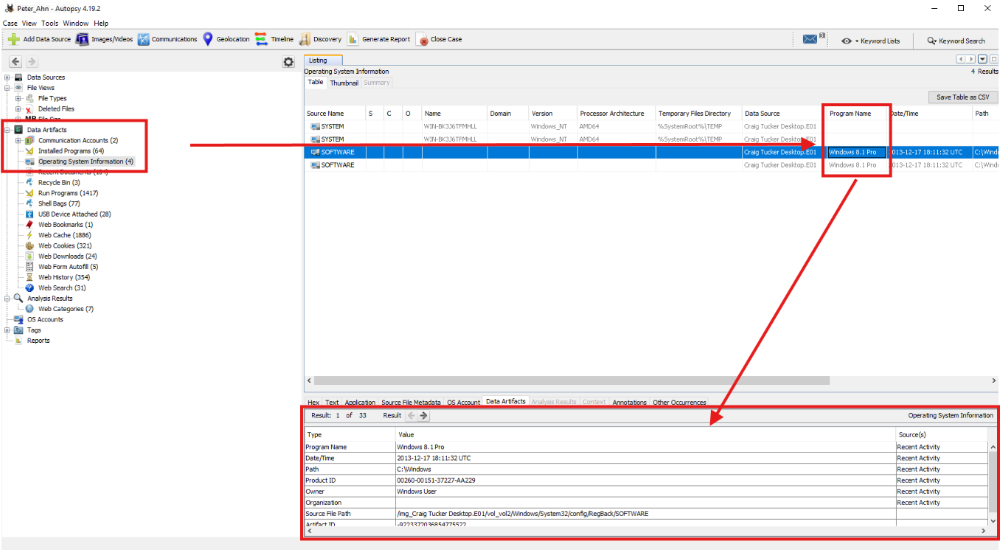<br>
  <em>Figure 5: Reviewing Operating System Information artifacts recovered from the disk image.The Program Name field identifies the operating system as Windows 8.1 Pro.</em>
</p>

The suspect laptop was identified as running:`Windows 8.1 Pro`

##### 🔷 Phase 4.4 — Identify the hostname

After identifying the operating system, I continued reviewing the Operating System Information artifacts to determine the identity of the system itself.

While the operating system tells us what platform is being analyzed, the hostname helps identify which specific device the evidence originated from. This can be useful when correlating forensic findings with inventory records, network logs, incident reports, or evidence collected from multiple systems.

For this reason, I reviewed the available fields for a value representing the system name. The hostname was recorded under the `Name` column.


<p align="left">
  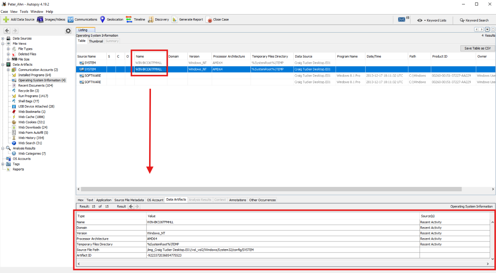<br>
  <em>Figure 6: Reviewing Operating System Information artifacts to identify the hostname associated with the disk image.</em>
</p>

The hostname identified was:

```text
WIN-BK336TFMHLL
```

##### 🔷 Phase 4.5 — Interpret the findings

The operating system and hostname provide system identity context.

The OS version tells the analyst what platform the disk image came from.

The hostname can help correlate the evidence source with other records, such as network logs, user reports, inventory records, or incident response notes.

##### 🔷 Phase 4.6 — Phase 4 findings

| Question | Finding |
|---|---|
| What operating system and version is the suspect laptop running? | `Windows 8.1 Pro` |
| What is the hostname of the system? | `WIN-BK336TFMHLL` |

<blockquote>
This phase established system context. Before analyzing downloads, Recent Documents, or account activity, it was useful to confirm the operating system and hostname associated with the disk image.
</blockquote>

</details>

<details>
<summary><strong>▶ Phase 5 — Investigate Web Download Artifacts</strong><br>
→ identifying downloaded files and source URLs
</summary><br>

This phase focused on reviewing web download artifacts recovered from the disk image. After establishing the operating system and system identity, I shifted the investigation toward user activity artifacts. Download records can provide insight into files acquired from the internet, when they were obtained, and in many cases where they originated.

Because downloaded files often represent a direct interaction between a user and external content, web download artifacts are commonly reviewed during digital forensic investigations to help reconstruct activity occurring on the system.

<blockquote>
Web download artifacts are useful because they can show what files were obtained through a browser or web-based activity. These artifacts can help explain how files arrived on a system and where they originated.
</blockquote>

##### 🔷 Phase 5.1 — Understand web download artifacts

Before reviewing individual download records, it is important to understand what evidence web download artifacts can provide. When a file is downloaded through a web browser, the operating system and browser often create metadata that records details about the download. Depending on the browser and available artifacts, this information may include:

- the downloaded filename,
- the local storage location,
- the source URL,
- timestamps associated with the download,
- browser-specific metadata.

These artifacts are valuable because they can help answer two common investigative questions:

- What was downloaded?
- Where did it come from?

While those questions sound similar, they provide different types of evidence. A filename identifies the object acquired by the user, while a URL helps identify the external source associated with the download. For this reason, web download artifacts are frequently examined during incident response, user activity reconstruction, malware investigations, and general forensic analysis.

Both questions are useful, but they are not the same.

##### 🔷 Phase 5.2 — Open Web Downloads

In Autopsy, I remained under the `Data Artifacts` section and selected `Web Downloads`. The table on the right displayed download records recovered during ingest processing.

##### 🔷 Phase 5.3 — Identify the downloaded file associated with the specified timestamp

To begin reviewing download activity, I focused on a specific timestamp that had been identified as relevant to the investigation:

```text
2013-12-18 20:05:57 GMT
```

Using a known timestamp is a common forensic technique because it allows analysts to quickly locate a specific event within a larger collection of artifacts. Rather than reviewing every download record individually, the timestamp can be used as a reference point to identify the exact download activity being investigated.

With the timestamp established, I reviewed the Date Accessed column within the Web Downloads artifact view and located the row matching `2013-12-18 20:05:57 GMT`. I reviewed the download records and used the timestamp column to locate the row matching that time. The relevant timestamp appeared under the `Date Accessed` column.

<p align="left">
  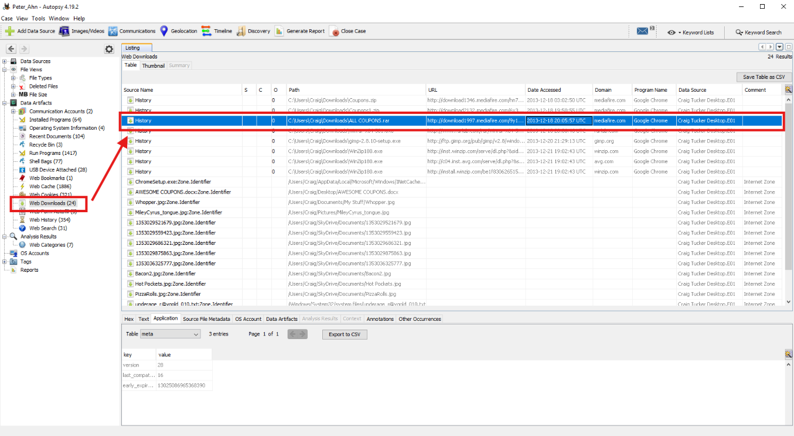<br>
  <em>Figure 7: Reviewing Web Download artifacts to identify the file associated with the specified timestamp.</em>
</p>

The file downloaded at that timestamp was `ALL COUPONS.rar`.

##### 🔷 Phase 5.4 — Interpret the downloaded file finding

After locating the download record associated with the specified timestamp, I reviewed the remaining fields within the artifact to determine which file had been downloaded. The Web Downloads artifact contains metadata associated with browser download activity, including information such as filenames, source URLs, timestamps, and other details recovered during ingest processing.

For this investigation, the filename associated with the matching download record was `ALL COUPONS.rar`.

The `.rar` extension indicates that the downloaded file was a compressed archive. Compressed archive formats such as `.rar` are commonly used to bundle multiple files into a single downloadable package. From this artifact alone, it can be determined that the archive was downloaded at the recorded timestamp, but the contents of the archive cannot be determined without examining the file itself.

This distinction is important because:

```
Downloaded File Name
        ≠
Archive Contents
```

The artifact confirms the name of the downloaded file, but additional analysis would be required to determine what files were stored inside the archive.

##### 🔷 Phase 5.5 — Identify the full URL by timestamp

The previous analysis identified the filename associated with one download event. To continue validating the download artifacts recovered from the disk image, I reviewed a second download record associated with a different timestamp.

Examining multiple download records helps demonstrate that Web Downloads artifacts can provide more than just filenames. In addition to identifying downloaded content, they can also reveal the external source from which a file was obtained.

For this portion of the investigation, I focused on the download record associated with `2013-12-18 03:02:50 GMT`.

Using the timestamp as a reference point, I located the matching entry within the Web Downloads artifact view and reviewed the `URL`column.

The URL field contains the source address associated with the download event, allowing the analyst to determine where the file originated.

<p align="left">
  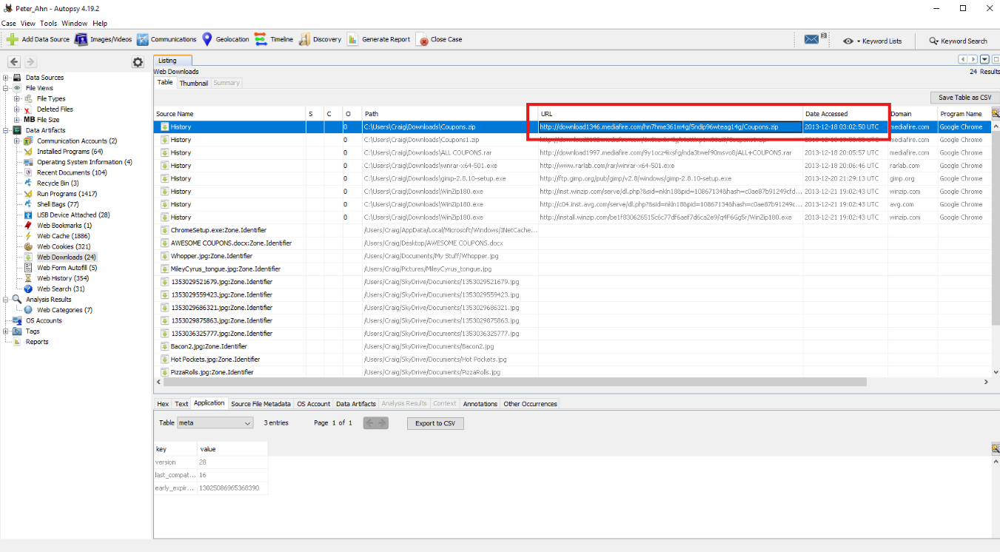<br>
  <em>Figure 8: Reviewing the URL column to identify the full download source URL.</em>
</p>

The full URL associated with the download was:

```text
http://download1346.mediafire.com/hn7hme361m4j/5ndp96wteag14q/Coupons.zip
```

##### 🔷 Phase 5.6 — Interpret the URL finding

The URL identifies the remote location associated with the downloaded file. This is important because the filename alone only identifies the object downloaded. The URL helps identify the source location.

In a forensic investigation, source URLs may be useful for:

- identifying file origin,
- determining whether a download came from a trusted or suspicious domain,
- searching proxy logs,
- performing threat intelligence enrichment,
- correlating with browser history,
- identifying user browsing behavior around the download.

##### 🔷 Phase 5.7 — Phase 5 findings

File downloaded at `2013-12-18 20:05:57 GMT`: `ALL COUPONS.rar`
Full URL of the file downloaded at `2013-12-18 03:02:50 GMT` `http://download1346.mediafire.com/hn7hme361m4j/5ndp96wteag14q/Coupons.zip`

<blockquote>
This phase demonstrated how web download artifacts can identify both local downloaded files and remote source URLs. The timestamp helped locate the correct records, while the filename and URL columns provided the evidence needed to answer the investigation questions.
</blockquote>

</details>

<details>
<summary><strong>▶ Phase 6 — Analyze Recent Documents Artifacts</strong><br>
→ using shortcut artifacts to recover the path of Pier.jpg
</summary><br>

This phase focused on reviewing Recent Documents artifacts to identify the full path associated with `Pier.jpg`.

<blockquote>
Recent Documents artifacts can help show files that were accessed by a user. These artifacts often rely on Windows shortcut files, also known as `.lnk` files, which can preserve useful metadata about the original target file.
</blockquote>

##### 🔷 Phase 6.1 — Understand Recent Documents

Windows commonly tracks recently accessed files through shortcuts. These shortcuts help users quickly reopen files they recently used. From a forensic perspective, Recent Documents can be valuable because they may preserve evidence that a file was accessed, even if the original file is moved, deleted, or no longer easily visible.

##### 🔷 Phase 6.2 — Understand LNK files

LNK files are Windows shortcut files. A shortcut does not contain the full original file itself. Instead, it points to another file or location. For example: `Pier.lnk` may point to `Pier.jpg`.

The shortcut can contain metadata such as:

- target file path,
- timestamps,
- volume information,
- file size,
- drive information,
- original location.

This makes LNK files useful in digital forensics because they can help reconstruct file access activity.

##### 🔷 Phase 6.3 — Open Recent Documents

After navigating to the Recent Documents artifact category, I reviewed the records recovered by Autopsy during ingest processing.

The entries displayed in this view represent recently accessed items identified on the Craig Tucker Desktop.E01 disk image. Many of these entries are Windows shortcut (`.lnk`) files, which Windows creates to help users quickly access recently opened files.

Because the investigation focused on the image file Pier.jpg, I searched the Recent Documents entries for a corresponding shortcut artifact.

In Autopsy, I selected `Recent Documents`. This displayed recent document records parsed from the disk image. The file being investigated was `Pier.jpg`. In the Recent Documents view, the relevant shortcut appeared as `Pier.lnk`.

Selecting the artifact revealed additional metadata in the lower pane, including the original file path, access timestamp, and source artifact information recovered from the disk image.

<p align="left">
  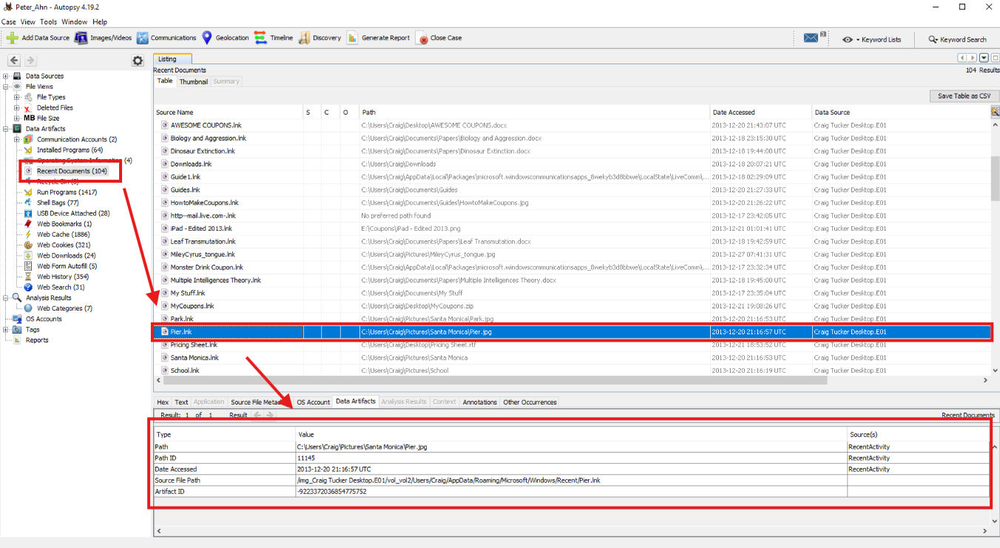<br>
  <em>Figure 9: Reviewing Recent Documents artifacts recovered from the Craig Tucker disk image. The Pier.lnk shortcut preserves metadata associated with the recently accessed file Pier.jpg, including its original filesystem path and access information.</em>
</p>

##### 🔷 Phase 6.4 — Recover the full path

To identify the original file path, I reviewed the `Path` column. The full path associated with `Pier.jpg` was: `C:\Users\Craig\Documents\My Pictures\Pier.jpg`.

This is significant because the shortcut itself is not the image file. Instead, it serves as evidence that Windows recorded access to the image and preserved metadata about its original location.

##### 🔷 Phase 6.5 — Interpret the Recent Documents finding

This finding indicates that a shortcut artifact existed for `Pier.jpg`, allowing the original path to be recovered. It does not necessarily prove the image is still present at that location. However, it does show that Windows preserved a Recent Documents artifact pointing to the file path. In a real investigation, the next step might be to:

- navigate to the path in the filesystem,
- verify whether the file still exists,
- review timestamps,
- examine the image,
- correlate with user activity,
- review thumbnail cache artifacts,
- review shellbags or Jump Lists if available.

##### 🔷 Phase 6.6 — Phase 6 findings

| Question | Finding |
|---|---|
| Looking at Recent Documents, what is the full path for the file Pier.jpg? | `C:\Users\Craig\Documents\My Pictures\Pier.jpg` |

<blockquote>
This phase demonstrated how shortcut artifacts can preserve useful file path evidence. Even though the visible artifact was `Pier.lnk`, the shortcut represented recent access to `Pier.jpg` and preserved the original path.
</blockquote>

</details>

<details>
<summary><strong>▶ Phase 7 — Examine the Virtual Filesystem</strong><br>
→ navigating the disk image to inspect directory metadata
</summary><br>

Up to this point, the investigation has primarily relied on artifacts that Autopsy automatically identified and organized during ingest processing. These artifact views provide a convenient way to review operating system information, browser activity, download records, and recently accessed files without manually navigating the disk image.

However, forensic investigations are not limited to parsed artifacts. Analysts often need to examine the underlying filesystem directly to locate files, review directory structures, validate artifact findings, and inspect metadata that may not be surfaced through artifact views alone.

To demonstrate this approach, I shifted from artifact-based analysis to filesystem-based analysis by navigating the virtual filesystem contained within the Craig Tucker disk image. This allowed me to explore the disk structure as it existed on the original system and review directory information directly from the forensic image.

This phase focused on browsing the virtual filesystem in Autopsy and identifying the size of the `lib` directory inside the `GIMP 2` folder.

<blockquote>
Autopsy allows analysts to review parsed artifacts, but it also allows direct filesystem navigation. This is useful when an investigation requires locating a specific file or directory rather than reviewing only artifact categories.
</blockquote>

##### 🔷 Phase 7.1 — Understand the virtual filesystem

The virtual filesystem is Autopsy's representation of the filesystem recovered from the disk image. It allows the analyst to browse partitions, directories, and files as if navigating the original computer. This does not mean the analyst is interacting with the original live system. Instead, Autopsy is displaying the filesystem structure from the forensic image.

##### 🔷 Phase 7.2 — Understand partitions and volumes

A disk image may contain multiple partitions or volumes. In Autopsy, these may appear as entries such as the following below with each volume may contain different filesystem content:

```text
vol1
vol2
```

The largest volume often contains the main operating system partition, but analysts should avoid assuming this without review.

##### 🔷 Phase 7.3 — Open the primary filesystem volume

Under the Craig Tucker disk image, Autopsy displayed the volumes recovered from the forensic image. The volume list included entries such as `vol1`, `vol2`, `vol3`.

These entries represent partitions or volume areas identified within the disk image. Some volumes may contain allocated filesystem data, while others may represent unallocated space or areas that are not the main operating system partition.

For this part of the investigation, I opened `vol2` because it contained the primary Windows filesystem structure, including familiar directories such as user profiles, program folders, and operating system files. This made `vol2` the relevant volume for manually browsing the suspect system's files and locating the Program Files directory.

<p align="left">
  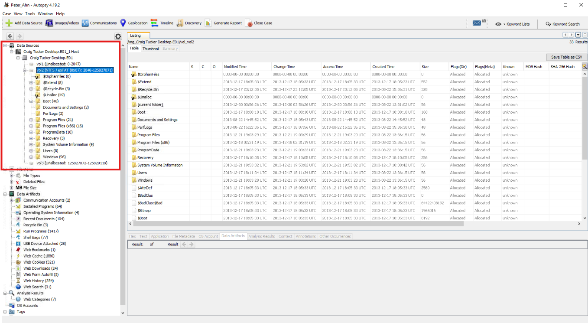<br>
  <em>Figure 10: Opening vol2, the primary filesystem volume recovered from the Craig Tucker disk image.</em>
</p>

##### 🔷 Phase 7.4 — Navigate to Program Files and GIMP 2

After opening the primary filesystem volume, I continued navigating through the directory structure to examine an installed application and its associated folders.

Reviewing application directories is a common forensic task because installed software often contains files, libraries, configuration data, logs, and other artifacts that may provide investigative value. Even when a specific application is not the focus of an investigation, examining its directory structure can help analysts understand how software is organized on the system and identify useful filesystem metadata.

For this portion of the workflow, I navigated to `Program Files > GIMP 2`.

The Program Files directory contains many of the applications installed on the system, making it a useful location for examining software-related artifacts and directory structures. Within the GIMP 2 directory, I reviewed the available folders and identified a directory named `lib`.

This directory was selected for further examination because it provided an opportunity to review filesystem metadata directly from the disk image and determine the size of a specific application-related directory.

<p align="left">
  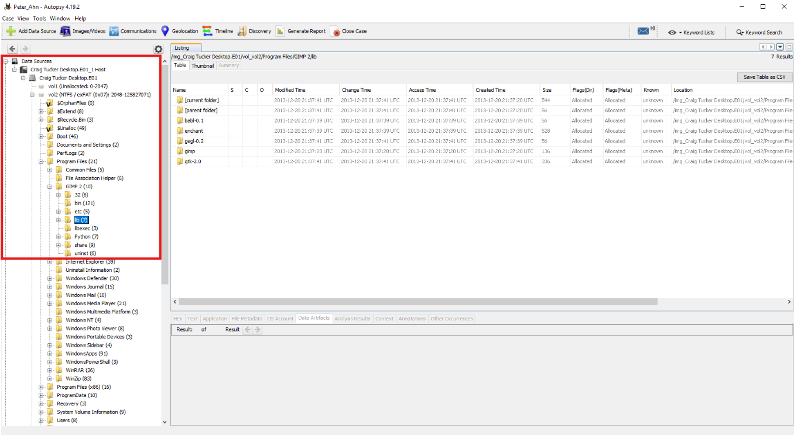<br>
  <em>Figure 11: Navigating to the GIMP 2 application directory and reviewing the lib folder within the virtual filesystem.</em>
</p>

##### 🔷 Phase 7.5 — Identify the file size of the lib directory

The directory size was displayed in the size-related column at the end of the highlighted row (`Size`). The size of the `lib` directory was `544 MB`.

<p align="left">
  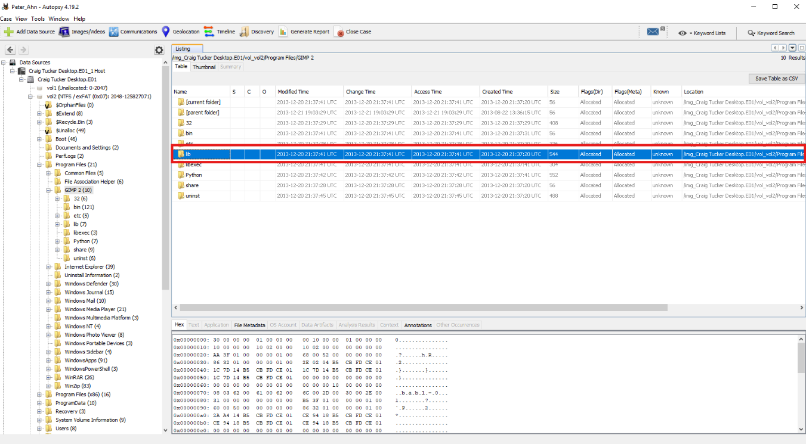<br>
  <em>Figure 12: Identifying the file size of the lib directory.</em>
</p>


##### 🔷 Phase 7.6 — Interpret the filesystem finding

This task demonstrated direct filesystem navigation in Autopsy.

Unlike parsed artifact views such as Web Downloads or Recent Documents, the virtual filesystem allows the analyst to browse the disk structure manually.

This can be useful when:

- locating installed programs,
- reviewing user directories,
- inspecting file paths,
- checking folder sizes,
- confirming the existence of files,
- comparing artifact paths against actual filesystem locations.

##### 🔷 Phase 7.7 — Phase 7 findings

The file size of the directory named `lib` inside `Program Files > GIMP 2` was `156 MB`.

<blockquote>
This phase demonstrated the difference between artifact-based review and filesystem-based review. Autopsy can parse artifacts into categories, but analysts can also navigate the disk image directly to inspect files and directories.
</blockquote>

</details>

<details>
<summary><strong>▶ Phase 8 — Review OS Account Artifacts</strong><br>
→ identifying the local Administrator account last accessed timestamp
</summary><br>

This phase focused on reviewing local operating system account information.

<blockquote>
OS account artifacts can help identify users configured on a system and may provide timestamps associated with account activity. This can support user attribution and timeline development during a forensic investigation.
</blockquote>

##### 🔷 Phase 8.1 — Understand OS Account artifacts

Up to this point, the investigation has focused on identifying system information, download activity, recent file access, and filesystem metadata recovered from the disk image.

While these artifacts help explain what existed on the system and what activity occurred, they do not necessarily identify the accounts associated with that activity. To add user and account context to the investigation, I shifted my focus to the operating system account artifacts recovered during ingest processing.

OS Account artifacts can help identify local user accounts present on the system and provide metadata related to account activity. This information can be useful when correlating forensic findings to specific users, reviewing account usage patterns, or developing a broader timeline of system activity.

For this reason, I reviewed the OS Accounts artifact category to examine the local accounts recovered from the Craig Tucker disk image and identify the last accessed timestamp associated with the local Administrator account.

Depending on the evidence and parsing results, account artifacts may include:

- username,
- account type,
- account status,
- last login or last accessed timestamps,
- security identifier information,
- account creation or modification information,
- domain or local account context.

These artifacts are useful because investigations often require identifying which user accounts existed and whether specific accounts were active.

##### 🔷 Phase 8.2 — Open OS Accounts

In Autopsy, I selected `OS Accounts`. This displayed local account information recovered from the disk image. The account of interest was `Administrator`.


<p align="left">
  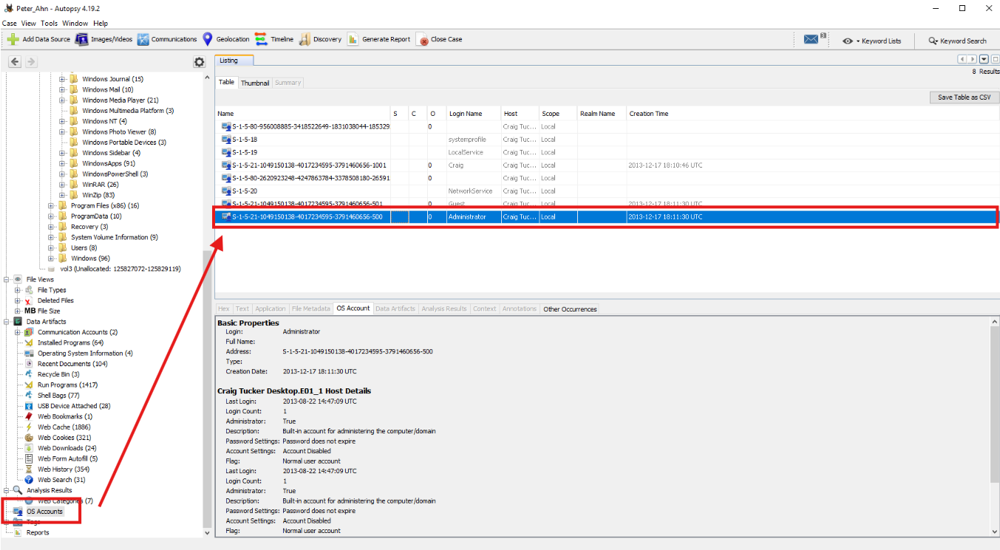<br>
  <em>Figure 13: Reviewing OS Accounts to identify the Administrator account last accessed timestamp.</em>
</p>

##### 🔷 Phase 8.3 — Identify the Administrator account timestamp

After locating the local Administrator account, I reviewed the available account metadata to identify when the account was last accessed.

Last accessed timestamps can provide useful context during a forensic investigation because they help establish when an account was active on the system. While a timestamp alone does not reveal what actions were performed, it can help analysts determine whether an account was recently used and support broader timeline reconstruction efforts.

This type of information is often reviewed alongside other artifacts, such as browser activity, downloaded files, recent document access, and filesystem evidence, to better understand when activity occurred on a system and which accounts may have been associated with that activity.

For this reason, I examined the account metadata associated with the local `Administrator` account and reviewed the recorded last accessed value. At the bottom of the OS Accounts table, I located the local `Administrator` account. The last accessed timestamp was listed as:

```text
2013-08-22 14:47:09 UTC
```

<p align="left">
  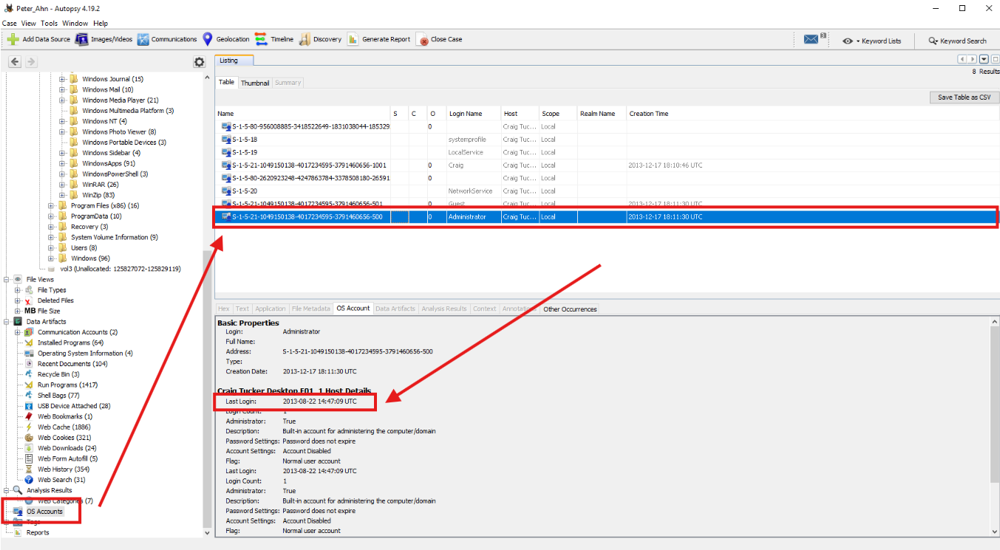<br>
  <em>Figure 14: Identifying the Administrator account timestamp.</em>
</p>

##### 🔷 Phase 8.4 — Interpret the account finding

The timestamp provides account activity context for the local Administrator account. In a real investigation, this timestamp could be correlated with:

- login events,
- file access activity,
- browser activity,
- program execution artifacts,
- registry artifacts,
- account creation or modification records,
- timeline evidence.

For this workflow, the artifact answered the specific question of when the local Administrator account was last accessed.

##### 🔷 Phase 8.5 — Phase 8 findings

The local Administrator account last accessed: `2013-08-22 14:47:09 UTC`.

<blockquote>
This phase demonstrated how OS Account artifacts can support user and account activity analysis. Account records help connect system activity to local users and provide timestamps that may be useful during timeline reconstruction.
</blockquote>

</details>

---

### Artifact Correlation

The most important part of this workflow was not simply collecting separate answers. The stronger forensic value came from correlating disk artifacts together.

Each Autopsy artifact source answered a different part of the disk image investigation.

#### Case and Data Source Artifacts

The case creation and data source setup established the forensic workspace.

The disk image selected was:

```text
Craig Tucker Desktop.E01
```

This artifact source helped answer:

- What evidence source was analyzed?
- Where did the analysis begin?
- What disk image was added to the case?

Case and data source setup are important because all later findings depend on the correct evidence source being imported and processed.

#### Operating System Artifacts

Operating System Information showed that the suspect laptop was running: `Windows 8.1 Pro`

The hostname was identified as: `WIN-BK336TFMHLL`

These artifacts helped answer:

- What operating system was installed?
- What version was the OS?
- What was the system hostname?
- What device identity context exists for later correlation?

System identity is useful because it helps tie disk artifacts to a specific machine.

#### Web Download Artifacts

Web download artifacts identified a downloaded executable `ALL COUPONS.rar` at `2013-12-18 20:05:57 GMT`

I also identified a full download URL: `http://download1346.mediafire.com/hn7hme361m4j/5ndp96wteag14q/Coupons.zip` for the timestamp at `2013-12-18 03:02:50 GMT`.

These artifacts helped answer:

- What files were downloaded?
- When were files downloaded?
- Where did downloaded files originate?
- What web-based activity may have occurred?

Web download artifacts are valuable because they can link local files to external sources.

#### Recent Documents and LNK Artifacts

Recent Documents identified a shortcut artifact `Pier.lnk` that pointed to `C:\Users\Craig\Documents\My Pictures\Pier.jpg`.

This artifact helped answer:

- What file was recently accessed?
- What was the original path of the target file?
- What user-accessed content may be relevant?

Recent Documents artifacts are useful because they may preserve evidence of file access even when the original file is not being directly reviewed.

#### Filesystem Artifacts

The virtual filesystem allowed navigation into `vol2` and then `Program Files > GIMP 2`.

The `lib` directory size was identified as `544 MB`

This artifact helped answer:

- What volumes were available?
- What directories existed in the filesystem?
- What was the size of a specific directory?
- How can parsed artifacts be validated against filesystem structure?

Filesystem artifacts are useful because they allow direct evidence browsing.

#### OS Account Artifacts

OS Accounts showed that the local Administrator account was last accessed at `2013-08-22 14:47:09`.

This artifact helped answer:

- What local accounts existed?
- When was the Administrator account last accessed?
- What account activity context exists for timeline analysis?

Account artifacts are useful because they support user and account activity analysis.

#### Combined Interpretation

Disk investigations rarely rely on one artifact by itself.

Each artifact examined during this workflow answered a different question:

- **Operating System Information** identified the OS version and hostname.
- **Web Downloads** identified downloaded files and source URLs.
- **Recent Documents** identified recently accessed file paths.
- **Virtual Filesystem** allowed direct review of files and directories.
- **OS Accounts** identified account activity timestamps.

When analyzed together, these artifacts supported the following activity reconstruction.

##### 1. The Disk Image Was Successfully Added and Processed

The workflow began by creating an Autopsy case and adding `Craig Tucker Desktop.E01` as the evidence source. Autopsy processed the disk image using selected ingest modules and populated artifact categories for review.

##### 2. The Suspect Laptop Was Identified

Operating System Information showed `Windows 8.1 Pro` and hostname `WIN-BK336TFMHLL`. This established the system identity and operating environment.

##### 3. Web Download Activity Was Recovered

Autopsy recovered Web Download artifacts showing downloaded files and source URLs. One downloaded file was identified as `ALL COUPONS.rar`. Another download record revealed the full URL `http://download1346.mediafire.com/hn7hme361m4j/5ndp96wteag14q/Coupons.zip`. This demonstrated how browser and web artifacts can reconstruct internet-based file acquisition.

##### 4. Recent Document Activity Was Reconstructed

Recent Documents showed that `Pier.lnk` preserved a path to `C:\Users\Craig\Documents\My Pictures\Pier.jpg`. This demonstrated how shortcut artifacts can preserve evidence of file access.

##### 5. Filesystem Metadata Was Reviewed Directly

The virtual filesystem allowed navigation into `vol2` and then `Program Files > GIMP 2`. The directory named `lib` was identified as `544 MB`. This demonstrated how Autopsy can be used to manually browse the disk image.

##### 6. Local Account Activity Was Reviewed

OS Accounts showed the local Administrator account was last accessed at `2013-08-22 14:47:09`. This provided account-level context for the disk image. This provided account-level context for the disk image.

##### Overall Conclusion

No single Autopsy view provided the full picture.

Instead, the investigation relied on correlating multiple disk artifacts:

| Artifact Type | Question Answered | Key Finding |
|---|---|---|
| Operating System Information | What OS was installed? | `Windows 8.1 Pro` |
| Hostname Artifact | What was the system hostname? | `WIN-BK336TFMHLL` |
| Web Downloads | What file was downloaded at the specified timestamp? | `ALL COUPONS.rar` |
| Web Downloads URL | What URL was associated with the specified download? | `http://download1346.mediafire.com/hn7hme361m4j/5ndp96wteag14q/Coupons.zip` |
| Recent Documents / LNK | What was the path for `Pier.jpg`? | `C:\Users\Craig\Documents\My Pictures\Pier.jpg` |
| Virtual Filesystem | What was the size of the `lib` directory? | `544 MB` |
| OS Accounts | When was Administrator last accessed? | `2013-08-22 14:47:09` |

Taken together, these artifacts demonstrated how disk image analysis can be used to understand system identity, user activity, downloaded content, file access, filesystem structure, and local account activity.

---

### Evidence Examination Summary

| Task | Artifact Source | Tool / View | Finding |
|---|---|---|---|
| Create forensic case | Autopsy case setup | New Case Wizard | Case created |
| Add disk image | Data Source | Add Data Source | `Craig Tucker Desktop.E01` |
| Process evidence | Ingest modules | Ingest Module Selection | Required modules selected |
| Identify OS version | Operating System Information | Data Artifacts | `Windows 8.1 Pro` |
| Identify hostname | Operating System Information | Data Artifacts | `WIN-BK336TFMHLL` |
| Identify downloaded file | Web Downloads | Data Artifacts | `ALL COUPONS.rar` |
| Identify download URL | Web Downloads | URL column | `http://download1346.mediafire.com/hn7hme361m4j/5ndp96wteag14q/Coupons.zip` |
| Identify recent document path | Recent Documents / LNK | Recent Documents | `C:\Users\Craig\Documents\My Pictures\Pier.jpg` |
| Identify directory size | Virtual Filesystem | `vol2 > Program Files > GIMP 2` | `544 MB` |
| Identify Administrator last accessed time | OS Accounts | OS Accounts | `2013-08-22 14:47:09` |

---

### What I Learned (Skills Demonstrated)

Through this workflow, I learned how to:

- Open Autopsy from a forensic analysis environment.
- Create a new Autopsy case.
- Select an empty base directory.
- Understand why case organization matters.
- Add a disk image as a data source.
- Understand what an E01 forensic image represents.
- Select ingest modules.
- Understand how ingest modules parse and organize forensic artifacts.
- Review operating system information in Autopsy.
- Identify Windows operating system version information.
- Identify the hostname of a system.
- Review Web Downloads artifacts.
- Use timestamps to locate specific download records.
- Identify downloaded filenames.
- Identify full source URLs from download records.
- Understand the difference between a downloaded file and its source URL.
- Review Recent Documents artifacts.
- Understand how LNK files support forensic investigations.
- Recover a file path associated with a recently accessed file.
- Navigate the virtual filesystem in Autopsy.
- Understand volumes and partitions in a disk image.
- Browse to installed application directories.
- Identify folder size metadata.
- Review OS Account artifacts.
- Identify local Administrator account access time.
- Correlate operating system artifacts, browser artifacts, shortcut artifacts, filesystem artifacts, and account artifacts.
- Document a repeatable disk image forensic workflow.

This workflow strengthened my understanding that disk images contain multiple layers of evidence. Operating system artifacts can identify the machine. Web downloads can reveal files obtained from the internet. Recent Documents can show file access. The virtual filesystem can confirm file and directory structure. OS Accounts can provide user and account context. Correlating these artifacts together allows an analyst to reconstruct activity with more confidence.

---

### Final Conclusion

This workflow demonstrated how Autopsy can be used to analyze a forensic disk image and recover artifacts related to system identity, browser downloads, recent document activity, filesystem metadata, and local account information. The disk image `Craig Tucker Desktop.E01` was added to a new Autopsy case and processed using selected ingest modules.

- Operating System Information identified the suspect laptop as running `Windows 8.1 Pro`.
- The system hostname was identified as `WIN-BK336TFMHLL`
- Web Downloads artifacts showed that the file downloaded at `2013-12-18 20:05:57 GMT` was `ALL COUPONS.rar`.
- A separate Web Downloads record showed that the full URL associated with the download at `2013-12-18 03:02:50 GMT` was `http://download1346.mediafire.com/hn7hme361m4j/5ndp96wteag14q/Coupons.zip`
- Recent Documents artifacts showed that `Pier.lnk` preserved the full path for `Pier.jpg`: `C:\Users\Craig\Documents\My Pictures\Pier.jpg`
- Filesystem navigation through `vol2` showed that the `lib` directory inside `Program Files > GIMP 2` had a size of `544 MB`
- OS Account artifacts showed that the local Administrator account was last accessed at `2013-08-22 14:47:09`.

The final key findings were:

```text
Operating System: Windows 8.1 Pro
Hostname: WIN-BK336TFMHLL
Downloaded File: ALL COUPONS.rar
Download URL: http://download1346.mediafire.com/hn7hme361m4j/5ndp96wteag14q/Coupons.zip
Pier.jpg Path: C:\Users\Craig\Documents\My Pictures\Pier.jpg
GIMP 2 lib Directory Size: 544 MB
Administrator Last Accessed: 2013-08-22 14:47:09
```

Together, these findings showed how disk image forensics can provide visibility into operating system configuration, downloaded files, web activity, recent file access, filesystem structure, and local account activity.
