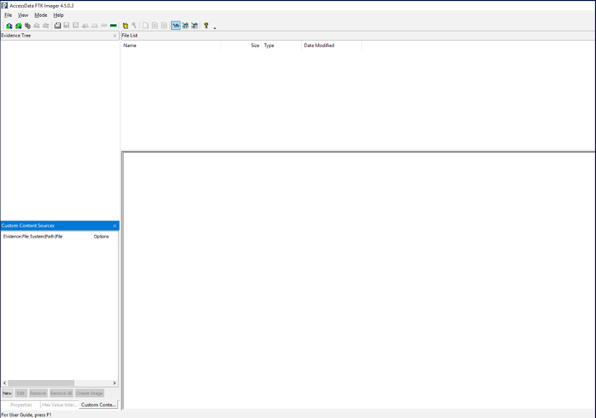
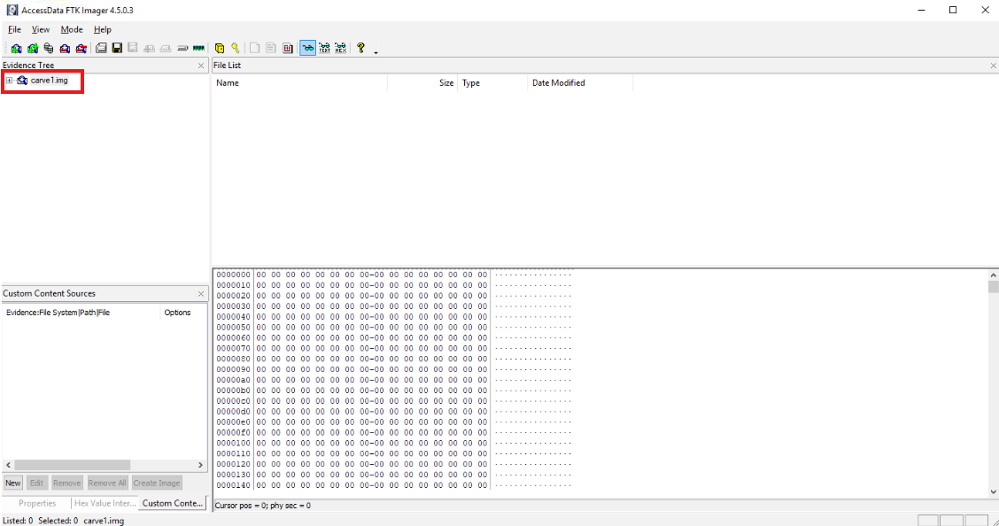
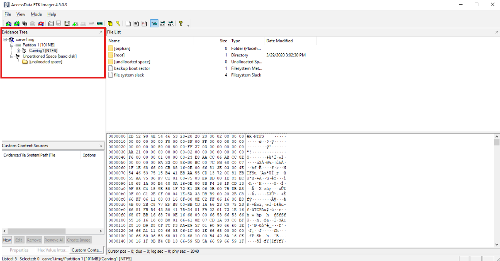
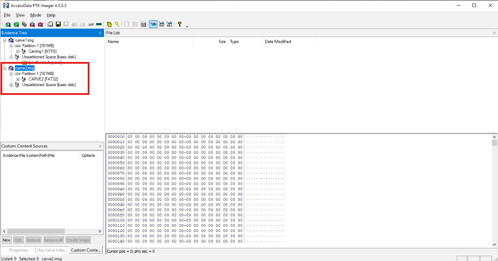
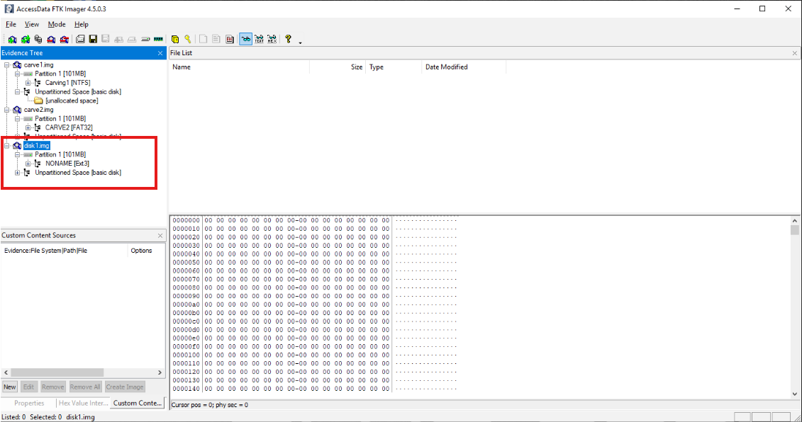

# File System Identification and Evidence Structure Analysis Using FTK Imager

This workflow demonstrates practical digital forensic evidence examination using FTK Imager to identify file systems from acquired forensic disk images. The workflow focuses on importing existing image files, reviewing volume and file system information, documenting the identified file system for each image, and explaining why file system identification is an important early step before deeper forensic recovery or artifact analysis.

The main tool used is: **FTK Imager**. See **[Environment and Execution Context](#environment-and-execution-context)** section below.

### Overview

This project focused on identifying file systems from forensic disk images using FTK Imager. The images examined during this workflow were `carve1.img`, `carve2.img`, and `disk1.img`. Each image was imported into FTK Imager as an evidence item, reviewed through the evidence tree, and examined to determine the file system used by the storage media represented in the image.

The file systems identified were:

- `carve1.img` — **NTFS**
- `carve2.img` — **FAT32**
- `disk1.img` — **EXT3**

This workflow documents a foundational digital forensics task: determining how a storage device organizes files and metadata before attempting deeper analysis. A file system controls how data is stored, categorized, navigated, accessed, managed, and potentially recovered. Because different file systems use different structures and rules, identifying the file system helps an analyst understand what evidence may exist, where that evidence may be located, and how deleted or residual data may behave.

The reading material described a file system as a critical part of an IT system because it classifies and organizes files, stores data, manages available space, supports file navigation, and provides mechanisms for accessing and recovering data. This workflow applies that concept directly by using FTK Imager to identify the file system from forensic images before deeper analysis.

> **Workflow vs Execution vs Writeup (Terminology Used Here)**  
> - **Workflows** refer to repeatable digital forensic tasks such as importing disk images, identifying file systems, reviewing evidence structures, and documenting findings.  
> - **Executions** refer to the hands-on use of FTK Imager to add image files as evidence items and review their file system information.  
> - **Writeups** document forensic observations, analyst reasoning, technical context, and evidence examination conclusions.

> 👉 For a **detailed, step-by-step walkthrough of how this workflow was executed — complete with screenshot placeholders**, see the **[Step-by-Step Execution](#step-by-step-execution)** section below.

---

### Purpose and Analyst Focus

#### ▶ Purpose

The purpose of this workflow is to identify the file systems used by acquired forensic disk images using FTK Imager.

File system identification is important because a forensic examiner cannot properly understand a storage device without first understanding how that device organizes data. The file system determines how files are named, categorized, stored, located, deleted, and recovered. It also determines which metadata structures may exist and which forensic artifacts may be available for later analysis.

The reading material emphasized that file systems are used for:

- data storage,
- hierarchical categorization,
- data management,
- file navigation,
- accessing data,
- recovery of data.

This workflow demonstrates those concepts practically by examining disk images and identifying whether each image uses NTFS, FAT32, or EXT3.

#### ▶ Analyst Focus

The analyst focus is on using FTK Imager to perform a controlled initial evidence review. The goal is not to recover deleted files yet, carve file fragments, build timelines, or examine operating system artifacts. The goal is to answer a more foundational question first:

> What file system is this evidence image using?

This matters because the answer influences what an analyst should expect during later analysis.

For example:

- If the file system is **NTFS**, the evidence may be associated with a Windows environment and may contain NTFS-specific structures such as the Master File Table, journaling records, access control information, and Windows-style metadata.
- If the file system is **FAT32**, the evidence may be associated with removable media, older systems, cameras, embedded devices, or cross-platform storage, and may have fewer security and journaling features.
- If the file system is **EXT3**, the evidence may be associated with a Linux environment and may contain Linux-style directory structures, permissions, logs, shell histories, cron jobs, and configuration files.

The analyst focus is therefore not simply identifying a label. It is understanding what that label means for evidence handling, artifact expectations, deleted data behavior, and future investigative direction.

---

### What This Workflow Demonstrates

This workflow demonstrates how to:

- Open FTK Imager in a forensic evidence review workflow.
- Add an existing image file as an evidence item.
- Select the correct evidence source type when importing a disk image.
- Review the imported image structure inside FTK Imager.
- Identify the file system used by the image.
- Document findings clearly for each evidence item.
- Explain why different file systems matter during forensic analysis.
- Connect file system concepts to lower-level storage concepts such as clusters, Logical Block Addresses, SSD controllers, Flash Translation Layers, TRIM, garbage collection, and wear leveling.

This workflow also demonstrates the difference between simply answering a prompt and documenting a professional forensic process. The important part is not only that `carve1.img` was NTFS, `carve2.img` was FAT32, and `disk1.img` was EXT3. The important part is understanding how those conclusions were reached and why they matter.

---

### Investigation and Digital Forensics Relevance

File system identification is one of the earliest steps in digital forensic analysis because it tells the examiner how the evidence is organized.

A disk image is a forensic copy of storage media. When that image is opened in FTK Imager, the analyst is not just looking at “files.” The analyst is looking at a structured storage environment governed by a file system. The file system determines how the operating system originally tracked file names, directories, allocation units, deleted files, metadata, and access paths.

During this workflow, the three identified file systems represented different operating system and storage contexts:

| Evidence Image | File System | Common Context |
|---|---|---|
| `carve1.img` | NTFS | Modern Windows systems |
| `carve2.img` | FAT32 | Removable media, USB drives, embedded devices, cross-platform storage |
| `disk1.img` | EXT3 | Linux systems |

This matters because different file systems have different forensic implications.

NTFS, for example, is commonly associated with Windows systems and contains richer metadata structures than FAT32. FAT32 is simpler and broadly compatible but lacks many modern security and journaling features. EXT3 is a Linux journaling file system, which means it maintains a journal used to track file system changes and support recovery after crashes.

In a real investigation, identifying the file system helps answer questions such as:

- What operating system may have used this storage media?
- What metadata structures should I expect?
- Are deleted file records likely to be recoverable?
- Does the file system support journaling?
- What artifacts should I look for next?
- What tools or parsing methods are appropriate?
- What limitations should I understand before drawing conclusions?

This connects directly to the storage concepts discussed during preparation for this workflow. A file does not simply “live” on a disk in the way a user sees it in Windows Explorer. A file system organizes file records, clusters, names, timestamps, and metadata. Beneath that, storage devices use logical and physical addressing layers to store the data. This means forensic analysis requires understanding both the file system layer and the storage layer.

---

### Environment and Execution Context

This section documents the tools, evidence images, and examination environment used during the workflow.

**Note:** Each section is collapsible. Click the ▶ arrow to expand and view details on software, evidence images, file system concepts, and the high-level workflow map.

<details>
<summary><strong>▶ Environment & Platform</strong><br>
</summary><br>

The evidence review was performed using FTK Imager within a controlled digital forensic training environment. The disk images were already provided, so the focus was not on acquisition or imaging methodology. Instead, the focus was on importing existing image files and identifying the file systems present inside those images.

The evidence images reviewed were:

- `carve1.img`
- `carve2.img`
- `disk1.img`

Each image was treated as a separate evidence item. This allowed each image to be examined independently and documented separately.

</details>

<details>
<summary><strong>▶ Tooling Used</strong><br>
</summary><br>

The primary tool used was:

- **FTK Imager**

FTK Imager was used to:

- add image files as evidence items,
- browse the evidence tree,
- inspect image and volume information,
- identify the file system associated with each image.

FTK Imager is commonly used in digital forensics because it allows analysts to view forensic images, inspect files, review metadata, export evidence, and perform initial evidence triage without modifying the original evidence image.

</details>

<details>
<summary><strong>▶ Evidence Images Reviewed</strong><br>
</summary><br>

The following forensic images were reviewed:

| Evidence Image | Purpose of Review | Identified File System |
|---|---|---|
| `carve1.img` | Identify the file system from the first imported image | NTFS |
| `carve2.img` | Identify the file system from the second imported image | FAT32 |
| `disk1.img` | Identify the file system from the third imported image | EXT3 |

Each image was imported into FTK Imager using:

```text
File → Add Evidence Item → Image File
```

This workflow focused on reading the evidence image and identifying the file system information shown by FTK Imager.

</details>

<details>
<summary><strong>▶ File System Concepts Relevant to This Workflow</strong><br>
</summary><br>

A file system is the organizational layer that allows an operating system to store, retrieve, manage, and navigate files.

Without a file system, storage would be a large collection of raw data with no meaningful structure for filenames, folders, timestamps, permissions, or file locations.

The reading material described file systems as mechanisms used for:

- data storage,
- hierarchical categorization,
- data management,
- file navigation,
- accessing data,
- recovery of data.

The main file systems reviewed in the reading material were:

- **FAT16**
- **FAT32**
- **NTFS**
- **EXT3 / EXT4**

This workflow specifically identified three of those file systems:

- **NTFS**
- **FAT32**
- **EXT3**

</details>

<details>
<summary><strong>▶ Workflow Map (High-Level)</strong><br>
</summary><br>

1. Launch FTK Imager.
2. Select **File → Add Evidence Item**.
3. Choose **Image File** as the source evidence type.
4. Import the target image file.
5. Review the image and volume information in the evidence tree.
6. Identify the file system.
7. Document the file system finding.
8. Repeat the process for each image.
9. Interpret what each file system means for future forensic analysis.

</details>

---

### Step-by-Step Execution

This section documents the workflow in the same order an analyst would realistically perform file system identification using FTK Imager. The examination began with importing each image file as an evidence item and then reviewing the file system information presented inside FTK Imager.

The key point of this workflow is that file system identification happens before deeper forensic analysis. Before an analyst attempts deleted file recovery, file carving, artifact parsing, or timeline reconstruction, they need to know how the evidence is structured.

<p align="left">
  <br>
  <em>Figure 1: FTK Imager.</em>
</p>

**Note:** Each section is collapsible. Click the ▶ arrow to expand and view the detailed steps.

<details>
<summary><strong>▶ Phase 1 — Import and Identify the File System of carve1.img</strong><br>
→ reviewing the first forensic image and identifying its file system as NTFS
</summary><br>

This phase focused on importing `carve1.img` into FTK Imager and identifying the file system used by the image.

<blockquote>
I started with `carve1.img` because the workflow required identifying the file system of each provided image independently. At this stage, I was not trying to recover files or interpret user activity. I first needed to determine how the image was structured so that any later analysis would be grounded in the correct file system context.
</blockquote>

##### 🔷 Phase 1.1 — Add carve1.img as an evidence item

To begin, I opened FTK Imager and selected:

```text
File → Add Evidence Item
```

When prompted for the source evidence type, I selected:

```text
Image File
```

This option was appropriate because `carve1.img` was already an acquired image file. I was not imaging a live drive, physical disk, logical drive, or folder. I was examining an existing image.

<p align="left">
  <br>
  <em>Figure 2: Importing carve1.img into FTK Imager as an image file.</em>
</p>

After selecting the image file, I completed the import process and allowed FTK Imager to populate the evidence tree.

This step matters because FTK Imager needs to parse the image structure before the analyst can review volumes, partitions, directories, and file system information.

##### 🔷 Phase 1.2 — Review the image structure and locate the file system information

After the image was imported, I reviewed the evidence tree and image details. FTK Imager displayed the structure of the image and the associated file system information.

The evidence tree displayed the following hierarchy:

```
carve1.img
└─ Partition 1 [101MB]
   └─ Carving1 [NTFS]
```

FTK Imager identified the partition as NTFS, which was displayed directly beside the volume name within the evidence tree. Because FTK Imager parses the image and interprets the underlying storage structure, the displayed file system can be used to identify how the storage media organizes files, directories, metadata, and allocation information.

<p align="left">
  <br>
  <em>Figure 3: Reviewing carve1.img and identifying the file system as NTFS.</em>
</p>


The file system identified for `carve1.img` was:

```text
NTFS
```

At this stage, the objective was not to analyze files stored inside the image. Instead, the goal was to determine the file system governing the partition. This is an important first step because the file system defines how data is organized and managed throughout the storage device.

According to the reading material, file systems are responsible for functions such as:

- Data storage
- Hierarchical categorization
- Data management
- File navigation
- Accessing data
- Recovery of data

By identifying NTFS, I immediately gained context regarding how evidence inside the image is likely organized. NTFS (NT File System) is Microsoft's primary file system for modern Windows operating systems and includes advanced features such as metadata management, journaling, access control lists, and improved reliability compared to older file systems such as FAT16 and FAT32.

This finding is also important when viewed alongside modern storage concepts. Although NTFS organizes files, directories, timestamps, and allocation information, it does not manage the physical storage media directly. Beneath the file system layer, storage devices use Logical Block Addresses (LBAs) to communicate with the operating system. If the underlying storage device is a Solid State Drive (SSD), the SSD controller further maps those Logical Block Addresses to physical pages and blocks through the Flash Translation Layer (FTL), while mechanisms such as wear leveling, TRIM, and garbage collection manage the physical storage of data.

Understanding that distinction helps explain why identifying the file system is one of the earliest steps in forensic analysis: the file system tells the investigator how the evidence is organized, while the storage device determines how the data is physically stored.

<blockquote>
Before performing this workflow, I found myself wondering why identifying a file system was important at all. At first glance, seeing labels such as NTFS, FAT32, or EXT3 in FTK Imager felt like little more than reading a technical detail from the evidence image. However, I learned that a file system is essentially the method an operating system uses to organize and manage data on a storage device. Without a file system, a storage device would simply contain raw data with no meaningful structure for files, folders, filenames, timestamps, or permissions. The file system acts as the organizational layer that makes stored data usable and accessible.

Different file systems represent different approaches to organizing data. FAT16 and FAT32 are older and simpler file systems that were designed to be lightweight and broadly compatible across many devices. Because of this, FAT32 is still commonly found on USB drives, memory cards, cameras, and other removable storage. NTFS is Microsoft's modern file system for Windows and includes more advanced features such as journaling, permissions, and richer metadata. EXT3 serves a similar purpose in many Linux environments and also includes journaling capabilities. While all three file systems ultimately store files, they do so using different structures and capabilities, which can significantly impact how evidence is stored, recovered, and analyzed.

From a forensic perspective, identifying the file system is often one of the first steps performed because it helps establish how the evidence is organized before deeper analysis begins. Knowing whether an image uses NTFS, FAT32, or EXT3 provides clues about the likely operating system, the types of metadata available, how deleted files may behave, and what artifacts an examiner should expect to encounter. In many ways, identifying the file system is like obtaining a map before exploring unfamiliar territory. Before examining files, recovering deleted data, or building a timeline of activity, an investigator must first understand the structure governing the evidence.
</blockquote>


##### 🔷 Phase 1.3 — Interpret the NTFS finding

NTFS stands for **NT File System**. It is a Microsoft file system commonly used by modern Windows systems.

Personal research reading material described NTFS as a proprietary journaling file system developed by Microsoft and used as the default file system of the Windows NT family. It also described NTFS as an improvement over earlier file systems such as File Allocation Table and High-Performance File System because it provides better metadata support, more advanced data structures, improved reliability, improved disk space use, access control lists, and journaling.

From a forensic perspective, identifying NTFS is important because it immediately suggests the image may contain Windows-style artifacts and NTFS-specific metadata structures.

Examples of evidence areas that may become relevant after identifying NTFS include:

- Master File Table records,
- Windows directory structures,
- file creation, modification, and access timestamps,
- access control metadata,
- deleted file records,
- Windows Recycle Bin artifacts,
- registry hives,
- event logs,
- user profile directories.

This finding also connects to the earlier storage discussion. NTFS does not physically store data directly in SSD pages and blocks. NTFS organizes files using file system structures such as records and clusters. Beneath that, the operating system communicates with the storage device using Logical Block Addresses. If the underlying storage is an SSD, the SSD controller uses the Flash Translation Layer to map those Logical Block Addresses to physical pages and blocks.

That distinction matters because NTFS is the file organization layer, while the SSD controller manages physical flash storage behavior such as wear leveling, TRIM, and garbage collection.

</details>

<details>
<summary><strong>▶ Phase 2 — Import and Identify the File System of carve2.img</strong><br>
→ reviewing the second forensic image and identifying its file system as FAT32
</summary><br>

This phase focused on importing `carve2.img` into FTK Imager and identifying the file system used by the image.

<blockquote>
After identifying the first image as NTFS, I repeated the same process with `carve2.img`. Repeating the same controlled method for each image helps keep the workflow consistent and reduces the chance of mixing findings between evidence items.
</blockquote>

##### 🔷 Phase 2.1 — Add carve2.img as an evidence item

The second image was imported into FTK Imager using the same process:

```text
File → Add Evidence Item → Image File
```

I selected `carve2.img` and completed the import process.

This process allowed FTK Imager to parse the image and display its storage structure.

##### 🔷 Phase 2.2 — Review the image structure and locate the file system information

Once the image was loaded, FTK Imager displayed the evidence within the Evidence Tree. Before identifying the file system, I expanded the image and selected Partition 1 [101MB] to review the storage structure associated with the image.

A partition is a logical division of a storage device. A single physical disk can be divided into one or more partitions, each functioning as an independent storage area. Operating systems typically create partitions so that storage can be organized and managed separately. Each partition can contain its own file system, files, directories, and metadata.

In a forensic image, reviewing the partition is important because the file system is typically applied to a partition rather than to the entire disk. Selecting the partition allows the examiner to determine how the data stored within that portion of the disk is organized.

Within the Evidence Tree, FTK Imager displayed the following structure:

```
carve2.img
└─ Partition 1 [101MB]
   └─ CARVE2 [FAT32]
```

<p align="left">
  <br>
  <em>Figure 4: Reviewing carve2.img and identifying the file system as FAT32.</em>
</p>

The file system identified for `carve2.img` was:

```text
FAT32
```

The label [FAT32] displayed beside the volume name indicates that the partition is formatted using the FAT32 (File Allocation Table 32) file system. FTK Imager automatically parses the image and identifies the file system associated with the partition, allowing the examiner to quickly determine how the operating system originally organized the data stored within that volume.

At this stage, I was not focused on examining individual files. Instead, I was identifying the storage structure governing the partition. Understanding the file system is an important early forensic step because it provides context for how files, directories, timestamps, metadata, and deleted data may be stored and managed throughout the evidence.

By identifying FAT32, I immediately learned that the partition uses an older and simpler file system commonly associated with removable media such as USB drives, memory cards, cameras, and other portable storage devices. This provides valuable context for future forensic analysis and helps establish expectations regarding the types of metadata and artifacts that may be available within the image.

<blockquote>
Before completing this phase, I assumed the file system was something applied to the entire disk. However, reviewing the partition structure helped clarify that file systems are typically associated with partitions. In other words, a disk may contain one or more partitions, and each partition can potentially use a different file system. This is why examining the partition information is an important step when identifying how data is organized within a forensic image.
</blockquote>


##### 🔷 Phase 2.3 — Interpret the FAT32 finding

FAT32 stands for **File Allocation Table 32**.

The reading material described FAT32 as a revised version of FAT16 that supports larger partitions and long filenames. It also explained that FAT32 is highly compatible with many devices and operating systems, including Windows, macOS, Linux, smartphones, cameras, gaming consoles, surveillance cameras, and other devices.

This broad compatibility is one reason FAT32 is still commonly encountered in digital forensic work. FAT32 may appear on:

- USB flash drives,
- SD cards,
- external drives,
- cameras,
- embedded devices,
- removable storage,
- older systems.

From a forensic perspective, identifying FAT32 matters because it tells the analyst that the evidence likely uses a simpler file system structure than NTFS. FAT32 does not include many of the advanced features found in NTFS, such as advanced access control lists, journaling, built-in file compression, or built-in encryption.

This can affect expectations during analysis. For example, FAT32 may provide fewer metadata and recovery features compared to NTFS. However, because FAT32 is commonly used on removable devices, identifying FAT32 may help guide the analyst toward removable media use, file transfer activity, or portable storage analysis.

This also connects back to the earlier discussion about file systems and clusters. FAT32 uses a File Allocation Table to track which clusters belong to files. In simple terms, FAT32 maintains a table that acts like a map of file storage locations. If the table indicates that a file uses certain clusters, the operating system can follow that chain to retrieve the file's contents.

This is different from NTFS, which uses more advanced metadata structures such as the Master File Table. Both file systems organize files, but they do so differently.

</details>

<details>
<summary><strong>▶ Phase 3 — Import and Identify the File System of disk1.img</strong><br>
→ reviewing the third forensic image and identifying its file system as EXT3
</summary><br>

This phase focused on importing `disk1.img` into FTK Imager and identifying the file system used by the image.

<blockquote>
After reviewing an NTFS image and a FAT32 image, I imported `disk1.img` to identify the file system used by the third evidence image. This phase was important because it introduced a Linux-associated file system, which changes the analyst's expectations for later evidence review.
</blockquote>

##### 🔷 Phase 3.1 — Add disk1.img as an evidence item

The third image was imported into FTK Imager using the same evidence import process:

```text
File → Add Evidence Item → Image File
```

I selected `disk1.img` and completed the import process.

Using the same process for each image helped keep the examination consistent across evidence items.

##### 🔷 Phase 3.2 — Review the image structure and locate the file system information

After importing `disk1.img` into FTK Imager, I expanded the image within the Evidence Tree and reviewed the partition information associated with the disk image.

As with the previous images, I selected Partition 1 [101MB] because partitions are the logical storage areas that contain file systems. While a physical disk can contain multiple partitions, each partition is typically formatted with a specific file system that determines how files, directories, timestamps, and metadata are organized. Reviewing the partition therefore allows the examiner to identify the file system governing the data stored within that section of the disk.

Within the Evidence Tree, FTK Imager displayed the following structure:

```
disk1.img
└─ Partition 1 [101MB]
   └─ NONAME [Ext3]
```


<p align="left">
  <br>
  <em>Figure 5: Reviewing disk1.img and identifying the file system as EXT3.</em>
</p>

The file system identified for `disk1.img` was:

```text
EXT3
```

The label [Ext3] displayed beside the volume name indicates that the partition is formatted using the EXT3 (Third Extended Filesystem) file system. FTK Imager automatically parses the image structure and identifies the file system associated with the partition, allowing the examiner to determine how the operating system originally organized the stored data.

Unlike the previous image, which used FAT32, this image uses a Linux-based file system. The presence of EXT3 immediately provides important context regarding the likely operating system environment associated with the evidence.

At this stage, the objective was not to review individual files or recover deleted data. Instead, the goal was to identify the file system governing the partition. This is an important first step because the file system determines how files are organized, how metadata is stored, how timestamps are maintained, and what forensic artifacts may be available during later stages of analysis.

<blockquote>
Before completing this phase, I assumed all file systems served essentially the same purpose and only differed in name. However, identifying EXT3 helped demonstrate that different operating systems often use entirely different file systems to organize data. EXT3 is commonly associated with Linux systems and includes a feature called journaling, which records file system changes before they are fully committed to disk. This helps improve reliability and recovery after system crashes or unexpected shutdowns.

From a forensic perspective, identifying EXT3 provides valuable investigative context. Knowing the image uses a Linux file system helps establish expectations regarding the types of artifacts that may exist within the evidence, such as Linux user directories, shell history files, configuration files, cron jobs, and system logs. Identifying the file system therefore helps an examiner understand not only how data is organized, but also what evidence may be available for future analysis.
</blockquote>

##### 🔷 Phase 3.3 — Interpret the EXT3 finding

EXT3 stands for **Third Extended Filesystem**.

Personal research reading material described EXT3 as a journaled file system commonly used by the Linux kernel. It explained that journaling is an additional feature that helps track file system changes through a journal, which can assist with recovery after a crash.

This matters because journaling file systems maintain records of file system activity before changes are fully committed. In a forensic context, journaling can be relevant because it may provide insight into recent file system activity, consistency recovery, or the sequence of file system operations.

Identifying EXT3 suggests the image may be associated with a Linux system. This changes what an analyst may look for next.

Examples of Linux-related artifacts that may become relevant include:

- `/home` user directories,
- shell history files,
- `/var/log` system logs,
- cron job entries,
- configuration files,
- service files,
- user and group information,
- mounted device references.

This also reinforces the concept that file system identification is not just a technical label. It informs the examiner about the likely operating system environment and the types of evidence that may exist.


</details>

<details>
<summary><strong>▶ Phase 4 — Connect File System Identification to Storage Architecture Concepts</strong><br>
→ explaining how NTFS, FAT32, EXT3, clusters, Logical Block Addresses, SSD controllers, and physical storage layers relate
</summary><br>

This phase documents the conceptual understanding developed while reviewing file systems and storage behavior.

<blockquote>
The most important learning point from this workflow was understanding that a file system and a storage device are not the same thing. A file system organizes files for the operating system. The storage device stores the underlying data physically or electronically. These layers work together, but they are responsible for different things.
</blockquote>

##### 🔷 Phase 4.1 — Understand what a file system does

A file system is the structure used by an operating system to organize files and directories.

For example, when a user sees:

```text
Documents
Downloads
Pictures
Resume.docx
Dog.jpg
```

the storage device itself does not understand those names as human-readable files and folders. The file system provides that organization.

The file system tracks information such as:

- file names,
- directory paths,
- file sizes,
- file timestamps,
- permissions,
- file locations,
- allocation status,
- metadata records.

This is why identifying the file system matters. The file system determines how that information is stored and how an examiner should interpret it.

##### 🔷 Phase 4.2 — Understand the role of clusters

A cluster is a file system allocation unit.

In simple terms, clusters are chunks of storage that the file system assigns to files. A file may occupy one cluster or many clusters depending on its size.

For example:

```text
Report.docx
→ Cluster 100
→ Cluster 101
→ Cluster 102
```

NTFS, FAT32, and EXT3 each manage file allocation differently, but all file systems need some method of tracking which storage areas belong to which files.

This connects to deleted file behavior. When a file is deleted, the file system may mark its clusters as available for reuse even though the underlying data may not be immediately erased. This is why deleted data may sometimes remain recoverable until it is overwritten, erased, or sanitized.

##### 🔷 Phase 4.3 — Understand Logical Block Addresses

Logical Block Addresses, or LBAs, are the logical addresses used by the operating system when communicating with a storage device.

A file system may track a file through clusters, but the storage stack ultimately communicates with the drive using Logical Block Addresses.

A simplified flow looks like this:

```text
File
↓
File System
↓
Clusters
↓
Logical Block Addresses
↓
Storage Device
```

This was an important clarification during the learning process because Logical Block Addresses are not the same as clusters. Clusters are file system allocation units. Logical Block Addresses are storage addressing units used to communicate with the device.

##### 🔷 Phase 4.4 — Understand how SSDs add another layer

On a Solid State Drive, the situation becomes more abstract.

One of the most important concepts I learned while studying file systems is that the file system is only one layer in a much larger storage architecture.

Initially, I assumed a file system such as NTFS directly controlled where files were physically stored on a disk. In reality, modern storage systems introduce several layers of abstraction between a file and its physical storage location.

A simplified view looks like this:

```text
File
↓
File System (NTFS, FAT32, EXT3)
↓
Clusters
↓
Logical Block Addresses (LBAs)
↓
SSD Controller
↓
Flash Translation Layer (FTL)
↓
Physical Pages and Blocks
↓
Flash Memory Cells
```

The file system is responsible for organizing files, folders, metadata, timestamps, and allocation information. For example, NTFS may know that a file occupies certain clusters, while FAT32 may use a File Allocation Table to track which clusters belong to a file.

However, neither NTFS nor FAT32 actually knows the precise physical location of the data on a modern SSD.

Instead, the operating system communicates with storage devices using Logical Block Addresses (LBAs). A Logical Block Address is essentially a logical storage location used by the operating system. When Windows wants to read or write data, it sends requests using LBAs rather than physical storage locations.

The SSD controller then receives those requests and consults a component known as the Flash Translation Layer (FTL).

The Flash Translation Layer acts as a translator between the logical view used by the operating system and the physical reality of flash memory.

For example:

```
Windows / NTFS
↓
Read LBA 5000
```

The SSD controller may internally translate that request to:

```
LBA 5000
↓
Block 42, Page 10
```

At a later time, due to SSD maintenance operations, that same Logical Block Address may point somewhere completely different:

```
LBA 5000
↓
Block 87, Page 55
```

From the perspective of Windows and NTFS, nothing has changed. The operating system still references LBA 5000. Only the SSD controller knows that the physical storage location has moved.

This abstraction exists because SSDs cannot simply overwrite data the way traditional hard drives can. Instead, SSDs must constantly manage flash memory through techniques such as wear leveling, garbage collection, and TRIM operations. The Flash Translation Layer allows the SSD controller to move data around internally while presenting a consistent view to the operating system.

Understanding this distinction helped clarify an important forensic concept: the file system organizes data logically, while the SSD controller manages where that data physically resides.

##### 🔷 Phase 4.5 — Understand TRIM, garbage collection, and wear leveling

Several SSD-specific concepts are important when thinking about forensic recovery and deleted data behavior.

While learning about file systems, I also explored how modern SSDs manage data beneath the file system layer. This helped explain why deleted data behaves differently on SSDs compared to traditional hard drives.

When a user deletes a file, the process is not as simple as the data immediately disappearing.

Consider the following example:

```
Resume.docx
```

Suppose NTFS knows that the file occupies several clusters, which correspond to a range of Logical Block Addresses.

When the user deletes the file:

1. NTFS removes the file record and marks the associated clusters as available for reuse.
2. Windows determines which Logical Block Addresses were associated with those clusters.
3. Windows sends a TRIM command to the SSD.

The TRIM command essentially tells the SSD:

`The data associated with these Logical Block Addresses is no longer needed.`

However, TRIM does not immediately erase the data.

Instead, the SSD controller uses the Flash Translation Layer to locate the physical pages associated with those Logical Block Addresses and marks those pages as invalid.

For example:

```
LBA 5000
↓
Block 42, Page 10
```

After TRIM:

```
Block 42, Page 10
↓
Invalid
```

The physical bits may still exist on the SSD, but the SSD now considers that page obsolete.

At this point, Garbage Collection becomes important.

Garbage Collection is an internal SSD maintenance process that reclaims space occupied by invalid pages.

Suppose a flash block contains:

```
Page 1 = Valid
Page 2 = Valid
Page 3 = Invalid
Page 4 = Invalid
```

The SSD cannot erase individual pages. It can only erase entire blocks. To reclaim space, Garbage Collection:

1. Copies any remaining valid pages elsewhere.
2. Updates the Flash Translation Layer mappings.
3. Erases the entire block.
4. Returns the block to the pool of available storage.

This is the point where the old data may become permanently unrecoverable. 

Another important SSD mechanism is Wear Leveling.

Flash memory cells have a limited number of erase cycles. If the SSD repeatedly wrote to the same physical locations, those cells would wear out much faster than others.

Wear Leveling helps prevent this by spreading writes across the drive.

For example, suppose:

```
LBA 5000
↓
Block 10, Page 5
```

The SSD may decide that Block 10 has been used too heavily.

Wear Leveling can move the data:

```
Block 10, Page 5
↓
Block 80, Page 22
```

The Flash Translation Layer then updates its records:

```
LBA 5000
↓
Block 80, Page 22
```

The old page becomes invalid because it is no longer the active location for that Logical Block Address.

This process can occur even when the user is not actively modifying files.

One surprising realization is that multiple historical copies of data may temporarily exist inside an SSD. A file may be written, moved due to wear leveling, updated, trimmed, and eventually cleaned up through garbage collection. During that lifecycle, several physical versions of the same logical data may exist simultaneously until the SSD finally reclaims the space.

Understanding TRIM, Garbage Collection, Wear Leveling, Logical Block Addresses, and the Flash Translation Layer helped me appreciate that file systems only describe how data is logically organized. Modern SSDs introduce an additional layer of complexity that determines how that data is physically stored, moved, invalidated, and eventually erased.

**TRIM** is a command sent by the operating system to tell the SSD that certain Logical Block Addresses are no longer needed. TRIM does not necessarily erase the data immediately. It tells the SSD that the data can be discarded.

**Garbage collection** is the SSD controller's cleanup process. It finds invalid pages, moves any remaining valid data elsewhere, erases blocks, and prepares space for future writes.

**Wear leveling** spreads writes across the SSD so that the same physical memory cells are not worn out too quickly.

The relationship can be summarized like this:

```text
TRIM
→ tells the SSD which data is no longer needed

Garbage Collection
→ cleans up invalid pages and erases blocks

Wear Leveling
→ spreads writes across the SSD to reduce uneven wear

Flash Translation Layer
→ tracks which Logical Block Addresses map to which physical pages
```

This matters in forensics because deleted data behavior on SSDs can be less predictable than on traditional hard drives. A deleted file may be marked as deleted by the file system, then trimmed by the operating system, then physically erased later by garbage collection. Wear leveling may also mean that older versions of data existed in different physical locations at different times.

##### 🔷 Phase 4.6 — Connect this back to FTK Imager file system identification

One of the biggest takeaways from this workflow was realizing that a file system is only one layer of a much larger storage architecture.

When I first started this exercise, I assumed that identifying a file system such as NTFS, FAT32, or EXT3 was simply determining what type of storage was being used. However, I learned that the file system is actually the organizational layer that sits between the operating system and the underlying storage device.

For example, when a user saves a file such as:

```
Resume.docx
```

the file system is responsible for tracking information such as:

- The file name
- The directory path
- The file size
- Timestamps
- Metadata
- Which clusters belong to the file

The file system does not directly manage the physical storage hardware. Instead, it organizes the file logically so the operating system can locate and access it later.

As I learned during this workflow, the relationship between the file system and the storage device is more accurately represented as:

```
File
↓
File System (NTFS, FAT32, EXT3)
↓
Clusters
↓
Logical Block Addresses (LBAs)
↓
SSD Controller
↓
Flash Translation Layer (FTL)
↓
Physical Pages and Blocks
↓
Flash Memory Cells
```

This means that when FTK Imager identified:

```
carve1.img → NTFS
carve2.img → FAT32
disk1.img → EXT3
```

it was identifying the layer responsible for organizing the data, not necessarily the physical storage mechanism itself.

This distinction becomes especially important when considering deleted data and forensic recovery. A file system may mark a file as deleted and make its clusters available for reuse, but the underlying data may still exist within the storage device. On traditional hard drives, this often means data remains until it is overwritten. On modern SSDs, the situation becomes more complex because additional processes such as TRIM, garbage collection, and wear leveling influence how and when physical storage locations are reclaimed.

Understanding the file system therefore provides critical forensic context. By identifying NTFS, FAT32, or EXT3, an examiner gains insight into how files are organized, how metadata is maintained, what operating system may have used the device, and what artifacts may be available for analysis. At the same time, understanding the underlying storage architecture helps explain why deleted files, residual data, and evidence recovery can behave differently depending on the storage technology involved.

This workflow ultimately reinforced that file system identification is not simply about recognizing a label displayed by FTK Imager. It is about understanding the structure governing the evidence before attempting deeper analysis. Before recovering deleted files, examining timestamps, analyzing user activity, or interpreting artifacts, an examiner must first understand how the data is organized. Identifying the file system provides that foundation.

</details>

---

### Evidence Examination Summary

The evidence examination involved importing three forensic images into FTK Imager and identifying the file system used by each image.

| Evidence Image | Identified File System | Interpretation |
|---|---|---|
| `carve1.img` | NTFS | Likely associated with a Windows-style file system environment |
| `carve2.img` | FAT32 | Likely associated with removable media, embedded devices, or broadly compatible storage |
| `disk1.img` | EXT3 | Likely associated with a Linux-style file system environment |

The workflow reinforced that file system identification provides investigative context before deeper analysis begins. The file system helps determine what metadata may be available, how files are organized, how deleted data may behave, and what artifacts may be relevant during future forensic review.

---

### What I Learned (Skills Demonstrated)

Through this workflow, I learned how to:

- Use FTK Imager to import forensic disk images.
- Identify file systems from acquired evidence images.
- Distinguish between NTFS, FAT32, and EXT3 at a practical level.
- Understand why file system identification matters before deeper forensic analysis.
- Connect file system concepts to evidence recovery and metadata analysis.
- Understand that file systems organize data, while storage devices physically store data.
- Explain the relationship between files, clusters, Logical Block Addresses, SSD controllers, Flash Translation Layers, pages, blocks, TRIM, garbage collection, and wear leveling.
- Document forensic findings in a repeatable and analyst-focused format.

This workflow strengthened my understanding of digital forensic fundamentals by showing that evidence analysis begins with structure. Before an analyst can recover files, interpret deleted data, or examine artifacts, they first need to understand the file system that controls how the evidence is organized.

---
