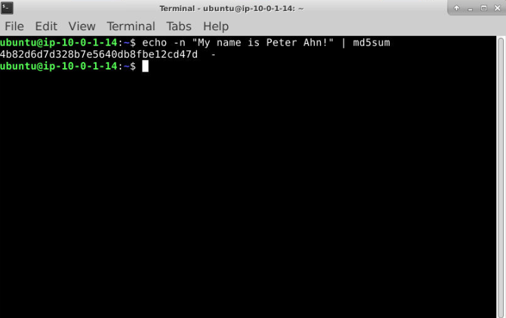
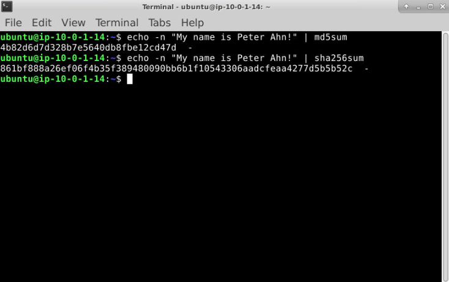
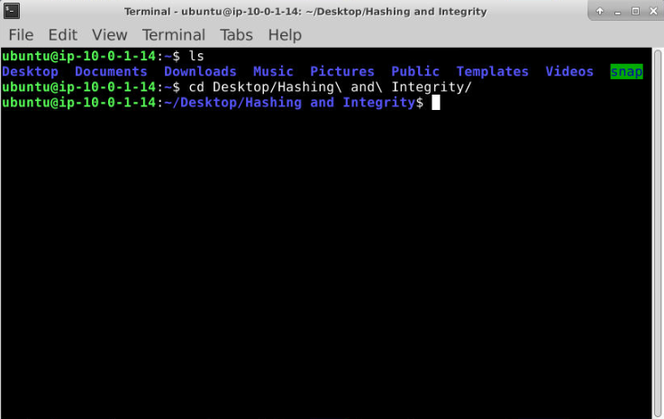
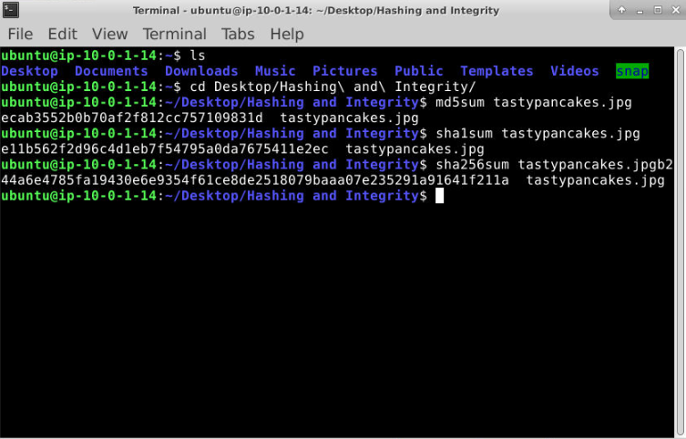

# Hash Analysis and File Integrity Validation

This workflow demonstrates practical digital forensic evidence validation using cryptographic hashing techniques. The workflow focuses on generating and comparing MD5, SHA1, and SHA256 hashes from both strings and files, validating evidence integrity, identifying files through their hash values, and understanding how hash databases are used during investigations.

The main tools used are: **md5sum**, **sha1sum**, **sha256sum**, **Get-FileHash (PowerShell)**, and the Linux terminal.

### Overview

This project focused on one of the most common activities performed during digital forensic investigations: hashing.

Hashing is the process of passing data through a mathematical function to generate a unique fingerprint known as a hash value. Investigators use hashes to verify that evidence has not changed, identify known files, compare artifacts across systems, and validate forensic acquisitions.

Unlike encryption, hashing is designed to be one-way. The purpose is not to hide data and later recover it. Instead, the purpose is to create a repeatable fingerprint that can be used to uniquely identify information.

This workflow begins with hashing a simple text string before progressing into file hashing using both Linux and Windows tooling. The workflow concludes with hash lookup techniques and explains why so-called "MD5 decryption" websites are actually performing database lookups rather than true decryption.

> **Workflow vs Execution vs Writeup (Terminology Used Here)**  
> - **Workflows** refer to repeatable digital forensic tasks such as metadata extraction, file carving, evidence recovery, and hash validation.  
> - **Executions** refer to the hands-on use of forensic tools such as ExifTool and Scalpel to analyze provided evidence files.  
> - **Writeups** document forensic observations, command usage, analyst reasoning, tool outputs, and evidence handling conclusions.

> 👉 For a **detailed, step-by-step walkthrough of how this workflow was executed — complete with screenshot placeholders**, see the **[Step-by-Step Execution](#step-by-step-execution)** section below.

---

### Purpose and Analyst Focus

#### ▶ Purpose

The purpose of this workflow is to demonstrate how cryptographic hashing supports evidence integrity, file identification, and forensic validation.

#### ▶ Analyst Focus

The analyst focus is on understanding:

- How hashes are generated
- Why identical data produces identical hashes
- Why a single character change creates a different hash
- Differences between MD5, SHA1, and SHA256
- Windows and Linux hashing workflows
- Evidence integrity validation concepts
- Hash lookup and identification techniques

---

### Environment and Execution Context

<details>
<summary><strong>▶ Environment & Platform</strong></summary>

The workflow was performed using Linux command-line utilities and Windows PowerShell examples.

</details>

<details>
<summary><strong>▶ Tooling Used</strong></summary>

- md5sum
- sha1sum
- sha256sum
- echo
- Get-FileHash
- Linux Terminal
- Public Hash Lookup Database

</details>

---

### Step-by-Step Execution

<details>
<summary><strong>▶ Phase 1 — Generate an MD5 Hash from a String</strong><br>
→ creating a digital fingerprint of text using md5sum
</summary>

#### 🔷 Phase 1.1 — Execute the Command

```bash
echo -n "My name is Peter Ahn!" | md5sum
```

<p align="left">
  <br>
  <em>Figure 1: Generating MD5 Hash from a string</em>
</p>

The `echo` command outputs text. The `-n` flag prevents a newline character from being added to the string. This matters because hashing is extremely sensitive to changes. Even a hidden newline character would produce a completely different hash.

The pipe character (`|`) sends the output of `echo` directly into `md5sum`, which calculates the MD5 hash of the supplied text.

#### 🔷 Phase 1.2 — Why This Matters

This exercise demonstrates a fundamental forensic principle:

> Identical input produces identical hashes. Different input produces different hashes.

Hashing allows investigators to compare evidence quickly without manually comparing every byte of data.

#### 🔷 Phase 1.3 — Record the Result

```text
4b82d6d7d328b7e5640db8fbe12cd47d
```

</details>

<details>
<summary><strong>▶ Phase 2 — Generate a SHA256 Hash from the Same String</strong><br>
→ comparing hashing algorithms using identical input
</summary>

#### 🔷 Phase 2.1 — Execute the Command

```bash
echo -n "My name is Peter Ahn!" | sha256sum

<p align="left">
  <br>
  <em>Figure 2: Generating SHA256 Hash from a string</em>
</p>
```

The process is identical to the MD5 example except a different hashing algorithm is used.

#### 🔷 Phase 2.2 — Compare the Results

The input remains exactly the same, but the output changes because SHA256 uses a different algorithm than MD5.

SHA256 produces a longer hash and is considered significantly stronger for modern integrity verification purposes.

#### 🔷 Phase 2.3 — Record the Result

```text
Answer:
861bf888a26ef06f4b35f389480090bb6b1f10543306aadcfeaa4277d5b5b52c
```

</details>

<details>
<summary><strong>▶ Phase 3 — Review PowerShell Hashing</strong><br>
→ identifying the correct command for generating a SHA1 file hash
</summary>

#### 🔷 Phase 3.1 — Identify the Command

```powershell
Get-FileHash -Algorithm SHA1 hashthis.jpg
```

This command calculates the SHA1 hash of a sample file `hashthis.jpg` in Windows PowerShell.

The `-Algorithm` parameter specifies which hashing algorithm should be used.

#### 🔷 Phase 3.2 — Why Investigators Use It

PowerShell hashing is commonly used during incident response, malware investigations, and evidence validation because it provides a built-in method for generating file hashes on Windows systems.

</details>

<details>
<summary><strong>▶ Phase 4 — Review Linux File Hashing</strong><br>
→ identifying the correct command for generating an MD5 file hash
</summary>


#### 🔷 Phase 4.1 — Identify the Command

```bash
md5sum hashthis.jpg
```

Linux provides dedicated utilities for several common hashing algorithms including MD5, SHA1, and SHA256.

#### 🔷 Phase 4.2 — Why Multiple Utilities Exist

Different organizations, tools, and investigations may require different algorithms. Analysts frequently generate multiple hashes for compatibility and validation purposes.

</details>

<details>
<summary><strong>▶ Phase 5 — Generate Multiple Hashes for a File</strong><br>
→ calculating MD5, SHA1, and SHA256 values for the same artifact
</summary>

I created a sample image and named the file `tastypancakes`. Since it's a JPG image file, I referenced the image as `tastypancakes.jpg`. This image file was located in a separate folder on my VM Desktop named `Hashing and Integrity`. I first changed directories to where the image file was located before hashing the image file.

<p align="left">
  <br>
  <em>Figure 3: Changing directories</em>
</p>

#### 🔷 Phase 5.1 — Generate the Hashes

```bash
md5sum tastypancakes.jpg
sha1sum tastypancakes.jpg
sha256sum tastypancakes.jpg
```

<p align="left">
  <br>
  <em>Figure 4: Generating hashes of the same image file using different algorithims</em>
</p>

Each command generates a different fingerprint for the same file.

One point that initially caused confusion was the difference between hashing a file and hashing the text of a file name. At first glance, the following commands may appear to accomplish the same task:

```bash
md5sum hashthis.jpg
```

```bash
echo -n "hashthis.jpg" | md5sum
```

However, they produce completely different results because they are hashing different inputs.

The command `md5sum hashthis.jpg` opens the file and calculates a hash based on the actual contents of the file. In a forensic investigation, this is the method used to identify files, validate evidence integrity, and compare artifacts because the resulting hash represents the file itself.

In contrast, `echo -n "hashthis.jpg" | md5sum` does not interact with the file at all. Instead, it hashes the literal text string `hashthis.jpg`. The resulting hash is simply a fingerprint of those characters and has no relationship to the contents of the image file. This distinction is important because forensic investigators are typically interested in validating the contents of evidence files rather than the names assigned to those files.

Understanding this difference helped clarify why Linux provides commands such as `md5sum`, `sha1sum`, and `sha256sum` that operate directly against files. During digital forensic investigations, these commands are used to generate fingerprints of evidence artifacts, while commands using `echo` are more commonly used for demonstrating hashing concepts or generating hashes from small text inputs.


#### 🔷 Phase 5.3 — Why This Matters

Generating multiple hashes improves interoperability between tools and allows investigators to compare artifacts using whichever algorithm is available in a given environment.

</details>

<details>
<summary><strong>▶ Phase 6 — Perform a Hash Lookup</strong><br>
→ identifying a plaintext value from a known MD5 hash
</summary>

#### 🔷 Phase 6.1 — Reverse/Decode a Provided Hash

For example, if I was provided with the hash below, I'd copy and paste it into a public MD5 lookup service.

```text
1f3870be274f6c49b3e31a0c6728957f
```

#### 🔷 Phase 6.2 — Search a Public Hash Database

The hash was submitted to a public MD5 lookup service.

The resulting plaintext value was:

```text
apple
```

#### 🔷 Phase 6.3 — Important Clarification

Many websites describe this process as “MD5 decryption.”

This is technically incorrect.

MD5 hashes are not decrypted. Instead, the website compares the submitted hash against a database of previously known hashes and returns a match if one exists.

This distinction is important because hashing and encryption are fundamentally different technologies.

</details>

---

### Evidence Examination Summary

| Task | Technique | Tool | Finding |
|--------|--------|--------|--------|
| Question 1 | String Hashing | md5sum | MD5 hash generated |
| Question 2 | String Hashing | sha256sum | SHA256 hash generated |
| Question 3 | Windows File Hashing | Get-FileHash | SHA1 command identified |
| Question 4 | Linux File Hashing | md5sum | MD5 command identified |
| Question 5 | Multi-Hash Comparison | md5sum / sha1sum / sha256sum | Three hashes generated |
| Question 6 | Hash Lookup | Public Database | Plaintext identified as apple |

---

### What I Learned (Skills Demonstrated)

Through this workflow, I learned how to:

- Generate MD5 hashes from strings
- Generate SHA256 hashes from strings
- Calculate file hashes in Linux
- Calculate file hashes in Windows PowerShell
- Compare multiple hashing algorithms
- Understand evidence integrity validation
- Explain the difference between hashing and encryption
- Perform hash lookup and identification activities
- Understand how hashes support forensic investigations and chain-of-custody processes
