# Memory Analysis Using Volatility

This workflow demonstrates practical memory forensics using **Volatility** to analyze Windows memory images, identify the correct memory profile, enumerate running processes, investigate suspicious process relationships, review command-line activity, examine network connections, and dump a process from memory for hashing.

The main tool used is: **Volatility Framework 2.6.1**. Supporting Linux command-line utilities used during the workflow include **bash**, **grep**, **wc**, and **md5sum**. See **[Environment and Execution Context](#environment-and-execution-context)** section below.

---

### Overview

This project focused on foundational memory analysis activities using Volatility.

Unlike disk-based forensic analysis, where evidence is examined from files stored on a drive, memory analysis focuses on evidence that existed in RAM at the time the memory image was captured. Memory can contain volatile evidence such as running processes, active network connections, command-line arguments, process relationships, loaded modules, injected code, and other runtime artifacts.

1. The first portion involved preparing the analysis environment and identifying the correct Volatility profile for `memdump1.mem`. This was necessary because Volatility needs to understand the operating system version and memory structure before plugins can reliably parse the image.

2. The second portion involved process enumeration and process relationship analysis. Volatility was used to list running processes, count `svchost.exe` instances, and then move from a flat process list into a process tree view to identify abnormal parent-child relationships.

3. The third portion involved command-line analysis. After a suspicious process relationship was identified, Volatility was used to extract the command line associated with a specific process ID. This helped reveal the exact command that was executed in memory.

4. The fourth portion shifted to `memdump2.mem`, where Volatility was used to review network connections and identify suspicious communication involving Microsoft Word. Finally, a process was dumped from memory and hashed using `md5sum`.

This workflow demonstrates that memory analysis can involve multiple evidence types, including image metadata, process listings, process trees, command-line arguments, network connections, and executable extraction. Each source provides a different view into system activity at the time memory was captured.

> **Workflow vs Execution vs Writeup (Terminology Used Here)**  
> - **Workflows** refer to repeatable digital forensic tasks such as memory image identification, process enumeration, network analysis, and process dumping.  
> - **Executions** refer to the hands-on use of forensic tools such as Volatility and Linux command-line utilities against memory images.  
> - **Writeups** document analysis steps, analyst observations, tool usage, evidence interpretation, and forensic reasoning.

> 👉 For a **detailed, step-by-step walkthrough of how this workflow was executed — complete with screenshot placeholders**, see the **[Step-by-Step Execution](#step-by-step-execution)** section below.

---

### Purpose and Analyst Focus

#### ▶ Purpose

The purpose of this workflow is to demonstrate how memory images can be analyzed to identify system characteristics, running processes, suspicious process behavior, network activity, and process artifacts.

This matters because memory can contain evidence that may not be available from disk alone. A suspicious process may terminate, malware may run only in memory, command-line arguments may not be logged elsewhere, and active network connections may disappear after system shutdown.

The `imageinfo` portion focused on identifying the correct Volatility profile. This matters because Volatility plugins rely on the correct operating system profile to interpret memory structures accurately.

The process analysis portion focused on identifying running processes and suspicious process relationships. This matters because malware may disguise itself using legitimate process names or create unusual parent-child process chains.

The command-line analysis portion focused on recovering the command line for a suspicious process. This matters because command-line arguments can reveal what a process executed, what files it referenced, and what behavior occurred.

The network analysis portion focused on reviewing active or recently active connections from memory. This matters because malware often communicates with external infrastructure, and memory may preserve evidence of that communication.

The process dumping portion focused on extracting an executable from memory and hashing it. This matters because analysts may need to preserve a suspicious process for later malware analysis, reputation checks, or evidence documentation.

#### ▶ Analyst Focus

The analyst focus is on understanding how memory artifacts can be extracted and interpreted using Volatility.

This includes:

- preparing the Linux analysis environment,
- using Bash for command-line efficiency,
- locating and running `vol.py`,
- identifying the correct memory profile with `imageinfo`,
- understanding why profile selection matters,
- interpreting system metadata such as processor count and KDBG address,
- using `pslist` to enumerate running processes,
- using `grep` to filter process output,
- using `wc -l` to count matching process names,
- understanding why multiple `svchost.exe` processes can be normal,
- using `pstree` to review parent-child process relationships,
- identifying suspicious process lineage,
- using `cmdline` to recover command-line arguments,
- using `netscan` to review network connections,
- identifying suspicious external communication,
- using `procdump` to extract a process from memory,
- using `md5sum` to calculate a file hash.

The goal is not just to run Volatility commands and copy answers. The goal is to understand what each plugin reveals, what each artifact proves, and why each investigative pivot makes sense.

---

### What This Workflow Demonstrates

This workflow demonstrates how to:

- Prepare a Linux terminal environment for memory analysis.
- Navigate to the Volatility framework directory.
- Use Volatility against provided memory images.
- Identify the suggested memory profile for a Windows memory image.
- Understand why the correct profile is required.
- Identify image metadata such as processor count and KDBG address.
- Use the `pslist` plugin to list running processes.
- Use `grep` to filter process output.
- Use `wc -l` to count matching process results.
- Understand normal versus suspicious `svchost.exe` behavior.
- Use the `pstree` plugin to view process parent-child relationships.
- Identify suspicious process lineage involving `svchost.exe`, `cmd.exe`, and `PING.EXE`.
- Use the `cmdline` plugin to recover command-line arguments for a specific PID.
- Use the `netscan` plugin to identify suspicious network connections.
- Recognize suspicious Microsoft Word network activity.
- Use the `procdump` plugin to extract a process from memory.
- Use `md5sum` to calculate a hash of the dumped process.
- Correlate multiple memory artifacts into one investigative narrative.

This workflow also demonstrates the difference between broad process visibility and contextual process analysis. A flat process list can show what was running, while a process tree can explain how processes are related. That relationship can be critical when distinguishing normal system activity from suspicious behavior.

---

### Investigation and Digital Forensics Relevance

Memory analysis is one of the most valuable areas of digital forensics because it captures a system's live runtime state.

A memory image can help answer questions such as:

- What operating system was running?
- What processes were active?
- What process relationships existed?
- Were command shells launched by unusual parent processes?
- What command-line arguments were used?
- What network connections existed?
- Did a suspicious process communicate externally?
- Can a process be extracted from memory for further analysis?

These questions are important because many attacks involve runtime behavior that may not be fully visible from disk artifacts alone.

The table below summarizes the role of each memory analysis technique in this workflow:

| Technique | Meaning | Why It Matters |
|---|---|---|
| Image Identification | Determining the correct memory profile | Allows Volatility to parse memory structures correctly |
| Process Enumeration | Listing running processes | Establishes what was active at the time of capture |
| Process Tree Analysis | Reviewing parent-child relationships | Helps identify unusual process lineage |
| Command-Line Analysis | Extracting command-line arguments | Reveals what a process was instructed to run |
| Network Analysis | Reviewing connections from memory | Helps identify suspicious external communication |
| Process Dumping | Extracting a process from memory | Preserves an executable for later analysis |
| Hashing | Calculating a file fingerprint | Supports identification, comparison, and evidence documentation |

---

### Environment and Execution Context

This section documents the tools, memory images, and execution environment used during the workflow.

**Note:** Each section is collapsible. Click the ▶ arrow to expand and view details on platform, tools, evidence sources, workflow scope, and the high-level execution map.

<details>
<summary><strong>▶ Environment & Platform</strong><br>
</summary><br>

The workflow was performed in a Linux-based lab environment.

The user account used during the lab was:

```text
ubuntu
```

The Volatility framework was located at:

```text
/volatility/
```

The memory images were located at:

```text
/home/ubuntu/Desktop/Volatility Exercise/
```

The primary memory images reviewed were:

```text
memdump1.mem
memdump2.mem
```

</details>

<details>
<summary><strong>▶ Evidence Sources Reviewed</strong><br>
</summary><br>

The following evidence sources were reviewed:

| Evidence Source | Purpose |
|---|---|
| `memdump1.mem` | Used for profile identification, process listing, process tree analysis, and command-line review |
| `memdump2.mem` | Used for network connection analysis and process dumping |
| Volatility plugin output | Used to extract structured memory artifacts |
| Dumped executable | Used for hash calculation |

Each evidence source contributed a different part of the memory analysis workflow.

</details>

<details>
<summary><strong>▶ Tooling Used</strong><br>
</summary><br>

The tools and utilities used during execution included:

- **Volatility Framework 2.6.1** — used to analyze Windows memory images.
- **bash** — used to improve command-line usability during the lab.
- **grep** — used to filter Volatility output for specific process names.
- **wc** — used to count matching output lines.
- **md5sum** — used to calculate an MD5 hash of the dumped process.
- **Linux Terminal** — used as the command execution environment.

</details>

<details>
<summary><strong>▶ Volatility Plugins Used</strong><br>
</summary><br>

The following Volatility plugins were used:

| Plugin | Purpose |
|---|---|
| `imageinfo` | Identify suggested memory profile and image metadata |
| `pslist` | List running processes |
| `pstree` | Display process parent-child relationships |
| `cmdline` | Extract command-line arguments |
| `netscan` | Identify network connections and sockets |
| `procdump` | Dump a process executable from memory |

</details>

<details>
<summary><strong>▶ Workflow Scope</strong><br>
</summary><br>

This workflow focused on introductory memory analysis.

The workflow did not perform advanced malware reverse engineering or deep memory carving. Instead, the purpose was to demonstrate how Volatility can be used to extract common investigative artifacts from memory images.

Out-of-scope activities included:

- reverse engineering the dumped executable,
- unpacking malware,
- extracting injected code,
- analyzing DLLs in depth,
- performing full timeline reconstruction,
- submitting hashes to threat intelligence platforms.

Those activities could occur in later analysis-focused workflows.

</details>

<details>
<summary><strong>▶ Workflow Map (High-Level)</strong><br>
</summary><br>

1. Open the terminal.
2. Switch to a Bash shell.
3. Confirm the current user context.
4. Navigate to `/volatility/`.
5. Confirm `vol.py` exists.
6. Run `imageinfo` against `memdump1.mem`.
7. Identify the first suggested profile.
8. Review processor count.
9. Identify the KDBG address.
10. Use `pslist` to list running processes.
11. Filter for `svchost.exe`.
12. Count `svchost.exe` instances.
13. Use `pstree` to review parent-child relationships.
14. Identify suspicious `svchost.exe` behavior.
15. Use `cmdline` to review the command line for PID `2352`.
16. Switch to `memdump2.mem`.
17. Use `netscan` to review network activity.
18. Identify suspicious `WINWORD.EXE` communication.
19. Use `procdump` to dump process PID `2940`.
20. Use `md5sum` to calculate the hash of the dumped executable.

</details>

---

### Step-by-Step Execution

This section documents the workflow in the same order an analyst would realistically perform memory analysis.

The workflow begins with environment preparation, then moves into image identification, process enumeration, process relationship analysis, command-line review, network analysis, process extraction, and hashing.

**Note:** Each section is collapsible. Click the ▶ arrow to expand and view the detailed steps.

<details>
<summary><strong>▶ Phase 1 — Prepare the Analysis Environment</strong><br>
→ setting up the terminal and locating Volatility
</summary><br>

This phase focused on preparing the command-line environment and locating the Volatility framework.

<blockquote>
I started with environment preparation because memory analysis requires running commands accurately against specific memory images. Setting up the shell and confirming the Volatility directory helped reduce command mistakes later in the workflow.
</blockquote>

##### 🔷 Phase 1.1 — Switch to Bash

The lab environment opened in a terminal session.

I switched to Bash using:

```bash
bash
```

Bash was useful because it provides features that make command-line analysis easier, including:

- tab completion,
- command history,
- easier editing of long commands,
- faster reuse of previous commands.

I also confirmed the user context using:

```bash
whoami
```

The output showed:

```text
ubuntu
```

<p align="left">
  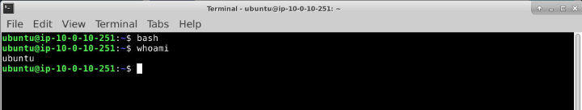<br>
  <em>Figure 1: Switching to Bash and confirming the active user context.</em>
</p>

##### 🔷 Phase 1.2 — Navigate to the Volatility directory

Before beginning analysis, I needed to access the Volatility framework and verify that the required tooling was available.

Volatility is the primary tool used throughout this workflow to analyze Windows memory images and extract forensic artifacts such as process listings, command-line activity, network connections, and other memory-resident evidence.

I navigated to the Volatility directory `/volatility/`, by using:

```bash
cd /volatility/
```

Then I listed the directory contents using:

```bash
dir
```

The directory contained: `vol.py`. This confirmed that the Volatility script was available for analysis.

<p align="left">
  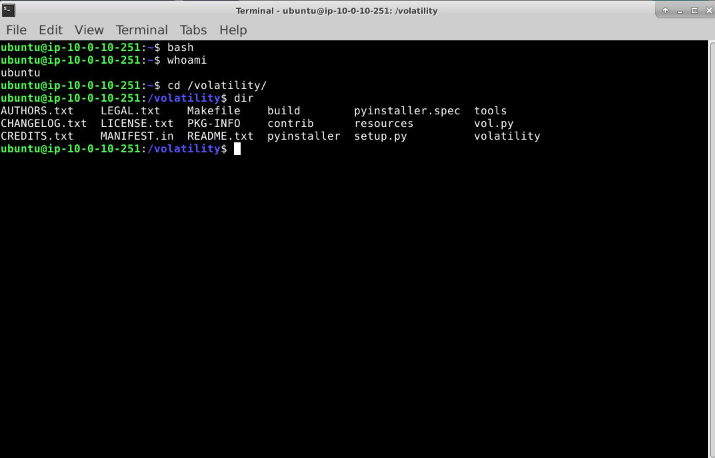<br>
  <em>Figure 2: Navigating to the Volatility framework directory and confirming vol.py exists.</em>
</p>

##### 🔷 Phase 1.3 — Phase 1 findings

| Item | Finding |
|---|---|
| User context | `ubuntu` |
| Volatility directory | `/volatility/` |
| Main script | `vol.py` |
| Purpose | Prepare the environment for memory image analysis |

</details>

<details>
<summary><strong>▶ Phase 2 — Identify the Memory Image Profile</strong><br>
→ determining how Volatility should interpret memdump1.mem
</summary><br>

This phase focused on identifying the correct Volatility profile for the first memory image.

Before using most Volatility plugins, I needed to identify the correct profile. The profile tells Volatility what operating system and memory structure it should expect. Without the correct profile, plugin output may be incomplete, inaccurate, or fail entirely.

##### 🔷 Phase 2.1 — Run imageinfo against memdump1.mem

To identify the memory image, I ran:

```bash
python vol.py -f "/home/ubuntu/Desktop/Volatility Exercise/memdump1.mem" imageinfo
```

The command can be broken down as follows:

| Command Element | Meaning |
|---|---|
| `python vol.py` | Runs Volatility |
| `-f` | Specifies the memory image file |
| `/home/ubuntu/Desktop/Volatility Exercise/memdump1.mem` | Path to the memory image |
| `imageinfo` | Plugin used to identify image metadata and suggested profiles |

The file path was wrapped in quotation marks because the directory name contains a space:

```text
Volatility Exercise
```

Without quotation marks, the shell could interpret the path as separate arguments.

<p align="left">
  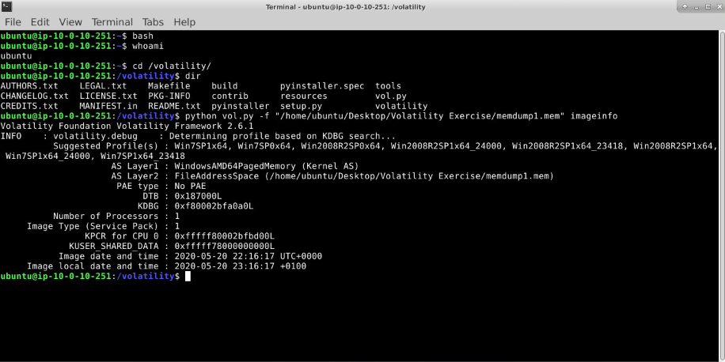<br>
  <em>Figure 3: Running imageinfo to identify the suggested memory profile.</em>
</p>

##### 🔷 Phase 2.2 — Identify the suggested profile

The `imageinfo` output returned several suggested profiles that could potentially match the memory image.

The first suggested profile was:

```text
Win7SP1x64
```

I selected this profile for subsequent analysis because it was the highest-confidence profile suggested by Volatility and closely matched the operating system characteristics identified during image analysis.

Using the correct profile is important because many Volatility plugins rely on operating system-specific memory structures. Selecting an incorrect profile can result in missing artifacts, inaccurate output, or plugin failures. Establishing the profile early helps ensure that later findings are interpreted correctly and consistently throughout the investigation.

<p align="left">
  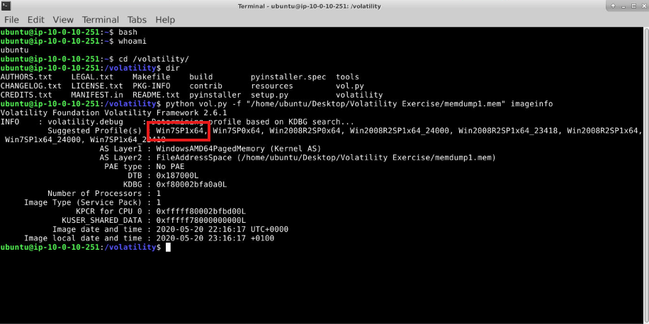<br>
  <em>Figure 4: Identifying the suggested profile.</em>
</p>

This profile was used for later analysis of `memdump1.mem`.

##### 🔷 Phase 2.3 — Understand why profile selection matters

Volatility needs a profile because different Windows versions and service packs organize memory structures differently. A memory profile is essentially a blueprint that tells Volatility how Windows structures are organized in memory. Different operating system versions, architectures, and service packs store data differently, so Volatility needs the correct profile to accurately locate and interpret artifacts such as processes, network connections, loaded modules, and kernel structures.

A plugin such as `pslist` needs to understand where process structures are located and how to interpret them.

Using the wrong profile can cause:

- missing processes,
- incorrect timestamps,
- failed plugin execution,
- unreliable results.

This is why image identification is usually performed before deeper memory analysis.

##### 🔷 Phase 2.4 — Identify the processor count

With an appropriate profile selected, I reviewed the additional metadata identified by `imageinfo`.

While the operating system profile is the primary objective of this plugin, the output also provides several environmental details about the system that produced the memory image. These details can help validate our understanding of the host, establish context for later analysis, and answer investigation questions related to the captured system.

The next step was to examine some of the key metadata values identified during the image analysis process.

The `imageinfo` output showed:

```text
Number of Processors : 1
```

This indicated that Volatility identified one processor in the memory image.

<p align="left">
  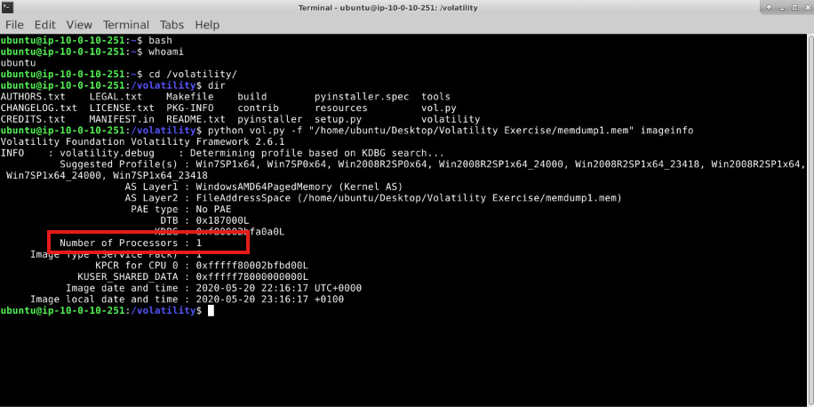<br>
  <em>Figure 5: Reviewing image metadata including processor count and KDBG information.</em>
</p>

##### 🔷 Phase 2.5 — Identify the KDBG address

The `imageinfo` output also showed the KDBG value.

KDBG is short for:

```text
_KDDEBUGGER_DATA64
```

This is a Windows kernel debugger data structure that Volatility uses to locate important kernel information.

The KDBG address identified was:

```text
0xf80002bfa0a0L
```

This value was important because plugins such as `pslist` and `modules` may rely on KDBG-related information during analysis.

<p align="left">
  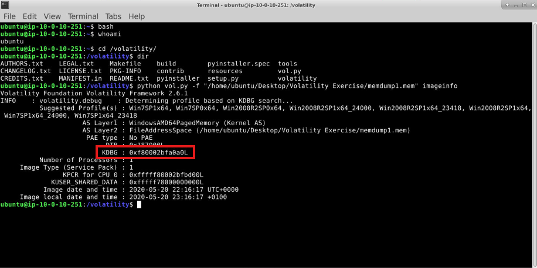<br>
  <em>Figure 6: Identifying the KDBG address.</em>
</p>

##### 🔷 Phase 2.6 — Phase 2 findings

| Question | Finding |
|---|---|
| Suggested profile | `Win7SP1x64` |
| Number of processors | `1` |
| KDBG address | `0xf80002bfa0a0L` |

</details>

<details>
<summary><strong>▶ Phase 3 — Enumerate Running Processes</strong><br>
→ using pslist, grep, and wc to identify process activity
</summary><br>

This phase focused on listing running processes and counting `svchost.exe` instances.

<blockquote>
After identifying the correct profile, I moved into process enumeration. Running processes are one of the most important memory artifacts because they show what was active at the time of capture.
</blockquote>

##### 🔷 Phase 3.1 — Understand the pslist plugin

With the memory image successfully identified and the profile selected, the next step was to examine what was running on the system at the time memory was captured.

Running processes are often one of the most valuable sources of evidence during memory analysis because they provide a snapshot of system activity. By reviewing active processes, analysts can identify legitimate operating system activity, establish a baseline of normal behavior, and begin looking for unusual or suspicious processes that warrant further investigation.

To enumerate the processes present in memory, I used the `pslist` plugin:

```text
pslist
```

The `pslist` plugin shows processes that were active in memory at the time of capture. The full process listing contained many entries, including several instances of `svchost.exe`.

##### 🔷 Phase 3.2 — Understand the pstree plugin

Rather than manually reviewing every process in the output, I narrowed the results to focus specifically on `svchost.exe`.

The `pstree` plugin/process is commonly used by Windows to host system services and it is normal to see multiple instances running simultaneously. However, because attackers often abuse trusted Windows processes to blend into normal activity, understanding which `svchost.exe` instances are present can be an important investigative step.

This plugin is useful because it shows parent-child process relationships, which can reveal suspicious execution chains. Because service-hosting processes are frequently involved in both legitimate Windows activity and malware investigations, I decided to take a closer look at the svchost.exe instances present in memory.

Filtering the results made it easier to review the individual `svchost.exe` entries, but manually counting each occurrence can become inefficient and error-prone.

To establish a quick baseline of how many service host processes were active at the time of acquisition, I used a command-line count of the filtered results.


##### 🔷 Phase 3.3 — Count svchost.exe instances

To count the number of matching processes, I extended the previous command by piping the filtered output into:

I used `pslist` and filtered the output with `grep`:

```bash
python vol.py -f "/home/ubuntu/Desktop/Volatility Exercise/memdump1.mem" --profile=Win7SP1x64 pslist | grep "svchost.exe"
```

The command can be broken down as follows:

| Command Element | Meaning |
|---|---|
| `pslist` | Lists running processes |
| `--profile=Win7SP1x64` | Uses the identified memory profile |
| `|` | Pipes output into another command |
| `grep "svchost.exe"` | Filters output for lines containing `svchost.exe` |

<p align="left">
  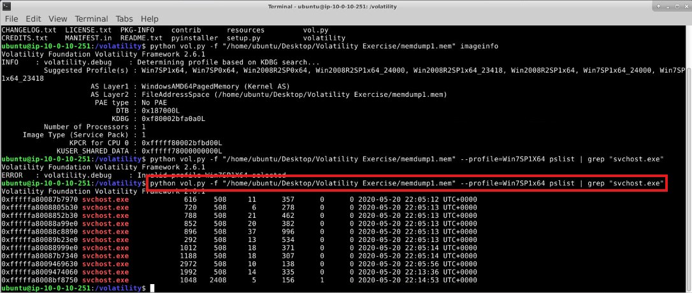<br>
  <em>Figure 7: Filtering process output for svchost.exe instances.</em>
</p>

##### 🔷 Phase 3.4 — Count svchost.exe instances

Manually counting process entries can lead to mistakes, especially when there are many matching lines.

To count the results more reliably, I added:

```bash
wc -l
```

The full command was:

```bash
python vol.py -f "/home/ubuntu/Desktop/Volatility Exercise/memdump1.mem" --profile=Win7SP1x64 pslist | grep "svchost.exe" | wc -l
```

The result was:

```text
11
```

<p align="left">
  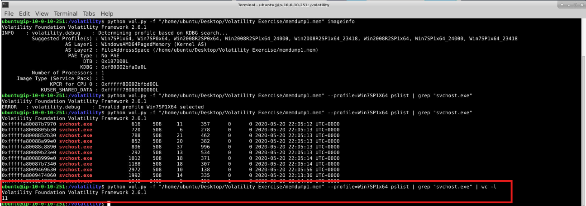<br>
  <em>Figure 8: Counting svchost.exe entries using grep and wc.</em>
</p>

##### 🔷 Phase 3.5 — Interpret svchost.exe process count

Seeing many `svchost.exe` processes does not automatically indicate malware.

`svchost.exe` is a legitimate Windows process used to host Windows services. It is normal for Windows systems to run multiple `svchost.exe` instances at the same time.

The suspiciousness depends on context, such as:

- unusual parent process,
- unusual child processes,
- suspicious command line,
- abnormal network activity,
- unexpected file path,
- mismatched process name.

##### 🔷 Phase 3.6 — Phase 3 findings

| Question | Finding |
|---|---|
| Plugin used to list processes | `pslist` |
| Plugin used to view process tree | `pstree` |
| Number of `svchost.exe` processes | `11` |

</details>

<details>
<summary><strong>▶ Phase 4 — Review Process Relationships</strong><br>
→ using pstree to identify suspicious process lineage
</summary><br>

This phase focused on using process relationships to identify potentially suspicious `svchost.exe` process.

<blockquote>
A process list tells me what was running, but it does not provide enough context about how the processes were created. To understand whether one of the `svchost.exe` instances was abnormal, I needed to review parent-child relationships.
</blockquote>

##### 🔷 Phase 4.1 — Run pstree

To review process relationships, I used:

```bash
python vol.py -f "/home/ubuntu/Desktop/Volatility Exercise/memdump1.mem" --profile=Win7SP1x64 pstree
```

The `pstree` plugin displays process lineage in a tree structure.

This helps identify:

- parent processes,
- child processes,
- unusual spawning behavior,
- process chains that may indicate malicious activity.

<p align="left">
  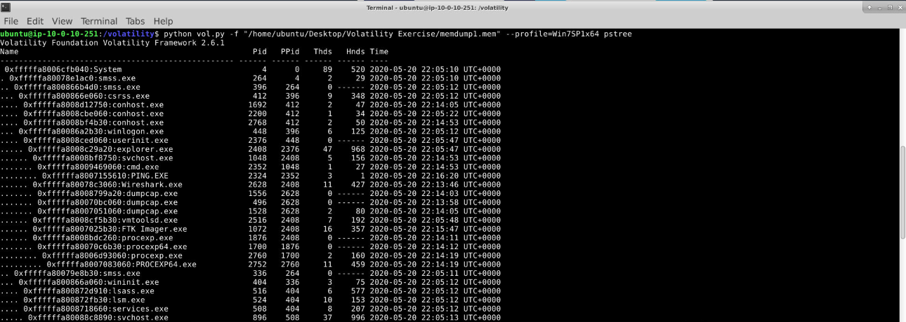<br>
  <em>Figure 9: Reviewing process relationships using pstree.</em>
</p>

##### 🔷 Phase 4.2 — Identify the suspicious svchost.exe process

The process tree showed one `svchost.exe` process spawning:

```text
cmd.exe
```

The `cmd.exe` process then spawned:

```text
PING.EXE
```

This stood out because `svchost.exe` normally hosts Windows services. It is not normally expected to spawn an interactive command shell such as `cmd.exe`.

The suspicious `svchost.exe` process had the PID:

```text
1048
```

<p align="left">
  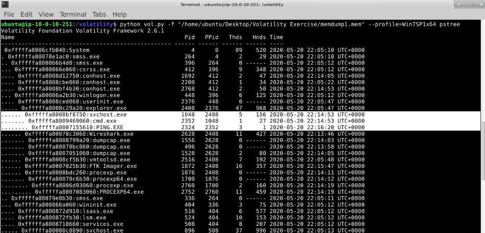<br>
  <em>Figure 10: Identifying the suspicious svchost.exe process.</em>
</p>

##### 🔷 Phase 4.3 — Interpret why this process chain was unusual

The suspicious process chain was:

```text
svchost.exe
    └── cmd.exe
        └── PING.EXE
```

This mattered because:

- `svchost.exe` is commonly abused by malware because it looks like a legitimate Windows process.
- `cmd.exe` is often used to execute commands or scripts.
- `PING.EXE` may be used for network testing, delays, beacon simulation, or connectivity checks.

This does not prove malicious activity by itself, but the parent-child relationship was unusual enough to justify deeper investigation.

##### 🔷 Phase 4.4 — Phase 4 findings

| Question | Finding |
|---|---|
| PID of suspicious `svchost.exe` | `1048` |
| Suspicious child process | `cmd.exe` |
| Additional child process | `PING.EXE` |

</details>

<details>
<summary><strong>▶ Phase 5 — Review Command-Line Activity</strong><br>
→ extracting the command line associated with PID 2352
</summary><br>

This phase focused on determining what command was executed by the suspicious process chain.

<blockquote>
After identifying suspicious process lineage, I needed to determine what the command shell actually executed. Process relationships showed that `cmd.exe` was involved, but command-line analysis could reveal the exact command.
</blockquote>

##### 🔷 Phase 5.1 — Pivot from pstree to cmdline

The suspicious tree showed:

```text
cmd.exe
```

with PID:

```text
2352
```

To inspect the command-line arguments for that process, I used the `cmdline` plugin.

##### 🔷 Phase 5.2 — Run cmdline for PID 2352

The command used was:

```bash
python vol.py -f "/home/ubuntu/Desktop/Volatility Exercise/memdump1.mem" --profile=Win7SP1x64 cmdline -p 2352
```

The command can be broken down as follows:

| Command Element | Meaning |
|---|---|
| `cmdline` | Extracts command-line arguments for processes |
| `-p 2352` | Limits output to PID `2352` |
| `--profile=Win7SP1x64` | Uses the correct memory profile |
| `memdump1.mem` | Memory image being analyzed |

<p align="left">
  <br>
  <em>Figure 11: Extracting the command line for PID 2352.</em>
</p>

##### 🔷 Phase 5.3 — Interpret the command line

The command line for PID `2352` was:

```text
cmd /c ""C:\Users\ismak\AppData\Local\Temp\3C92.tmp\photo_download_keyres.bat" "
```

This was suspicious because it showed `cmd.exe` executing a batch file from a temporary directory.

The filename was:

```text
photo_download_keyres.bat
```

Batch files can be used legitimately, but they are also frequently used to automate commands during malware execution.

The path was also notable:

```text
C:\Users\ismak\AppData\Local\Temp\3C92.tmp\
```

The `Temp` directory is commonly used by installers, scripts, malware droppers, and temporary execution chains.

##### 🔷 Phase 5.4 — Phase 5 findings

| Question | Finding |
|---|---|
| Command line for PID `2352` | `cmd /c ""C:\Users\ismak\AppData\Local\Temp\3C92.tmp\photo_download_keyres.bat" "` |

</details>

<details>
<summary><strong>▶ Phase 6 — Analyze Network Connections in memdump2.mem</strong><br>
→ identifying suspicious external communication
</summary><br>

This phase shifted from `memdump1.mem` to `memdump2.mem`.

<blockquote>
The first memory image focused on process and command-line analysis. The next stage used a second memory image to examine network activity. Network connections in memory can help identify suspicious communication that may not be obvious from process listings alone.
</blockquote>

##### 🔷 Phase 6.1 — Run netscan against memdump2.mem

To review network connections, I used the `netscan` plugin:

```bash
python vol.py -f "/home/ubuntu/Desktop/Volatility Exercise/memdump2.mem" --profile=Win7SP1x64 netscan
```

The `netscan` plugin identifies network sockets and connections from memory.

It can show:

- local addresses,
- foreign addresses,
- connection states,
- associated PIDs,
- process names.

<p align="left">
  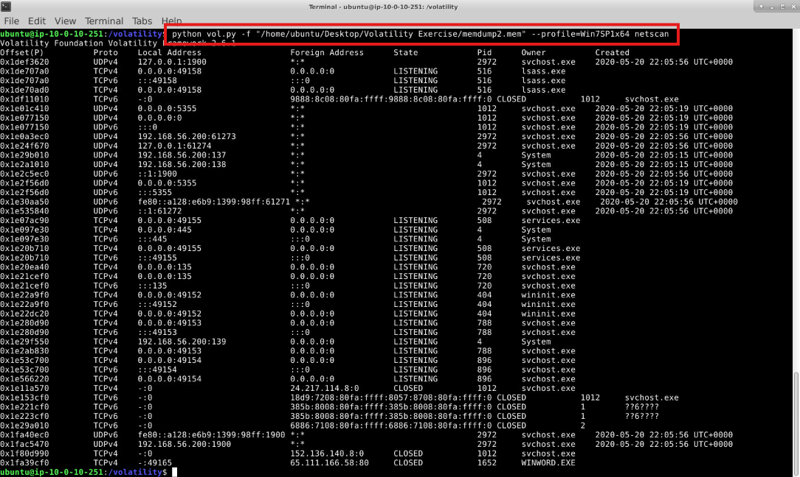<br>
  <em>Figure 12: Reviewing network connections using netscan.</em>
</p>

##### 🔷 Phase 6.2 — Identify suspicious external communication

The output showed a connection involving:

```text
WINWORD.EXE
```

communicating with the foreign address:

```text
65.111.166.58:80
```

Port `80` is commonly associated with HTTP traffic.

<p align="left">
  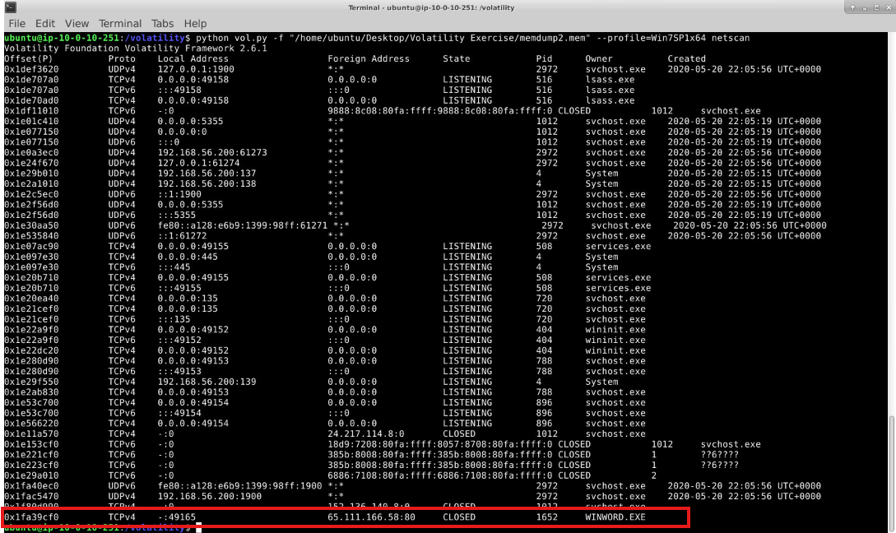<br>
  <em>Figure 13: Identifying suspicious external communication.</em>
</p>

##### 🔷 Phase 6.3 — Interpret why WINWORD.EXE network activity was suspicious

`WINWORD.EXE` is Microsoft Word.

Microsoft Word can legitimately access network resources in some cases, but a Word process communicating directly with an external public IP address over HTTP is suspicious in a malware investigation context.

This behavior is commonly associated with malicious document activity, such as:

- macro-enabled documents,
- phishing attachments,
- document-based downloaders,
- scripts that retrieve additional payloads.

This did not prove the document was malicious by itself, but it provided strong evidence of suspicious behavior.

##### 🔷 Phase 6.4 — Phase 6 findings

| Question | Finding |
|---|---|
| Suspicious process | `WINWORD.EXE` |
| Suspicious foreign IP | `65.111.166.58` |
| Port | `80` |

</details>

<details>
<summary><strong>▶ Phase 7 — Dump a Suspicious Process from Memory</strong><br>
→ extracting process PID 2940 for hashing
</summary><br>

This phase focused on extracting a process from `memdump2.mem`.

<blockquote>
After identifying suspicious behavior, the next step was to preserve the relevant process from memory. Dumping a process allows analysts to create a file artifact that can be hashed, examined, or submitted to additional analysis tools.
</blockquote>

##### 🔷 Phase 7.1 — Run procdump for PID 2940

The investigation question required dumping the process with PID:

```text
2940
```

The command used was:

```bash
python vol.py -f "/home/ubuntu/Desktop/Volatility Exercise/memdump2.mem" --profile=Win7SP1x64 -D /home/ubuntu/Desktop/ procdump -p 2940
```

The command can be broken down as follows:

| Command Element | Meaning |
|---|---|
| `procdump` | Dumps a process executable from memory |
| `-p 2940` | Specifies the process ID to dump |
| `-D /home/ubuntu/Desktop/` | Writes the dumped file to the Desktop |
| `memdump2.mem` | Memory image being analyzed |

Volatility successfully produced:

```text
executable.2940.exe
```

<p align="left">
  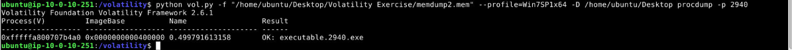<br>
  <em>Figure 14: Dumping PID 2940 from memory and calculating its MD5 hash.</em>
</p>

##### 🔷 Phase 7.2 — Calculate the MD5 hash

Before calculating the MD5 hash, I verified where the file had been saved. This step was important because Volatility was executed from the /volatility/ directory, while the dumped process was written to:

`/home/ubuntu/Desktop/`

Attempting to calculate the hash from the wrong working directory resulted in a "No such file or directory" error because the executable was not located in the current path.

After successfully dumping the process, I calculated the MD5 hash of the extracted executable using:

`md5sum /home/ubuntu/Desktop/executable.2940.exe`

Using the full file path ensured that the correct file was referenced regardless of the current working directory.

The MD5 hash was:

```text
015c0255c232d95a4bdf305522eb9b7
```

<p align="left">
  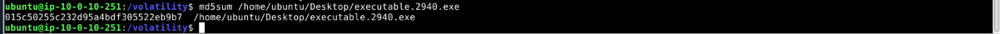<br>
  <em>Figure 15: Calculating the MD5 hash.</em>
</p>

##### 🔷 Phase 7.3 — Explain why hashing matters

A hash is a repeatable fingerprint of a file.

Hashing is useful because it allows analysts to:

- identify known files,
- compare artifacts,
- check whether a file changed,
- search malware repositories,
- document evidence consistently.

MD5 is not recommended for strong cryptographic integrity protection, but it is still commonly used in malware triage and file identification workflows.

##### 🔷 Phase 7.4 — Phase 7 findings

| Question | Finding |
|---|---|
| Dumped process PID | `2940` |
| Dumped file | `executable.2940.exe` |
| MD5 hash | `015c0255c232d95a4bdf305522eb9b7` |
| First five MD5 characters | `015c0` |

</details>

---

### Evidence Examination Summary

| Task | Memory Image | Artifact Source | Tool / Plugin | Finding |
|---|---|---|---|---|
| Identify profile | `memdump1.mem` | Image metadata | Volatility `imageinfo` | `Win7SP1x64` |
| Identify processor count | `memdump1.mem` | Image metadata | Volatility `imageinfo` | `1` |
| Identify KDBG | `memdump1.mem` | Kernel metadata | Volatility `imageinfo` | `0xf80002bfa0a0L` |
| List processes | `memdump1.mem` | Process list | Volatility `pslist` | Process enumeration |
| Count svchost processes | `memdump1.mem` | Process list | `pslist`, `grep`, `wc` | `11` |
| Identify suspicious process | `memdump1.mem` | Process tree | Volatility `pstree` | `svchost.exe` PID `1048` |
| Extract command line | `memdump1.mem` | Process command line | Volatility `cmdline` | Batch file execution from Temp |
| Identify suspicious network activity | `memdump2.mem` | Network connections | Volatility `netscan` | `WINWORD.EXE` to `65.111.166.58:80` |
| Dump process | `memdump2.mem` | Process memory | Volatility `procdump` | `executable.2940.exe` |
| Hash dumped file | Dumped executable | File hash | `md5sum` | `015c0...` |

---

### What I Learned (Skills Demonstrated)

Through this workflow, I learned how to:

- Prepare a Linux terminal environment for memory analysis.
- Use Bash to improve command-line workflow.
- Locate and execute Volatility from the `/volatility/` directory.
- Use `imageinfo` to identify a memory profile.
- Understand why Volatility profiles matter.
- Identify system metadata from a memory image.
- Interpret processor count and KDBG values.
- Use `pslist` to enumerate running processes.
- Use `grep` to filter process output.
- Use `wc -l` to count filtered results.
- Understand why multiple `svchost.exe` processes may be normal.
- Use `pstree` to review process relationships.
- Identify suspicious parent-child process lineage.
- Use `cmdline` to recover command-line arguments.
- Recognize suspicious execution from temporary directories.
- Use `netscan` to review network connections.
- Identify suspicious public IP communication.
- Recognize why Microsoft Word communicating externally can be suspicious.
- Use `procdump` to extract a process from memory.
- Use `md5sum` to calculate a file hash.
- Correlate memory artifacts into a broader investigative conclusion.

This workflow strengthened my understanding that memory analysis provides runtime context that may not be available from disk alone. Process lists, process trees, command-line arguments, network connections, and process dumps can be correlated to identify suspicious activity and preserve evidence for later analysis.

---

### Key Takeaways

This workflow showed that memory analysis is not one single action.

It involves a sequence of investigative pivots:

```text
Identify profile
      ↓
List processes
      ↓
Review process relationships
      ↓
Extract command line
      ↓
Review network activity
      ↓
Dump suspicious process
      ↓
Hash extracted artifact
```

The most important lesson from this workflow is that context matters.

Seeing many `svchost.exe` processes is not suspicious by itself. Seeing `svchost.exe` spawn `cmd.exe`, which then launches `PING.EXE`, is much more meaningful.

Similarly, seeing a network connection is not automatically malicious. Seeing `WINWORD.EXE` communicate with a public IP over HTTP in a suspected malware investigation is far more suspicious.

Together, the artifacts demonstrated how Volatility can be used to reconstruct process behavior, investigate suspicious activity, identify external communication, and extract evidence from memory for additional analysis.
