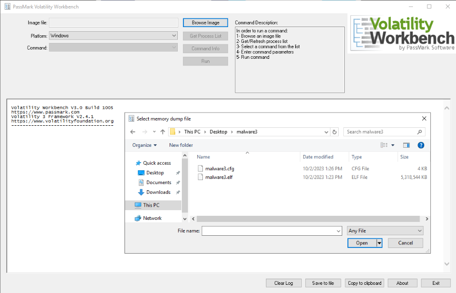
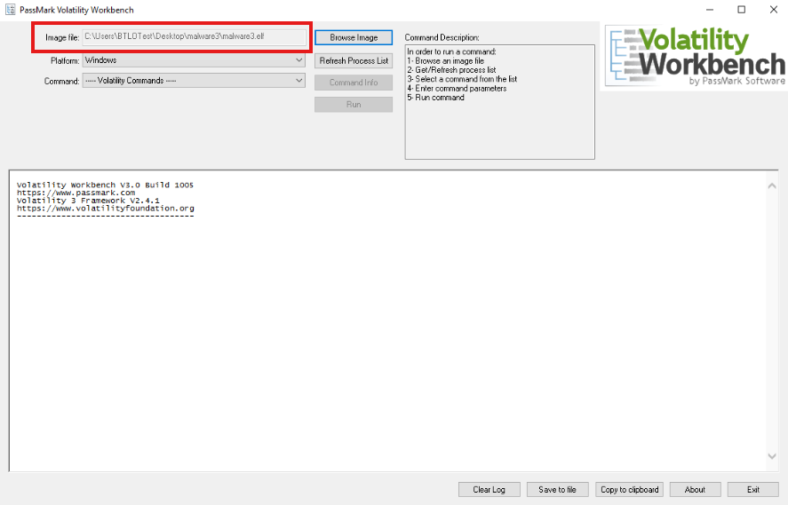
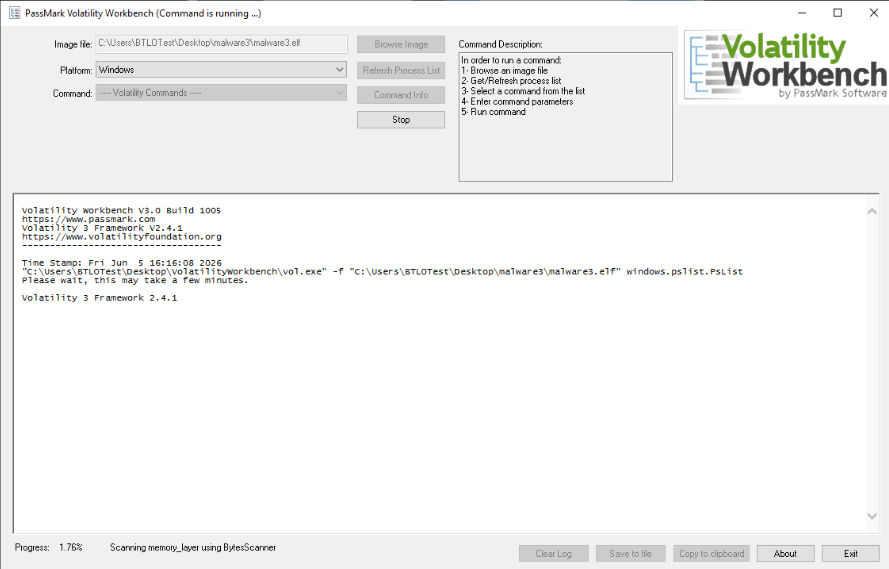
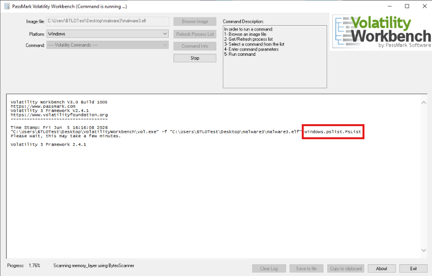
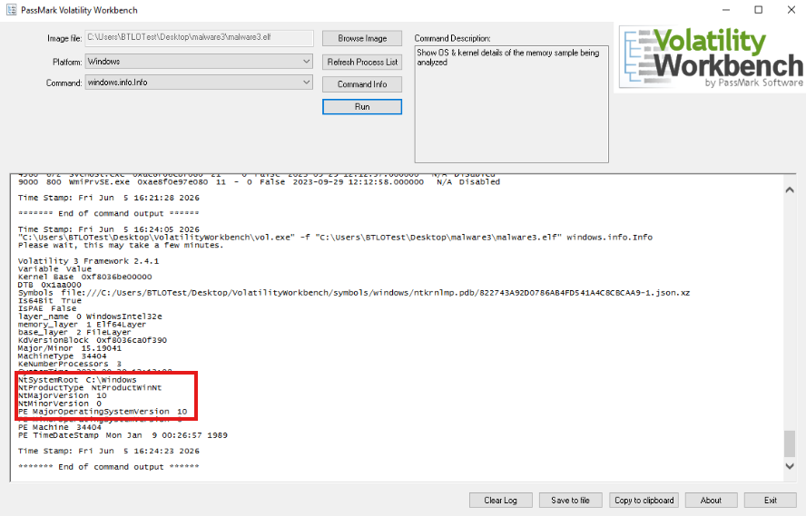
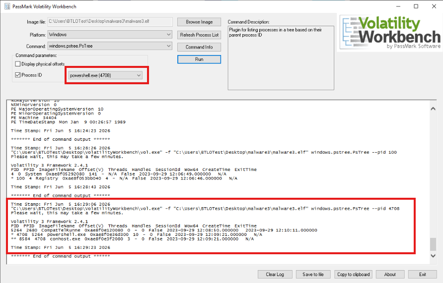
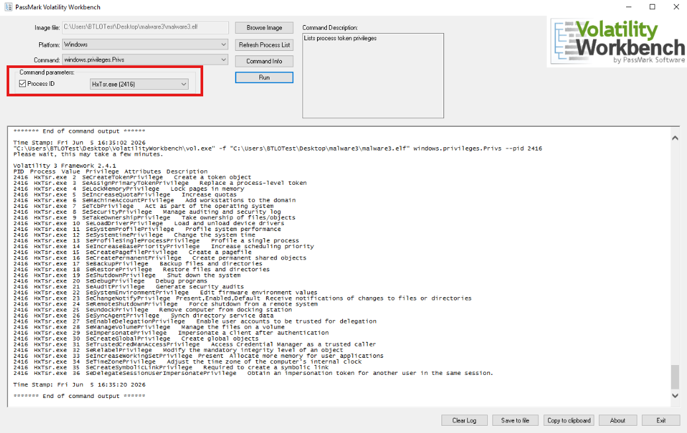
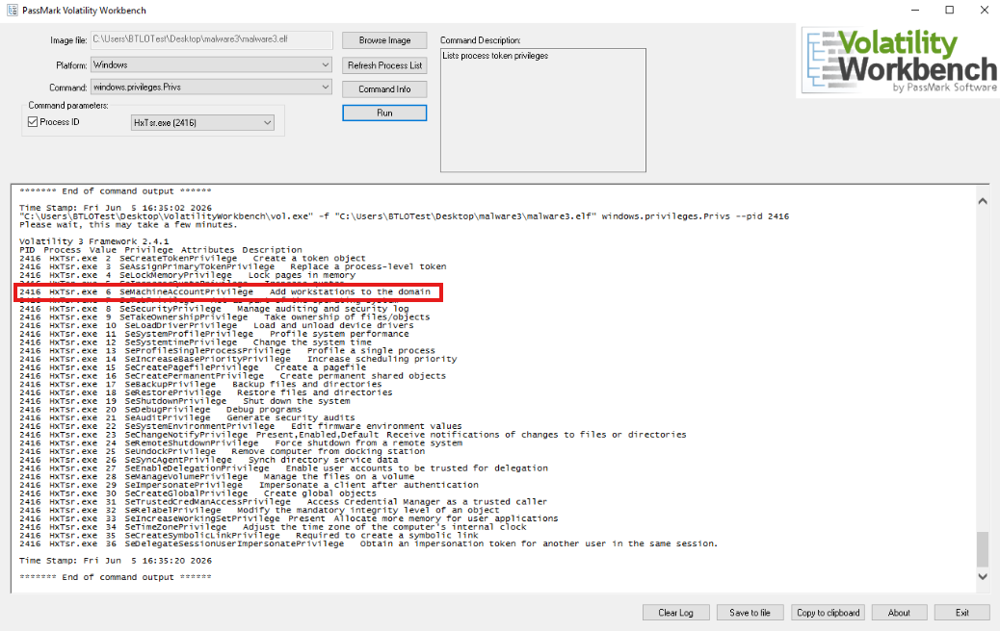
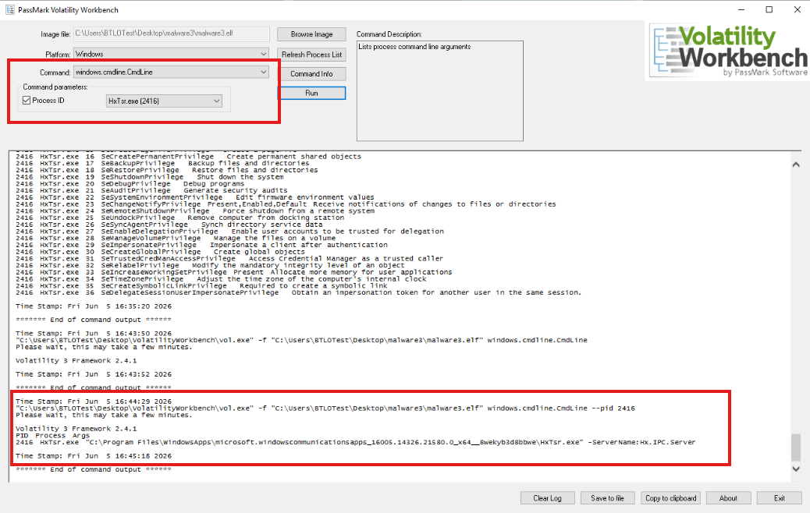

# Memory Forensics and Process Analysis Using Volatility 3 Workbench

### Overview

This workflow demonstrates practical memory forensics and host-based process analysis using **Volatility 3 Workbench** to examine a Windows memory image.

In this investigation, I will be analyzing a captured memory image to identify operating system information, enumerate active processes, inspect process relationships, review process privileges, and examine command-line arguments associated with a specific process. The goal is not only to answer the required investigation questions, but to understand how memory artifacts can support endpoint triage, host investigation, and incident response activity.

The scenario is that a memory image has been provided for analysis. I am responsible for loading the memory image into Volatility Workbench, selecting the appropriate plugins, filtering the results where needed, and interpreting the artifacts recovered from memory.

This project focused on analyzing a Windows memory image to recover host-based artifacts related to process execution and system state.

This workflow demonstrates how multiple memory artifacts can be analyzed separately and then correlated together to better understand activity on a Windows host.

> **Workflow vs Execution vs Writeup (Terminology Used Here)**  
> - **Workflows** refer to operational threat intelligence tasks such as ransomware research, ATT&CK mapping analysis, IOC review, and adversary investigation.  
> - **Executions** refer to hands-on use of MISP to perform event searches, review indicators, analyze tags and galaxies, and pivot through related intelligence.  
> - **Writeups** document investigative findings, analyst reasoning, intelligence pivots, and threat research conclusions.

> 👉 For a **detailed, step-by-step walkthrough of how this workflow was executed — complete with screenshots**, see the **[Step-by-Step Execution](#step-by-step-execution)** section below.

---

### Purpose and Analyst Focus

#### ▶ Purpose

The purpose of this workflow is to demonstrate how memory artifacts can be used to analyze process activity on a Windows system.

Rather than treating each plugin as an isolated command, this workflow uses Volatility output as evidence. Each plugin contributes a different part of the host investigation.

For example:

- Process enumeration helped identify what plugin Workbench uses when refreshing the process list.
- Operating system metadata helped determine the Windows version.
- Process tree analysis helped identify the parent process of PowerShell.
- Privilege analysis helped identify the attribute associated with a specific process capability.
- Command-line analysis helped identify a server name used by a process during execution.

This type of artifact correlation is important because a process name alone rarely tells the full story. Analysts often need to understand the process name, process ID, parent process, privileges, command-line arguments, and surrounding context before reaching a reliable conclusion.

#### ▶ Analyst Focus

The analyst focus is on understanding what evidence can be extracted from memory and how that evidence supports endpoint triage.

This includes:

- understanding what a memory image is,
- understanding what Volatility Workbench is used for,
- loading a memory image into Volatility Workbench,
- changing file type filters when a memory image does not appear in the file picker,
- refreshing the process list,
- recognizing which plugin Workbench runs in the background,
- identifying Windows operating system information from memory,
- understanding what a Process ID (PID) is,
- using PID filters to reduce output noise,
- analyzing process parent-child relationships,
- understanding why PowerShell process lineage matters,
- reviewing process privileges,
- understanding what privilege attributes represent,
- selecting a plugin to inspect command-line arguments,
- identifying runtime server values from command-line output,
- documenting process-based findings in a repeatable memory analysis workflow.

The goal is not just to click through Volatility Workbench and copy values. The goal is to understand what each plugin proves, what it does not prove, and why the next step in the workflow makes sense.

---

### What This Workflow Demonstrates

This workflow demonstrates how to:

- Open Volatility Workbench.
- Load a memory image into the application.
- Adjust the file picker to show all file types.
- Select and load an ELF memory image.
- Refresh the process list.
- Identify the plugin used by Volatility Workbench for process enumeration.
- Run `windows.info.Info` to recover system metadata.
- Interpret Windows version information from memory.
- Run `windows.pstree.PsTree` to review process hierarchy.
- Use the Process ID filter to reduce output noise.
- Identify the parent process of `PowerShell.exe`.
- Run `windows.privileges.Privs` to review process privileges.
- Interpret the relationship between privilege descriptions and privilege attributes.
- Run `windows.cmdline.CmdLine` to review command-line arguments.
- Identify a server name from process command-line output.
- Correlate process enumeration, process hierarchy, privileges, and command-line evidence.

This workflow also demonstrates an important endpoint investigation concept: memory artifacts can provide runtime context that may not be obvious from disk alone. Process names, parent processes, privileges, and command-line arguments are most useful when interpreted together.

---

### Investigation and Memory Forensics Relevance

Memory images are valuable because they capture the active state of a system. While disk artifacts show what is stored, memory artifacts can show what was running.

During incident response, this distinction is important.

A suspicious process may no longer exist on disk, but it may still be visible in memory. A malicious command may not be saved in a script file, but the command-line arguments may be recoverable from memory. A process may look normal by name, but its parent process or privileges may make it worth further investigation.

The table below summarizes the role of each artifact source in this workflow:

| Artifact | What It Can Reveal | Why It Matters |
|---|---|---|
| Process List | Active processes in memory | Helps establish what was running when memory was captured |
| Operating System Metadata | Windows version and system information | Helps confirm the target environment being analyzed |
| Process Tree | Parent-child process relationships | Helps determine how a process was launched |
| Process Privileges | Privileges assigned to a process token | Helps identify what actions a process may be allowed to perform |
| Command-Line Arguments | Runtime execution parameters | Helps reveal files, servers, flags, scripts, or configuration values used by a process |

These artifacts are useful because they support different investigative questions:

- What processes were running?
- What Windows version was the system using?
- Which process launched PowerShell?
- What privileges were assigned to a process?
- What command-line arguments were used?
- What runtime server value was referenced by the process?
- How do these artifacts support a process investigation?

By moving from process enumeration to operating system information, process tree analysis, privilege review, and command-line inspection, the workflow follows a logical host investigation path:

1. Load the memory image.
2. Confirm process enumeration works.
3. Identify the operating system.
4. Review process relationships.
5. Inspect process privileges.
6. Examine process execution context.
7. Correlate findings.

> **Note:** Relationship to Memory Forensics and Host Analysis:
>
> Memory forensics focuses on analyzing volatile memory, also known as RAM. RAM stores information that a running system needs to access quickly. This can include running processes, command-line arguments, network connections, encryption keys, user sessions, loaded DLLs, injected code, and other runtime data.
>
> Unlike disk-based artifacts, memory artifacts represent what was active on the system at or near the time the memory image was captured. This makes memory analysis especially useful when investigating malware execution, suspicious PowerShell activity, unauthorized processes, credential theft, privilege abuse, and short-lived activity that may not leave obvious files on disk.
>
> In a real-world investigation, memory would normally be acquired from a system using a trusted memory acquisition tool. The acquired memory image would then be analyzed separately so the original system evidence is preserved.

The artifacts examined in this workflow come from a Windows memory image and are parsed using Volatility plugins. For example:

| Artifact | What It May Contain |
|---|---|
| Process List | Processes active at the time memory was captured |
| Operating System Metadata | Windows version, kernel information, system paths, architecture details |
| Process Tree | Parent-child process relationships and execution lineage |
| Process Privileges | Token privileges assigned to a process |
| Command-Line Arguments | Runtime parameters used when a process was launched |

> **Note:** This workflow focuses on memory analysis and host investigation. It does not cover memory acquisition, malware reverse engineering, disk imaging, or timeline reconstruction from disk artifacts. The goal is to use the provided memory image to extract and interpret process-related evidence.

The workflow focuses on five main areas of analysis within Volatility Workbench:

- Process enumeration
- Operating system identification
- Process hierarchy analysis
- Process privilege analysis
- Command-line argument analysis

Together, these artifacts provide useful insight into system state, process execution, process relationships, and runtime behavior.

---

### Environment and Execution Context

This section documents the tools, evidence sources, and execution environment used during the workflow.

**Note:** Each section is collapsible. Click the ▶ arrow to expand and view details on software, evidence sources, workflow scope, and the high-level execution map.

<details>
<summary><strong>▶ Environment & Platform</strong><br>
</summary><br>

The workflow was performed in a Windows-based analysis environment.

Volatility Workbench was opened from the Desktop.

The provided memory image was located in:

```text
Desktop\Malware3
```

The memory image analyzed was:

```text
malware3.elf
```

Because the memory image used an `.elf` extension, the file picker needed to be adjusted to show:

```text
Any File
```

This allowed the image to appear in the file selection window.

</details>

<details>
<summary><strong>▶ Evidence Sources Reviewed</strong><br>
</summary><br>

The primary evidence source reviewed was:

| Evidence Source | Purpose |
|---|---|
| `malware3.elf` | Memory image analyzed using Volatility Workbench |

The memory image was used to recover process and operating system artifacts.

The following memory artifact categories were reviewed:

| Artifact Category | Purpose |
|---|---|
| Process list | Identify active processes |
| Operating system metadata | Determine Windows version |
| Process tree | Identify parent-child process relationships |
| Process privileges | Identify privilege attributes associated with a process |
| Command-line arguments | Identify runtime parameters used by a process |

Each evidence source contributed a different part of the overall host investigation.

</details>

<details>
<summary><strong>▶ Tooling Used</strong><br>
</summary><br>

The primary tool used during execution was:

- **Volatility Workbench** — a graphical interface for running Volatility plugins against memory images. Volatility is used to extract host artifacts from memory, including process listings, operating system metadata, parent-child process relationships, privileges, command-line arguments, loaded modules, network connections, and other runtime evidence.

The Volatility plugins used during this workflow included:

| Plugin | Purpose |
|---|---|
| `windows.pslist.PsList` | Enumerate active processes |
| `windows.info.Info` | Recover Windows system information |
| `windows.pstree.PsTree` | Display process parent-child relationships |
| `windows.privileges.Privs` | Review process token privileges |
| `windows.cmdline.CmdLine` | Review process command-line arguments |

</details>

<details>
<summary><strong>▶ Workflow Map (High-Level)</strong><br>
</summary><br>

1. Open the `VolatilityWorkbench` folder on the Desktop.
2. Launch the `VolatilityWorkbench` application.
3. Click `Browse Image`.
4. Navigate to `Desktop > Malware3`.
5. Change the file type selector to `Any File`.
6. Select `malware3.elf`.
7. Click `Open`.
8. Click `Refresh Process List`.
9. Identify the plugin Workbench uses for process enumeration.
10. Select `windows.info.Info`.
11. Review operating system metadata.
12. Identify the Windows version.
13. Select `windows.pstree.PsTree`.
14. Enable the Process ID filter.
15. Select `PowerShell.exe (PID 4708)`.
16. Identify the parent process of PowerShell.
17. Select `windows.privileges.Privs`.
18. Enable the Process ID filter.
19. Select `HxTsr.exe (PID 2416)`.
20. Identify the privilege attribute associated with adding workstations to a domain.
21. Select `windows.cmdline.CmdLine`.
22. Enable the Process ID filter.
23. Select `HxTsr.exe (PID 2416)`.
24. Identify the server name parsed by the executable.
25. Summarize and correlate findings.

1. The investigation began by opening Volatility Workbench and loading the provided memory image. A memory image is a captured copy of volatile memory from a system. Before it can be analyzed, the image needs to be selected and loaded into an analysis tool.

<blockquote>
This matters because memory evidence is not directly readable in the same way as a normal text file or spreadsheet. Volatility parses the memory image and extracts structured artifacts, such as processes, command lines, privileges, and operating system metadata.
</blockquote>

2. The investigation then moved into process enumeration by refreshing the process list. Process enumeration is often one of the first steps in memory analysis because it shows what was running when memory was captured.

<blockquote>
This matters because suspicious activity often appears as a process, a child process, or an unusual execution chain. Even legitimate Windows processes can become relevant if they spawn suspicious children or run with unexpected arguments.
</blockquote>

3. Operating system information was reviewed using the `windows.info.Info` plugin. This helped identify the Windows version associated with the memory image.

4. Process hierarchy was reviewed using the `windows.pstree.PsTree` plugin. This helped identify the parent process of `PowerShell.exe`.

5. Process privileges were reviewed using the `windows.privileges.Privs` plugin. This helped identify the privilege attribute associated with the ability to add workstations to a domain.

6. Finally, command-line arguments were examined using the `windows.cmdline.CmdLine` plugin. This helped identify the server name parsed by the executable associated with process ID `2416`.

</details>

---

### Step-by-Step Execution

This section documents the workflow in the same order an analyst would realistically perform memory-based process analysis.

The workflow begins with loading the memory image because Volatility Workbench needs a memory source before any plugins can be executed. It then moves into process enumeration, operating system identification, process hierarchy analysis, privilege analysis, and command-line review.

**Note:** Each section is collapsible. Click the ▶ arrow to expand and view the detailed steps.

<details>
<summary><strong>▶ Phase 1 — Load the Memory Image into Volatility Workbench</strong><br>
→ preparing memory evidence for analysis
</summary><br>

This phase focused on loading the provided memory image into Volatility Workbench.

<blockquote>
I started by loading the memory image because Volatility cannot analyze process artifacts until it has a memory source. A memory image contains a snapshot of volatile memory from a system. Volatility parses that image and reconstructs artifacts such as processes, command lines, privileges, and system metadata.
</blockquote>

##### 🔷 Phase 1.1 — Open the VolatilityWorkbench folder

I began by opening the `VolatilityWorkbench` folder on the Desktop.

Inside the folder, I launched the Volatility Workbench application by double-clicking the executable.

This opened the graphical interface used to select a memory image and run Volatility plugins.

<blockquote>
Volatility can be run from the command line, but Volatility Workbench provides a graphical interface. This makes it easier to select plugins from a dropdown menu, filter by Process ID, and review output without manually typing every command.
</blockquote>

##### 🔷 Phase 1.2 — Browse for the memory image

Once Volatility Workbench opened, I clicked `Browse Image`. This opened a file picker window. I then navigated to:

```text
Desktop > Malware3
```

At first, the memory image did not appear in the file picker. This happened because the file picker was not showing all file types. To fix this, I changed the file type selector in the bottom-right corner to:

```text
Any File
```

After changing the filter, the memory image became visible.

<p align="left">
  <br>
  <em>Figure 1: Changing the file type filter to Any File so the memory image becomes visible.</em>
</p>

> **Note:** Why the file type filter matters:
>
> Some tools only display certain file extensions by default. If a memory image uses an extension that the file picker is not currently filtering for, the file may appear to be missing even though it is present.
>
> In this workflow, the memory image used the `.elf` extension:
>
> ```text
> malware3.elf
> ```
>
> Changing the filter to `Any File` allowed the file picker to display it.

##### 🔷 Phase 1.3 — Select the memory image

After the memory image became visible, I selected `malware3.elf` and clicked `Open`. This loaded the memory image into Volatility Workbench.


<p align="left">
  <br>
  <em>Figure 2: Selecting the malware3.elf memory image for analysis.</em>
</p>

At this point, the memory image was selected, but process information still needed to be populated.

##### 🔷 Phase 1.4 — Refresh the process list

Before starting plugin-based analysis, I clicked `Refresh Process List`. This action allowed Workbench to identify processes from the loaded memory image and populate the process-related dropdown menus.

<p align="left">
  <br>
  <em>Figure 3: Refreshing the process list after loading the memory image.</em>
</p>

<blockquote>
Refreshing the process list matters because several later steps use the Process ID dropdown to filter output. If the process list is not refreshed first, the dropdown may not contain the processes recovered from the memory image.
</blockquote>

##### 🔷 Phase 1.5 — Understand what a PID is

A Process ID, or PID, is a numeric identifier assigned to a process by the operating system.

For example:

```text
PowerShell.exe (PID 4708)
HxTsr.exe (PID 2416)
```

PIDs are useful because process names are not always unique. A system can have multiple instances of the same executable name running at the same time. For example, there may be multiple instances of:

```text
svchost.exe
chrome.exe
powershell.exe
```

The PID helps the analyst identify the exact process instance being reviewed.

##### 🔷 Phase 1.6 — Phase 1 findings

The memory image was successfully loaded into Volatility Workbench.

| Item | Finding |
|---|---|
| Tool used | Volatility Workbench |
| Memory image | `malware3.elf` |
| Evidence location | `Desktop > Malware3` |
| Required file filter | `Any File` |
| Initial preparation step | `Refresh Process List` |

</details>

<details>
<summary><strong>▶ Phase 2 — Enumerate Active Processes</strong><br>
→ identifying which Volatility plugin Workbench uses to refresh the process list
</summary><br>

This phase focused on understanding what happens when the process list is refreshed in Volatility Workbench.

<blockquote>
Process enumeration is one of the most common starting points in memory analysis. Before investigating specific behavior, an analyst usually needs to understand what processes were active at the time memory was captured.
</blockquote>

##### 🔷 Phase 2.1 — Understand process enumeration

Process enumeration means listing processes that were active on the system when the memory image was captured.

In memory analysis, process enumeration can help identify:

- normal system processes,
- user-launched applications,
- suspicious process names,
- unusual process locations,
- unexpected process relationships,
- malware execution,
- living-off-the-land activity,
- processes that may require deeper review.

In Volatility, process enumeration is commonly performed using a plugin that extracts process information from Windows memory structures.

##### 🔷 Phase 2.2 — Review the Workbench output
 
After clicking `Refresh Process List`, I reviewed the main output window in Volatility Workbench. The output showed that Workbench was running:

```text
windows.pslist.PsList
```

<p align="left">
  <br>
  <em>Figure 4: Identifying the plugin used by Workbench when refreshing the process list.</em>
</p>

##### 🔷 Phase 2.3 — Understand what windows.pslist does

The `windows.pslist.PsList` plugin lists active processes found in memory.

This is similar in purpose to viewing processes in Task Manager, but there is an important difference.

Task Manager shows what is currently running on a live system. Volatility analyzes a captured memory image and reconstructs what was running at the time of acquisition.

This matters because the analyst may not have access to the live system anymore. Memory analysis allows the analyst to inspect the state of the machine after the fact.

##### 🔷 Phase 2.4 — Interpret the plugin name

The plugin name can be broken down as:

| Component | Meaning |
|---|---|
| `windows` | The plugin is designed for Windows memory images |
| `pslist` | The plugin lists processes |
| `PsList` | The plugin class or command being executed |

The format is usually `Command.command`. Based on the Workbench output, the plugin used was `windows.pslist.PsList`.


##### 🔷 Phase 2.5 — Phase 2 findings

| When refreshing the process list, the plugin Volatility is actually using is `windows.pslist.PsList`

<blockquote>
This phase confirmed that the Refresh Process List button is not a separate analysis technique. It is a graphical shortcut that runs Volatility's process listing plugin against the loaded memory image.
</blockquote>

</details>

<details>
<summary><strong>▶ Phase 3 — Identify Operating System Information</strong><br>
→ determining the Windows version from memory
</summary><br>

This phase focused on identifying operating system information using the `windows.info.Info` plugin.

<blockquote>
Before interpreting process activity, it is useful to identify the operating system associated with the memory image. Windows version information can affect artifact locations, process behavior, plugin output, and how an analyst interprets findings.
</blockquote>

##### 🔷 Phase 3.1 — Select the windows.info.Info plugin

In Volatility Workbench, I selected the plugin from the dropdown list `windows.info.Info`. Then, I clicked `Run`.

This plugin extracts operating system and kernel-related metadata from the memory image.

##### 🔷 Phase 3.2 — Run the plugin and review output

After selecting the plugin, I ran it and reviewed the output.

The relevant lines included:

```text
SystemRoot
MajorOperatingSystemVersion
```

<p align="left">
  <br>
  <em>Figure 5: Reviewing operating system metadata using windows.info.Info.</em>
</p>

##### 🔷 Phase 3.3 — Understand the relevant fields

The output contained information similar to:

```text
SystemRoot: C:\Windows
MajorOperatingSystemVersion: 10
```

- The `SystemRoot` value shows the Windows installation directory.
- The `MajorOperatingSystemVersion` value helps identify the Windows version family.

In this case, the major version value was `10`.

##### 🔷 Phase 3.4 — Interpret the Windows version

Combining the Windows system root with the major operating system version indicated that the memory image was taken from a `Windows 10` system.

<blockquote>
This finding establishes the operating system context for the rest of the workflow. Since the memory image came from Windows 10, the Windows-specific Volatility plugins selected throughout the investigation are appropriate.
</blockquote>

##### 🔷 Phase 3.5 — Phase 3 findings

| Question | Finding |
|---|---|
| What version of the Windows Operating system is being used on the system the memorydump is taken from? | `Windows 10` |

<blockquote>
This phase showed how system metadata recovered from memory can be used to identify the operating system being analyzed. This is a foundational step because it helps ensure the analyst is interpreting later artifacts in the correct system context.
</blockquote>

</details>

<details>
<summary><strong>▶ Phase 4 — Analyze Process Relationships</strong><br>
→ identifying the parent process of PowerShell.exe
</summary><br>

This phase focused on using process tree analysis to determine which process launched `PowerShell.exe`.

<blockquote>
PowerShell is a legitimate Windows tool, but it is also frequently used during administration, automation, incident response, and attacker activity. Because of this, analysts often review PowerShell execution carefully. One of the first questions to ask is: what launched it?
</blockquote>

##### 🔷 Phase 4.1 — Understand process trees

- A process tree shows parent-child relationships between processes.
- A parent process is the process that launched another process.
- A child process is the process that was launched.

For example:

```text
parent.exe
└── child.exe
```

This relationship can provide important investigative context.

If PowerShell is launched by a normal administrative console, that may suggest one type of activity. If PowerShell is launched by a suspicious document, browser process, script host, or unexpected binary, that may suggest another.

##### 🔷 Phase 4.2 — Select the windows.pstree.PsTree plugin

In Volatility Workbench, I selected:

```text
windows.pstree.PsTree
```

This plugin displays processes in a tree format, making it easier to identify parent-child relationships.

##### 🔷 Phase 4.3 — Use the Process ID filter

Because process tree output can contain many entries, I used the Process ID filter to reduce noise. I clicked the Process ID checkbox and selected: `PowerShell.exe (PID 4708)`. Using the PID filter helped focus the output on the relevant process.

<p align="left">
  <br>
  <em>Figure 6: Filtering the process tree output to focus on PowerShell.exe.</em>
</p>

> **Note:** Why filtering by PID matters:
>
> Process tree output can be noisy because a Windows system normally runs many processes. Filtering by PID helps narrow the analysis to the process being investigated.
>
> This is especially important when a process name may appear more than once. The PID identifies the exact process instance.

##### 🔷 Phase 4.4 — Review the process hierarchy

The output showed the parent-child relationship associated with `PowerShell.exe`.

The relevant relationship was:

```text
5264 CompatTelRunner.exe
└── 4708 PowerShell.exe
```

This means the parent process of `PowerShell.exe` was `CompatTelRunner.exe` with PID `5264`.


##### 🔷 Phase 4.5 — Interpret the finding

In the Workbench output, the process name may appear shortened because of column width limitations, such as:

```text
CompatTelRunne
```

However, the intended process name is:

```text
CompatTelRunner.exe
```

<blockquote>
This phase did not require proving whether the PowerShell execution was malicious. The specific task was to identify PowerShell's parent process. In a real investigation, this relationship would be a starting point for deeper review.
</blockquote>

##### 🔷 Phase 4.6 — Phase 4 findings

| Question | Finding |
|---|---|
| What is the parent process of PowerShell.exe? | `5264, CompatTelRunner.exe` |

<blockquote>
This phase demonstrated how process tree analysis can provide execution context. Instead of only seeing that PowerShell was running, the process tree showed which process launched it.
</blockquote>

</details>

<details>
<summary><strong>▶ Phase 5 — Review Process Privileges</strong><br>
→ identifying the privilege attribute associated with a process capability
</summary><br>

This phase focused on reviewing privileges associated with process ID `2416`.

<blockquote>
Process privileges are important because they define what actions a process may be allowed to perform. A process name alone does not reveal what capabilities the process has. Privilege analysis helps show what the process can potentially do.
</blockquote>

##### 🔷 Phase 5.1 — Understand Windows process privileges

Windows uses access tokens to represent the security context of a process or thread. A process token can contain privileges. Privileges define specific system-level capabilities, such as:

- shutting down the system,
- debugging other processes,
- changing system time,
- loading drivers,
- backing up files,
- restoring files,
- adding workstations to a domain.

Not every privilege is enabled or actively used, but reviewing privileges helps an analyst understand what capabilities are associated with a process.

##### 🔷 Phase 5.2 — Select the windows.privileges.Privs plugin

In Volatility Workbench, I selected the privileges plugin:

```text
windows.privileges.Privs
```

This plugin reviews privileges associated with processes recovered from memory.

##### 🔷 Phase 5.3 — Filter to process ID 2416

Process privilege output can contain entries for many different processes recovered from memory. Rather than reviewing every process individually, I narrowed the analysis to a single process so the privileges could be examined in greater detail.

During the review, the process `HxTsr.exe (PID 2416)` was selected for further analysis. To reduce noise in the output, I enabled the Process ID filter and selected: `HxTsr.exe (2416)`.

<p align="left">
  <br>
  <em>Figure 7: Filtering privilege output to process ID 2416.</em>
</p>

##### 🔷 Phase 5.4 — Review the privilege output

After running the plugin against the selected process, I reviewed the privilege information returned by Volatility.

The output displayed several columns, including:
- Process ID
- Process Name
- Privilege Value
- Privilege Attribute
- Description

Each row represented a privilege associated with the process token. At this stage, I was not looking for every privilege assigned to the process. Instead, I reviewed the privilege descriptions to identify any entries related to domain administration or workstation management.

This approach is useful because privilege output often contains numerous entries. Reviewing the human-readable descriptions first makes it easier to locate the capability being investigated before identifying the corresponding privilege attribute.

While reviewing the output, I located the description:

```text
Add workstations to the domain
```

The corresponding privilege attribute shown in the output was:

```text
SeMachineAccountPrivilege
```

<p align="left">
  <br>
  <em>Figure 8: Locating the privilege description.</em>
</p>

##### 🔷 Phase 5.5 — Understand the privilege attribute

The description was:

```text
Add workstations to the domain
```

The attribute name was:

```text
SeMachineAccountPrivilege
```

The attribute is the technical Windows privilege name. The description is the human-readable explanation of what the privilege allows.

This distinction matters because security tools and Windows internals often use the attribute name rather than the friendly description.

##### 🔷 Phase 5.6 — Interpret the finding carefully

The presence of a privilege does not automatically prove abuse.

It shows that the process token contains that privilege. In a real investigation, the analyst would need additional evidence to determine whether the privilege was used suspiciously.

For this workflow, the task was specifically to identify the attribute associated with the described privilege.

##### 🔷 Phase 5.7 — Phase 5 findings

The process 2416 has the ability to Add Workstations to the Domain. The attribute associated with this privilege is `SeMachineAccountPrivilege`

<blockquote>
This phase demonstrated how memory analysis can reveal process token privileges. Privilege information helps analysts understand the capabilities available to a process at runtime.
</blockquote>

</details>

<details>
<summary><strong>▶ Phase 6 — Examine Command-Line Arguments</strong><br>
→ identifying the server name parsed by process 2416
</summary><br>

This phase focused on examining command-line arguments associated with process ID `2416`.

<blockquote>
Command-line arguments are often one of the most useful process artifacts during endpoint investigations. A process name may look normal, but the command line can reveal what files, servers, scripts, flags, or configuration values were used during execution.
</blockquote>

##### 🔷 Phase 6.1 — Understand command-line arguments

A command line is the full command used to launch a process.

It can include:

- the executable path,
- switches,
- parameters,
- server names,
- file paths,
- scripts,
- URLs,
- configuration values.

For example, a process name alone may be:

```text
example.exe
```

But its command line may show:

```text
example.exe -server internal.service.local -config settings.json
```

The second version provides much more investigative context.

##### 🔷 Phase 6.2 — Select a relevant plugin

To analyze command-line arguments, I selected:

```text
windows.cmdline.CmdLine
```

This plugin recovers command-line information for processes from memory. The plugin was appropriate because the question asked for a server name being parsed in the executable's command.

##### 🔷 Phase 6.3 — Focus the analysis on the selected process

Privilege analysis provided insight into the capabilities associated with HxTsr.exe, but privileges alone do not explain how a process was executed or what values it may have been interacting with at runtime.

Maintaining focus on the same process allows related artifacts to be correlated more easily. Rather than switching to a different process, I used command-line analysis to examine additional execution details associated with HxTsr.exe.

To reduce noise in the output, I enabled the Process ID filter and selected: `HxTsr.exe (2416)`.

<p align="left">
  <br>
  <em>Figure 9: Reviewing command-line arguments for process ID 2416.</em>
</p>

##### 🔷 Phase 6.4 — Review the command-line output

The command-line output contained a server name value:

```text
HX.IPC.Server
```

This value appeared in the command-line arguments associated with:

```text
HxTsr.exe
```

##### 🔷 Phase 6.5 — Interpret the server name

The recovered server name was:

```text
HX.IPC.Server
```

This value is important because it provides runtime context about what the process was referencing.

In an investigation, command-line values like this may be useful for identifying:

- inter-process communication names,
- named server values,
- service references,
- configuration parameters,
- internal application behavior,
- potential suspicious execution context.

##### 🔷 Phase 6.6 — Phase 6 findings

The server name the executable is parsing in its command was `HX.IPC.Server`.

<blockquote>
This phase demonstrated why command-line analysis is valuable. The process name identified the executable, but the command-line arguments revealed the specific server value being parsed during execution.
</blockquote>

</details>

---

### Artifact Correlation

The most important part of this workflow was not simply collecting separate answers. The stronger investigative value came from correlating memory artifacts together.

Each Volatility plugin answered a different part of the host investigation.

#### Process Enumeration Artifacts

Process enumeration showed that Volatility Workbench used the following plugin when refreshing the process list:

```text
windows.pslist.PsList
```

This artifact helped answer:

- What plugin is Workbench running behind the scenes?
- What processes were available for selection?
- What process IDs could be used for filtering?

Process enumeration is important because it establishes the initial view of active processes recovered from the memory image.

#### Operating System Artifacts

Operating system metadata showed that the memory image came from a:

```text
Windows 10
```

system.

This artifact helped answer:

- What operating system is being analyzed?
- Are Windows-specific plugins appropriate?
- What system context should be used when interpreting process artifacts?

Operating system context matters because plugin behavior, artifact meaning, and Windows internals can vary across versions.

#### Process Hierarchy Artifacts

Process tree analysis showed the relationship:

```text
5264 CompatTelRunner.exe
└── 4708 PowerShell.exe
```

This artifact helped answer:

- What process launched PowerShell?
- What is the parent-child relationship?
- What process lineage should be reviewed further?

Process hierarchy is useful because suspicious activity often becomes clearer when the analyst understands how a process was started.

#### Privilege Artifacts

Privilege analysis showed that process `2416`, identified as `HxTsr.exe`, had a privilege description related to:

```text
Add workstations to the domain
```

The associated privilege attribute was:

```text
SeMachineAccountPrivilege
```

This artifact helped answer:

- What privilege is associated with a specific process?
- What is the technical privilege attribute name?
- What capabilities may exist within the process token?

Privilege artifacts are useful because they help show what actions a process may be permitted to perform.

#### Command-Line Artifacts

Command-line analysis showed the server name:

```text
HX.IPC.Server
```

This artifact helped answer:

- What arguments were associated with the process?
- What server value was parsed by the executable?
- What runtime context was present beyond the process name?

Command-line artifacts are valuable because they can reveal details that are not visible from the process list alone.

#### Combined Interpretation

Memory investigations rarely rely on one artifact by itself.

Each artifact examined during this workflow answered a different question:

- **Process enumeration** identified the plugin used to populate process information.
- **Operating system metadata** identified the Windows version.
- **Process hierarchy** identified the parent process of PowerShell.
- **Privilege analysis** identified a specific Windows privilege attribute.
- **Command-line analysis** identified a server value used by a process.

When analyzed together, these artifacts supported the following activity reconstruction.

##### 1. The Memory Image Was Successfully Loaded and Parsed

The workflow began by loading:

```text
malware3.elf
```

into Volatility Workbench.

Changing the file picker to:

```text
Any File
```

was necessary because the memory image used an extension that may not appear under the default file filter.

After the image loaded, refreshing the process list allowed Workbench to enumerate processes from memory.

##### 2. Process Enumeration Was Performed Using windows.pslist

The Refresh Process List action ran:

```text
windows.pslist.PsList
```

This confirmed that Workbench was using Volatility's Windows process listing capability to populate process information.

This was important because it showed that the graphical button corresponded to a specific Volatility plugin.

##### 3. The System Was Identified as Windows 10

The `windows.info.Info` plugin recovered operating system metadata.

The relevant version information indicated:

```text
Windows 10
```

This established the system context for the rest of the analysis.

##### 4. PowerShell's Parent Process Was Identified

The `windows.pstree.PsTree` plugin showed that:

```text
PowerShell.exe
```

with PID:

```text
4708
```

was launched by:

```text
CompatTelRunner.exe
```

with PID:

```text
5264
```

This process relationship provided execution context for the PowerShell process.

##### 5. Process 2416 Had a Domain-Related Privilege Attribute

The `windows.privileges.Privs` plugin was used to review privileges for:

```text
HxTsr.exe (PID 2416)
```

The privilege description:

```text
Add workstations to the domain
```

mapped to the attribute:

```text
SeMachineAccountPrivilege
```

This finding showed how Volatility can recover process token privilege information from memory.

##### 6. Process 2416 Included a Server Name in Its Command Line

The `windows.cmdline.CmdLine` plugin was used to review command-line arguments for:

```text
HxTsr.exe (PID 2416)
```

The server name identified was:

```text
HX.IPC.Server
```

This showed how command-line artifacts can reveal execution details not visible from process names alone.

##### Overall Conclusion

No single plugin provided the full host investigation picture.

Instead, the investigation relied on correlating multiple memory artifacts:

| Artifact Type | Question Answered | Key Finding |
|---|---|---|
| Process Enumeration | What plugin refreshes the process list? | `windows.pslist.PsList` |
| Operating System Metadata | What Windows version was used? | `Windows 10` |
| Process Tree | What launched PowerShell? | `5264, CompatTelRunner.exe` |
| Process Privileges | What privilege attribute was associated with process 2416? | `SeMachineAccountPrivilege` |
| Command-Line Arguments | What server name was parsed by process 2416? | `HX.IPC.Server` |

Taken together, these artifacts demonstrated how memory analysis can be used to understand host state, process execution, process relationships, process capabilities, and runtime command-line context.

---

### Evidence Examination Summary

| Task | Artifact Source | Tool / Plugin | Finding |
|---|---|---|---|
| Load memory evidence | Memory image | Volatility Workbench | `malware3.elf` |
| Refresh process list | Process enumeration | `windows.pslist.PsList` | Process list populated |
| Identify process list plugin | Workbench output | `windows.pslist.PsList` | `windows.pslist.PsList` |
| Identify Windows version | OS metadata | `windows.info.Info` | `Windows 10` |
| Identify PowerShell parent process | Process hierarchy | `windows.pstree.PsTree` | `5264, CompatTelRunner.exe` |
| Identify privilege attribute | Process privileges | `windows.privileges.Privs` | `SeMachineAccountPrivilege` |
| Identify server name | Command-line arguments | `windows.cmdline.CmdLine` | `HX.IPC.Server` |

---

### What I Learned (Skills Demonstrated)

Through this workflow, I learned how to:

- Open Volatility Workbench.
- Load a memory image for analysis.
- Adjust file picker settings when an image does not appear.
- Understand what a memory image represents.
- Refresh the process list in Volatility Workbench.
- Identify which Volatility plugin is executed by a Workbench action.
- Understand what process enumeration is.
- Use `windows.pslist.PsList` to enumerate processes.
- Use `windows.info.Info` to identify operating system metadata.
- Interpret Windows version information from memory.
- Understand what PIDs are and why they matter.
- Use Process ID filters to reduce output noise.
- Use `windows.pstree.PsTree` to review process hierarchy.
- Identify the parent process of PowerShell.
- Understand why parent-child process relationships matter.
- Use `windows.privileges.Privs` to review process privileges.
- Distinguish between privilege descriptions and privilege attributes.
- Identify `SeMachineAccountPrivilege` from process privilege output.
- Use `windows.cmdline.CmdLine` to review command-line arguments.
- Identify runtime server values from command-line output.
- Correlate process enumeration, OS metadata, process hierarchy, privileges, and command-line artifacts.
- Document a repeatable memory analysis workflow.

This workflow strengthened my understanding that memory artifacts provide runtime visibility into a system. A process list can show what was running. A process tree can show how a process was launched. Privilege output can show what capabilities a process had. Command-line output can show how a process was executed. Correlating these artifacts together allows an analyst to understand host activity more clearly.

---

### Final Conclusion

This workflow demonstrated how Volatility Workbench can be used to analyze a Windows memory image and recover process-related artifacts.

The memory image `malware3.elf` was loaded into Volatility Workbench after changing the file picker to show `Any File`. The process list was refreshed, and Workbench showed that it was using the `windows.pslist.PsList` plugin for process enumeration.

Operating system metadata recovered with `windows.info.Info` identified the memory image as coming from a Windows 10 system.

Process hierarchy analysis using `windows.pstree.PsTree` showed that `PowerShell.exe` with PID `4708` was launched by `CompatTelRunner.exe` with PID `5264`.

Privilege analysis using `windows.privileges.Privs` showed that process `2416`, identified as `HxTsr.exe`, had the privilege description `Add workstations to the domain`, which corresponded to the attribute:

```text
SeMachineAccountPrivilege
```

Command-line analysis using `windows.cmdline.CmdLine` identified the server name parsed by the executable as:

```text
HX.IPC.Server
```

The final key findings were:

```text
Process Enumeration Plugin: windows.pslist.PsList
Operating System: Windows 10
PowerShell Parent Process: 5264, CompatTelRunner.exe
Privilege Attribute: SeMachineAccountPrivilege
Server Name: HX.IPC.Server
```

Together, these findings showed how memory forensics can provide visibility into active processes, operating system context, process lineage, process privileges, and command-line execution details.
