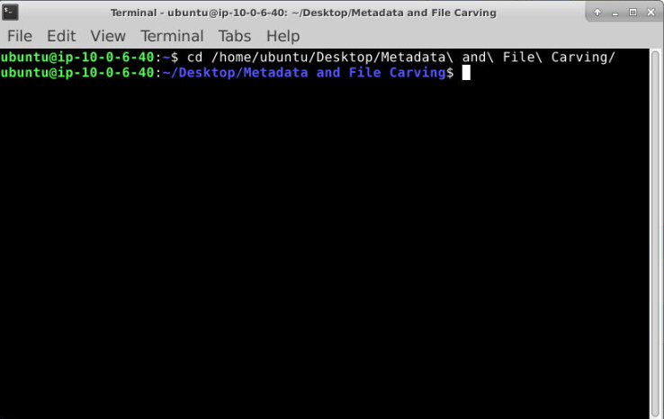
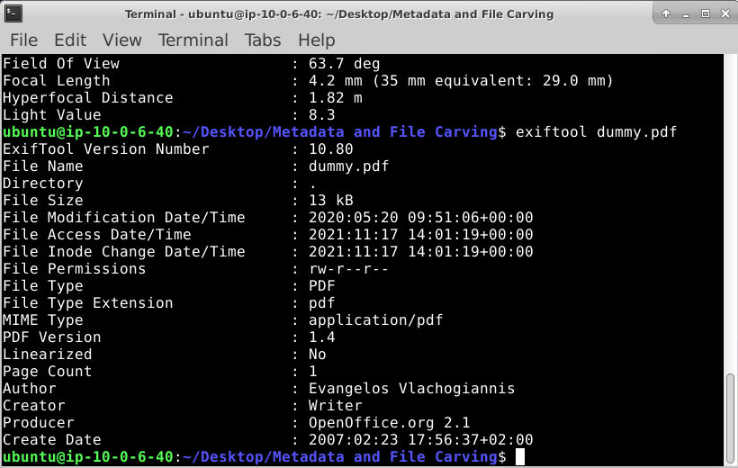
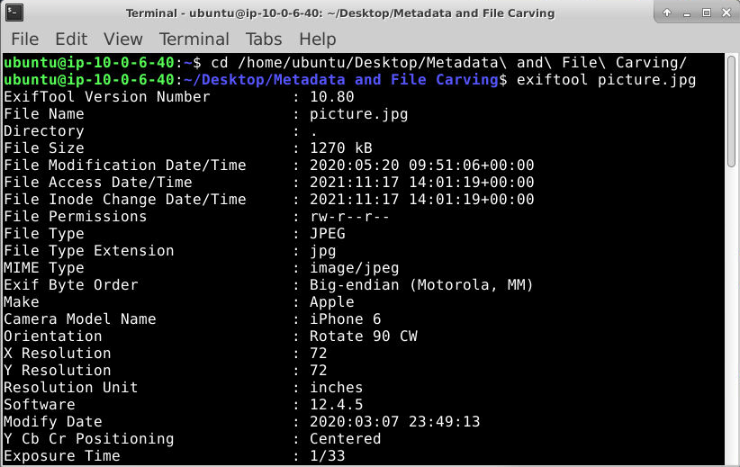
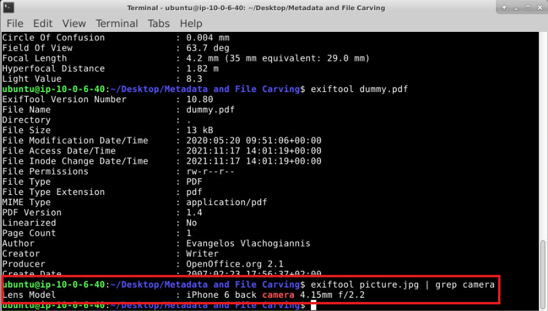
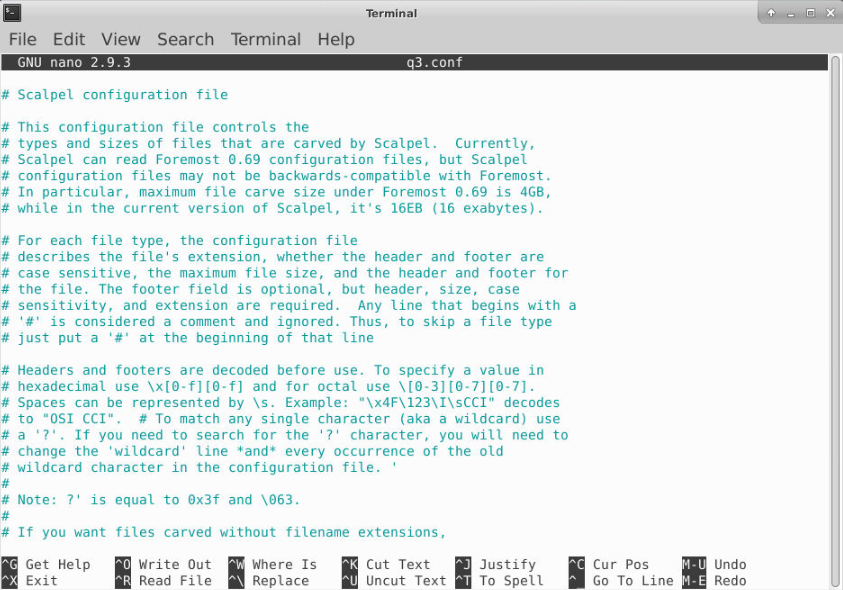
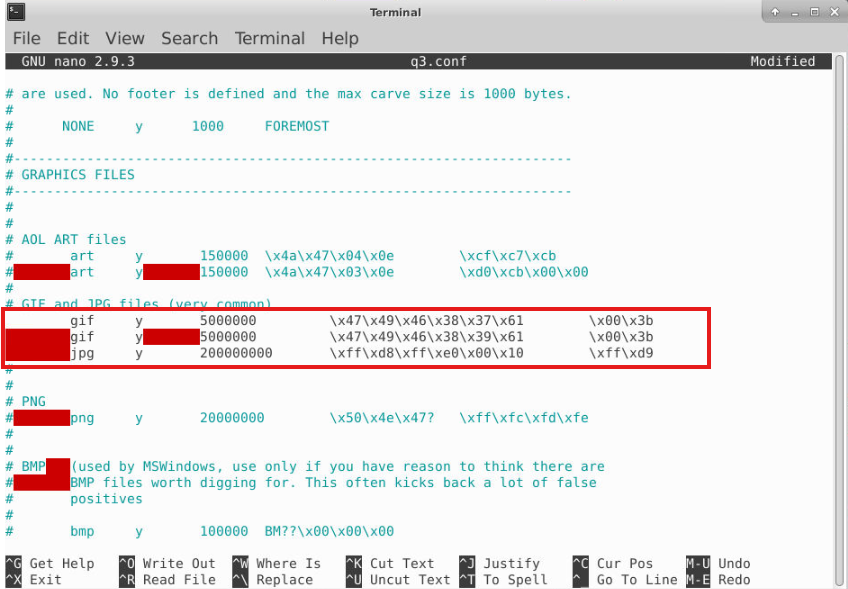
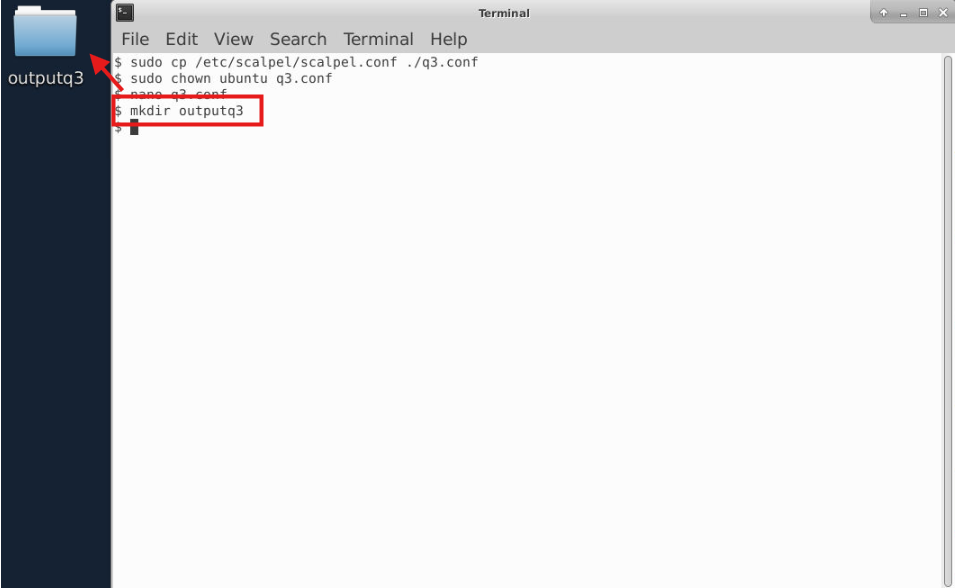
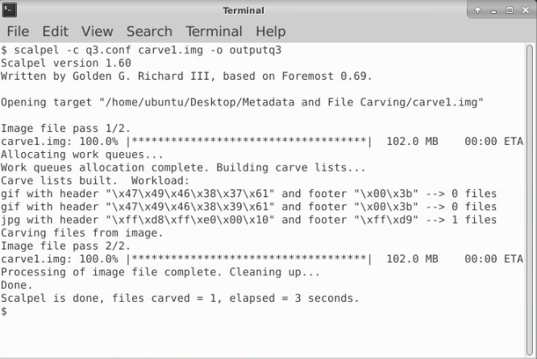
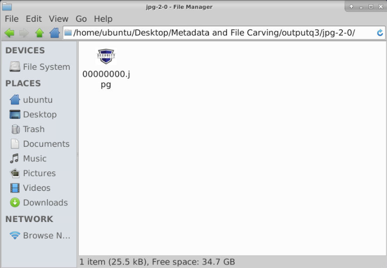
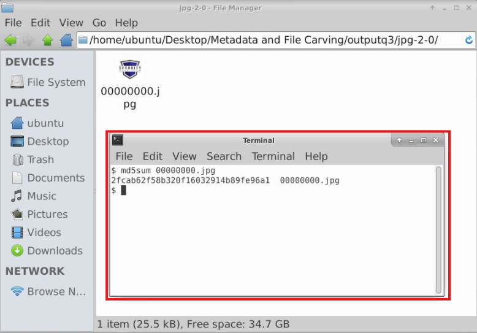

# Metadata Analysis and File Carving Using ExifTool and Scalpel

This workflow demonstrates practical digital forensic evidence examination using command-line tools to extract file metadata and recover deleted image data from a forensic disk image. The workflow focuses on using ExifTool to analyze metadata embedded in a PDF document and JPEG image, then using Scalpel to carve a deleted image from an NTFS-formatted memory stick image and validate the recovered artifact using an MD5 hash.

The main tools used are: **ExifTool**, **Scalpel**, **md5sum**, **nano**, and the Linux terminal. See **[Environment and Execution Context](#environment-and-execution-context)** section below.

### Overview

This project focused on two foundational digital forensic activities: metadata analysis and file carving.

The metadata portion involved examining `dummy.pdf` and `picture.jpg` using ExifTool. Metadata is information about a file rather than the visible contents of the file itself. For example, a PDF may contain author information, software information, timestamps, or document creation details. A JPEG image may contain embedded camera information, device details, timestamps, and other image-related metadata.

The file carving portion involved examining `carve1.img`, a disk image of a memory stick formatted with NTFS. The objective was to recover a deleted image using Scalpel, then calculate the MD5 hash of the recovered image. Unlike normal file browsing, file carving does not depend entirely on the file system showing a file in a directory. Instead, carving tools search raw storage data for recognizable file signatures and attempt to reconstruct files based on those patterns.

This workflow builds directly on the previous file system identification workflow. In that workflow, the focus was understanding how file systems such as NTFS, FAT32, and EXT3 organize evidence. In this workflow, that understanding becomes more practical: `carve1.img` is known to be NTFS-formatted, but the deleted image is recovered using carving methods rather than simply browsing visible files through the file system.

> **Workflow vs Execution vs Writeup (Terminology Used Here)**  
> - **Workflows** refer to repeatable digital forensic tasks such as metadata extraction, file carving, evidence recovery, and hash validation.  
> - **Executions** refer to the hands-on use of forensic tools such as ExifTool and Scalpel to analyze provided evidence files.  
> - **Writeups** document forensic observations, command usage, analyst reasoning, tool outputs, and evidence handling conclusions.

> 👉 For a **detailed, step-by-step walkthrough of how this workflow was executed — complete with screenshot placeholders**, see the **[Step-by-Step Execution](#step-by-step-execution)** section below.

---

### Purpose and Analyst Focus

#### ▶ Purpose

The purpose of this workflow is to demonstrate how metadata and deleted file artifacts can provide investigative value during digital forensic analysis.

The metadata exercises focus on identifying information embedded inside files. This matters because files often contain hidden or non-obvious information that may help identify who created a document, what software was used, what device captured an image, or when a file was created or modified.

The file carving exercise focuses on recovering a deleted image from an NTFS-formatted disk image using Scalpel. This matters because deleted files may not appear during normal browsing, but their raw data may still exist somewhere inside the storage image. File carving allows an examiner to search for recoverable content based on file signatures rather than relying entirely on the file system's active records.

#### ▶ Analyst Focus

The analyst focus is on understanding what evidence can be extracted from files and storage images using basic forensic methods.

This includes:

- using ExifTool to extract metadata from a PDF document,
- using ExifTool to extract camera metadata from a JPEG image,
- understanding why metadata can be useful during investigations,
- preparing a Scalpel configuration file for image carving,
- enabling specific file signatures for recovery,
- carving a deleted image from `carve1.img`,
- calculating an MD5 hash for the recovered image,
- documenting how the findings were produced and why they matter.

The goal is not just to run commands and record answers. The goal is to understand what each command reveals, why the tool is being used, and how the result supports a forensic conclusion.

---

### What This Workflow Demonstrates

This workflow demonstrates how to:

- Navigate to an evidence directory from the Linux terminal.
- Use ExifTool to extract metadata from a PDF file.
- Identify author metadata from a document.
- Use ExifTool to extract EXIF metadata from a JPEG image.
- Identify camera model metadata from an image file.
- Use command-line filtering to narrow metadata output.
- Prepare a Scalpel configuration file for file carving.
- Enable file signatures in the Scalpel configuration.
- Create a dedicated output directory for carved files.
- Recover deleted image data from a forensic disk image.
- Generate an MD5 hash of a recovered artifact.
- Explain how metadata analysis and file carving support forensic investigations.

This workflow also demonstrates the difference between visible file content, embedded metadata, file system records, and raw recoverable storage data. A file may contain visible content, hidden metadata, and recoverable remnants that are not immediately obvious through normal file browsing.

---

### Investigation and Digital Forensics Relevance

Metadata analysis and file carving are both common digital forensic techniques, but they answer different investigative questions.

Metadata analysis helps answer questions such as:

- Who created this file?
- What software created or modified it?
- What device captured this image?
- When was this file created or modified?
- Does the metadata reveal information that the visible file contents do not?

File carving helps answer a different set of questions:

- Does deleted data still exist inside the storage image?
- Can a file be recovered even if the file system no longer shows it?
- Are there file signatures in unallocated or raw storage areas?
- Can recovered files be validated using hashes?

These techniques matter because investigations often require more than reviewing visible files. Evidence may exist in metadata, deleted file remnants, unallocated space, slack space, or raw disk content.

This workflow is especially important because it connects three core forensic concepts:

| Concept | Meaning | Why It Matters |
|---|---|---|
| Metadata | Information about a file | Can reveal authorship, device, timestamp, or software details |
| File Carving | Recovering files from raw data based on signatures | Can recover deleted files without relying entirely on file system records |
| Hashing | Creating a unique fingerprint of a file | Helps validate and identify recovered evidence |

---

### Environment and Execution Context

This section documents the tools, evidence files, and execution environment used during the workflow.

**Note:** Each section is collapsible. Click the ▶ arrow to expand and view details on software, evidence files, workflow scope, and the high-level execution map.

<details>
<summary><strong>▶ Environment & Platform</strong><br>
</summary><br>

The workflow was performed from a Linux-based desktop environment using a terminal session.

The instructions required working from the following directory:

```text
/home/ubuntu/Desktop/Metadata and File Carving
```

The terminal session was opened from the taskbar or directly from the relevant folder depending on the file carving step being performed.

The evidence files were located inside the `Metadata and File Carving` directory.

</details>

<details>
<summary><strong>▶ Evidence Files Reviewed</strong><br>
</summary><br>

The following files were examined:

| File | Purpose |
|---|---|
| `dummy.pdf` | PDF document used for metadata author identification |
| `picture.jpg` | JPEG image used for camera model metadata identification |
| `carve1.img` | NTFS-formatted disk image used for deleted image carving |
| `00000000.jpg` | Carved image recovered by Scalpel from `carve1.img` |

The final recovered image was validated using MD5 hashing.

</details>

<details>
<summary><strong>▶ Tooling Used</strong><br>
</summary><br>

The tools used during execution included:

- **ExifTool** — used to extract metadata from `dummy.pdf` and `picture.jpg`
- **Scalpel** — used to carve deleted files from `carve1.img`
- **nano** — used to edit the Scalpel configuration file
- **md5sum** — used to calculate the MD5 hash of the recovered image
- **Linux terminal** — used to execute commands and navigate the evidence directory

</details>

<details>
<summary><strong>▶ Workflow Map (High-Level)</strong><br>
</summary><br>

1. Open a terminal session.
2. Navigate to the `Metadata and File Carving` directory.
3. Run ExifTool against `dummy.pdf`.
4. Identify the PDF author metadata.
5. Run ExifTool against `picture.jpg`.
6. Identify the camera model metadata.
7. Copy the default Scalpel configuration file.
8. Change ownership of the copied configuration file.
9. Edit the configuration file to enable image carving signatures.
10. Create an output directory for recovered files.
11. Run Scalpel against `carve1.img`.
12. Locate the recovered image.
13. Generate the MD5 hash of the recovered image.
14. Document the metadata and carved file findings.

</details>

---

### Step-by-Step Execution

This section documents the workflow in the same order an analyst would realistically perform the metadata and file carving tasks from the terminal.

The workflow begins with metadata extraction because metadata can be reviewed directly from existing files. It then moves into file carving, which requires preparing a carving configuration, enabling target file types, creating an output directory, running Scalpel, and hashing the recovered file.

**Note:** Each section is collapsible. Click the ▶ arrow to expand and view the detailed steps.

<details>
<summary><strong>▶ Phase 1 — Prepare the Terminal Environment</strong><br>
→ navigating to the evidence directory before running metadata and carving commands
</summary><br>

This phase focused on opening a terminal session and moving into the correct working directory.

<blockquote>
Before running forensic commands, I needed to make sure the terminal was opened in the correct evidence directory. This matters because tools such as ExifTool, Scalpel, nano, and md5sum operate against files by path. If the terminal is in the wrong directory, the command may fail because the target evidence file is not present in the current working location.
</blockquote>

##### 🔷 Phase 1.1 — Open the terminal and navigate to the evidence directory

The terminal was opened from the Linux desktop environment.

The target directory was:

```text
/home/ubuntu/Desktop/Metadata and File Carving
```

So I started typing:

```bash
cd /home/ubuntu/Desktop/Metadata
```

and then pressed **Tab** to autocomplete the full folder name.

<p align="left">
  <br>
  <em>Figure 1: Working from the Metadata and File Carving directory in the Linux environment.</em>
</p>

This was useful because the folder name contained spaces. In Linux, spaces in folder names can require escaping or quoting if typed manually. Using Tab completion reduces the chance of typing the path incorrectly.

##### 🔷 Phase 1.2 — Confirm the purpose of the working directory

The `Metadata and File Carving` directory contained the evidence files used during the workflow:

```text
dummy.pdf
picture.jpg
carve1.img
```

This directory acted as the working evidence location for both the metadata and file carving portions of the workflow.

At this stage, the objective was not to analyze the files yet. The objective was to establish the correct terminal context so that commands would run against the correct evidence files.

<blockquote>
This phase reinforced that command-line forensic workflows depend heavily on working directory awareness. A command such as `exiftool dummy.pdf` only works if `dummy.pdf` exists in the current directory or if a full path is provided. Confirming the directory first helps prevent avoidable execution errors and supports repeatable documentation.
</blockquote>

</details>

<details>
<summary><strong>▶ Phase 2 — Analyze PDF Metadata with ExifTool</strong><br>
→ extracting author metadata from dummy.pdf
</summary><br>

This phase focused on using ExifTool to identify the author of `dummy.pdf`.

<blockquote>
I started with PDF metadata analysis because document metadata can reveal information that is not visible when simply opening the document. A PDF may display normal document content to a user, but it can also contain embedded properties such as author name, creator software, producer software, creation date, modification date, and other metadata fields.
</blockquote>

##### 🔷 Phase 2.1 — Run ExifTool against dummy.pdf

From the `Metadata and File Carving` directory, I ran:

```bash
exiftool dummy.pdf
```

This command instructed ExifTool to parse metadata from the PDF file and display the available metadata fields in the terminal.

<p align="left">
  <br>
  <em>Figure 2: Running ExifTool against dummy.pdf to identify document metadata.</em>
</p>

##### 🔷 Phase 2.2 — Identify the Author field

After running ExifTool, I reviewed the output for the various fields including the `Author` field.

The relevant field was:

```text
Author: Evangelos Vlachogiannis
```

##### 🔷 Phase 2.3 — Explain why author metadata matters

Metadata is often described as "data about data." In this case, the visible content of the PDF is not the main focus. Instead, the focus is on information embedded inside the PDF that describes the document.

Author metadata can be useful because it may help identify who created or last saved a document, what application generated it, or whether a file's apparent source matches its embedded metadata.

In an investigation, this type of metadata could support questions such as:

- Who may have created this file?
- Does the document metadata match the claimed author?
- Was the file created by a specific application?
- Does the metadata reveal a username, organization, or system identity?

<blockquote>
This step helped reinforce that forensic evidence can exist outside visible file content. A user may open a PDF and only see the document text, but ExifTool can reveal hidden contextual information stored inside the file. That hidden context can sometimes become more important than the visible content itself.
</blockquote>

</details>

<details>
<summary><strong>▶ Phase 3 — Analyze JPEG Metadata with ExifTool</strong><br>
→ extracting camera model metadata from picture.jpg
</summary><br>

This phase focused on identifying the camera model used to capture `picture.jpg`.

<blockquote>
After reviewing document metadata, I moved into image metadata analysis. This phase was important because photographs often contain EXIF metadata, which can reveal device, camera, timestamp, lens, location, and image processing information depending on how the image was created and whether metadata was preserved.
</blockquote>

##### 🔷 Phase 3.1 — Run ExifTool against picture.jpg

From the same terminal session, I ran:

```bash
exiftool picture.jpg
```

This command instructed ExifTool to parse the metadata embedded inside the JPEG file.

<p align="left">
  <br>
  <em>Figure 3: Running ExifTool against picture.jpg to identify image metadata.</em>
</p>

##### 🔷 Phase 3.2 — Filter camera-related metadata

ExifTool can produce a large amount of output. To focus only on camera-related fields, I could also filter the output using:

```bash
exiftool picture.jpg | grep camera
```

<p align="left">
  <br>
  <em>Figure 4: Running ExifTool against picture.jpg to focus only on camera-related metadata fields.</em>
</p>


This command pipes the ExifTool output into `grep`, which searches for lines containing the word `camera`.

The purpose of this command is not to change the file. It simply narrows the terminal output so the relevant camera-related metadata is easier to find.

##### 🔷 Phase 3.3 — Identify the camera model

The relevant metadata field should identify the camera model used to capture the picture.

The answer should be recorded as the camera model displayed in the ExifTool output.

```text
Camera Model: iPhone 6
```

##### 🔷 Phase 3.4 — Explain why image metadata matters

EXIF stands for Exchangeable Image File Format. It is a metadata standard commonly used by cameras and smartphones to store information inside image files.

Depending on the image and device settings, EXIF metadata may include:

- camera make,
- camera model,
- image dimensions,
- timestamps,
- lens information,
- exposure settings,
- GPS coordinates,
- software information.

From a forensic perspective, this information can help establish how an image was created, what device may have captured it, and whether the metadata supports or contradicts other investigative claims.

<blockquote>
This phase helped clarify that image files can contain far more than the visible picture. Even if two images look similar when opened normally, their metadata may reveal different devices, timestamps, software, or location information. Forensic analysts often review this metadata because it can provide context that is not visible in the image itself.
</blockquote>

</details>

<details>
<summary><strong>▶ Phase 4 — Prepare Scalpel for File Carving</strong><br>
→ copying, changing ownership, and editing the Scalpel configuration file
</summary><br>

This phase focused on preparing Scalpel to recover deleted image files from `carve1.img`.

<blockquote>
Before running Scalpel, I needed to configure what types of files it should search for. Scalpel uses a configuration file containing file signatures. By default, many signatures may be commented out. To recover image files, I needed to enable the relevant image signatures in the configuration file.
</blockquote>

##### 🔷 Phase 4.1 — Copy the default Scalpel configuration file

I copied the default Scalpel configuration file into the working directory using:

```bash
sudo cp /etc/scalpel/scalpel.conf ./q3.conf
```

<p align="left">
  <br>
  <em>Figure 5: Copying default Scalpel configuration file in current working directory (Desktop).</em>
</p>

This command created a local working copy named:

```text
q3.conf
```

Using a copy was important because it avoided modifying the original system configuration file directly.

##### 🔷 Phase 4.2 — Change ownership of the copied configuration file

After copying the file, I changed ownership to the `ubuntu` user:

```bash
sudo chown ubuntu q3.conf
```

This step was necessary because the copied file may initially be owned by `root` due to the use of `sudo`. Changing ownership allowed the `ubuntu` user to edit the file more easily.

##### 🔷 Phase 4.3 — Edit q3.conf using nano

I opened the configuration file using:

```bash
nano q3.conf
```

<p align="left">
  <br>
  <em>Figure 6: Opening the configuration file</em>
</p>

Inside the configuration file, I navigated to the **Graphics Files** section and removed the `#` symbol from the relevant image signatures.

The `#` symbol marks a line as commented out. A commented-out line is ignored by the program. Removing the `#` enables that file type for carving.

For this workflow, I enabled the image signatures for GIF and JPEG recovery.

After editing the file, I saved and exited nano using:

```text
CTRL + X
Y
ENTER
```

<p align="left">
  <br>
  <em>Figure 7: Editing q3.conf to enable image file carving signatures.</em>
</p>

##### 🔷 Phase 4.4 — Explain why configuration matters

Scalpel does not automatically recover every possible file type unless configured to do so. It searches based on the signatures enabled in its configuration file.

A file signature is a recognizable pattern of bytes that helps identify a file type. For example, JPEG files typically begin with recognizable header bytes and end with recognizable footer bytes. Scalpel uses those patterns to locate possible files inside raw storage data.

This is why enabling the correct file types in `q3.conf` mattered. If JPEG carving was not enabled, Scalpel may not search for or recover the deleted image needed for the question.

<blockquote>
This phase clarified that file carving is not magic. Scalpel needs instructions about which file types to search for. The configuration file tells Scalpel which file headers and footers matter. Enabling JPEG and GIF signatures allowed the tool to focus on recovering image files from the disk image.
</blockquote>

</details>

<details>
<summary><strong>▶ Phase 5 — Carve Deleted Image Data from carve1.img</strong><br>
→ using Scalpel to recover a deleted image from an NTFS-formatted memory stick image
</summary><br>

This phase focused on running Scalpel against `carve1.img` and recovering the deleted image.

<blockquote>
This was the main file carving phase of the workflow. The evidence image `carve1.img` was described as a disk image of a memory stick formatted in NTFS. Because the target image had been deleted, the goal was not to browse the visible file system for an active file. Instead, I needed to carve recoverable image data from the raw disk image.
</blockquote>

##### 🔷 Phase 5.1 — Create an output directory

Before running Scalpel, I created an output directory:

```bash
mkdir outputq3
```
<p align="left">
  <br>
  <em>Figure 8: Creating an output directory.</em>
</p>

This directory was used to store any files recovered by Scalpel.

Creating a dedicated output directory was important because carving tools may generate multiple files and subfolders. A separate output location keeps recovered artifacts organized and prevents them from being mixed with source evidence files.

I later moved both the outputq3 folder and the q3.conf file into the same folder I had all of the images for this particular project (Metadata and file Carving).

##### 🔷 Phase 5.2 — Run Scalpel against carve1.img

I right-clicked the "Metadata and File Carving" folder and selected "Open Terminal Here".

In the terminal, I executed Scalpel using:

```bash
scalpel -c q3.conf carve1.img -o outputq3
```

This command can be broken down as follows:

```text
scalpel
```

runs the Scalpel file carving tool.

```text
-c q3.conf
```

tells Scalpel to use the custom configuration file I edited.

```text
carve1.img
```

is the source disk image being searched.

```text
-o outputq3
```

sets the output directory where recovered files will be written.

<p align="left">
  <br>
  <em>Figure 9: Running Scalpel against carve1.img using the q3.conf configuration file.</em>
</p>

##### 🔷 Phase 5.3 — Review the carved output

After Scalpel completed, I reviewed the `outputq3` directory.

The recovered image was located in a JPEG output folder similar to:

```text
outputq3/jpg-2-0/00000000.jpg
```

The recovered file was:

```text
00000000.jpg
```

<p align="left">
  <br>
  <em>Figure 10: Reviewing carved output folder</em>
</p>

This was the unique deleted image recovered from the NTFS-formatted memory stick image.

##### 🔷 Phase 5.4 — Explain how carving relates to deletion

This step connects directly to the earlier file system discussion.

When a file is deleted, the file system may remove or mark the file record as deleted and make the associated clusters available for reuse. However, the actual raw data may remain on the storage medium until it is overwritten or otherwise erased.

File carving takes advantage of this by searching the raw disk image for file signatures. It does not require the deleted file to still appear in a directory listing.

In this workflow, Scalpel searched `carve1.img` for enabled image signatures and recovered `00000000.jpg`.

<blockquote>
This phase helped reinforce the difference between logical file visibility and physical data existence. A file may no longer be visible to the operating system, but portions of the file may still exist in raw storage. File carving attempts to recover those remnants by looking for recognizable file structure rather than relying only on the file system.
</blockquote>

</details>

<details>
<summary><strong>▶ Phase 6 — Generate the MD5 Hash of the Recovered Image</strong><br>
→ validating the carved image using md5sum
</summary><br>

This phase focused on calculating the MD5 hash of the recovered image file.

<blockquote>
After recovering the deleted image, I needed to generate a hash value for the file. I wanted the MD5 hash of the deleted image, so the recovered file had to be hashed after carving.
</blockquote>

##### 🔷 Phase 6.1 — Open a terminal in the recovered image folder

After locating the recovered file, I opened a terminal in the folder containing:

```text
00000000.jpg
```

The expected folder was:

```text
outputq3/jpg-2-0/
```

Opening the terminal directly in the recovered file directory allowed the hash command to run against the file name without typing the full path. I did so by right-clicking the empty white space in that folder and "Open Terminal Here".

##### 🔷 Phase 6.2 — Run md5sum against the recovered image

I generated the MD5 hash using:

```bash
md5sum 00000000.jpg
```

<p align="left">
  <br>
  <em>Figure 11: Generating MD5 hash against recovered image</em>
</p>

This command produced an MD5 hash for the recovered image.

```text
MD5 Hash of Deleted Image: 2fcab62f58b320f16032914b89fe96a1
```


##### 🔷 Phase 6.3 — Explain why hashing matters

A hash is a fixed-length value generated from file contents. Even a small change to the file should produce a different hash.

In digital forensics, hashes are commonly used to:

- identify files,
- verify integrity,
- compare artifacts,
- document evidence,
- confirm that a recovered file has not changed.

MD5 is older and not collision-resistant enough for some security uses, but it is still commonly encountered in training exercises, malware analysis contexts, and file identification workflows.

<blockquote>
This phase reinforced that recovery alone is not the end of the process. Once an artifact is recovered, it often needs to be identified or validated. Hashing the recovered image produced a concise value that could be used to identify the recovered file and answer the investigation question.
</blockquote>

</details>

---

### Evidence Examination Summary

The workflow examined three evidence items across two forensic techniques: metadata extraction and file carving.

| Task | Evidence File | Technique | Tool | Finding |
|---|---|---|---|---|
| Task 1 | `dummy.pdf` | PDF metadata analysis | ExifTool | `Evangelos Vlachogiannis` |
| Task 2 | `picture.jpg` | JPEG metadata analysis | ExifTool | `iPhone6` |
| Task 3 | `carve1.img` → `00000000.jpg` | File carving and hashing | Scalpel, md5sum | `2fcab62f58b320f16032914b89fe96a1` |

The workflow demonstrated that evidence may exist in multiple forms. Some evidence exists as metadata embedded inside ordinary files. Other evidence may exist as deleted file remnants recoverable from raw storage data.

---

### What I Learned (Skills Demonstrated)

Through this workflow, I learned how to:

- Navigate to a forensic evidence directory from the Linux terminal.
- Use ExifTool to extract PDF metadata.
- Identify author metadata from a document.
- Use ExifTool to extract JPEG metadata.
- Identify camera model information from EXIF metadata.
- Use `grep` to filter command output.
- Copy and modify a Scalpel configuration file.
- Understand why file carving signatures must be enabled.
- Use Scalpel to carve deleted image data from a disk image.
- Locate recovered files in a carving output directory.
- Generate an MD5 hash using `md5sum`.
- Explain how metadata analysis and file carving support forensic investigation workflows.

This workflow strengthened my understanding that forensic evidence is not limited to visible files. Evidence may exist inside metadata, file system structures, deleted data regions, unallocated space, and carved artifacts recovered from raw storage.

---

