# Recycle Bin Analysis Using RBCmd and CSVQuickViewer

This workflow demonstrates practical Windows Recycle Bin forensic analysis using **RBCmd** and **CSVQuickViewer** to parse deleted-file metadata, identify deleted files, associate deleted activity with user accounts, and review evidence related to possible data removal.

In this investigation, I will be analyzing Windows Recycle Bin artifacts to determine what files were deleted, which users were associated with those files, when specific files were deleted, and whether deleted-file evidence supports the allegation that a user downloaded confidential files and then deleted local copies.

The scenario is that a Windows system contains Recycle Bin artifacts from multiple user accounts. I am responsible for parsing those artifacts, reviewing the deleted-file metadata, identifying notable files, and determining whether the evidence supports the investigative questions.

The main tools used in this workflow are:

- **RBCmd** — a command-line forensic utility used to parse Windows Recycle Bin artifacts. Recycle Bin metadata can preserve information such as the original file path, file size, deletion timestamp, and user-specific Recycle Bin location.
- **CSVQuickViewer** — a CSV viewing utility used to open, sort, and review the structured CSV output generated by RBCmd.

> **Workflow vs Execution vs Writeup (Terminology Used Here)**  
> - **Workflows** refer to operational threat intelligence tasks such as ransomware research, ATT&CK mapping analysis, IOC review, and adversary investigation.  
> - **Executions** refer to hands-on use of MISP to perform event searches, review indicators, analyze tags and galaxies, and pivot through related intelligence.  
> - **Writeups** document investigative findings, analyst reasoning, intelligence pivots, and threat research conclusions.

> 👉 For a **detailed, step-by-step walkthrough of how this workflow was executed — complete with screenshots**, see the **[Step-by-Step Execution](#step-by-step-execution)** section below.

---

### Overview

This project focused on examining Windows Recycle Bin artifacts to reconstruct deleted-file activity.

1. The investigation began by reviewing the `$Recycle.Bin` directory. This directory contains Recycle Bin artifacts organized into folders named after Windows Security Identifiers, also known as SIDs. Each SID folder corresponds to a user account on the system.

<blockquote>
This matters because deleted files can often be associated with a specific user account. The original file path may show the user profile, while the Recycle Bin source path may show the SID folder that preserved the artifact.
</blockquote>

2. The investigation then moved into parsing Recycle Bin artifacts with RBCmd. Raw Recycle Bin artifacts are not always easy to interpret manually. RBCmd parses the metadata and exports structured results that can be reviewed more easily.

<blockquote>
This matters because a parser can recover useful metadata such as the original filename, original path, deletion timestamp, and file size. These values are much easier to analyze in a structured CSV than by manually inspecting raw Recycle Bin files.
</blockquote>

3. Finally, the RBCmd CSV output was reviewed using CSVQuickViewer. CSVQuickViewer allowed the parsed records to be sorted by file size, grouped by file path, searched by filename, and reviewed for user-specific deletion activity.

This workflow demonstrates how Recycle Bin artifacts can be parsed, reviewed, and correlated to answer deleted-file investigation questions.

> **Workflow vs Execution vs Writeup (Terminology Used Here)**  
> - **Workflows** refer to repeatable digital forensic procedures, such as parsing Recycle Bin artifacts or reviewing deleted-file metadata.  
> - **Executions** refer to the hands-on use of forensic tools such as RBCmd and CSVQuickViewer against provided evidence.  
> - **Writeups** document the analyst's process, observations, reasoning, tool usage, and conclusions.

> 👉 For this workflow, the goal was not only to record answers. The goal was to understand what Recycle Bin artifacts reveal, why deleted-file metadata matters, and how the findings support user activity reconstruction.

---

### Purpose and Analyst Focus

#### ▶ Purpose

The purpose of this workflow is to demonstrate how Windows Recycle Bin artifacts can be used to identify deleted files, recover original file paths, review deletion timestamps, associate deleted files with user accounts, and support investigative conclusions.

Rather than treating deleted files as isolated records, this workflow uses Recycle Bin metadata as evidence. Each field contributes a different part of the investigation.

For example:

- Original file paths helped identify where files existed before deletion.
- File size values helped identify the largest deleted file and match a specific deleted file to a user account.
- Deleted timestamps helped determine when specific files were removed.
- SID folder values helped associate Recycle Bin artifacts with user-specific containers.
- CSV sorting helped group deleted files by user and identify patterns of deletion activity.

This type of artifact review is important because deletion activity can provide evidence of user behavior, data handling, attempted cleanup, or possible removal of sensitive files.

#### ▶ Analyst Focus

The analyst focus is on understanding what evidence can be extracted from Recycle Bin artifacts and how that evidence supports a forensic conclusion.

This includes:

- understanding what the Windows Recycle Bin preserves,
- understanding why Recycle Bin folders are organized by SID,
- using Command Prompt to access the `$Recycle.Bin` directory,
- using RBCmd to parse Recycle Bin metadata,
- exporting parsed results to CSV,
- using CSVQuickViewer to review structured output,
- sorting by file size to identify the largest deleted file,
- grouping file paths to identify which user account had the most deleted files,
- locating specific filenames and deletion timestamps,
- matching file size values to deleted-file records,
- identifying deleted files that support a data-removal allegation,
- counting total parsed deleted-file records,
- interpreting the last digits of a user's SID value,
- documenting deleted-file findings in a repeatable forensic workflow.

The goal is not just to run RBCmd and copy values from a CSV. The goal is to understand what each Recycle Bin field proves, what it does not prove, and why each sorting or filtering step supports the investigation.

---

### What This Workflow Demonstrates

This workflow demonstrates how to:

- Access the Windows `$Recycle.Bin` directory.
- Understand why Recycle Bin folders are organized by SID.
- Use RBCmd to parse Recycle Bin artifacts.
- Export parsed Recycle Bin results to CSV.
- Open the RBCmd CSV output in CSVQuickViewer.
- Sort records by file size.
- Identify the largest deleted file.
- Group deleted files by original path and user account.
- Determine which user had the most deleted files.
- Locate a specific deleted file by filename.
- Identify deletion timestamps.
- Match a file size value to a deleted-file record.
- Identify deleted files that support an allegation of confidential file removal.
- Count total deleted-file records.
- Use file path and SID information to associate deleted files with user accounts.
- Correlate Recycle Bin findings into one deleted-file activity summary.

This workflow also demonstrates an important digital forensics concept: deleted files may still leave structured metadata behind. Even when a user deletes a file, Recycle Bin artifacts may preserve information that helps reconstruct what was deleted, when it was deleted, and where it was originally located.

---

### Investigation and Digital Forensics Relevance

Windows systems create Recycle Bin artifacts during normal user deletion activity. These artifacts can remain available after a file is deleted from its original location.

That is why Recycle Bin analysis is valuable during digital forensic investigations.

Recycle Bin metadata can reveal original filenames, original paths, file sizes, deletion timestamps, and user-specific Recycle Bin ownership. These details can help answer questions about user behavior, document handling, attempted cleanup, and possible removal of sensitive data.

The table below summarizes the role of each artifact source in this workflow:

| Artifact | What It Can Reveal | Why It Matters |
|---|---|---|
| `$Recycle.Bin` | User-specific deleted-file containers | Helps identify where deleted-file artifacts are stored |
| SID folders | User account identifiers | Helps associate Recycle Bin artifacts with Windows accounts |
| `$I` metadata | Original file path, file size, deletion time | Helps reconstruct deleted-file activity |
| RBCmd CSV output | Parsed Recycle Bin records | Makes deleted-file evidence easier to sort, filter, and review |
| CSVQuickViewer | Structured CSV review | Helps identify largest files, user counts, timestamps, and matching records |

These artifacts are useful because they support different investigative questions:

- What files were deleted?
- Where did deleted files originally exist?
- When were specific files deleted?
- Which user account was associated with deleted files?
- Which deleted file was largest?
- Which user deleted the most files?
- Do deleted files support an allegation of confidential file removal?

By moving from Recycle Bin directory review to RBCmd parsing and CSV analysis, the workflow follows a logical evidence path:

1. Identify the Recycle Bin artifact location.
2. Parse the Recycle Bin metadata.
3. Export results to a structured CSV.
4. Review and sort the parsed records.
5. Identify notable deleted files.
6. Correlate file paths, file sizes, timestamps, and user accounts.
7. Summarize deleted-file activity.

---

### Environment and Execution Context

This section documents the tools, evidence sources, and execution environment used during the workflow.

**Note:** Each section is collapsible. Click the ▶ arrow to expand and view details on software, evidence sources, workflow scope, and the high-level execution map.

<details>
<summary><strong>▶ Environment & Platform</strong><br>
</summary><br>

The workflow was performed in a Windows-based forensic training environment.

The primary Recycle Bin artifact location was:

```text
C:\$Recycle.Bin
```

The RBCmd tool was located at:

```text
C:\Users\BTLOTest\Desktop\Recycle-Bin-Analysis\Tools\RBCmd.exe
```

The parsed CSV output was written to an output folder on the Desktop.

</details>

<details>
<summary><strong>▶ Evidence Sources Reviewed</strong><br>
</summary><br>

The following evidence sources were reviewed:

| Evidence Source | Purpose |
|---|---|
| `$Recycle.Bin` directory | Review user-specific Recycle Bin folders |
| SID folders | Identify user-specific Recycle Bin containers |
| Recycle Bin metadata files | Recover deleted-file metadata |
| RBCmd CSV output | Review parsed deleted-file records |
| `FileName` column | Identify original file paths and user accounts |
| `FileSize` column | Identify largest files and match specific file sizes |
| `DeletedOn` column | Identify deletion timestamps |

Each evidence source contributed a different part of the overall deleted-file reconstruction.

</details>

<details>
<summary><strong>▶ Tooling Used</strong><br>
</summary><br>

The tools used during execution included:

- **Windows Command Prompt** — used to navigate into the Recycle Bin directory and execute RBCmd.
- **RBCmd** — used to parse Windows Recycle Bin artifacts and export structured output.
- **CSVQuickViewer** — used to open, sort, and review the parsed CSV output.

</details>

<details>
<summary><strong>▶ Workflow Map (High-Level)</strong><br>
</summary><br>

1. Open Command Prompt as Administrator.
2. Navigate to the `$Recycle.Bin` directory.
3. Review available SID folders.
4. Run RBCmd against the Recycle Bin directory.
5. Export parsed results to CSV.
6. Open CSVQuickViewer.
7. Load the RBCmd CSV output.
8. Sort by `FileSize` to identify the largest deleted file.
9. Sort or group by `FileName` to identify deleted-file ownership patterns.
10. Locate the deleted file named `2023 Rebrand Design Brief.pdf`.
11. Identify its `DeletedOn` timestamp.
12. Search for the file size value `542812`.
13. Identify the user account associated with that file size.
14. Review Simon Leeves's deleted Downloads files.
15. Identify files supporting the confidential-file allegation.
16. Count the total number of deleted-file records.
17. Locate Rick Sanchez's deleted-file record.
18. Identify the last four digits of Rick Sanchez's SID.
19. Summarize findings and correlate Recycle Bin artifacts.

> **Note:** Relationship to Recycle Bin Artifacts and Forensic Evidence:
>
> When a file is deleted through normal Windows user activity, it may be moved to the Recycle Bin instead of being immediately removed from the file system. The Recycle Bin can preserve metadata about the deleted file, including the file's original path, deletion time, file size, and the user-specific Recycle Bin folder that contained the artifact.
>
> This makes Recycle Bin analysis useful during digital forensic investigations because it can show evidence of deleted files even when those files are no longer visible in their original locations.

The artifacts examined in this workflow would normally be extracted from the Recycle Bin location on a Windows system. For example:

| Artifact | What It May Contain |
|---|---|
| `$Recycle.Bin` directory | Per-user Recycle Bin folders organized by SID |
| SID folders | User-specific Recycle Bin containers tied to Windows accounts |
| `$I` metadata files | Original filename, original file path, file size, and deletion timestamp |
| `$R` content files | The renamed deleted file content retained in the Recycle Bin |

> **Note:** This workflow focuses on the Recycle Bin artifact analysis portion of the investigation rather than forensic acquisition. In a real investigation, these artifacts would normally be examined from a forensic image or collected evidence set rather than directly from a live system.

The workflow focuses on analyzing three main evidence areas:

- Recycle Bin directory structure
- Parsed Recycle Bin metadata
- CSV output review and correlation

Together, these artifacts provide insight into deleted files, user ownership, original file locations, deletion timestamps, file sizes, and possible evidence of intentional file removal.


</details>

---

### Step-by-Step Execution

This section documents the workflow in the same order an analyst would realistically perform the Recycle Bin artifact review.

The workflow begins with accessing the Recycle Bin directory because the raw artifacts must be located before they can be parsed. It then moves into RBCmd parsing, CSV review, sorting, filtering, and deleted-file correlation.

**Note:** Each section is collapsible. Click the ▶ arrow to expand and view the detailed steps.

<details>
<summary><strong>▶ Phase 1 — Access the Recycle Bin Artifact Directory</strong><br>
→ locating the deleted-file evidence source
</summary><br>

This phase focused on accessing the Windows Recycle Bin artifact location.

<blockquote>
I started with the Recycle Bin directory because deleted-file metadata must first be located before it can be parsed. The `$Recycle.Bin` directory stores Recycle Bin artifacts for user accounts on the system, making it the logical starting point for this workflow.
</blockquote>

##### 🔷 Phase 1.1 — Open Command Prompt as Administrator

Command Prompt was opened with administrative privileges.

This was important because Recycle Bin artifact locations may require elevated permissions to access fully. Running Command Prompt as Administrator helps reduce permission-related issues when navigating protected system directories.

##### 🔷 Phase 1.2 — Navigate to the Recycle Bin directory

Inside Command Prompt, I moved to the root of the C: drive and then entered the Recycle Bin directory:

```cmd
cd C:\
cd $Recycle.Bin
```

The Recycle Bin directory was located at:

```text
C:\$Recycle.Bin
```

##### 🔷 Phase 1.3 — Review the directory contents

After entering the Recycle Bin directory, I listed the contents using:

```cmd
dir /a
```

The `/a` option is useful because system and hidden files may not appear with a standard directory listing.

The directory contained multiple SID-named folders, such as:

```text
S-1-5-21-...
```

<p align="left">
  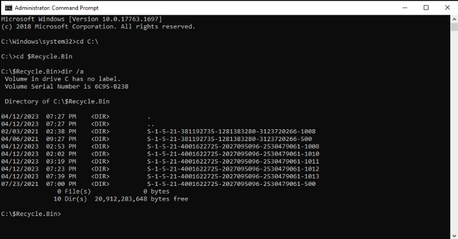<br>
  <em>Figure 1: Reviewing the Recycle Bin directory and user SID folders.</em>
</p>

##### 🔷 Phase 1.4 — Understand the SID folders

Windows creates user-specific Recycle Bin folders using Security Identifiers, also known as SIDs.

A SID is a unique identifier assigned by Windows to a user account or security principal. Even if two accounts have similar display names, their SIDs are unique.

From a forensic perspective, SID folders matter because they help associate deleted-file artifacts with a specific user account.

<blockquote>
At this stage, I was not yet identifying specific deleted files. I was confirming that the Recycle Bin artifact source existed and that it contained user-specific folders that could later be parsed and reviewed.
</blockquote>

##### 🔷 Phase 1.5 — Phase 1 findings

| Item | Finding |
|---|---|
| Recycle Bin location | `C:\$Recycle.Bin` |
| Directory contents | Multiple SID-named user folders |
| Investigation value | Establishes user-specific deleted-file artifact sources |

</details>

<details>
<summary><strong>▶ Phase 2 — Parse Recycle Bin Artifacts Using RBCmd</strong><br>
→ converting Recycle Bin metadata into structured output
</summary><br>

This phase focused on parsing Recycle Bin metadata with RBCmd.

<blockquote>
Raw Recycle Bin files are not always easy to interpret manually. RBCmd parses the metadata and exports structured results, making it easier to identify original filenames, deletion times, file sizes, and user-specific artifact paths.
</blockquote>

##### 🔷 Phase 2.1 — Run RBCmd against the current directory

While inside:

```text
C:\$Recycle.Bin
```

I executed RBCmd using the following command:

```cmd
C:\Users\BTLOTest\Desktop\Recycle-Bin-Analysis\Tools\RBCmd.exe -d . --csv C:\Users\BTLOTest\Desktop\
```

Command breakdown:

| Command Element | Meaning |
|---|---|
| `C:\Users\BTLOTest\Desktop\Recycle-Bin-Analysis\Tools\RBCmd.exe` | Runs the RBCmd executable |
| `-d .` | Tells RBCmd to parse the current directory |
| `.` | Represents the current working directory, which was `C:\$Recycle.Bin` |
| `--csv` | Exports parsed results in CSV format |
| `C:\Users\BTLOTest\Desktop\` | Saves the CSV output to the Desktop |

##### 🔷 Phase 2.2 — Confirm the RBCmd output

RBCmd processed the Recycle Bin artifacts and created an output folder on the Desktop.

The output contained a CSV file with parsed Recycle Bin records.

<p align="left">
  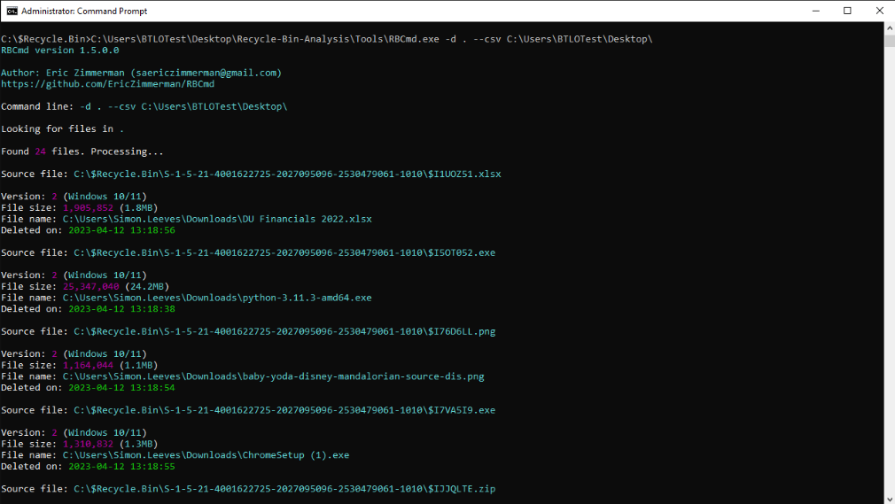<br>
  <em>Figure 2: Parsing Recycle Bin artifacts with RBCmd and generating CSV output.</em>
</p>

##### 🔷 Phase 2.3 — Understand why CSV output was useful

CSV output was useful because it converted parsed Recycle Bin metadata into a structured table.

This made it possible to review fields such as:

- original filename,
- original file path,
- file size,
- deletion timestamp,
- source Recycle Bin path,
- user SID folder.

This was important because the investigation questions required sorting, comparing, and counting records.

##### 🔷 Phase 2.4 — Phase 2 findings

| Item | Finding |
|---|---|
| Tool used | `RBCmd` |
| Input location | `C:\$Recycle.Bin` |
| Output format | CSV |
| Output location | Desktop `Output` folder |
| Records processed | `24` deleted-file records |

</details>

<details>
<summary><strong>▶ Phase 3 — Open and Review Parsed Output in CSVQuickViewer</strong><br>
→ preparing structured deleted-file metadata for analysis
</summary><br>

This phase focused on opening the RBCmd CSV output in CSVQuickViewer.

<blockquote>
After RBCmd generated the CSV output, I needed a way to review the parsed records efficiently. CSVQuickViewer allowed the results to be opened in a table-like view so columns could be sorted and records could be reviewed more easily.
</blockquote>

##### 🔷 Phase 3.1 — Open CSVQuickViewer

CSVQuickViewer was opened from the tools directory on the Desktop.

<p align="left">
  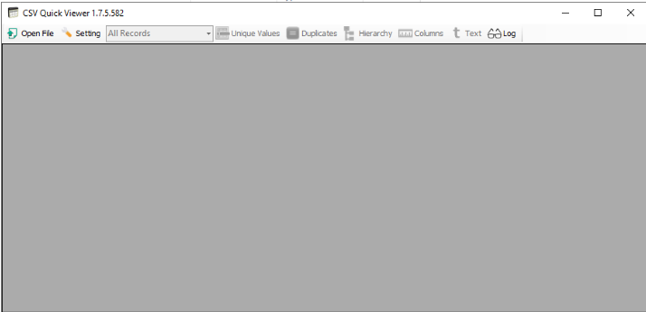<br>
  <em>Figure 3: Opening CSVQuickViewer to review the RBCmd CSV output.</em>
</p>

##### 🔷 Phase 3.2 — Load the RBCmd CSV output

Inside CSVQuickViewer, I opened the CSV file generated by RBCmd from the Desktop output folder.

<p align="left">
  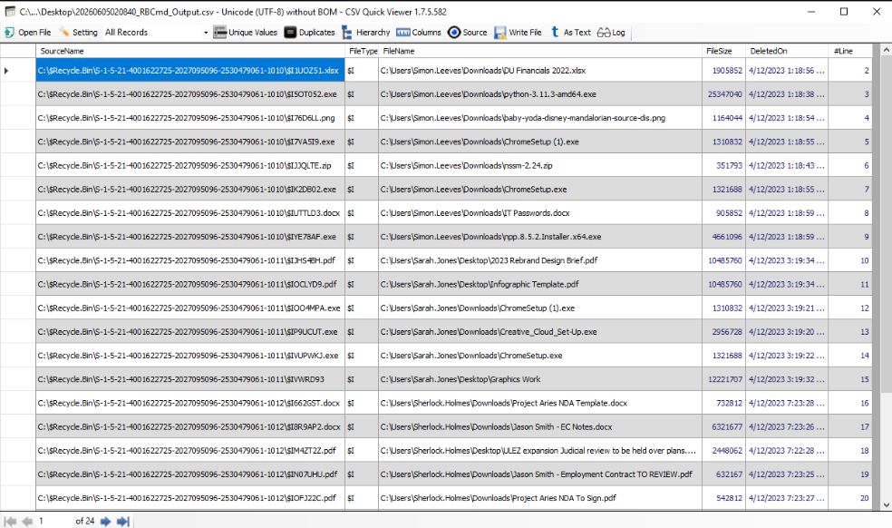<br>
  <em>Figure 4: Loading the RBCmd CSV output.</em>
</p>

Once loaded, the CSV displayed parsed deleted-file records in columns. The most important columns for this workflow included:

| Column | Why It Matters |
|---|---|
| `FileName` | Shows the original file path and filename |
| `FileSize` | Shows the size of the deleted file |
| `DeletedOn` | Shows when the file was deleted |
| Source file path | Shows the Recycle Bin metadata artifact path, including the SID folder |

##### 🔷 Phase 3.3 — Understand the role of the CSV viewer

CSVQuickViewer did not perform the forensic parsing itself. RBCmd performed the parsing.

CSVQuickViewer was used to review, sort, and interpret the parsed results.

This distinction matters because one tool extracted the evidence, while the other tool made the extracted data easier to analyze.

##### 🔷 Phase 3.4 — Phase 3 findings

| Item | Finding |
|---|---|
| Parser | RBCmd |
| Review tool | CSVQuickViewer |
| Primary analysis fields | `FileName`, `FileSize`, `DeletedOn`, SID/source paths |
| Purpose | Sort, filter, count, and compare parsed deleted-file records |

</details>

<details>
<summary><strong>▶ Phase 4 — Identify the Largest Deleted File</strong><br>
→ using file size metadata to prioritize deleted-file evidence
</summary><br>

This phase focused on identifying the deleted file with the largest file size.

<blockquote>
File size is useful during triage because large files may represent archives, disk images, executables, media files, exported datasets, or other content that may be important to an investigation. Sorting by size provides a quick way to identify large deleted artifacts.
</blockquote>

##### 🔷 Phase 4.1 — Sort by FileSize

In CSVQuickViewer, I clicked the `FileSize` column header to sort records by size.

Sorting from highest to lowest placed the largest deleted file at the top of the table.

##### 🔷 Phase 4.2 — Identify the largest deleted file

The largest deleted file detected was:

```text
kali-linux-2023.1-virtualbox-amd64.7z
```

The record showed this file under Rick Sanchez's Pictures path:

```text
C:\Users\Rick.Sanchez\Pictures\2021\Personal\kali-linux-2023.1-virtualbox-amd64.7z
```

<p align="left">
  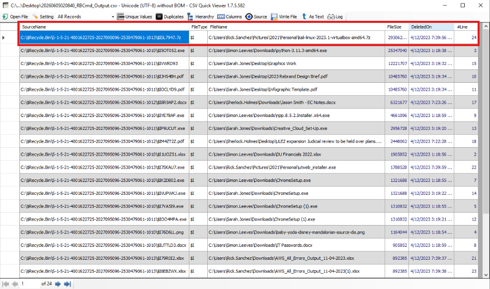<br>
  <em>Figure 5: Sorting by FileSize to identify the largest deleted file.</em>
</p>

##### 🔷 Phase 4.3 — Interpret the finding

The file extension `.7z` indicates a compressed archive.

The filename suggests a Kali Linux VirtualBox image archive. Kali Linux is a security-focused Linux distribution commonly used for penetration testing and security training. The file being the largest deleted item did not automatically make it malicious, but it made it notable from a triage perspective.

##### 🔷 Phase 4.4 — Phase 4 findings

| Question | Finding |
|---|---|
| FileName value of largest deleted file | `C:\Users\Rick.Sanchez\Pictures\2021\Personal\kali-linux-2023.1-virtualbox-amd64.7z` |

</details>

<details>
<summary><strong>▶ Phase 5 — Identify Which User Account Had the Most Deleted Files</strong><br>
→ grouping deleted-file records by original file path
</summary><br>

This phase focused on identifying which user account had the most deleted files present in the Recycle Bin.

<blockquote>
Because the original file paths include user profile directories, the `FileName` column can be used to associate deleted files with user accounts. Sorting or grouping by this column makes it easier to count how many deleted files are associated with each user.
</blockquote>

##### 🔷 Phase 5.1 — Review FileName paths by user

The `FileName` column contains original paths such as:

```text
C:\Users\Simon.Leeves\...
C:\Users\Sarah.Jones\...
C:\Users\Rick.Sanchez\...
```

Because the user account name appears in the original file path, this column was useful for identifying which user account was associated with each deleted file.

##### 🔷 Phase 5.2 — Count deleted files by user

I reviewed the `FileName` values and counted the number of deleted files associated with each user account.

The user account with the most deleted files was:

```text
Simon.Leeves
```

The total count was:

```text
8
```

<p align="left">
  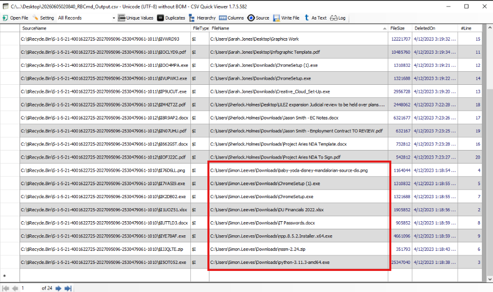<br>
  <em>Figure 6: Reviewing FileName paths to identify which user had the most deleted files.</em>
</p>

##### 🔷 Phase 5.3 — Interpret the user count

This finding showed that Simon Leeves had the highest number of deleted files represented in the parsed Recycle Bin records.

This does not automatically prove suspicious activity. However, it identifies which user's deleted-file activity was most prominent in the available Recycle Bin evidence and provides a useful pivot point for additional review.

##### 🔷 Phase 5.4 — Phase 5 findings

| Question | Finding |
|---|---|
| User account with most deleted files | `Simon.Leeves` |
| Total count | `8` |

</details>

<details>
<summary><strong>▶ Phase 6 — Identify When a Specific File Was Deleted</strong><br>
→ using filename and DeletedOn metadata
</summary><br>

This phase focused on determining when a specific deleted PDF was removed.

<blockquote>
When an investigation asks when a file was deleted, the `DeletedOn` field is the key artifact. The filename identifies the record of interest, while the deletion timestamp provides the time of the delete action recorded in the Recycle Bin metadata.
</blockquote>

At this point, I shifted from reviewing broad patterns in the Recycle Bin data to examining a specific deleted file. As part of this investigation, I needed to determine when a document named `2023 Rebrand Design Brief.pdf` was deleted. To answer this, I needed to locate the file within the parsed Recycle Bin records and review its associated deletion timestamp.


##### 🔷 Phase 6.1 — Locate the target file

I searched or visually reviewed the `FileName` column for:

```text
2023 Rebrand Design Brief.pdf
```

This file appeared under Sarah Jones's Desktop path:

```text
C:\Users\Sarah.Jones\Desktop\2023 Rebrand Design Brief.pdf
```

<p align="left">
  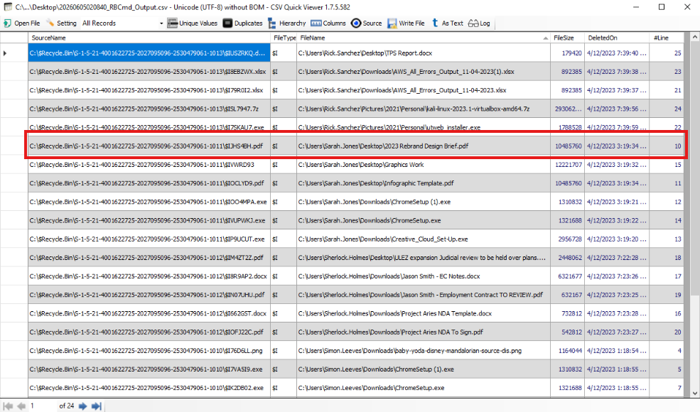<br>
  <em>Figure 7: Locating 2023 Rebrand Design Brief.pdf and reviewing its DeletedOn timestamp.</em>
</p>

##### 🔷 Phase 6.2 — Review the DeletedOn value

After locating the file, I reviewed the `DeletedOn` timestamp value in the same row.

The file was deleted at:

```text
4/12/2023 3:19:34 PM
```

##### 🔷 Phase 6.3 — Interpret the timestamp

The timestamp provided evidence of when the file was moved to the Recycle Bin.

This does not necessarily prove the user permanently destroyed the file, because Recycle Bin deletion is not the same as secure deletion or wiping. However, it does show that the file was deleted from its original location and preserved in Recycle Bin metadata.

##### 🔷 Phase 6.4 — Phase 6 findings

| Question | Finding |
|---|---|
| Deleted time for `2023 Rebrand Design Brief.pdf` | `4/12/2023 3:19:34 PM` |

</details>

<details>
<summary><strong>▶ Phase 7 — Identify the User Associated with a Specific File Size</strong><br>
→ matching FileSize metadata to original file path
</summary><br>

At this stage of the investigation, I shifted from reviewing known filenames to examining a specific metadata value. As part of the requirements for this investigation, I needed to identify the user associated with a file that had a size of `542812` bytes.

Rather than searching for a filename, I used the file size as the investigative pivot. By locating the matching `FileSize` value within the parsed Recycle Bin records, I could then review the corresponding file path and determine which user account owned the deleted file.

This phase focused on identifying which user account deleted a file that was exactly `542812` bytes in size.


<blockquote>
File size can be used as an investigative pivot when the filename is not provided. By locating the specified size value in the `FileSize` column, the analyst can then review the same row to identify the original file path and associated user account.
</blockquote>

##### 🔷 Phase 7.1 — Locate the file size value

I reviewed the `FileSize` column for the value:

```text
542812
```

##### 🔷 Phase 7.2 — Identify the associated user account

The matching record showed the original path:

```text
C:\Users\Sherlock.Holmes\Downloads\Project Aries NDA To Sign.pdf
```

Because the path includes:

```text
C:\Users\Sherlock.Holmes\
```

the associated user account was identified as:

```text
Sherlock.Holmes
```

<p align="left">
  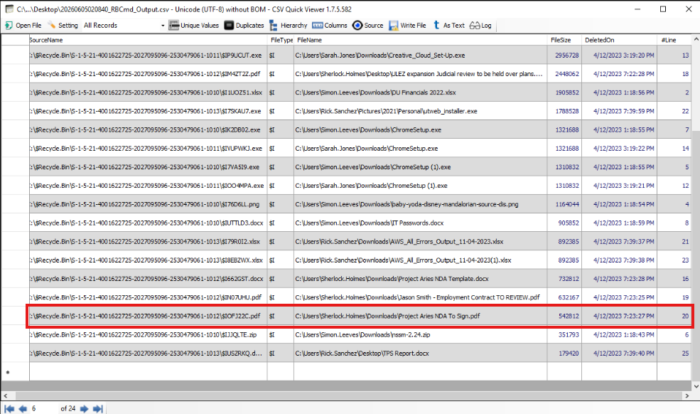<br>
  <em>Figure 8: Matching FileSize metadata to the associated user account.</em>
</p>

##### 🔷 Phase 7.3 — Phase 7 findings

| Question | Finding |
|---|---|
| User account associated with file size `542812` | `Sherlock.Holmes` |

</details>

<details>
<summary><strong>▶ Phase 8 — Identify Deleted Files Supporting a Confidential-File Allegation</strong><br>
→ reviewing filenames and original download locations
</summary><br>

This phase focused on identifying files that supported the allegation that Simon Leeves downloaded confidential files and then deleted local copies.

The allegation involved three elements: 
- The user downloaded files, 
- The files appeared confidential, and 
- The local copies were deleted.

Recycle Bin metadata can help support this type of allegation when deleted files are found in a user's Downloads folder and the filenames suggest sensitive or confidential content.

##### 🔷 Phase 8.1 — Focus on Simon Leeves's deleted files

I reviewed deleted files associated with:

```text
C:\Users\Simon.Leeves\
```

The investigation specifically focused on files deleted from Simon Leeves's Downloads folder because the allegation stated that he downloaded confidential files and then deleted his own copies.

##### 🔷 Phase 8.2 — Identify files in the Downloads folder

Two deleted files in Simon Leeves's Downloads folder supported the allegation:

```text
C:\Users\Simon.Leeves\Downloads\IT Passwords.docx
C:\Users\Simon.Leeves\Downloads\CI Financials 2021.xlsx
```

<p align="left">
  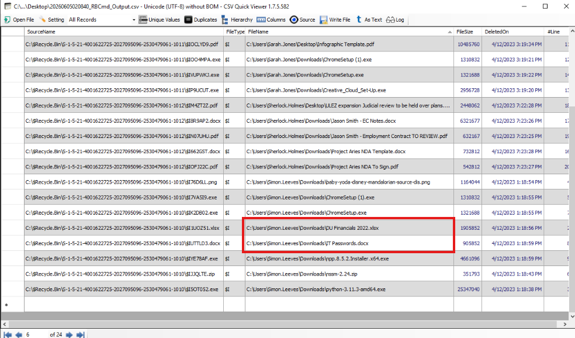<br>
  <em>Figure 9: Identifying Simon Leeves deleted files that support the confidential-file allegation.</em>
</p>

##### 🔷 Phase 8.3 — Interpret why these files support the allegation

These files supported the allegation for two reasons.

First, the original paths showed that the files were located in:

```text
C:\Users\Simon.Leeves\Downloads\
```

This location is consistent with files being downloaded by the user.

Second, the filenames suggested sensitive content:

```text
IT Passwords.docx
DU Financials 2021.xlsx
```

The names indicate possible credential-related and financial information. While filenames alone do not prove the contents, they are enough to justify documenting these files as supporting evidence.

##### 🔷 Phase 8.4 — Phase 8 findings

| Question | Finding |
|---|---|
| Deleted files supporting the allegation | `IT Passwords.docx`, `DU Financials 2021.xlsx` |

<blockquote>
This phase demonstrated how deleted-file metadata can support an investigative allegation when original file paths, user account names, and filenames align with the scenario being investigated.
</blockquote>

</details>

<details>
<summary><strong>▶ Phase 9 — Count Total Deleted Files Identified</strong><br>
→ validating the number of parsed Recycle Bin records
</summary><br>

At this point, I had already identified several specific findings from the parsed Recycle Bin data, including deleted files, user associations, and deletion timestamps. Before concluding the investigation, I wanted to verify the overall scope of the evidence that had been processed.

Determining the total number of deleted-file records helped confirm how much Recycle Bin data was available for analysis and provided a useful validation point for the dataset generated by RBCmd.

This phase focused on identifying the total number of deleted files parsed by RBCmd.

<blockquote>
Counting the total number of deleted-file records helps establish the scope of the parsed evidence. It also provides a simple validation point to confirm that the analyst is reviewing the expected number of results.
</blockquote>

##### 🔷 Phase 9.1 — Review the parsed record count

RBCmd reported that it processed:

```text
24 out of 24 files
```

CSVQuickViewer also displayed 24 parsed result rows.

<p align="left">
  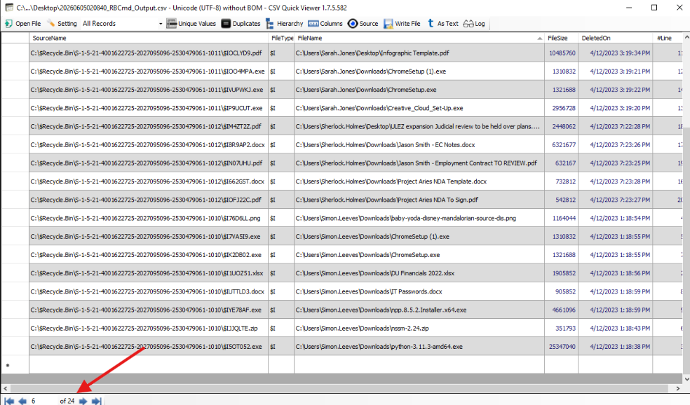<br>
  <em>Figure 10: Reviewing the parsed record count.</em>
</p>

##### 🔷 Phase 9.2 — Phase 9 findings

| Question | Finding |
|---|---|
| Total deleted files identified | `24` |

</details>

<details>
<summary><strong>▶ Phase 10 — Identify the Last Four Digits of Rick Sanchez's SID</strong><br>
→ using Recycle Bin source path and original file ownership
</summary><br>

At this stage, the investigation had primarily relied on user-friendly identifiers such as account names and file paths. However, Windows internally tracks users using Security Identifiers (SIDs), which are unique values assigned to each account.

As part of the investigation, I was required to identify the final four digits of Rick Sanchez's SID. To answer this, I needed to locate a deleted-file record associated with Rick Sanchez and then review the corresponding Recycle Bin source path, where the SID value was preserved.

This phase focused on identifying the last four digits of Rick Sanchez's SID value.

<blockquote>
Recycle Bin artifacts are stored under SID-named folders. When a deleted file path identifies a user account and the corresponding source Recycle Bin path identifies the SID folder, the SID can be associated with that user.
</blockquote>

##### 🔷 Phase 10.1 — Locate a Rick Sanchez deleted-file record

I reviewed the `FileName` column for entries associated with:

```text
Rick.Sanchez
```

A matching deleted file was:

```text
C:\Users\Rick.Sanchez\Downloads\AWS_All_Errors_Output_11-04-2023.xlsx
```

##### 🔷 Phase 10.2 — Review the corresponding source Recycle Bin path

The source Recycle Bin path for the record included the SID folder:

```text
S-1-5-21-4001622725-2027095906-2530479061-1013
```

<p align="left">
  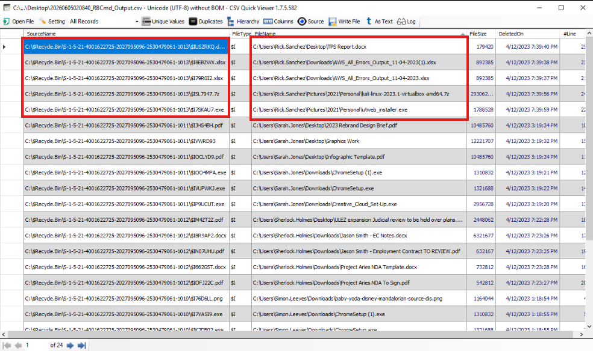<br>
  <em>Figure 11: Associating Rick Sanchez with his Recycle Bin SID folder.</em>
</p>

##### 🔷 Phase 10.3 — Extract the last four digits

The last four digits of the SID were:

```text
1013
```

##### 🔷 Phase 10.4 — Phase 10 findings

| Question | Finding |
|---|---|
| Last four digits of Rick Sanchez's SID | `1013` |

</details>

---

### Artifact Correlation

The most important part of this workflow was not simply collecting separate answers. The stronger forensic value came from correlating deleted-file metadata together.

Each artifact source answered a different part of the deleted-file activity chain.

#### Recycle Bin Directory Artifacts

Recycle Bin directory artifacts showed:

- user-specific SID folders,
- the presence of multiple Recycle Bin artifact containers,
- the source location for deleted-file metadata.

Findings:

```text
C:\$Recycle.Bin
S-1-5-21-...
```

Recycle Bin directory artifacts helped answer:

- Where were the deleted-file artifacts located?
- Were there multiple user-specific Recycle Bin folders?
- Could deleted-file artifacts be associated with user accounts?

#### RBCmd Parsed Metadata

RBCmd output showed:

- original file paths,
- file sizes,
- deletion timestamps,
- source Recycle Bin paths,
- total parsed record count.

Findings:

```text
24 deleted-file records
```

RBCmd parsed metadata helped answer:

- What files were deleted?
- Where did the files originally exist?
- How large were the deleted files?
- When were the files deleted?
- Which Recycle Bin SID folder contained each artifact?

#### CSVQuickViewer Review

CSVQuickViewer enabled:

- sorting by file size,
- grouping by user path,
- locating specific filenames,
- matching exact file size values,
- reviewing deleted-file records in structured form.

CSVQuickViewer helped answer:

- What was the largest deleted file?
- Which user had the most deleted files?
- When was a specific file deleted?
- Which user deleted a file of a specified size?
- Which files supported the confidential-file allegation?

#### Combined Interpretation

Digital forensic investigations rarely rely on a single field. Instead, investigators correlate multiple fields from the same artifact source to build a stronger understanding of activity.

Each field examined during this investigation answered a different question:

* **FileName** helped identify original file paths, filenames, and user accounts.
* **FileSize** helped identify large deleted files and match specific file size values.
* **DeletedOn** helped determine when files were deleted.
* **Source Recycle Bin paths** helped associate deleted files with SID folders.
* **Parsed record counts** helped establish the total scope of deleted-file evidence.

When analyzed together, the artifacts supported the following activity reconstruction.

##### 1. Multiple User Recycle Bin Containers Were Present

The investigation began by reviewing:

```text
C:\$Recycle.Bin
```

The directory contained multiple SID folders, indicating that Recycle Bin artifacts existed for multiple user accounts.

This established that deleted-file activity may have involved more than one user.

##### 2. Recycle Bin Metadata Was Parsed into Structured Output

RBCmd parsed the Recycle Bin artifacts and generated CSV output containing 24 deleted-file records.

This transformed raw Recycle Bin artifacts into a format that could be sorted, searched, and analyzed.

##### 3. Largest Deleted File Was Identified

Sorting by `FileSize` identified the largest deleted file as:

```text
C:\Users\Rick.Sanchez\Pictures\2021\Personal\kali-linux-2023.1-virtualbox-amd64.7z
```

This showed how file size metadata can be used during triage.

##### 4. Simon Leeves Had the Most Deleted Files

Reviewing and grouping original paths showed that:

```text
Simon.Leeves
```

had the highest number of deleted files, with:

```text
8
```

deleted-file records.

##### 5. A Specific PDF Deletion Time Was Identified

The record for:

```text
2023 Rebrand Design Brief.pdf
```

showed that it was deleted at:

```text
4/12/2023 7:39:34 PM
```

This demonstrated how filename and timestamp fields can be correlated.

##### 6. A File Size Value Was Matched to a User

The file size:

```text
542812
```

was matched to:

```text
C:\Users\Sherlock.Holmes\Downloads\Project Aries NDA To Sign.pdf
```

This identified the associated user as:

```text
Sherlock.Holmes
```

##### 7. Deleted Downloads Files Supported the Simon Leeves Allegation

Two deleted files in Simon Leeves's Downloads folder supported the allegation:

```text
IT Passwords.docx
CI Financials 2021.xlsx
```

These files were relevant because their original paths placed them in the user's Downloads folder and their filenames suggested sensitive information.

##### 8. Rick Sanchez's SID Was Identified

A Rick Sanchez deleted-file record was associated with the SID ending in:

```text
1013
```

This demonstrated how user account names and SID folder paths can be correlated.

##### Overall Conclusion

No single field provided the full story.

Instead, the investigation relied on correlating Recycle Bin directory structure, parsed metadata, user paths, file sizes, deletion timestamps, and SID folders.

| Artifact / Field | Question Answered | Key Finding |
|---|---|---|
| `$Recycle.Bin` directory | Where were deleted-file artifacts located? | `C:\$Recycle.Bin` |
| SID folders | Which user containers existed? | Multiple SID folders |
| `FileName` | What files were deleted and where did they originate? | Original user paths and filenames |
| `FileSize` | Which file was largest or matched a known size? | Largest file and `542812` byte match |
| `DeletedOn` | When was a file deleted? | `4/12/2023 7:39:34 PM` |
| Downloads paths | Which files supported the allegation? | `IT Passwords.docx`, `CI Financials 2021.xlsx` |
| SID source paths | What was Rick Sanchez's SID ending? | `1013` |

Taken together, these artifacts demonstrated how Recycle Bin metadata can be used to reconstruct deleted-file activity, associate deleted files with user accounts, identify notable documents, and support investigation of possible data removal.

---

### Evidence Examination Summary

| Task | Artifact Source | Tool | Finding |
|---|---|---|---|
| Identify largest deleted file | Recycle Bin metadata | RBCmd / CSVQuickViewer | `C:\Users\Rick.Sanchez\Pictures\2021\Personal\kali-linux-2023.1-virtualbox-amd64.7z` |
| Identify user with most deleted files | Original file paths | CSVQuickViewer | `Simon.Leeves`, `8` files |
| Identify deletion time for `2023 Rebrand Design Brief.pdf` | `DeletedOn` field | CSVQuickViewer | `4/12/2023 7:39:34 PM` |
| Identify user associated with file size `542812` | `FileSize` and `FileName` fields | CSVQuickViewer | `Sherlock.Holmes` |
| Identify files supporting allegation | Original Downloads paths | CSVQuickViewer | `IT Passwords.docx`, `CI Financials 2021.xlsx` |
| Count total deleted files | Parsed record count | RBCmd / CSVQuickViewer | `24` |
| Identify Rick Sanchez SID ending | Source Recycle Bin path | CSVQuickViewer | `1013` |

---

### What I Learned (Skills Demonstrated)

Through this workflow, I learned how to:

- Access the Windows `$Recycle.Bin` directory.
- Understand why Recycle Bin artifacts are organized by SID.
- Use Command Prompt with administrative privileges during forensic analysis.
- Use `dir /a` to view hidden or system artifact directories.
- Use RBCmd to parse Recycle Bin metadata.
- Understand what Recycle Bin metadata can preserve.
- Export parsed artifact results to CSV.
- Use CSVQuickViewer to review structured forensic output.
- Sort deleted-file records by file size.
- Identify the largest deleted file.
- Use original file paths to associate deleted files with user accounts.
- Count deleted files by user account.
- Locate a specific deleted file by filename.
- Interpret `DeletedOn` timestamp values.
- Match an exact file size value to a deleted-file record.
- Identify deleted files in a user's Downloads folder.
- Evaluate whether filenames and original paths support an allegation.
- Count total parsed deleted-file records.
- Correlate user profile paths with Recycle Bin SID paths.
- Document a repeatable Recycle Bin artifact analysis workflow.

This workflow strengthened my understanding that deletion does not necessarily remove forensic evidence. Windows Recycle Bin artifacts can preserve useful metadata about deleted files, including original locations, timestamps, file sizes, and user-specific context. Correlating these fields together allows an analyst to reconstruct deleted-file activity with more confidence.

---

### Final Conclusion

This workflow demonstrated how RBCmd and CSVQuickViewer can be used to analyze Windows Recycle Bin artifacts and reconstruct deleted-file activity.

The Recycle Bin directory contained multiple SID-based user folders. RBCmd parsed the Recycle Bin artifacts and generated a CSV containing 24 deleted-file records. CSVQuickViewer was then used to review, sort, and interpret the parsed metadata.

The investigation identified the largest deleted file, the user account with the most deleted files, the deletion timestamp of a specific PDF, the user associated with a specific file size, the files supporting a confidential-file allegation, the total number of deleted files, and the last four digits of Rick Sanchez's SID.

The final key findings were:

```text
Largest deleted file: C:\Users\Rick.Sanchez\Pictures\2021\Personal\kali-linux-2023.1-virtualbox-amd64.7z
User with most deleted files: Simon.Leeves
Total deleted files for Simon Leeves: 8
Deleted time for 2023 Rebrand Design Brief.pdf: 4/12/2023 7:39:34 PM
User associated with 542812-byte file: Sherlock.Holmes
Files supporting confidential-file allegation: IT Passwords.docx, CI Financials 2021.xlsx
Total deleted files identified: 24
Rick Sanchez SID ending: 1013
```

Together, these artifacts showed how Recycle Bin metadata can be used to investigate deleted files, associate deletion activity with user accounts, and support forensic conclusions about user behavior and potential data removal.
