# Windows Artifact Analysis Using WFA, PECmd, and JumpList Explorer

This workflow demonstrates practical Windows forensic artifact analysis using **Windows File Analyzer (WFA)**, **PECmd**, and **JumpList Explorer** to identify suspicious file activity, trace execution history, and examine user activity artifacts.

The scenario is that the investigation team has seized a desktop PC from a suspect, who was believed to have purchased the commodity malware "PlagueRat" and used it to attack a company offering IT services. A forensic copy of the disk has been captured, and I am now responsible for analyzing prefetch files, jump lists, and .LNK files (shortcuts) to determine if the suspect has used PlagueRat at all. There are a list of questions that we need gather answers for so that I can find the evidence needed to convict this malicious hacker.

In this investigation, I will be analyzing prefetch files, shortcuts, and jump files to determine when files were last accessed on a system that has been retrieved from a crime scene. My job is to collect information on what programs have been run on the system, how many times they've been accessed, and when. The names of any documents will also aid the investigation.

> **Workflow vs Execution vs Writeup (Terminology Used Here)**  
> - **Workflows** refer to repeatable digital forensic tasks such as metadata extraction, file carving, evidence recovery, and hash validation.  
> - **Executions** refer to the hands-on use of forensic tools such as ExifTool and Scalpel to analyze provided evidence files.  
> - **Writeups** document forensic observations, command usage, analyst reasoning, tool outputs, and evidence handling conclusions.

> 👉 For a **detailed, step-by-step walkthrough of how this workflow was executed — complete with screenshot placeholders**, see the **[Step-by-Step Execution](#step-by-step-execution)** section below.

---

### Overview

This project focused on examining multiple Windows forensic artifact sources to reconstruct activity associated with a suspicious file.

1. The investigation began with shortcut analysis. Windows shortcut files, also known as `.LNK` files, are small files used by Windows to point to another file, folder, or application. From a normal user perspective, a shortcut may only look like a convenient way to open something. From a forensic perspective, shortcut files can be much more useful because they often preserve historical information about the target file, including the file name, file path, volume information, and sometimes information about where the file originally existed.

<blockquote>
This matters because the original file may have been moved, deleted, or no longer available. Even then, the shortcut artifact may still preserve evidence that the file once existed or was accessed.
</blockquote>

2. The investigation then moved into Prefetch analysis. Prefetch files are created by Windows to help applications load faster. Although Prefetch exists for performance reasons, forensic analysts use Prefetch artifacts because they can provide evidence that a program executed on a system. Prefetch files may also preserve references to files that were accessed or loaded during execution.

<blockquote>
This matters because shortcut artifacts can show that a file was accessed or existed, but they do not always prove that a related program executed. Prefetch artifacts help answer a stronger question: did an executable run, and what files did it reference?
</blockquote>

3. Finally, Jump List artifacts were reviewed using JumpList Explorer. Jump Lists are Windows artifacts associated with application activity. They may show recently accessed files, folders, documents, or websites depending on the application. In this workflow, Jump List analysis was used to identify browser-related activity and determine which browser was used.

This workflow demonstrates how multiple Windows artifacts can be analyzed separately, then correlated together to build a more complete understanding of user and system activity.

> **Workflow vs Execution vs Writeup (Terminology Used Here)**  
> - **Workflows** refer to repeatable digital forensic procedures, such as analyzing shortcut files, parsing Prefetch files, or reviewing Jump Lists.  
> - **Executions** refer to the hands-on use of forensic tools such as WFA, PECmd, and JumpList Explorer against provided evidence.  
> - **Writeups** document the analyst's process, observations, reasoning, tool usage, and conclusions.

> 👉 For this workflow, the goal was not only to record answers. The goal was to understand what each artifact source revealed, why each tool was used, and how the findings supported the overall reconstruction of suspicious activity.

---

### Purpose and Analyst Focus

#### ▶ Purpose

The purpose of this workflow is to demonstrate how Windows forensic artifacts can be used to identify suspicious files, determine file origins, trace execution activity, and reconstruct user actions.

Rather than relying on one artifact source, this workflow combines shortcut artifacts, Prefetch artifacts, and Jump List artifacts. Each source provides a different type of evidence. When analyzed together, they help answer more complete investigative questions.

For example:

- Shortcut artifacts helped identify the suspicious file and the archive it came from.
- Prefetch artifacts helped identify execution-related activity and file references.
- Jump List artifacts helped identify related browser activity.

This type of artifact correlation is important because real investigations rarely depend on a single piece of evidence. One artifact may suggest something happened, while another artifact may validate or add context to that finding.

#### ▶ Analyst Focus

The analyst focus is on understanding what evidence can be extracted from common Windows artifacts and how those artifacts can support a forensic conclusion.

This includes:

- understanding what `.LNK` shortcut files are,
- using Windows File Analyzer to review shortcut metadata,
- identifying suspicious files from shortcut artifacts,
- determining whether a suspicious file originated from a ZIP archive,
- identifying other files that existed inside the same archive,
- understanding what Prefetch files are,
- using PECmd to parse a specific Prefetch artifact,
- reviewing Prefetch output for file references,
- determining the full path of a suspicious file,
- using keyword searches across multiple Prefetch files,
- identifying applications that interacted with a suspicious PowerShell script,
- understanding what Jump Lists are,
- using JumpList Explorer to review application activity,
- identifying website activity from Jump List artifacts,
- correlating findings across multiple evidence sources.

The goal is not just to run tools and copy answers. The goal is to understand what each artifact proves, what it does not prove, and why the next step in the workflow makes sense.

---

### What This Workflow Demonstrates

This workflow demonstrates how to:

- Analyze Windows shortcut files using Windows File Analyzer.
- Identify suspicious files from `.LNK` artifacts.
- Review filename and linked path fields.
- Determine whether a suspicious file originated from a compressed archive.
- Identify additional files that were contained in the same ZIP archive.
- Analyze a specific Prefetch file using PECmd.
- Understand the difference between file access evidence and execution evidence.
- Locate referenced files inside Prefetch output.
- Determine the full path of a suspicious file from a Prefetch artifact.
- Use PECmd's keyword search option to hunt across an entire Prefetch directory.
- Identify applications that interacted with `PlagueRat.ps1`.
- Analyze Jump List artifacts using JumpList Explorer.
- Identify a website accessed by a user.
- Determine which browser was used to access the website.
- Correlate shortcut, Prefetch, and Jump List artifacts into one forensic narrative.

This workflow also demonstrates an important digital forensics concept: one artifact rarely tells the full story. Shortcut files, Prefetch files, and Jump Lists each reveal different parts of activity. The stronger conclusion comes from combining them.

---

### Investigation and Digital Forensics Relevance

Windows systems create many artifacts during normal user and system activity. These artifacts can remain available even after files are deleted, moved, renamed, or no longer visible through normal browsing.

That is why artifact analysis is valuable during digital forensic investigations.

Shortcut files can reveal that a file existed or was accessed. Prefetch files can reveal that an executable ran or referenced specific files. Jump Lists can reveal recent application-specific activity, such as websites visited or files opened.

The table below summarizes the role of each artifact source in this workflow:

| Artifact | What It Can Reveal | Why It Matters |
|---|---|---|
| Shortcut Files | File names, paths, archive references, historical access | Helps identify suspicious files and where they came from |
| Prefetch Files | Executable activity, run-related metadata, referenced files | Helps determine whether execution occurred |
| Jump Lists | Recently accessed resources tied to applications | Helps reconstruct user activity and browser usage |

These artifacts are especially useful because they can support different investigative questions:

- What suspicious file was present?
- Where did the file come from?
- Was the file executed?
- What applications interacted with it?
- Was there related browser activity?

By moving from shortcut artifacts to Prefetch artifacts to Jump Lists, the workflow follows a logical evidence path:

1. Identify the suspicious file.
2. Determine its origin.
3. Look for execution evidence.
4. Identify related application activity.
5. Correlate the findings.

> **Note:** Relationship to Disk Images and Forensic Evidence:
>
> In a real-world investigation, analysts rarely examine artifacts directly from a live system. Instead, investigators typically create a forensic image of the storage device to preserve evidence and prevent accidental modification of the original data. A forensic image, often called a disk image, is a bit-for-bit copy of a storage device that contains the same files, folders, operating system data, and forensic artifacts present on the original system at the time of acquisition.

Tools such as FTK Imager, Magnet Acquire, EnCase Imager, or similar acquisition tools are commonly used to create these forensic images. Once acquired, investigators can mount or examine the disk image and analyze artifact locations without interacting with the original evidence.


> **Note:** In a real-world forensic investigation, these artifacts would typically be extracted from a forensic disk image rather than examined directly on a live system. Investigators often use acquisition tools such as FTK Imager to create a bit-for-bit copy of the original storage device, preserving the evidence while preventing accidental modification. Once the disk image is mounted, analysts can locate and extract artifacts such as shortcut files, Prefetch files, and Jump Lists for further examination using specialized forensic tools.

<blockquote>
For example, an investigator may first create a forensic image using FTK Imager, verify its integrity using cryptographic hashes, and then mount the image for analysis. From the mounted image, the investigator can locate the Prefetch directory, user shortcut artifacts, and Jump List files before parsing them with specialized tools such as WFA, PECmd, and JumpList Explorer.

This workflow focuses on the artifact analysis portion of the investigation rather than the acquisition phase. However, in a real forensic examination, these artifacts would typically originate from a forensic image acquired from a suspect system.
</blockquote>


The workflow focuses on analyzing three common Windows forensic artifact sources:

- Shortcut (`.LNK`) files
- Prefetch (`.pf`) files
- Jump Lists

Together, these artifacts provide valuable insight into file access, program execution, archive origins, script activity, and browser-related user activity. Throughout the workflow, a suspicious file named **PlagueRat** was traced from an archive file to execution-related artifacts and associated user activity.

---

### Environment and Execution Context

This section documents the tools, evidence sources, and execution environment used during the workflow.

**Note:** Each section is collapsible. Click the ▶ arrow to expand and view details on software, evidence sources, workflow scope, and the high-level execution map.

<details>
<summary><strong>▶ Environment & Platform</strong><br>
</summary><br>

The workflow was performed in a Windows-based forensic training environment.

The primary evidence directory was:

```text
C:\Users\BTLOTest\Desktop\Windows Investigation One
```

The relevant evidence folders included:

```text
C:\Users\BTLOTest\Desktop\Windows Investigation One\Shortcuts
C:\Users\BTLOTest\Desktop\Windows Investigation One\Prefetch
```

The tools were located within the same lab environment. Windows File Analyzer and JumpList Explorer were launched from the desktop environment, while PECmd was executed from the Windows Command Prompt.

</details>

<details>
<summary><strong>▶ Evidence Sources Reviewed</strong><br>
</summary><br>

The following evidence sources were reviewed:

| Evidence Source | Purpose |
|---|---|
| `Shortcuts` folder | Analyze Windows shortcut artifacts |
| `CMD.EXE-89305D47.pf` | Analyze command prompt Prefetch evidence |
| Full Prefetch directory | Search for references to `plaguerat.ps1` |
| Jump List artifacts | Identify browser and website activity |

Each evidence source contributed a different part of the overall activity reconstruction.

</details>

<details>
<summary><strong>▶ Tooling Used</strong><br>
</summary><br>

The tools used during execution included:

- Windows File Analyzer - A forensic analysis tool used to examine Windows shortcut (.LNK) files. A shortcut file is a small file created by Windows that points to another file, folder, or program. Although shortcuts are commonly used to provide quick access to items on a system, they can also preserve useful information such as file names, file paths, timestamps, and locations where files previously existed. Investigators use WFA to extract and review this information.
- Prefetch Explorer Command Line - A command-line forensic utility used to examine Windows Prefetch (.pf) files. Prefetch files are automatically created by Windows when applications run and are primarily intended to help programs start faster. From a forensic perspective, Prefetch files are valuable because they can provide evidence that a program executed on a system, how many times it executed, when it last executed, and what files or directories it referenced during execution.
- JumpList Explorer - A forensic analysis tool used to examine Windows Jump Lists. A Jump List is a Windows feature that keeps track of files, folders, documents, and websites recently accessed through a specific application. For example, Microsoft Word may maintain a list of recently opened documents, while Microsoft Edge may maintain information about recently visited websites. JumpList Explorer allows investigators to review this activity and identify resources that a user interacted with through specific applications.

The artifacts examined in this workflow would normally be extracted from locations within a forensic image. For example:

| Artifact | Typical Location |
|----------|------------------|
| Shortcut Files (`.LNK`) | User profile directories, Recent Items folders, Desktop locations |
| Prefetch Files (`.pf`) | `C:\Windows\Prefetch\` |
| Jump Lists | `%AppData%\Microsoft\Windows\Recent\AutomaticDestinations\` and `%AppData%\Microsoft\Windows\Recent\CustomDestinations\` |

</details>

<details>
<summary><strong>▶ Workflow Map (High-Level)</strong><br>
</summary><br>

1. Launch Windows File Analyzer as Administrator.
2. Load the `Shortcuts` folder.
3. Review shortcut entries for suspicious filenames.
4. Identify the full PlagueRat file name.
5. Review linked paths to identify the ZIP archive.
6. Compare linked paths to identify additional files in the archive.
7. Open Command Prompt.
8. Navigate to the PECmd directory.
9. Parse the `CMD.EXE-89305D47.pf` Prefetch file.
10. Identify the PlagueRat file referenced in the Prefetch output.
11. Record the full file path from the Prefetch output.
12. Run PECmd against the full Prefetch directory using a keyword search for `plaguerat.ps1`.
13. Review matching Prefetch sections and identify associated executables.
14. Open JumpList Explorer.
15. Review browser-related Jump List entries.
16. Identify the visited domain.
17. Determine the browser used.
18. Correlate findings across shortcut, Prefetch, and Jump List artifacts.

</details>

---

### Step-by-Step Execution

This section documents the workflow in the same order an analyst would realistically perform the artifact review.

The workflow begins with shortcut artifacts because they can identify files and paths. It then moves into Prefetch artifacts because they can provide execution-related evidence. Finally, it reviews Jump Lists because they can provide user activity and browser context.

**Note:** Each section is collapsible. Click the ▶ arrow to expand and view the detailed steps.

<details>
<summary><strong>▶ Phase 1 — Analyze Shortcut Files Using Windows File Analyzer</strong><br>
→ identifying the suspicious file, archive origin, and related archive contents
</summary><br>

This phase focused on examining Windows shortcut artifacts to identify the suspicious PlagueRat file and determine where it originated.

<blockquote>
I started with shortcut analysis because shortcut files can preserve historical information about files that were accessed by the user or system. Even if the original file is no longer present, the shortcut may still contain useful details such as the filename, path, and source location. Since the lab focused on identifying PlagueRat, shortcut artifacts were a logical starting point.
</blockquote>

##### 🔷 Phase 1.1 — Open Windows File Analyzer as Administrator

Windows File Analyzer was opened from:

```text
C:\Users\BTLOTest\Desktop\Windows Investigation One\WFA.exe
```

The tool was opened by right-clicking the executable and selecting:

```text
Run as Administrator
```

Running the tool as Administrator helps avoid permission-related issues when parsing artifacts. Some forensic tools may need elevated permissions to access certain files or directories, so launching the tool with administrative privileges reduces the chance of incomplete results.

##### 🔷 Phase 1.2 — Load the Shortcuts folder

Inside Windows File Analyzer, the shortcut analysis option was selected:

```text
File > Analyze Shortcuts...
```

The following folder was selected:

```text
C:\Users\BTLOTest\Desktop\Windows Investigation One\Shortcuts
```

<p align="left">
  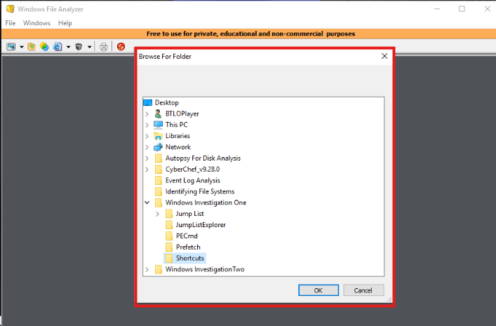<br>
  <em>Figure 1: Loading and reviewing shortcut artifacts in Windows File Analyzer.</em>
</p>

This instructed Windows File Analyzer to parse the `.LNK` artifacts stored in the Shortcuts folder.

<p align="left">
  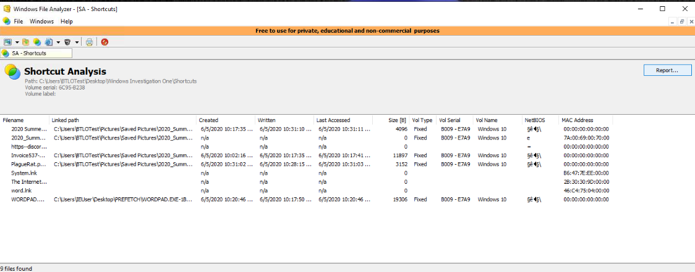<br>
  <em>Figure 2: Parsed .LNK artifacts in Windows File Analyzer</em>
</p>

##### 🔷 Phase 1.3 — Review the Filename column

After the shortcut artifacts loaded, I reviewed the parsed results table.

The most important field at this stage was the `Filename` column because it shows the target file associated with the shortcut artifact.

The suspicious file identified was:

```text
PlagueRat.ps1.lnk
```

This was the full filename of the PlagueRat file.

<p align="left">
  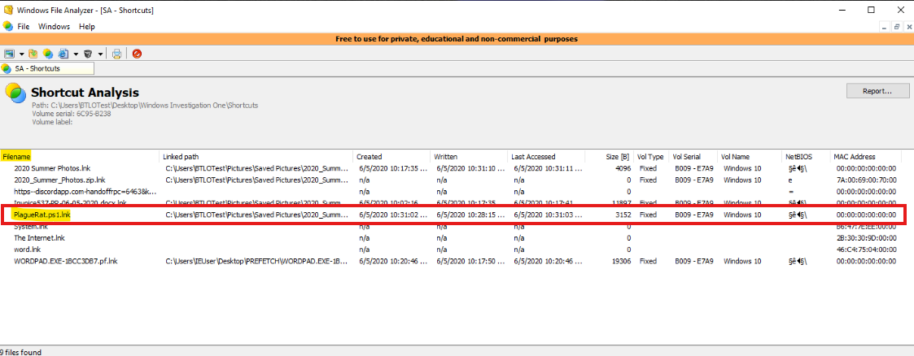<br>
  <em>Figure 3: Identifying the PlagueRat filename</em>
</p>

This file stood out for three reasons:

1. The name `PlagueRat` appeared suspicious and matched the investigation focus.
2. The .lnk extension indicates this is a Windows shortcut file rather than the actual script itself. The filename suggests the original target was a PowerShell script named PlagueRat.ps1. Because shortcut artifacts often preserve information about files that were accessed, this finding provided an initial indication that a PowerShell-based file may have been present on the system.
3. The .ps1 extension indicates a Windows PowerShell script. PowerShell is a legitimate administrative tool included with Windows, but it is also frequently abused by attackers because it can execute commands, download files, automate tasks, and interact extensively with the operating system. The presence of a PowerShell script named PlagueRat.ps1 made it a notable artifact and justified further investigation through Prefetch analysis.

<blockquote>
At this point, the shortcut artifact established that a suspicious file named PlagueRat.ps1.lnk existed or had been accessed. However, shortcut artifacts alone do not prove that the file executed. They primarily helped identify the file and provide context about where it came from.
</blockquote>

##### 🔷 Phase 1.4 — Review the Linked Path column

After identifying `PlagueRat.ps1.lnk`, I reviewed the same row for path information.

The `Linked Path` field was important because shortcut artifacts often preserve where the target file was located. In this case, the path showed that the suspicious file had been located inside a ZIP archive.

The ZIP archive identified was:

```text
2020_Summer_Photos.zip
```

This was significant because the archive name appeared harmless and photo-themed. Threat actors frequently use socially engineered filenames to make malicious content appear safe or familiar.

For example, a user may be more likely to open an archive named `2020_Summer_Photos.zip` because it sounds like personal photos rather than malware.

<p align="left">
  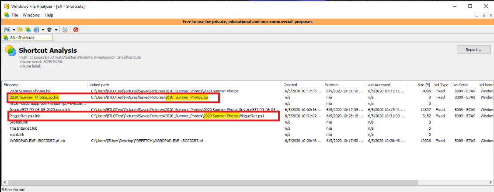<br>
  <em>Figure 4: Reviewing the linked path to identify the ZIP archive associated with PlagueRat.</em>
</p>

##### 🔷 Phase 1.5 — Identify other files in the same ZIP archive

Next, I looked for other shortcut entries that referenced the same ZIP archive path.

This step mattered because if multiple files share the same archive path, they may have been extracted from or accessed within the same ZIP file. Comparing paths helps identify related files and understand how the suspicious file was packaged. Another file associated with the same archive was:

```text
Invoice537-PR-06-05-2020.docx
```

This finding suggests the archive contained both a suspicious PowerShell-related file and a Microsoft Word document. From a forensic perspective, this is noteworthy because attackers commonly package malicious scripts alongside seemingly legitimate business documents, invoices, receipts, shipping notices, or other work-related files in an attempt to encourage users to open the archive.

Although the artifact alone does not prove malicious intent, the combination of a suspicious PowerShell-related file and an invoice-themed document is consistent with techniques frequently observed in phishing and malware delivery campaigns.

<p align="left">
  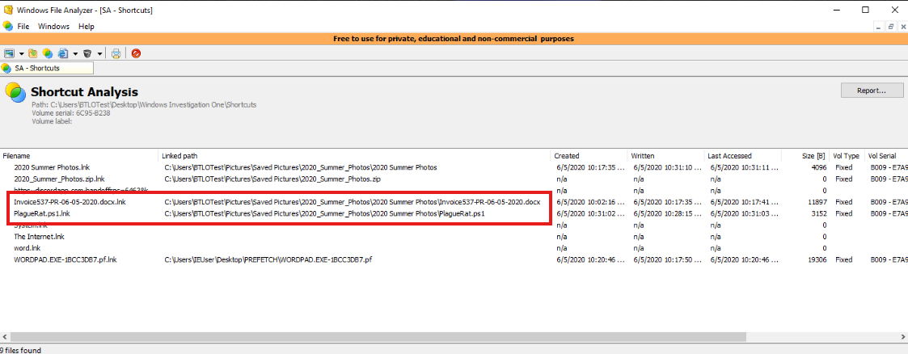<br>
  <em>Figure 5: Identifying another file associated with the same ZIP archive.</em>
</p>

##### 🔷 Phase 1.6 — Phase 1 findings

Shortcut analysis produced three important findings:

| Question | Finding |
|---|---|
| Full PlagueRat filename | `PlagueRat.ps1` |
| ZIP archive name | `2020_Summer_Photos.zip` |
| Other file in the ZIP archive | `invoice537-pr-06-05-2020.docx` |

<blockquote>
This phase showed why shortcut artifacts are useful in forensic analysis. They helped identify the suspicious file, determine the archive it came from, and identify related archive contents. However, this still did not fully answer whether the suspicious file executed. For that, I needed to move into Prefetch analysis.
</blockquote>

Shortcut analysis identified a PowerShell-related artifact named `PlagueRat.ps1.lnk`, suggesting the presence of a script associated with the investigation. However, shortcut artifacts primarily provide file access and path information rather than execution evidence. To determine whether related files had been executed or referenced by applications on the system, I moved to Prefetch analysis.

</details>

<details>
<summary><strong>▶ Phase 2 — Analyze CMD.EXE Prefetch Artifact Using PECmd</strong><br>
→ identifying execution-related evidence and the full PlagueRat path
</summary><br>

This phase focused on analyzing a specific Prefetch file related to Command Prompt.

After identifying `PlagueRat.ps1.lnk` through shortcut analysis, the next question was whether there was evidence that the associated script had been executed. Shortcut artifacts can reveal that a file existed or was accessed, but they do not necessarily prove execution. To determine whether there was execution-related activity associated with PlagueRat, I moved to Prefetch analysis.

Prefetch artifacts are useful because they can provide evidence that an executable ran on a system and may preserve references to files involved during execution. Since the shortcut artifact suggested the presence of a PowerShell-related file, reviewing execution artifacts was the logical next step in determining whether the activity extended beyond simple file access.

##### 🔷 Phase 2.1 — Understand what Prefetch is

Windows Prefetch files are created by the operating system to improve application startup performance.

When an application runs, Windows may create or update a Prefetch file for that executable. The Prefetch file can contain information such as:

- the executable name,
- timestamps related to execution,
- run count information,
- files and directories referenced during execution.

From a forensic perspective, this is useful because Prefetch files can provide evidence that a program executed on the system.

A Prefetch file does not necessarily show every command a user typed, but it can show that an executable ran and may show files that were referenced during that execution.

##### 🔷 Phase 2.2 — Open Command Prompt and navigate to PECmd

A Command Prompt window was opened.

Then I moved to the PECmd directory using:

```cmd
cd "C:\Users\BTLOTest\Desktop\Windows Investigation One\PECmd\"
```

The quotation marks are important because the path contains spaces. Without quotes, Windows may interpret the path incorrectly and treat each space-separated part as a separate argument.

For example, this path contains spaces in:

```text
Windows Investigation One
```

<p align="left">
  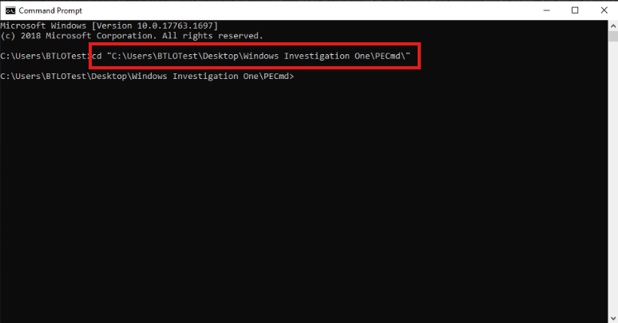<br>
  <em>Figure 6: Navigating to PECmd in CMD</em>
</p>

##### 🔷 Phase 2.3 — Parse the CMD.EXE Prefetch file

The target Prefetch file was:

```text
CMD.EXE-89305D47.pf
```

The command used was:

```cmd
PECmd.exe -f "C:\Users\BTLOTest\Desktop\Windows Investigation One\Prefetch\CMD.EXE-89305D47.pf"
```

Command breakdown:

```text
PECmd.exe
```

Runs PECmd, a Prefetch parser from Eric Zimmerman's forensic toolset.

```text
-f
```

Tells PECmd to parse a single file.

```text
"C:\Users\BTLOTest\Desktop\Windows Investigation One\Prefetch\CMD.EXE-89305D47.pf"
```

Specifies the exact Prefetch file being analyzed.

<p align="left">
  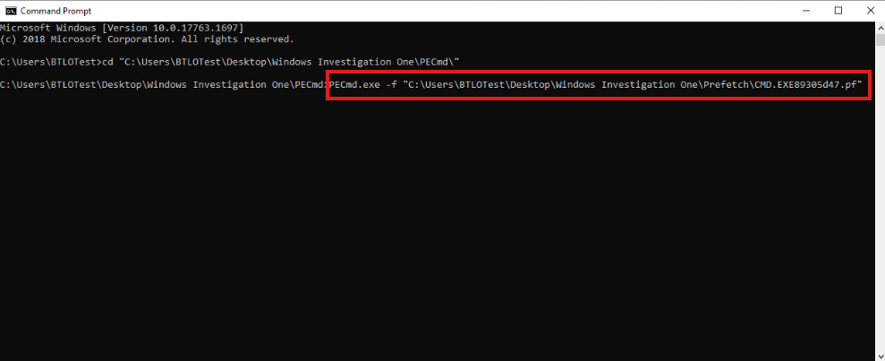<br>
  <em>Figure 7: Parsing the CMD.EXE Prefetch artifact using PECmd.</em>
</p>

Before analyzing the Prefetch artifact, I needed to decide which Prefetch file was most likely to contain information relevant to the suspicious activity.

During Phase 1, the shortcut analysis identified `PlagueRat.ps1.lnk` which suggested the presence of a PowerShell-related file. However, at this stage, there was no direct evidence showing how the script was executed.

The environment specifically directed the analysis toward `CMD.EXE-89305D47.pf` which is the Prefetch artifact associated with Windows Command Prompt (CMD.EXE).

This was a logical artifact to review because command-line tools are commonly involved in script execution. Batch files (.bat) execute through Command Prompt, and Command Prompt can also launch PowerShell scripts and other executables. Because Prefetch artifacts often preserve references to files accessed during execution, reviewing the CMD.EXE Prefetch file provided an opportunity to determine whether Command Prompt had interacted with any PlagueRat-related files.

<blockquote> At this stage, I was not assuming that CMD.EXE executed PlagueRat. The goal was simply to review an execution-related artifact that had the potential to contain references to suspicious files. The evidence discovered in the Prefetch output would determine whether a relationship actually existed. </blockquote>

##### 🔷 Phase 2.4 — Locate the PlagueRat reference

After running PECmd against the CMD.EXE Prefetch artifact, I reviewed the output for references to suspicious files.

The output contains a section labeled:

`Files referenced`

This section lists files that were referenced during activity associated with the executable represented by the Prefetch artifact. Since this artifact belongs to CMD.EXE, the referenced files may provide insight into what Command Prompt interacted with during execution.

Reviewing the output revealed a notable entry on Line 13:

`\USERS\IEUSER\PICTURES\SAVED PICTURES\2020_SUMMER_PHOTOS\2020 SUMMER PHOTOS\PLAGUERAT.BAT`

This path was useful because it showed where the file existed on the system.

Breaking down the path:

```text
\USERS\IEUSER\
```

indicates the user profile involved.

```text
PICTURES\SAVED PICTURES\
```

suggests the file was located in a user-accessible picture-related location.

```text
2020_SUMMER_PHOTOS\2020 SUMMER PHOTOS\
```

matches the social-engineering theme observed in the shortcut artifacts.

```text
PLAGUERAT.BAT
```

is the suspicious batch file.

<p align="left">
  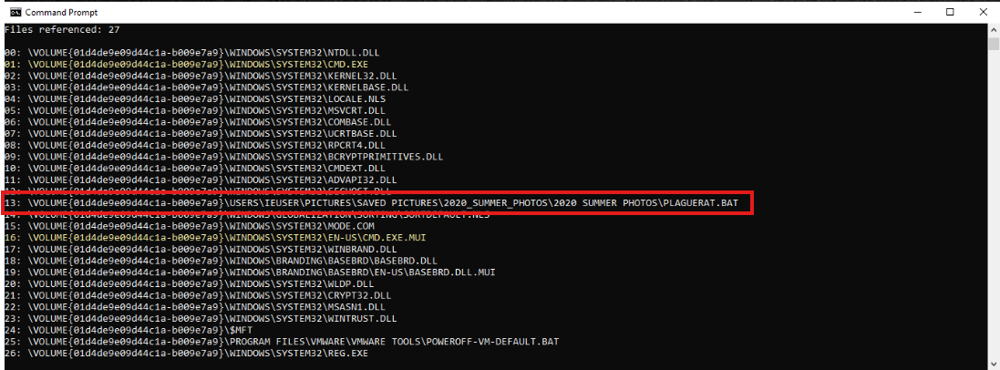<br>
  <em>Figure 8: Locating PlagueRat reference.</em>
</p>

Interestingly, the CMD.EXE Prefetch artifact did not reference PlagueRat.ps1 directly. Instead, it referenced a related file named PlagueRat.bat. While the relationship between the two files cannot be conclusively determined from this artifact alone, the shared naming convention suggests they may be associated with the same activity or malware package.

This finding was interesting also because the shortcut analysis from Phase 1 identified: `PlagueRat.ps1.lnk` which suggested the presence of a PowerShell script named `PlagueRat.ps1`. However, the Prefetch artifact revealed: `PlagueRat.bat` which is a Windows batch script. 

<blockquote>
A batch script (.bat) is executed through Command Prompt and can contain commands that launch programs, execute scripts, modify files, or call other scripting engines such as PowerShell.
</blockquote>

At this stage, the artifacts suggest that multiple PlagueRat-related files may have existed on the system. Rather than assuming they are the same file, the safer forensic approach is to document both findings and continue gathering evidence from additional artifact sources.

This finding was important because it established a direct relationship between the CMD.EXE Prefetch artifact and a suspicious batch file named `PlagueRat.bat`. While the shortcut artifacts pointed toward a PowerShell-related file, the Prefetch artifact showed evidence of a batch file associated with Command Prompt activity. This justified further investigation into additional Prefetch artifacts to determine how the files were related.

This was important because it connected the suspicious batch file to the CMD.EXE Prefetch artifact.

> **Note:** Before analyzing the Prefetch artifact, it is helpful to understand what `CMD.EXE` is and why its Prefetch file may contain useful evidence.
>
> `CMD.EXE` is the executable behind the Windows Command Prompt. When a user opens Command Prompt by typing `cmd` in the Start Menu or executes commands through a command-line window, they are interacting with `CMD.EXE`. For example, when I opened Command Prompt and ran commands such as `dir`, `cd`, `copy`, or `move`, those commands were being executed through `CMD.EXE`.
>
> Command Prompt can also be used to launch scripts and other programs. One common example is a Windows batch file (`.bat`). Batch files contain a series of commands that are executed automatically through Command Prompt. For example, a file named `PlagueRat.bat` would normally be executed by `CMD.EXE`.
>
> During Phase 1, the shortcut analysis identified `PlagueRat.ps1.lnk`, which suggested the presence of a PowerShell-related file. However, shortcut artifacts primarily tell us that a file existed or was accessed. They do not necessarily tell us whether anything executed.
>
> To look for execution-related evidence, I moved to Prefetch analysis. The lab directed the investigation toward `CMD.EXE-89305D47.pf`, which is the Prefetch artifact associated with Windows Command Prompt.
>
> A Prefetch file is named after the executable that generated it. Therefore, `CMD.EXE-89305D47.pf` tells us that Windows created this artifact because `CMD.EXE` executed on the system.
>
> More importantly, Prefetch artifacts can preserve information about files and directories that were referenced during execution. Because Command Prompt is commonly used to execute batch files and launch scripts, reviewing the `CMD.EXE` Prefetch artifact provided an opportunity to determine whether any PlagueRat-related files appeared in execution-related evidence.
>
> At this stage, I did not yet know what relationship existed between `CMD.EXE` and PlagueRat. The purpose of reviewing the artifact was to determine whether Command Prompt activity referenced any suspicious files and whether additional evidence existed beyond the shortcut artifacts identified earlier in the workflow.


##### 🔷 Phase 2.5 — Phase 2 findings

Prefetch analysis of `CMD.EXE-89305D47.pf` produced two important findings:

| Question | Finding |
|---|---|
| Full PlagueRat filename in CMD.EXE Prefetch | `PlagueRat.bat` |
| Full PlagueRat path | `\USERS\IEUSER\PICTURES\SAVED PICTURES\2020_SUMMER_PHOTOS\2020 SUMMER PHOTOS\PLAGUERAT.BAT` |

<blockquote>
This phase moved the analysis from file origin evidence to execution-related evidence. The shortcut artifacts showed where PlagueRat came from, while the Prefetch artifact showed that Command Prompt had a relationship with the suspicious batch file. This made the activity more concerning and justified searching across additional Prefetch files.
</blockquote>

</details>

<details>
<summary><strong>▶ Phase 3 — Search All Prefetch Files for PlagueRat.ps1</strong><br>
→ identifying applications that interacted with the PowerShell script
</summary><br>

This phase focused on searching across all Prefetch files for references to `plaguerat.ps1`.

<blockquote>
After identifying PlagueRat.bat, the next step was to determine whether a related PowerShell script was involved. PowerShell is commonly used in Windows administration, but it is also frequently abused by attackers because it can run scripts, download payloads, execute commands, and interact with the operating system. Searching for `plaguerat.ps1` helped identify which applications interacted with the script.
</blockquote>

##### 🔷 Phase 3.1 — Understand why a directory-wide search was needed

In Phase 2, only one Prefetch file was analyzed:

```text
CMD.EXE-89305D47.pf
```

That was useful, but it only showed information related to one executable. To determine whether other applications interacted with `plaguerat.ps1`, I needed to search across the entire Prefetch directory. This approach is useful because each executable may have its own Prefetch file. If a suspicious file appears in more than one Prefetch artifact, that can reveal multiple applications involved in the activity.

##### 🔷 Phase 3.2 — Run PECmd against the full Prefetch directory

The command used was:

```cmd
PECmd.exe -k "plaguerat.ps1" -d "C:\Users\BTLOTest\Desktop\Windows Investigation One\Prefetch\"
```

Command breakdown:

```text
PECmd.exe
```

Runs the Prefetch parsing tool.

```text
-k "plaguerat.ps1"
```

Searches for and highlights the keyword `plaguerat.ps1` in the parsed output.

```text
-d
```

Tells PECmd to process a directory instead of a single file.

```text
"C:\Users\BTLOTest\Desktop\Windows Investigation One\Prefetch\"
```

Specifies the Prefetch directory to parse.

Using the `-k` option made the search easier because matching rows were highlighted in red. However, highlighted lines still needed to be reviewed carefully because not every red-highlighted line is automatically relevant. The analyst still has to confirm that the highlighted text actually matches the suspicious file or supports the investigation.

<p align="left">
  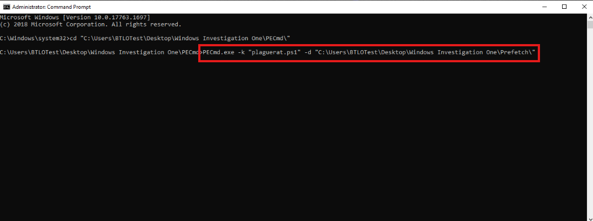<br>
  <em>Figure 9: Searching all Prefetch files for references to plaguerat.ps1.</em>
</p>

The format of the output:

```
PECmd output
├─ Section for CMD.EXE-89305D47.pf
│     └─ contains references
│
├─ Section for POWERSHELL.EXE-59FC8F3D.pf
│     └─ contains references
│
├─ Section for NOTEPAD.EXE-....
│     └─ contains references
│
└─ etc.
```

##### 🔷 Phase 3.3 — Review the first relevant match

After running the directory-wide search, I reviewed the highlighted results for references to:

```text
plaguerat.ps1
```

> **Note:** When using PECmd with the `-k` option, it is important to understand that not every red-highlighted line is necessarily relevant to the investigation. The `-k "plaguerat.ps1"` argument instructs PECmd to highlight references to the specified string, but PECmd may also highlight additional entries based on its own built-in matching behavior. Because of this, analysts should not assume that every highlighted line is related to the suspicious file.
>
> Instead, the output should be reviewed carefully for explicit references to:
>
> ```text
> plaguerat.ps1
> ```
>
> Once a matching reference is identified, the surrounding Prefetch output can be examined to determine which executable generated the artifact. This approach helps identify applications that interacted with the suspicious script while avoiding false assumptions based solely on highlighted output.
>
> During this investigation, I searched the Prefetch directory for references to `plaguerat.ps1` and reviewed only the relevant matches. By tracing those matches back to their associated Prefetch artifacts, I identified the executables that interacted with the script and used those findings to support the overall activity reconstruction.

The first relevant match appeared on line 198:

`\USERS\IEUSER\PICTURES\SAVED PICTURES\2020_SUMMER_PHOTOS\2020 SUMMER PHOTOS\PLAGUERAT.PS1`

<p align="left">
  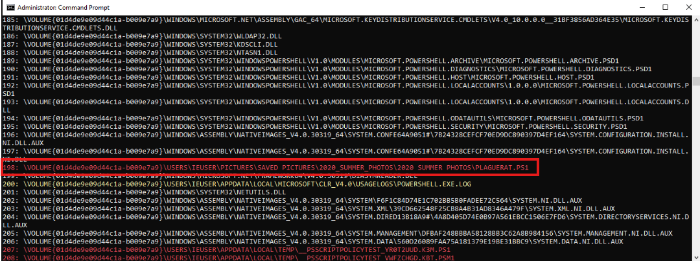<br>
  <em>Figure 10: Reviewing first highlighted Prefetch match for plaguerat.ps1.</em>
</p>

At this point, I needed to determine which application's Prefetch artifact contained this reference. To do this, I scrolled upward through the output until I reached the beginning of the current Prefetch section.

Each section in PECmd's output represents a different Prefetch file being parsed. The beginning of a section contains information about the Prefetch file itself, including:

- The Prefetch filename being processed
- The executable associated with the artifact
- Run count information
- Last execution timestamps

After reaching the top of the section, I identified:

`POWERSHELL.EXE-59FC8F3D.pf` and the associated executable: `POWERSHELL.EXE`.

This told me that the reference to `PlagueRat.ps1` was found within the Prefetch artifact associated with Windows PowerShell.

<p align="left">
  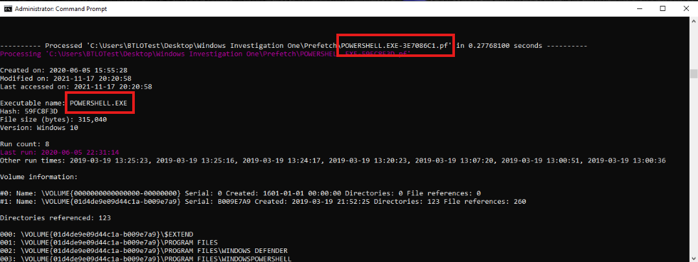<br>
  <em>Figure 11: Reviewing first Prefetch artifact.</em>
</p>

This finding was significant because it established a relationship between the suspicious PowerShell script and the PowerShell executable itself. While the artifact does not prove exactly how the script was executed, it does show that PlagueRat.ps1 appeared within a Prefetch artifact generated by POWERSHELL.EXE, making PowerShell one of the applications associated with the suspicious activity.

The second relevant match appeared on line 62:

`\USERS\IEUSER\PICTURES\SAVED PICTURES\2020_SUMMER_PHOTOS\2020 SUMMER PHOTOS\PLAGUERAT.PS1`

<p align="left">
  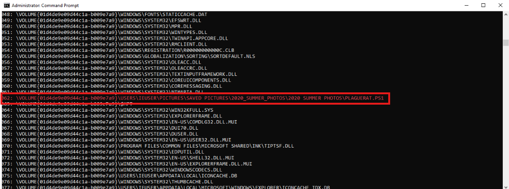<br>
  <em>Figure 12: Reviewing second highlighted Prefetch match for plaguerat.ps1.</em>
</p>

Again, I needed to determine which application's Prefetch artifact contained this reference. To do this, I scrolled upward through the output until I reached the beginning of the current Prefetch section. After reaching the top of the section, I identified:

`LOGONUI.EXE-1BEE4A84.pf`and the associated executable: `NOTEPAD.EXE`.

<p align="left">
  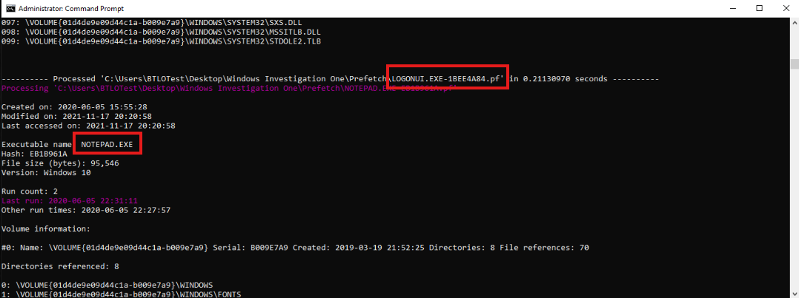<br>
  <em>Figure 13: Reviewing second Prefetch artifact.</em>
</p>


##### 🔷 Phase 3.4 — Trace the match back to the executable

After finding the highlighted `plaguerat.ps1` line, I reviewed the surrounding output to determine which executable the Prefetch section belonged to.

This step was important because a keyword match alone does not tell the full story. The analyst needs to connect the file reference to the executable responsible for the Prefetch artifact.

One associated executable identified was:

```text
POWERSHELL.EXE
```

This indicated that PowerShell interacted with the suspicious script.

Second associated executable identified was:

```text
NOTEPAD.EXE
```

This indicated that Notepad also interacted with the suspicious script.

This finding suggests that the suspicious PowerShell script was not only associated with PowerShell execution activity, but was also opened or viewed using Notepad. This makes sense because PowerShell scripts are text-based files and can be opened in text editors such as Notepad for viewing or modification. Unlike the PowerShell artifact, which may indicate execution-related activity, the Notepad artifact does not necessarily indicate that the script was executed. Instead, it suggests that the file was accessed through a text editor at some point in time.

##### 🔷 Phase 3.5 — Interpret the Application Findings

The two applications identified were:

```text
NOTEPAD.EXE
POWERSHELL.EXE
```

This was important because each application provides a different type of context regarding how `PlagueRat.ps1` may have been used on the system.

`NOTEPAD.EXE` is a simple text editor included with Windows. Because PowerShell scripts are text-based files, they can be opened in Notepad for viewing or editing. The presence of `PlagueRat.ps1` within the NOTEPAD.EXE Prefetch artifact suggests that the script was accessed through a text editor at some point in time.

`POWERSHELL.EXE` is the Windows PowerShell executable. It is capable of executing PowerShell scripts, interacting with Windows APIs, automating administrative tasks, and running complex commands. The presence of `PlagueRat.ps1` within the POWERSHELL.EXE Prefetch artifact suggests that the script was associated with PowerShell activity on the system.

Together, these findings indicate that the suspicious script was not only viewed or accessed through a text editor, but was also associated with PowerShell activity. While the artifacts alone do not prove exactly how the script was used, they provide valuable context regarding the applications that interacted with the file.

##### 🔷 Phase 3.6 — Phase 3 Findings

The Prefetch directory-wide keyword search identified two applications that opened or interacted with `PlagueRat.ps1`:

| Application      | Significance                                    |
| ---------------- | ----------------------------------------------- |
| `NOTEPAD.EXE`    | Text editor activity associated with the script |
| `POWERSHELL.EXE` | PowerShell activity associated with the script  |

<blockquote>
This phase demonstrated why directory-wide artifact hunting is useful. An analyst may start with one known artifact, but broader searching can reveal additional applications involved in the same activity. In this case, the evidence showed that both Notepad and PowerShell interacted with `PlagueRat.ps1`, providing additional insight into how the file may have been accessed and used on the system.
</blockquote>


</details>

<details>
<summary><strong>▶ Phase 4 — Analyze Jump List Artifacts Using JumpList Explorer</strong><br>
→ identifying website activity and browser used
</summary><br>

This phase focused on reviewing Jump List artifacts to identify user activity associated with a website.

<blockquote>
After reviewing file access and execution artifacts, I moved into Jump List analysis to identify user activity context. Jump Lists are useful because they can show what a user recently accessed through an application. Since the question involved a website, browser-related Jump List entries were the best place to start.
</blockquote>

##### 🔷 Phase 4.1 — Understand what Jump Lists are

Jump Lists are Windows artifacts associated with application activity.

From a user perspective, Jump Lists may appear when right-clicking an application icon in the taskbar or Start menu. They may show recently opened files, frequent locations, or recent resources.

From a forensic perspective, Jump Lists can be useful because they may preserve information about:

- recently accessed files,
- recently accessed folders,
- application usage,
- visited websites,
- user interaction history.

The information available depends on the application. For browsers, Jump Lists may contain web-related entries.

##### 🔷 Phase 4.2 — Load and Review the Jump List Artifacts

JumpList Explorer was opened and the Jump List files provided by the lab were loaded into the application.

The previous phases of the investigation focused on identifying suspicious files and determining which applications interacted with them. However, neither shortcut artifacts nor Prefetch artifacts are particularly useful for identifying websites visited by a user.

Because the investigation required identifying a visited website, I shifted my focus toward browser-related artifacts. Jump Lists are useful for this type of analysis because they can preserve records of files, folders, documents, and websites accessed through specific applications.

After loading the artifacts, several application entries became available, including:

- Quick Access
- Control Panel - Settings
- Notepad 64-bit
- Edge Browser
- Windows WordPad
- Windows PowerShell 5.0 64-bit

Since the investigation question involved website activity, I focused on the entries associated with:

`Edge Browser`

##### 🔷 Phase 4.3 — Evaluate the Edge Browser Artifacts

Two separate Edge Browser Jump List artifacts were present within the dataset.

The first Edge Browser artifact contained:

```
Jump List Type: Automatic
Link File Count: 1
```

The second Edge Browser artifact contained:

```
Jump List Type: Custom
Link File Count: 10
```

Rather than assuming both artifacts contained useful website information, I reviewed each one individually.

When examining the second Edge Browser artifact, the lower details pane primarily contained Microsoft Edge application references and metadata. While this confirmed the artifact was associated with Edge, it did not reveal any website activity that would help answer the investigation question.

The first Edge Browser artifact, however, contained an entry that included a URL reference. Because the investigation objective was to identify a website visited by the user, this artifact became the primary focus of the analysis.

##### 🔷 Phase 4.4 — Identify the Visited Domain

After selecting the Edge Browser artifact and reviewing the lower panes of JumpList Explorer, I identified an entry containing the following URL:

`https://discordapp.com/...`

The URL appeared within the artifact details pane and represented a resource that had been accessed through Microsoft Edge. From the URL, the visited domain was identified as: `discordapp.com`.

<p align="left">
  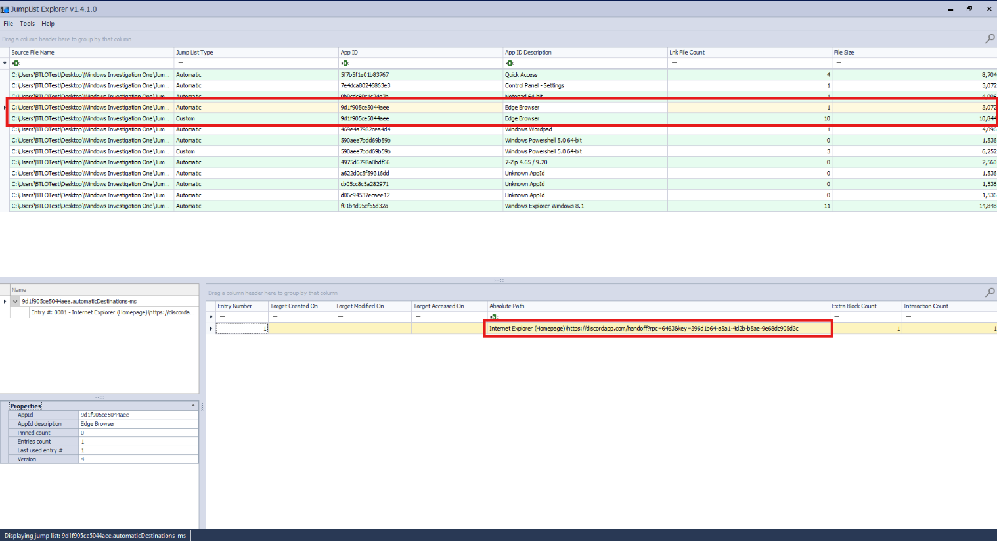<br>
  <em>Figure 14: Identifying the visited domain.</em>
</p>


This finding demonstrated how Jump Lists can preserve evidence of resources accessed through a specific application.

##### 🔷 Phase 4.5 — Identify the Browser Used

The URL was discovered within a Jump List artifact associated with:

`Edge Browser`

Because the URL appeared within the Edge Browser Jump List, the evidence indicates that Microsoft Edge was the browser used to access the website.

##### 🔷 Phase 4.6 — Phase 4 Findings

Jump List analysis produced two important findings:

| Question | Finding |
|---|---|
| Domain visited | `discordapp.com` |
| Browser used | `Microsoft Edge` |

Question	Finding
Domain visited	discordapp.com
Browser used	Microsoft Edge


<blockquote>
This phase showed how Jump Lists can provide user activity context that is not necessarily available from shortcut or Prefetch artifacts. Shortcut files helped identify file origin, Prefetch helped identify execution-related evidence, and Jump Lists helped identify browser activity.
</blockquote>

</details>

---

### Artifact Correlation

The most important part of this workflow was not simply collecting separate answers. The stronger forensic value came from correlating the artifacts together.

Each artifact source answered a different part of the activity chain.

#### Shortcut Artifacts

Shortcut artifacts showed:

- the suspicious file name,
- the ZIP archive it came from,
- another file associated with the same archive.

Findings:

```text
PlagueRat.bat
2020_Summer_Photos.zip
2020_Summer_Photos.jpg.lnk
```

Shortcut artifacts helped answer:

- What suspicious file was present?
- Where did it appear to come from?
- What else was packaged with it?

#### Prefetch Artifacts

Prefetch artifacts showed:

- the suspicious batch file referenced by CMD.EXE,
- the full path of the suspicious file,
- applications that interacted with the PowerShell script.

Findings:

```text
PlagueRat.bat
\USERS\IEUSER\PICTURES\SAVED PICTURES\2020_SUMMER_PHOTOS\2020 SUMMER PHOTOS\PLAGUERAT.BAT
NOTEPAD.EXE
POWERSHELL.EXE
```

Prefetch artifacts helped answer:

- Was there execution-related evidence?
- Which executable referenced the suspicious file?
- Where was the suspicious file located?
- Which applications interacted with the related PowerShell script?

#### Jump List Artifacts

Jump List artifacts showed:

- a domain visited by the user,
- the browser used to access that domain.

Findings:

```text
discordapp.com
Microsoft Edge
```

Jump List artifacts helped answer:

- What website was accessed?
- Which browser was used?

#### Combined Interpretation

Digital forensic investigations rarely rely on a single artifact. Instead, investigators correlate multiple artifact sources to build a more complete picture of activity that occurred on a system.

Each artifact examined during this investigation answered a different question:

* **Shortcut artifacts (`.LNK`)** helped identify suspicious files and where they originated.
* **Prefetch artifacts (`.pf`)** helped identify applications that interacted with those files and provided execution-related context.
* **Jump List artifacts** helped identify resources accessed through specific applications, including browser activity.

When analyzed together, the artifacts supported the following activity reconstruction.

##### 1. Identification of a Suspicious File

The investigation began with shortcut (`.LNK`) analysis.

A shortcut artifact named:

```text
PlagueRat.ps1.lnk
```

was identified within the evidence.

A shortcut file does not contain the actual file itself. Instead, it acts as a pointer to another file and often preserves metadata about that file, including its name, location, and access history.

Because the file name contained the term "PlagueRat" and referenced a PowerShell script (`.ps1`), it became the primary focus of the investigation.

##### 2. Determining the File's Origin

Further shortcut analysis revealed that the suspicious file was associated with:

```text
2020_Summer_Photos.zip
```

The same archive was also associated with:

```text
Invoice537-PR-06-05-2020.docx
```

This finding was important because it provided context regarding where the suspicious file originated.

Rather than appearing as an isolated file on the system, the evidence suggested that the PowerShell script was distributed alongside other files within a compressed archive.

##### 3. Looking for Execution-Related Evidence

At this stage, the shortcut artifacts showed that the file existed and provided information about its origin. However, they did not indicate whether the file was ever executed.

To answer that question, the investigation moved to Prefetch analysis.

Prefetch files are Windows artifacts automatically created when applications execute. While they are primarily designed to improve application startup performance, they are valuable forensic artifacts because they can reveal information about executed applications and files referenced during execution.

Analysis of the CMD.EXE Prefetch artifact revealed a reference to:

```text
PlagueRat.bat
```

and preserved the full path associated with the file.

This finding established a relationship between Command Prompt activity and a file using the same "PlagueRat" naming convention. While the artifact alone did not prove exactly how the files were related, it suggested that command-line activity was involved.

##### 4. Expanding the Investigation

To determine whether additional applications interacted with the suspicious script, a keyword search was performed across all available Prefetch artifacts.

This broader search identified references to:

```text
PlagueRat.ps1
```

within Prefetch artifacts associated with:

```text
NOTEPAD.EXE
POWERSHELL.EXE
```

These findings provided additional context regarding how the script may have been used.

* `NOTEPAD.EXE` suggested that the script was viewed or edited as a text file.
* `POWERSHELL.EXE` suggested that the script was associated with PowerShell activity on the system.

This demonstrated why reviewing multiple Prefetch artifacts is important. A single artifact may provide only a partial view of activity, while broader analysis can reveal additional applications involved with the same file.

##### 5. Identifying User Activity

The final phase of the investigation shifted focus from file activity to user activity.

While shortcut and Prefetch artifacts helped identify files and application activity, they were not designed to track website access. To investigate browser activity, Jump List artifacts were examined.

Jump Lists are Windows artifacts that maintain records of resources accessed through specific applications. For web browsers, these resources may include recently visited websites.

Reviewing the Microsoft Edge Jump List revealed a URL containing the domain:

```text
discordapp.com
```

Because the URL was found within a Jump List associated with Microsoft Edge, the evidence indicated that the website was accessed using:

```text
Microsoft Edge
```

##### Overall Conclusion

No single artifact provided a complete picture of activity on the system.

Instead, the investigation relied on correlating multiple Windows artifacts that each contributed a different piece of information.

| Artifact Type           | Question Answered                                           | Key Finding                                                                   |
| ----------------------- | ----------------------------------------------------------- | ----------------------------------------------------------------------------- |
| Shortcut Files (`.LNK`) | What suspicious files existed and where did they originate? | Identified `PlagueRat.ps1.lnk` and its associated archive                     |
| Prefetch Files (`.pf`)  | What applications interacted with the suspicious files?     | Identified activity involving CMD.EXE, NOTEPAD.EXE, and POWERSHELL.EXE        |
| Jump Lists              | What resources were accessed through applications?          | Identified browser activity involving `discordapp.com` through Microsoft Edge |

Taken together, these artifacts demonstrated how multiple forensic data sources can be correlated to reconstruct user and application activity on a Windows system. While each artifact provided only part of the story, combining them produced a more complete understanding of the events preserved within the evidence.

---

### Evidence Examination Summary

| Task | Artifact Source | Tool | Finding |
|---|---|---|---|
| Identify full PlagueRat filename | Shortcut files | WFA | `PlagueRat.bat` |
| Identify ZIP archive source | Shortcut files | WFA | `2020_Summer_Photos.zip` |
| Identify other archive content | Shortcut files | WFA | `2020_Summer_Photos.jpg.lnk` |
| Identify PlagueRat filename in CMD Prefetch | Prefetch | PECmd | `PlagueRat.bat` |
| Identify full PlagueRat path | Prefetch | PECmd | `\USERS\IEUSER\PICTURES\SAVED PICTURES\2020_SUMMER_PHOTOS\2020 SUMMER PHOTOS\PLAGUERAT.BAT` |
| Identify applications that opened PlagueRat.ps1 | Prefetch | PECmd | `NOTEPAD.EXE`, `POWERSHELL.EXE` |
| Identify visited domain | Jump Lists | JumpList Explorer | `discordapp.com` |
| Identify browser used | Jump Lists | JumpList Explorer | `Microsoft Edge` |

---

### What I Learned (Skills Demonstrated)

Through this workflow, I learned how to:

- Analyze Windows shortcut artifacts.
- Understand what `.LNK` files are and why they matter.
- Use Windows File Analyzer to parse shortcut metadata.
- Review filename and linked path fields.
- Trace a suspicious file back to a ZIP archive.
- Identify additional files associated with the same archive.
- Understand what Prefetch files are and how they support execution analysis.
- Use PECmd to parse a single Prefetch file.
- Use PECmd to search an entire Prefetch directory.
- Interpret highlighted keyword matches carefully.
- Identify executables associated with suspicious script references.
- Understand the forensic difference between file access evidence and execution-related evidence.
- Analyze Jump List artifacts.
- Understand how Jump Lists preserve application-specific activity.
- Identify browser activity from Jump List artifacts.
- Correlate shortcut, Prefetch, and Jump List findings.
- Document a repeatable Windows forensic artifact analysis workflow.

This workflow strengthened my understanding that forensic evidence often exists across multiple artifact types. A shortcut file may reveal where something came from. A Prefetch file may show execution-related activity. A Jump List may reveal user activity. Correlating these artifacts together allows an analyst to reconstruct events with more confidence.

---

### Final Conclusion

This workflow demonstrated how Windows forensic artifacts can be used to reconstruct suspicious activity involving a file named `PlagueRat`.

The shortcut artifacts identified the suspicious batch file, the ZIP archive it came from, and another file packaged with it. The Prefetch artifacts provided execution-related context, including the full file path and the applications associated with `plaguerat.ps1`. The Jump List artifacts added user activity context by identifying a visited domain and the browser used.

Together, the artifacts showed how a suspicious file can be traced across file access, execution, and user activity evidence sources.

The final key findings were:

```text
Suspicious file: PlagueRat.bat
Archive source: 2020_Summer_Photos.zip
Related archive file: 2020_Summer_Photos.jpg.lnk
Full path: \USERS\IEUSER\PICTURES\SAVED PICTURES\2020_SUMMER_PHOTOS\2020 SUMMER PHOTOS\PLAGUERAT.BAT
Applications involved: NOTEPAD.EXE, POWERSHELL.EXE
Visited domain: discordapp.com
Browser used: Microsoft Edge
```
