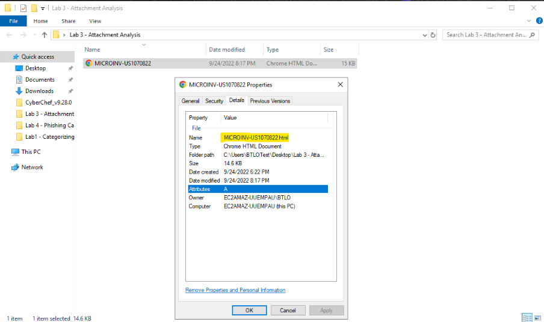
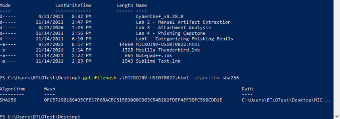
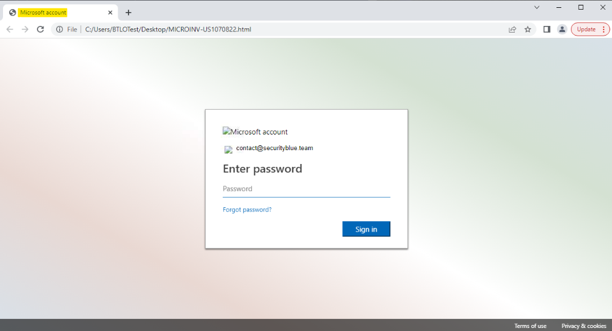
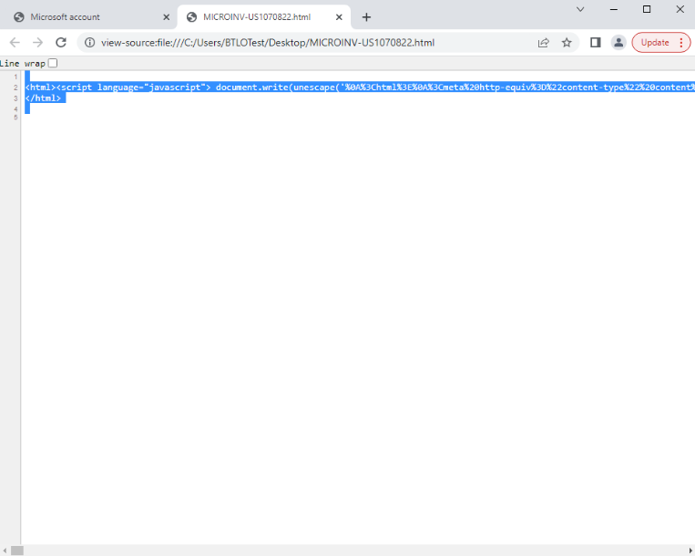
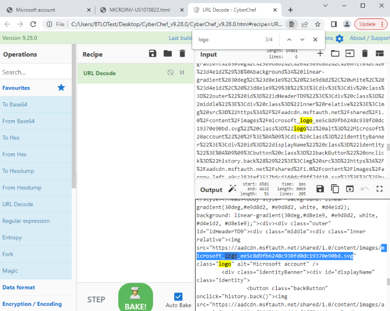
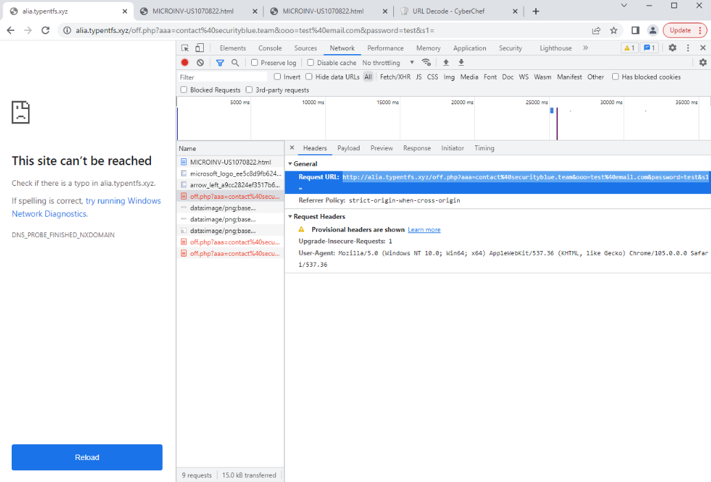

# Attachment-Based Phishing Artifact Analysis Using PowerShell, CyberChef, and Browser Developer Tools

This workflow demonstrates manual analysis of a phishing attachment that impersonates a legitimate Microsoft login portal and captures user credentials through an HTML-based credential harvesting page. It highlights how analysts move from safe file handling into rendered page analysis, source inspection, decoding, and network validation to confirm malicious behavior.

### Overview

This workflow documents practical phishing attachment analysis using Windows file properties, PowerShell, CyberChef, and browser-based inspection tools to identify suspicious file characteristics and validate credential harvesting behavior. The workflow focuses on confirming that the attachment is an HTML-based phishing interface, understanding how it presents itself to the victim, extracting meaningful artifacts from the page source, and verifying how submitted credentials are sent to attacker-controlled infrastructure.

The analysis progresses through structured phases beginning with safe file inspection and metadata collection, then moving into rendered page review, targeted victim identification, source-code analysis, decoding, and network validation. The workflow demonstrates how attachment-based phishing analysis complements broader phishing triage by showing that the malicious logic can live inside the attachment itself rather than only in the email body or linked destination.

> **Workflow vs Execution vs Writeup (Terminology Used Here)**
> - **Workflows** refer to operational tasks such as phishing triage, attachment validation, and credential theft analysis.
> - **Executions** refer to hands-on performance of those tasks using real artifacts, analyst tools, and supporting investigation utilities.
> - **Writeups** document extraction decisions, validation steps, and investigative conclusions.

> 👉 For a **detailed, step-by-step walkthrough of how this workflow was executed — complete with screenshots**, see the **[Step-by-Step Execution](#step-by-step-execution)** section below.

---

### Purpose and Analyst Focus

#### ▶ Purpose

The purpose of this workflow is to analyze a suspicious phishing attachment and validate whether it functions as a credential harvesting mechanism. The workflow focuses on understanding what the file actually is, how it presents itself when opened, whether it impersonates a legitimate service, what victim information is embedded in the page, and how the attachment transmits captured credentials to attacker infrastructure.

The workflow demonstrates how attachment analysis supports phishing validation, investigative scoping, and credential theft assessment. It emphasizes how analysts use file metadata, rendered HTML behavior, decoded source code, and browser network activity together to move from a suspicious file to a defensible phishing conclusion.

#### ▶ Analyst Focus

The analyst focus is on treating the attachment as both a file artifact and an active phishing system. This means not relying only on the filename or extension, but also validating what the page actually does once rendered in a browser.

The workflow reflects responsibilities commonly performed by SOC analysts, email security analysts, and incident responders when reviewing suspicious attachments that may be designed to capture credentials. It reinforces the importance of moving beyond surface-level appearance and confirming how the artifact behaves, how it is structured, and how data leaves the victim environment.

---

### What This Workflow Demonstrates

This workflow demonstrates an end-to-end review process for an HTML phishing attachment designed to impersonate a legitimate login page. Specifically, it demonstrates how to:

- Identify and document key file artifacts such as the filename, file extension, file size, and file hash before interacting more deeply with the attachment.
- Distinguish between a normal document-style attachment and an HTML file that functions as a rendered phishing interface.
- Open the attachment in a browser to determine what service or brand is being impersonated and what experience the victim would see.
- Identify whether the phishing page is generic or targeted by examining pre-filled user information in the rendered form.
- Use browser source inspection and CyberChef decoding to reveal hidden or encoded content inside the page.
- Search decoded content for branding artifacts that support impersonation analysis and phishing kit identification.
- Use browser Developer Tools to validate how entered credentials are submitted and what infrastructure receives them.

---

### Investigation and Detection Relevance

Phishing attachments are not always documents or executables. In many cases, an attacker can deliver a locally rendered HTML page that mimics a trusted login portal and captures credentials without requiring the victim to click an external link first.

Manual artifact extraction is especially useful when:

- a suspicious attachment is reported and must be validated without detonating it in a sandbox,
- the file appears simple or low-risk but may actually function as a phishing kit,
- the analyst needs to understand whether the page is generic or preconfigured for a specific recipient,
- network activity must be validated directly to confirm that credentials are being transmitted externally.

The workflow’s steps map directly to common security questions, including:

- Is this attachment simply a file, or is it a functioning credential theft interface?
- What service is the page trying to impersonate?
- Is the phishing page aimed at a specific recipient?
- Does the page contain encoded content or kit artifacts that are not obvious in the rendered browser view?
- Where do submitted credentials actually go, and how are they transmitted?

By documenting repeatable procedures for file review, page inspection, source decoding, and network validation, this workflow supports defensible reporting and gives analysts a concrete process for validating malicious HTML-based attachments.

---

### Environment and Execution Context

This section documents the tools, evidence sources, and constraints used to perform the workflow so that results can be interpreted consistently and reproduced by another analyst.

**Note:** Each section is collapsible. Click the ▶ arrow to expand and view details on software, tools, environment, data sources, and more.

<details>
<summary><strong>▶ Environment & Platform</strong><br>
</summary><br>

Attachment analysis was performed in a Windows desktop environment with local access to the suspicious file. File metadata was reviewed through Windows properties and PowerShell, rendered page behavior was reviewed in a browser, and source code analysis was supported through browser source inspection and CyberChef.

</details>

<details>
<summary><strong>▶ Tooling and Constraints</strong><br>
</summary><br>

- **File metadata review:** Windows file properties
- **File hashing tool:** PowerShell
- **Rendered page analysis:** Chrome browser
- **Source inspection:** Browser “View Source”
- **Decoding utility:** CyberChef
- **Credential submission validation:** Chrome Developer Tools (Network tab)

The workflow intentionally relies on common analyst tools rather than automated detonation or sandbox infrastructure so that the attachment can be understood manually and each validation step can be explained clearly.

</details>

<details>
<summary><strong>▶ Data Sources Analyzed</strong><br>
</summary><br>

The workflow used the following evidence sources:

- **Suspicious HTML attachment** located in the lab directory
- **File metadata** including filename, extension, file size, and hash value
- **Rendered phishing page** opened locally in a browser
- **Pre-filled victim data** visible in the login form
- **Page source code** copied from the browser
- **Decoded source output** reviewed in CyberChef
- **Browser network requests** generated during form submission testing

</details>

<details>
<summary><strong>▶ Workflow Map (High-Level)</strong><br>
</summary><br>

1. Locate the suspicious attachment and document the file metadata before deeper interaction.
2. Generate a cryptographic hash to create a stable file identifier.
3. Open the file in a controlled browser context to determine what service is being impersonated.
4. Review the rendered page to identify whether the phishing artifact is targeted to a specific victim.
5. Inspect and decode the source code to reveal hidden or encoded content.
6. Use Developer Tools to validate how submitted credentials are sent to the attacker.
7. Correlate file, page, source, and network findings to determine whether the attachment functions as a credential harvesting mechanism.

</details>

---

### Step-by-Step Execution

This section documents the workflow in the same order an analyst would realistically perform attachment-based phishing analysis using file metadata review, browser rendering, source-code inspection, and network validation. The process begins with safe handling of the suspicious attachment so that the file can be identified without prematurely interacting with it. Analysis then progresses into rendered page review to understand the victim-facing experience, then into source-code decoding and outbound request analysis to determine whether the page is actually designed to steal credentials.

Each phase captures both the technical actions performed and the investigative reasoning behind those actions. The workflow intentionally progresses from broad identification into targeted validation, mirroring how analysts move from “this attachment looks suspicious” to “this attachment is a functioning credential harvesting mechanism.”

**Note:** Each section is collapsible. Click the ▶ arrow to expand and view the detailed steps.

<details>
<summary><strong>▶ Phase 1 — Initial File Review and Metadata Collection</strong><br>
→ identifying the attachment as a suspicious HTML-based artifact before rendering it in a browser
</summary><br>

This phase establishes the basic identity of the suspicious attachment and captures the file-level artifacts that can be collected before interacting with the page itself.

<blockquote>
I started with file metadata rather than opening the attachment right away because I wanted to know what kind of artifact I was dealing with first. Even when a file looks simple, the extension, size, and filename can quickly tell me whether I am looking at a normal document, a disguised script, or a rendered web artifact.
</blockquote>

##### 🔷 Phase 1.1 — Locate the suspicious attachment and identify its file type

The suspicious file was located in a folder on the desktop. Rather than opening it immediately, I first reviewed the file properties to confirm its filename and extension.

This step matters because attachment triage should begin with the most basic questions first:

- What is the file called? **MICROINV-US1070822.html**
- What type of file is it? **.html**power
- Does the extension align with what a user might expect from an email attachment?

In this case, the properties review confirmed that the attachment used an **`.html`** extension. That immediately changed the investigative context because the file was not a document in the usual sense, but something designed to be rendered in a browser.

<p align="left">
  <br>
  <em>Figure 1"</em>
</p>

<blockquote>
Seeing that the attachment was HTML mattered right away because that tells me I am no longer just reviewing a passive file. I am potentially dealing with a local webpage that can imitate a login portal, capture user input, and submit it somewhere else.
</blockquote>

##### 🔷 Phase 1.2 — Record file size before deeper interaction

The file size was also recorded through the properties panel so that it could be documented alongside the filename and extension.

File size is not a standalone maliciousness indicator, but it still matters operationally because it helps answer questions such as:

- Is this attachment small enough to be a simple phishing page rather than a document with legitimate content?
- Does the size match expectations for a basic HTML credential harvester?
- Would the file be easy for an attacker to distribute broadly?

Capturing file size at this stage also creates cleaner documentation before later steps introduce more behavioral evidence.

In this case, the file size was 14.6 KB (see Figure 1).

</details>

<details>
<summary><strong>▶ Phase 2 — File Hashing and Stable Identifier Collection</strong><br>
→ creating a repeatable file-level investigation pivot without relying on visual inspection alone
</summary><br>

This phase focuses on generating a cryptographic identifier for the suspicious attachment so the file can be documented and referenced consistently.

<blockquote>
Before I relied on the browser-rendered behavior of the page, I wanted a stable identifier for the file itself. A hash gives me that pivot without requiring me to trust the rendered content or interact with the file more than necessary.
</blockquote>

##### 🔷 Phase 2.1 — Open PowerShell in the file’s directory and compute the SHA256 hash

Using the directory that contained the attachment, I opened PowerShell and used `Get-FileHash` to compute a SHA256 hash for the file.

This step is operationally important because a cryptographic hash:

- provides a unique identifier for the attachment,
- supports IOC documentation,
- enables later threat intelligence lookup or case correlation,
- and gives the analyst a safer early pivot than immediately interacting with the rendered page.

The command was executed from within the folder containing the artifact so the correct file could be targeted directly without ambiguity.


```powershell
Get-FileHash <attachment-filename> -Algorithm SHA256
```

<p align="left">
  <br>
  <em>Figure 2"</em>
</p>

<blockquote>
Hashing the file first keeps the workflow grounded in evidence rather than only appearance. Even if the rendered page later looks obviously malicious, the hash is still the cleaner identifier to carry forward into case notes, lookups, and future comparisons.
</blockquote>

##### 🔷 Phase 2.2 — Document the hash as a file artifact rather than a standalone verdict

The resulting SHA256 hash was recorded as part of the evidence set, but not treated as proof of maliciousness by itself.

* 0FC57290189ADECFE17F6BACBC515ED080CD63C54B282FDEF4EF3DFC598CDD1E

That distinction matters because the file hash tells me **which file** I am dealing with, but not yet **what the file does**. The real value of the hash at this stage is repeatability, documentation, and future lookup potential.

</details>

<details>
<summary><strong>▶ Phase 3 — Rendered Page Review and Brand Impersonation Validation</strong><br>
→ determining what the victim would see and what service the attachment is trying to impersonate
</summary><br>

This phase focuses on opening the file in a browser to understand the victim-facing experience of the phishing attachment.

<blockquote>
After documenting the file itself, I shifted into the victim perspective. At this stage, I wanted to understand what a user would actually see if they opened the attachment and why the page might appear trustworthy enough to steal credentials.
</blockquote>

##### 🔷 Phase 3.1 — Open the file locally and review the rendered login experience

The file was opened in a browser so the rendered page could be reviewed visually.

The page presented itself as a **Microsoft Outlook / Office365 login portal**, using the familiar structure and appearance of a corporate cloud login experience. Even though the lab environment lacked internet access and some graphic elements did not load fully, the page still communicated the intended brand impersonation clearly through the page layout, title, and authentication-style design.

This step matters because phishing pages do not need perfect brand fidelity to be effective. They only need to look plausible enough for the target to trust them.

<blockquote>
The missing logo image did not weaken the phishing conclusion for me because the rest of the page still carried the visual cues of a Microsoft login flow. In a real attack, even partial branding can be enough if the surrounding context feels familiar to the user.
</blockquote>

<p align="left">
  <br>
  <em>Figure 3"</em>
</p>

##### 🔷 Phase 3.2 — Identify the impersonated service and capture the social engineering context

Based on the page title and the overall login design, the rendered artifact was determined to be impersonating **Microsoft Outlook / Office365**.

This distinction is important because the impersonated service tells me what kind of credentials the attacker is seeking and what trust relationship they are abusing. In this case, the target is not being pushed toward a random login page, but toward a service that is widely used in enterprise environments and strongly associated with work email access.

That makes the page operationally relevant as a credential theft mechanism, not just a suspicious HTML file.

</details>

<details>
<summary><strong>▶ Phase 4 — Victim Target Identification and Page Personalization Review</strong><br>
→ determining whether the phishing attachment is generic or preconfigured for a specific recipient
</summary><br>

This phase focuses on extracting victim-specific information from the rendered phishing page.

<blockquote>
Once I understood what brand the page was impersonating, the next question was whether the artifact was generic or specifically aimed at one person. Targeted phishing pages often reduce friction by pre-filling known user information, which makes the page feel more legitimate and lowers the effort needed from the victim.
</blockquote>

##### 🔷 Phase 4.1 — Review the login form for pre-filled recipient data

The rendered page contained a pre-filled email field showing:

**`contact@securityblue.team`** (see Figure 3)

This matters because the presence of a pre-populated recipient value suggests that the phishing page was not meant to be a generic login lure alone. Instead, it appears tailored or preconfigured for a specific target.

Operationally, that changes the interpretation of the artifact in a few ways:

- it suggests the attacker already knew the intended victim identity,
- it makes the phishing page more believable because part of the login experience is already completed,
- and it indicates a more deliberate credential theft setup rather than a purely generic kit.

<blockquote>
The pre-filled email address stood out because it shows the attacker was not just hoping anyone would use the page. Prepopulation lowers friction, increases trust, and makes the phishing flow feel more like a legitimate session continuation than a brand-new login prompt.
</blockquote>

</details>

<details>
<summary><strong>▶ Phase 5 — Source Inspection and Decoding of Hidden Page Content</strong><br>
→ revealing encoded or obscured page elements that are not obvious from the browser view alone
</summary><br>

This phase focuses on extracting the page source and decoding it so that embedded content can be reviewed more clearly.

<blockquote>
Once the rendered page told me what the victim would see, I wanted to know how the page was actually put together. Rendering alone shows presentation, but source inspection shows structure, references, and sometimes the hidden mechanics the attacker does not expect the victim to notice.
</blockquote>

##### 🔷 Phase 5.1 — View the page source and capture the raw HTML

The page source was opened directly from the browser and the full content was copied out for offline analysis.


**Clarification — What “View Page Source” Actually Shows**

The “View Page Source” option shows the raw HTML and JavaScript exactly as it exists in the file before the browser processes it. This is different from the rendered page, which is what the user visually sees after the browser executes scripts and builds the interface.

In this case, the page source contains a JavaScript function (`document.write(unescape(...))`) that dynamically writes the real HTML into the page after decoding it. This means the actual phishing page is not directly visible in plain text, but instead hidden inside an encoded string.

Because of this, reviewing only the rendered page would not reveal how the page is constructed or how the content is being generated.

This step matters because phishing pages may include encoded values, embedded resources, or suspicious references that are easier to interpret outside the browser. Reviewing the raw source also avoids over-reliance on whatever the rendered view chooses to display.

<p align="left">
  <br>
  <em>Figure 4"</em>
</p>

I right-click the web page within Chrome and select View Source. Press CTRL+A to select all of the text, then CTRL+C to copy it.

##### 🔷 Phase 5.2 — Paste the source into CyberChef and apply URL decoding

The copied page source was pasted into CyberChef and the **URL Decode** operation was applied. I did so by opening up CyberChef and pasting the text into the 'Input' box in the top right. Drag 'URL Decode' from the left-hand panel into the 'Recipe' tab to decode it. Search for "logo"

<p align="left">
  <br>
  <em>Figure 5"</em>
</p>


Clarification — Why “URL Decode” Is Used Here: Although the content being analyzed is not a URL, it is encoded using the same format commonly used in URLs, known as URL encoding. This format replaces characters with percent-based representations, such as:
- `%3C` = `<`
- `%3E` = `>`
- `%0A` = newline
The presence of these `%XX` patterns indicates that the content is URL-encoded. Attackers often use this encoding inside JavaScript to obscure the real HTML content and make the page harder to analyze at a glance. CyberChef’s “URL Decode” operation is used here to reverse this encoding and reveal the actual HTML structure hidden inside the script. This is different from other encoding types such as Base64, which use a completely different format (e.g., `PGh0bWw+`). The encoding type is determined by visually inspecting the pattern of the data.


Important Distinction — Source vs Rendered Output: At this stage, there are effectively two versions of the page:

- The **original source code**, which contains encoded data and JavaScript logic
- The **decoded HTML**, which represents the actual phishing page structure

While the browser can render the final page automatically, decoding the content manually allows the analyst to clearly inspect the structure, search for artifacts, and understand how the page is built without relying on browser interpretation. This is especially useful when dealing with obfuscated or partially hidden phishing kits. This step was operationally useful because it exposed the source code in a more readable form and made it easier to identify meaningful strings, resources, and logic that would otherwise remain cluttered or obscured.

**How Encoding Type Is Identified in Practice**

The type of decoding applied is determined by visually inspecting the structure of the encoded data. In this case, the presence of repeated `%XX` patterns (such as `%3C`, `%3E`) indicates URL encoding. This differs from other encoding formats such as Base64, which typically appear as long strings of letters and numbers ending in `=`. This pattern-based recognition is an important analyst skill, as selecting the wrong decoding method will not produce meaningful output.

**View Source vs Inspect vs Decoded Output**

There are three different perspectives of the same page:

- **View Source** — shows the original file contents, including encoded or obfuscated data
- **Inspect (Elements tab)** — shows the final HTML after the browser executes scripts
- **Decoded Output (CyberChef)** — reveals the underlying content by manually reversing encoding

While the browser can render the final page automatically, decoding the content manually allows the analyst to clearly see how the page was constructed and identify hidden artifacts without relying on browser execution.


CyberChef was particularly appropriate here because phishing kits often use basic encoding as a low-effort way to reduce readability or bypass simple review.

<blockquote>
I used CyberChef here not because the content was deeply encrypted, but because even simple encoding can make a page harder to interpret quickly. Decoding it first made the rest of the source review more deliberate and less error-prone.
</blockquote>

##### 🔷 Phase 5.3 — Search the decoded content for branding artifacts

After decoding, I searched the content for the string **`logo`** in order to identify the Microsoft logo filename referenced by the page.

This step matters because branded resource references can help confirm:

- the service the page is trying to impersonate,
- whether the page was assembled from a reusable phishing kit,
- and how the attacker is attempting to recreate trust through familiar visual cues.

The logo filename was recorded as a supporting artifact because it strengthens the conclusion that the attachment is intentionally designed to imitate Microsoft rather than merely resembling a generic login form.

**Clarification — Why Search for “logo”**: Searching for the term “logo” is a quick way to locate image references within the HTML, particularly branding-related assets. This step is not intended to prove that the page is malicious by itself. Instead, it helps confirm:

- what brand or service the page is attempting to impersonate
- whether the page is using legitimate external resources (such as Microsoft-hosted images)
- how the attacker is attempting to recreate a trusted visual experience

In this case, the page references a Microsoft-hosted image URL, which reinforces that the page is intentionally designed to mimic a Microsoft login experience.

This is considered **supporting evidence**, not definitive proof of phishing. The final determination depends on how the page behaves, particularly how it handles user input.

<blockquote>
At this stage, I was less interested in the image itself than in what the source references told me. The presence of Microsoft-branded asset references reinforced that the impersonation was deliberate and built into the page structure, not just a vague visual similarity.
</blockquote>

</details>

<details>
<summary><strong>▶ Phase 6 — Network Validation of Credential Submission Behavior</strong><br>
→ confirming that the page does not merely look malicious, but actually transmits entered credentials externally
</summary><br>

This phase focuses on validating what happens when a user interacts with the phishing page and submits credentials.

<blockquote>
This was the phase where suspicion had to turn into proof. Up to this point, the page looked like phishing and was structured like phishing, but I still needed to confirm whether it actually transmitted credentials and where those credentials were being sent.
</blockquote>

##### 🔷 Phase 6.1 — Use Developer Tools to monitor network activity during form submission

Chrome Developer Tools were opened and the **Network** tab was used to monitor traffic generated by the page.

A test password was entered into the form and the sign-in action was triggered so the resulting network request could be reviewed in real time.

This step is critical because it moves the workflow from **appearance-based analysis** into **behavior-based validation**. Rather than assuming the page is malicious because it looks suspicious, the network view lets the analyst observe exactly how entered credentials are handled.

**Clarification — What the Network Tab Shows**: The Network tab in Developer Tools displays all requests made by the browser when interacting with a page.

Whenever a user clicks a button (such as “Sign in”), the browser sends a request to a server. This request includes:

- a **Request URL** (where the data is being sent)
- optional **form data** (such as email and password)
- the **request method** (GET or POST)


**Clarification — All Browser Actions Are Requests**

Every interaction with a webpage results in a request being sent to a server, regardless of whether data is being sent or received. Even when submitting credentials, the browser is still “requesting” a resource (such as a login endpoint), while optionally including additional data such as form inputs. Understanding this helps clarify why both GET and POST requests can contain data — the difference lies in how that data is transmitted and what the intended action is.


**Clarification — GET vs POST in Credential Submission**

The presence of credentials in a request does not inherently indicate malicious activity, as legitimate authentication systems must also transmit user input to backend services.

However, how the data is transmitted provides important context:

- **GET requests** include data directly in the URL (e.g., `/off.php?email=...\&password=...`)
- **POST requests** send data within the request body rather than exposing it in the URL

Transmitting credentials via GET is considered insecure because:
- the data is visible in the URL
- it may be stored in browser history
- it may be logged by servers or intermediaries

While this alone does not confirm malicious intent, it is a strong indicator of poor or unsafe implementation and is commonly observed in phishing kits and credential harvesting scripts.


By observing this behavior, the analyst can determine exactly where user input is being transmitted and whether it is going to a legitimate or malicious destination.


##### 🔷 Phase 6.2 — Review the credential submission request and capture the exfiltration path

The request associated with form submission was reviewed, including the suspicious **`off.php`** entry identified in the network activity.

The request URL used by the page to send the email and password to the web server was captured and documented. The review confirmed that:

- the submitted values were being passed outward through the request,
- the destination did not represent legitimate Microsoft infrastructure,
- and the page was functioning as an active credential harvesting mechanism.

<p align="left">
  <br>
  <em>Figure 6"</em>
</p>

This is the strongest technical confirmation in the workflow because it shows that the page is not merely a lookalike login form — it is a credential theft interface designed to transmit user input to attacker infrastructure.


**Clarification — What “off.php” Represents**

The file `off.php` is a server-side script located on the destination web server.

Server-side scripts are commonly used in both legitimate and malicious applications to receive and process data submitted by users.

- In legitimate login systems, user credentials are sent to trusted authentication endpoints operated by the service provider (e.g., Microsoft). These endpoints are hosted on known, verified domains.
- In this case, the credentials are being sent to a script (`off.php`) hosted on a domain that is not associated with Microsoft. This mismatch between the impersonated service (Microsoft) and the destination of the data is a strong indicator of credential harvesting.

The presence of a script like `off.php` itself is not inherently malicious. What makes it suspicious is:

- the domain it is hosted on
- its role in receiving credential data
- its lack of association with the legitimate service being impersonated

**Clarification — Understanding the Request URL**

The Request URL represents the exact destination where the browser sends data when a user interacts with the page.

In this case, the Request URL includes parameters such as:

- email address
- password

This indicates that user credentials are being transmitted directly to the destination server. For a legitimate Microsoft login page, these credentials would be sent to Microsoft-controlled infrastructure (such as `login.microsoftonline.com`). Instead, the credentials are being sent to an unrelated domain, confirming that the page is not a legitimate authentication interface but a credential harvesting mechanism.


**Analytical Context — Why the Endpoint Matters**

The endpoint (`off.php`) is not inherently malicious on its own. Legitimate applications also use server-side scripts to process user input. However, its significance comes from the surrounding context:

- the page claims to be a Microsoft login interface
- the submitted credentials are sent to an unrelated domain
- the endpoint directly receives sensitive authentication data

This mismatch between the **claimed identity of the page** and the **actual destination of the data** is what confirms that the page is functioning as a credential harvesting mechanism.


<blockquote>
The most important part of this step was seeing that the credentials were not just being entered locally into a fake page. They were actually being submitted out through a request path I could inspect. That is the point where the artifact stops being merely suspicious and becomes clearly malicious.
</blockquote>

##### 🔷 Phase 6.3 — Interpret the attacker-controlled request in context

The identified request path and malicious domain were interpreted together with the earlier evidence:

- the attachment was HTML rather than a normal document,
- the rendered page impersonated Microsoft Outlook / Office365,
- the page included a pre-filled victim email,
- the decoded source contained branding-related artifacts,
- and the page transmitted entered credentials outward through a suspicious request.

Taken together, these elements form a consistent credential harvesting narrative rather than isolated suspicious details.

**Key Takeaway — From Data Transmission to Malicious Intent**

The act of transmitting credentials is not inherently suspicious, as all authentication systems require user input to be sent to a backend service.

The determination of malicious intent is made by evaluating:
- whether the destination matches the claimed service
- whether the data is handled securely
- and whether the request aligns with a legitimate authentication flow

In this case, the credentials are sent to an unrelated domain that does not belong to the impersonated service, confirming that the page is designed to collect credentials rather than authenticate the user.

</details>

<details>
<summary><strong>▶ Phase 7 — Final Correlation and Investigative Determination</strong><br>
→ tying together file, page, source, and network evidence to reach a phishing conclusion
</summary><br>

This phase focuses on correlating all extracted artifacts and determining whether the attachment should be classified as a phishing or credential theft artifact.

<blockquote>
By the end of the workflow, I wanted to make sure I was not over-weighting any single clue. The strongest conclusion comes from showing how the file type, rendered page, victim targeting, decoded source, and network behavior all support the same explanation.
</blockquote>

##### 🔷 Phase 7.1 — Correlate the extracted artifact groups

The following artifact groups were reviewed together:

- **File artifacts** — filename, `.html` extension, file size, SHA256 hash
- **Rendered page artifacts** — Microsoft Outlook / Office365 impersonation, login page design, pre-filled victim email
- **Source artifacts** — decoded content, branding-related references, logo filename
- **Network artifacts** — suspicious form submission path, external destination, credential-bearing request

This correlation step matters because the phishing determination is strongest when multiple independent artifact types support the same conclusion.

##### 🔷 Phase 7.2 — Determine investigative outcome and next steps

The attachment was assessed as a malicious credential harvesting artifact based on the combined evidence. The file was not simply suspicious or misleading in appearance; it actively functioned as a phishing page that collected and transmitted entered credentials.

Potential next actions may include:

- documenting the file hash and request URL as IOCs,
- searching for the same attachment or page references across reported phishing cases,
- blocking the malicious destination infrastructure,
- assessing whether any user submitted credentials before the artifact was identified,
- and initiating account containment or password reset workflows if user interaction is suspected.

<blockquote>
This final step reinforced that attachment-based phishing analysis is not just about identifying a suspicious file. It is about building a clear explanation of how the artifact works, what it impersonates, who it targets, and how it steals data.
</blockquote>

</details>

---

### What I Learned (Skills Demonstrated)

Through this workflow, I learned how to:

- Treat HTML attachments as active phishing mechanisms rather than passive file artifacts.
- Use file metadata and hashing to identify suspicious attachments safely before deeper interaction.
- Determine what service a rendered phishing page is trying to impersonate and why that matters operationally.
- Identify signs of targeted phishing through pre-filled recipient data.
- Use browser source inspection and CyberChef decoding to reveal content that is not obvious from page rendering alone.
- Validate credential harvesting behavior directly through Developer Tools and outbound request analysis.
- Correlate file, rendered page, source, and network evidence to reach a more defensible phishing conclusion.

Overall, this workflow strengthened my understanding of how attachment-based phishing artifacts can operate as complete credential harvesting systems and gave me more confidence in validating both the visual and behavioral components of phishing attacks.
