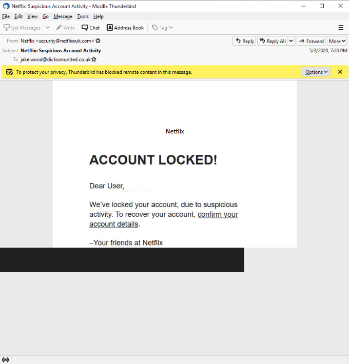
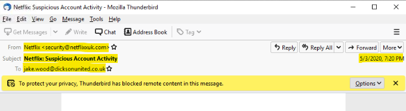
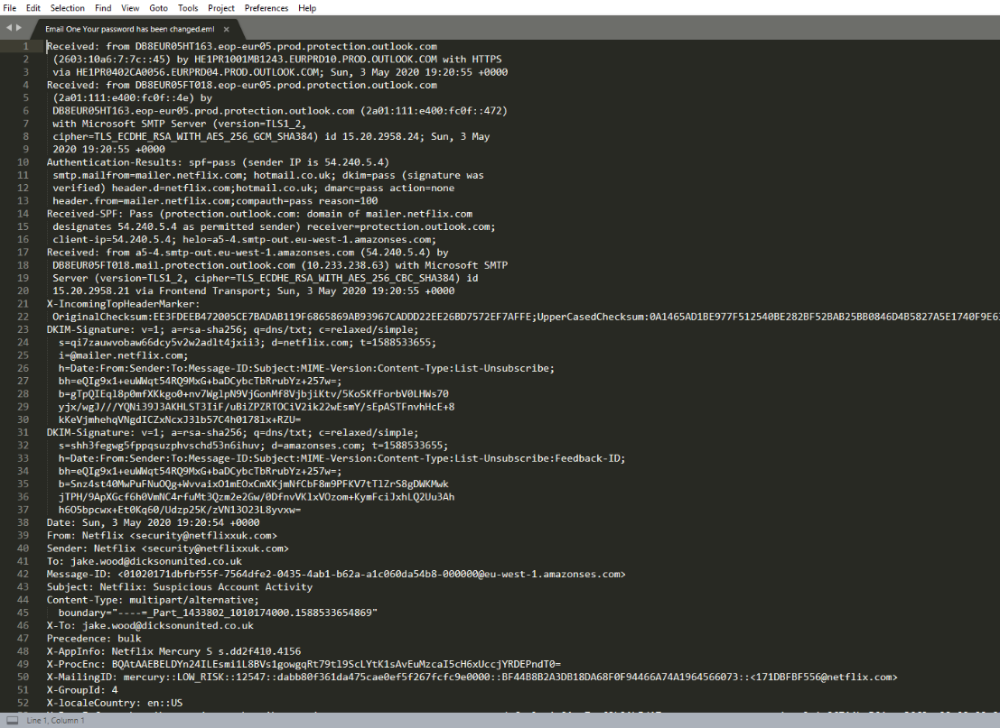
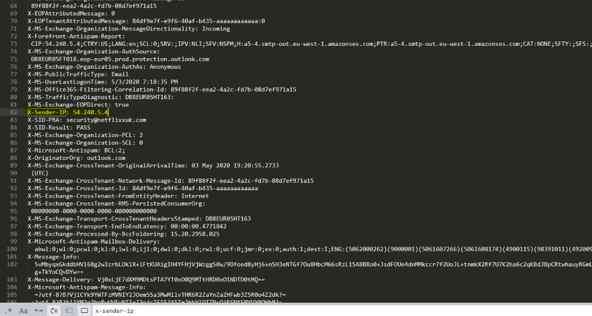
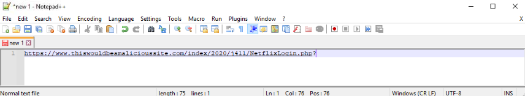
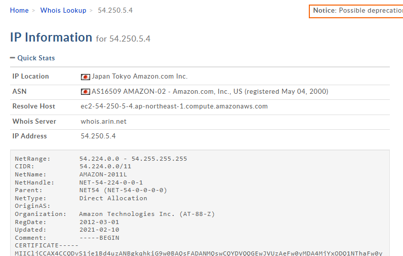
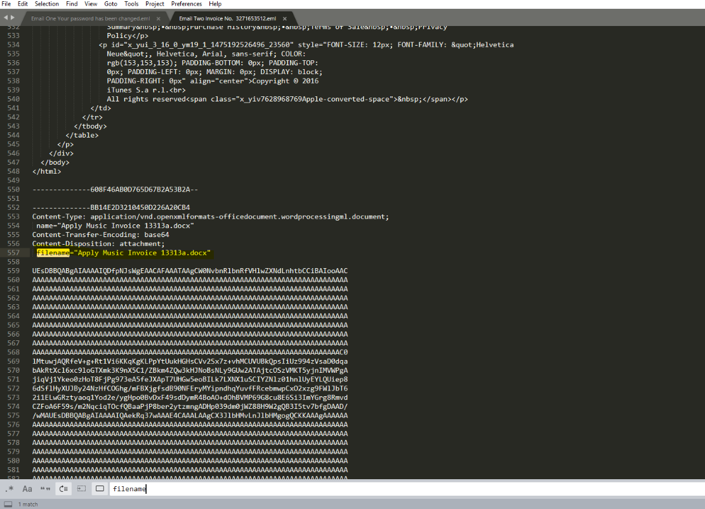
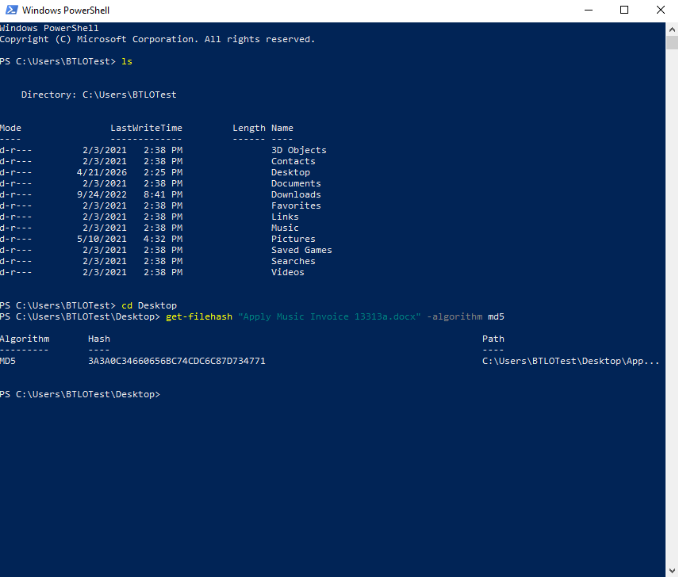
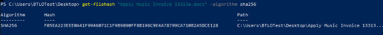

# Manual Phishing Email Artifact Extraction and Triage

This workflow demonstrates manual phishing email artifact extraction and analysis using Outlook, raw message review, and supporting enrichment tools to extract suspicious email, web, and file artifacts. It highlights how analysts investigate email behavior, validate sender infrastructure, and isolate evidence from suspicious messages.

The main tools I've used are: Outlook, Sublime Text, PhishTool, WHOIS, VirusTotal, and PowerShell. See **[Environment and Execution Context](#environment-and-execution-context)** section below.

### Overview

This workflow documents practical phishing email analysis using Outlook and raw email inspection to identify suspicious message characteristics and extract artifacts that support phishing validation. The workflow focuses on reviewing sender-related fields, extracting embedded URLs and root domains, identifying sending infrastructure, and validating suspicious attachments using local hashing and reputation checks.

The analysis progresses through structured email inspection phases, beginning with visible message triage and advancing into raw header review, sender infrastructure validation, web artifact extraction, and attachment-based verification. The workflow demonstrates how manual email analysis complements email security controls by providing deeper visibility into message origin, reply behavior, delivery infrastructure, and phishing indicators.

> **Workflow vs Execution vs Writeup (Terminology Used Here)**  
> - **Workflows** refer to operational tasks such as phishing triage, sender validation, and artifact extraction.  
> - **Executions** refer to hands-on performance of those tasks using real email messages, local analysis tools, and enrichment utilities.  
> - **Writeups** document extraction decisions, validation steps, and investigative conclusions.

> 👉 For a **detailed, step-by-step walkthrough of how this workflow was executed — complete with screenshots**, see the **[Step-by-Step Execution](#step-by-step-execution)** section below.

---

### Purpose and Analyst Focus

#### ▶ Purpose

The purpose of this workflow is to perform manual phishing email analysis by reviewing suspicious messages, extracting key email and web artifacts, and validating whether the message represents deceptive or malicious activity. The workflow focuses on understanding what an email claims to be, what the underlying message metadata reveals, where embedded links actually lead, and how attachments can be validated using file hashing and enrichment.

The workflow demonstrates how email inspection supports alert triage, phishing validation, and investigative scoping. It emphasizes how analysts use both visible message content and underlying raw header data to interpret sender behavior, identify mismatches, and extract evidence that supports containment and response workflows.

#### ▶ Analyst Focus

The analyst focus is on using Outlook, raw email header review, and enrichment platforms to identify the true sending context of a suspicious message, extract actionable indicators, and determine whether the email is consistent with phishing, impersonation, infrastructure abuse, or malicious attachment delivery.

The workflow reflects responsibilities commonly performed by SOC analysts, email security analysts, and incident responders when validating reported phishing messages, reviewing suspicious inbound email, and extracting indicators for detection and scoping activities. It reinforces the importance of understanding how visible sender fields, reply behavior, sending infrastructure, URLs, and file hashes all contribute to a defensible phishing assessment.

---

### What This Workflow Demonstrates

This workflow demonstrates an end-to-end suspicious email review process using a reported or otherwise identified phishing message. Specifically, it demonstrates how to:

- Review visible message fields in Outlook before pivoting into raw message data.
- Identify and record key email artifacts such as the sending address, subject line, recipients, date and time, reply-to address, and sending server IP.
- Open downloaded `.eml` or `.msg` email files in a text editor to manually extract fields not clearly exposed in the email client.
- Differentiate between visible sender identity, reply behavior, return-path-related information, and the actual sending server.
- Extract full embedded URLs and reduce them to root domains for domain-level validation and scoping.
- Use WHOIS to review ownership and registration context associated with suspicious infrastructure.
- Use PhishTool to enrich the email and review structured header interpretation, URL extraction, and sender infrastructure details.
- Hash suspicious file attachments using PowerShell and validate file reputation using VirusTotal.

---

### Investigation and Detection Relevance

Email remains one of the most common initial access and social engineering vectors. Manual artifact extraction is frequently required when:

- an end user reports a suspicious email,
- an email security gateway flags a message but analyst validation is still needed,
- a targeted phishing message bypasses automated filters,
- the analyst needs to scope recipients, links, or attachments quickly and accurately.

The workflow’s steps map directly to common security questions, including:

- Who does the email claim to be from, and what does the actual sender information reveal?
- Is a reply directed back to the visible sender or to a different address?
- What infrastructure actually delivered the email?
- Do the embedded URLs match the claimed brand or expected service?
- Does an attachment exhibit a malicious hash reputation or known detection history?

By documenting repeatable procedures for field review, raw parsing, enrichment, and validation, this workflow supports collaboration and defensible reporting—especially when multiple analysts need to review the same suspicious message or replicate the same findings.

---

### Environment and Execution Context

This section documents the tools, evidence sources, and constraints used to perform the workflow so that results can be interpreted consistently and reproduced by another analyst.

**Note:** Each section is collapsible. Click the ▶ arrow to expand and view details on software, tools, environment, data sources, and more.

<details>
<summary><strong>▶ Environment & Platform</strong><br>
</summary><br>

Email analysis was performed using Outlook for visible message review and local file-based inspection for raw message analysis. Supporting enrichment was performed using standard analyst utilities and web-based validation services.

</details>

<details>
<summary><strong>▶ Tooling and Constraints</strong><br>
</summary><br>

- **Primary email client:** Microsoft Outlook  
- **Raw message inspection:** Sublime Text 2 for reviewing downloaded `.eml` or `.msg` content  
- **Structured enrichment platform:** PhishTool  
- **Infrastructure lookup utility:** WHOIS  
- **File hashing tool:** PowerShell  
- **Reputation validation platform:** VirusTotal  

The workflow intentionally relies on commonly available analyst tools rather than automated SOAR-based parsing so that each field can be understood and validated manually.

</details>

<details>
<summary><strong>▶ Data Sources Analyzed</strong><br>
</summary><br>

The workflow used the following evidence sources:

- **Suspicious email message viewed in Outlook**
- **Downloaded raw email file** (`.eml` or `.msg`) opened locally for text-based review
- **Embedded URLs and associated root domains**
- **Potential email attachments requiring local hash extraction**
- **Infrastructure and reputation enrichment sources** including WHOIS, VirusTotal, and PhishTool

</details>

<details>
<summary><strong>▶ Workflow Map (High-Level)</strong><br>
</summary><br>

1. Review visible email fields in Outlook and record immediately available artifacts.
2. Download the message and inspect raw email content in Sublime Text to identify additional header fields.
3. Extract sender infrastructure details such as sending server IP, reply-to address, and return-path-related data.
4. Extract full URLs and root domains from the email and validate suspicious destinations.
5. Use WHOIS and PhishTool to enrich sender infrastructure and structured message context.
6. Hash suspicious attachments with PowerShell and validate file reputation in VirusTotal.
7. Correlate email, web, and file artifacts to determine phishing likelihood and investigative next steps.

</details>

---

### Step-by-Step Execution

This section documents the workflow in the same order an analyst would realistically perform phishing triage using Outlook, raw message inspection, and supporting enrichment tools. The process begins with visible message review to establish the claimed context of the email and identify immediately suspicious indicators. Analysis then progresses into raw header inspection, infrastructure review, web artifact extraction, and file validation to determine whether the message reflects phishing or other malicious delivery behavior.

Each phase captures both the technical actions performed and the investigative reasoning behind those actions. The workflow intentionally progresses from broad message understanding into targeted artifact validation, mirroring how analysts move from initial suspicion to evidence-driven phishing determination during real email investigations.

**Note:** Each section is collapsible. Click the ▶ arrow to expand and view the detailed steps.

<details>
<summary><strong>▶ Phase 1 — Initial Email Triage and Visible Artifact Review</strong><br>
→ establishing the claimed context of the message and extracting immediately visible email artifacts
</summary><br>

This phase establishes the initial context of the suspicious message and records the visible fields that can be collected directly from Outlook before deeper inspection begins.

<p align="left">
  <br>
  <em>Figure 1 - SIEM alert highlighting suspicious execution of "cudominer.exe"</em>
</p>

<blockquote>
I started with the visible Thunderbird message rather than immediately jumping into raw headers because the first thing an analyst needs to understand is what the email is claiming to be. This helps establish the social engineering angle before validating whether the underlying metadata supports or contradicts that visible story.
</blockquote>

##### 🔷 Phase 1.1 — Review visible sender identity and message theme

The visible sender identity, display name, subject line, and overall message theme were reviewed directly in Outlook to determine what the email was trying to communicate and what brand, service, or persona it appeared to represent.

This step is operationally important because phishing messages often rely on urgency, impersonation, or misleading branding long before header-level review begins. Identifying the claimed context early helps guide later validation steps.

Artifacts recorded at this stage included:

- **Sending Address**: security@netflixxuk.com
- **Subject Line**: Netflix: Suspicious Account Activity
- **Recipients**: jake.wood@dicksonunited.co.uk
- **Date and Time**: 5/3/2020, 7:20 PM

<p align="left">
  <br>
  <em>Figure 2: Reviewing visible Outlook message fields and initial phishing context.</em>
</p>

<blockquote>
I wanted to capture the obvious details first because these are the same artifacts most analysts would record in a ticket or case note right away. Even if deeper analysis later reveals more technical details, the visible message content still matters because it reflects what the target actually saw.
</blockquote>

##### 🔷 Phase 1.2 — Record visible message metadata before pivoting to raw analysis

Immediately available metadata was documented before opening the raw message file. This helps preserve the visible state of the email as presented to the user and provides a baseline for comparing what Outlook shows versus what the raw message actually contains.

This review also helps identify early inconsistencies such as:

- suspicious or unknown sender domains,
- urgent or transactional subject lines,
- unusual timestamps,
- recipient inconsistencies,
- branding that does not obviously align with the sender address.

<blockquote>
This step helped me separate the visible story of the email from the underlying technical story. That distinction matters because many phishing messages look convincing at the surface level, while the raw message data reveals the actual sender behavior.
</blockquote>

</details>

<details>
<summary><strong>▶ Phase 2 — Raw Email Inspection and Header-Based Artifact Extraction</strong><br>
→ extracting technical sender fields and validating how the message was actually sent
</summary><br>

This phase focuses on downloading the suspicious message and reviewing its raw content in a text editor to extract fields that are not always clearly exposed in the email client interface.

<blockquote>
I moved into raw message inspection because visible fields alone do not show the full sending context. If I want to identify the reply-to address, possible sending server details, or return-path-related information, I need to inspect the message data directly instead of relying only on Outlook’s UI.
</blockquote>

##### 🔷 Phase 2.1 — Download suspicious email as a local message file and Open raw email file in Sublime Text 2

The suspicious email was downloaded locally as a `.eml` or `.msg` file so that the raw message content could be reviewed outside the email client.

This step matters because raw message files preserve header values and delivery data that may be condensed, hidden, or reformatted in Thunderbird. Opening the message as a file also creates a repeatable artifact for later review or documentation.


The downloaded message file was opened in Sublime Text 2 to inspect the raw text and extract technical fields directly from the message content.

Sublime Text was used because it provides a clean and efficient way to search, review, and scroll through raw message data without Outlook reformatting the content. This makes it easier to locate header lines and identify fields that matter during phishing analysis.

<p align="left">
  <br>
  <em>Figure 3: Saving suspicious email locally for raw header review.</em>
</p>

<blockquote>
I used a text editor because I wanted to see the email in the most direct form possible. This makes it easier to identify the actual header values rather than whatever portions the email client chooses to display or simplify.
</blockquote>

##### 🔷 Phase 2.3 — Extract sender-related header artifacts

Raw message data was reviewed to identify and record the additional sender-related fields most relevant to phishing analysis. These included:

- **Reply-To Address*
- **Sending Server IP** (where exposed through received or delivery-related headers)

<p align="left">
  <br>
  <em>Figure 4: Saving suspicious email locally for raw header review.</em>
</p>

<blockquote> I searched the raw email file in Sublime Text for a `Reply-To:` header but did not find one present anywhere in the message. This indicates that a Reply-To field was never set by the sender. Email headers are explicit, meaning that if a header is not included in the raw message, it does not exist and is not being hidden or omitted by the email client.

As a result, reply behavior defaults to the From (sending address). In this case, any reply action would be directed back to the visible sender address. This is important to note because in phishing scenarios, attackers will sometimes include a Reply-To field to redirect responses to a different inbox. The absence of this field means no redirection is occurring, and reply behavior follows the standard default.

</blockquote>


This step is important because a phishing email can present one visible identity while technically routing replies elsewhere or being delivered through infrastructure that does not match the claimed sender.

<blockquote>
At this point, I was specifically looking for the fields that most directly affect phishing triage: who appears to have sent the email, where replies would go, and what infrastructure actually handled delivery. Those three ideas are related, but they are not the same thing.
</blockquote>

##### 🔷 Phase 2.4 — Interpret reply behavior and actual sending context

Special attention was given to the **Reply-To** field because it can redirect user responses away from the visible sender address. If present, the reply-to address was recorded and compared to the sending address to determine whether reply behavior was intentionally redirected.

The raw message was also reviewed for fields that helped identify the actual sending infrastructure, such as mail transfer-related header lines that reference the host or service responsible for delivery.

This distinction matters because:

- the **sending address** represents the identity presented by the message,
- the **reply-to address** determines where replies go if it is present,
- the **sending server IP** reflects the infrastructure that actually delivered the email,
- return-path-related values often reflect the SMTP envelope sender or bounce-handling address rather than the visible sender.

<blockquote>
I wanted to be careful not to treat every sender-related field as if it meant the same thing. In phishing analysis, the visible sender, reply behavior, SMTP envelope sender, and actual sending server can all point to different parts of the message flow.
</blockquote>

</details>

<details>
<summary><strong>▶ Phase 3 — Web Artifact Extraction and Domain Validation</strong><br>
→ identifying where embedded links actually lead and validating suspicious web infrastructure
</summary><br>

This phase focuses on identifying embedded URLs, reducing them to root domains, and validating whether the web destinations match the email’s claimed purpose.

<blockquote>
After reviewing the sender-related fields, I shifted to the web artifacts because phishing emails usually want the user to do something next, and that often means clicking a URL. If the sender story is suspicious, the link destinations usually provide even stronger evidence.
</blockquote>

##### 🔷 Phase 3.1 — Extract full embedded URLs from the message

All accessible URLs present in the email were identified and recorded in full. The complete URL was preserved because path values, tracking parameters, and subdomains may all be relevant during investigation.

This step matters because the full URL often reveals:

- redirection behavior,
- deceptive subdomain naming,
- suspicious hosting patterns,
- credential collection paths,
- campaign identifiers.

I right-clicked the link > selected "Copy-Link-Location" > pasted into Notepad ++. Result: 

https://www.thiswouldbeamalicioussite.com/index/2020/j411/NetflixLogin.php?

<p align="left">
  <br>
  <em>Figure 5: Extracting full URLs from the suspicious message.</em>
</p>

##### 🔷 Phase 3.2 — Reduce URLs to root domains for domain-level validation

Each full URL was reduced to its **root domain** so that the destination could be evaluated at the domain level rather than only at the full path level.

This step is operationally useful because full URLs can be long and noisy, while the root domain often reveals the actual site or hosting context more clearly. Root domain extraction also supports threat intelligence lookups and easier scoping across multiple emails.

Examples of what this step is meant to capture:

- **Full URL:** the complete web address embedded in the email (https://www.thiswouldbeamalicioussite.com/index/2020/j411/NetflixLogin.php?)
- **Root domain:** only the primary domain portion, excluding specific pages and parameters (thiswouldbeamalicioussite.com)

<blockquote>
I extracted both the full URL and the root domain because they answer slightly different questions. The full URL shows the exact path the user would visit, while the root domain helps identify who actually owns or controls the destination at a broader level.
</blockquote>

##### 🔷 Phase 3.3 — Compare destination domains to the claimed sender or brand

The extracted root domains were compared against the service, brand, or sender identity claimed by the email. Mismatches were treated as suspicious and documented.

This comparison is one of the strongest phishing indicators because attackers commonly impersonate known brands while linking to unrelated or newly registered infrastructure.


</details>

<details>
<summary><strong>▶ Phase 4 — Sender Infrastructure Enrichment Using WHOIS and PhishTool</strong><br>
→ validating the infrastructure behind the message and using structured enrichment to support conclusions
</summary><br>

This phase focuses on validating suspicious sender infrastructure and using a specialized email analysis platform to interpret the message more efficiently.

<blockquote>
Once I had the basic sender, reply, and URL artifacts documented, I moved into enrichment. Manual extraction is important, but enrichment helps confirm what the message infrastructure is actually doing and whether the email was delivered through suspicious or misleading channels.
</blockquote>

##### 🔷 Phase 4.1 — Use WHOIS to review suspicious server or domain context

WHOIS was used to retrieve ownership or registration information associated with suspicious domains and, where appropriate, infrastructure connected to the sending workflow.

This step is useful because WHOIS can help determine:

- whether a domain appears recently registered,
- whether the ownership context matches the claimed service,
- whether the domain appears unrelated to the impersonated brand,
- whether infrastructure characteristics strengthen suspicion.

<p align="left">
  <br>
  <em>Figure 6: Reviewing WHOIS data for suspicious sender or destination infrastructure.</em>
</p>

<blockquote>
I used WHOIS because it provides another layer of context around the infrastructure behind the message. It does not prove maliciousness by itself, but it can help show whether the domain aligns with the identity the email is trying to present.
</blockquote>

##### 🔷 Phase 4.2 — Submit the email to PhishTool for deeper investigation

PhishTool was used toward the end of the workflow to perform a deeper, structured review of the suspicious email. This allowed the message to be viewed through a platform that highlights key fields such as sender identity, reply behavior, sending infrastructure, SPF-related data, and embedded URLs in a more analyst-friendly format.

This step is particularly useful after manual extraction because it allows the analyst to compare what was manually identified against a structured platform interpretation.


##### 🔷 Phase 4.3 — Review and interpret key PhishTool fields clearly

During PhishTool analysis, the following areas were reviewed carefully:

- **From / sending address**  
- **Reply-To**  
- **Return-path-related information**  
- **Originating IP / sending server context**  
- **SPF-related results**  
- **URL section and extracted destinations**  
- **DNS / reverse DNS context when available**  

Special attention was given to keeping these concepts separate:

- The **visible sender** is the identity shown to the recipient.
- The **reply-to** controls where replies go if it is set.
- The **originating IP** reflects the server that actually sent or relayed the email into the mail flow.
- A **subdomain** used in the return path or sender infrastructure is not the same thing as the physical server itself.
- An **SPF pass** means a sending server is authorized to send on behalf of a given domain or subdomain context; it does **not** mean the email is safe or legitimate.

<blockquote>
I wanted to be especially careful here because phishing analysis becomes confusing when fields like From, Reply-To, Return-Path, subdomains, and the originating IP all get blended together. PhishTool helps organize those values, but I still needed to interpret what each one meant in the message flow.
</blockquote>

<blockquote>
This stage also reinforced that authentication results such as SPF can still pass on malicious emails. An attacker-controlled domain can authorize a legitimate third-party mail service to send phishing emails on its behalf, which means the message can be technically authenticated while still being malicious.
</blockquote>

</details>

<details>
<summary><strong>▶ Phase 5 — Attachment Hashing and Reputation Validation (Separate Email)</strong><br>
→ validating potentially malicious files associated with the suspicious messagex
</summary><br>

This phase focuses on extracting file-based artifacts from suspicious attachments and validating them using local hashing and reputation-based enrichment.


<blockquote>
If a suspicious email contains an attachment, the attachment itself becomes a separate artifact that needs to be treated carefully. I wanted to identify a stable file identifier first rather than jumping straight into opening or interacting with the file.
</blockquote>

##### 🔷 Phase 5.1 — Find Filename and Save suspicious attachment locally without executing it

Potentially malicious attachments were saved locally for offline analysis. The file was treated as an artifact rather than opened interactively. 

I opened this particular email in Sublime 2 > Searched for "filename" > "Apply Apple Music Invoice 13313a.docx"

<p align="left">
  <br>
  <em>Figure 7: Reviewing filename.</em>
</p>

This step is important because analysts should avoid triggering or executing suspicious content during initial triage. Saving the file allows it to be hashed, documented, and validated safely.

##### 🔷 Phase 5.2 — Compute MD5 and SHA256 file hash using PowerShell

PowerShell was used to generate a cryptographic hash value for the suspicious attachment. This provides a stable identifier that can be used for reputation lookups, case documentation, IOC sharing, and later verification.

```powershell
Get-FileHash "Apply Apple Music Invoice 13313a.docx" -Algorithm MD5
```

<p align="left">
  <br>
  <em>Figure 8: Generating MD5 hash.</em>
</p>


```powershell
Get-FileHash "Apply Apple Music Invoice 13313a.docx" -Algorithm SHA256
```

<p align="left">
  <br>
  <em>Figure 9: Generating SHA256 hash.</em>
</p>

<blockquote>
I used hashing first because a file hash gives me a safer and more useful investigation pivot than opening the file. It lets me search for existing detections and document the artifact consistently across tools and case notes.
</blockquote>

##### 🔷 Phase 5.3 — Check attachment reputation in VirusTotal

The computed hash was submitted to VirusTotal to review file reputation, vendor detections, and related intelligence. This helps determine whether the file is already known as malicious or suspicious.

VirusTotal was used here to answer questions such as:

- Is the file already known to security vendors?
- Are there prior detections or malicious classifications?
- Does the file connect to a broader campaign or known malware family?


##### 🔷 Phase 5.4 — Correlate file findings with email and web artifacts

Attachment findings were compared against the earlier email and URL analysis so that the message could be assessed as a whole rather than as disconnected indicators.

For example, a suspicious sender, mismatched URL, and malicious file reputation together provide a much stronger phishing conclusion than any one of those indicators alone.

<blockquote>
I wanted to correlate the file evidence with the earlier email analysis because phishing conclusions are strongest when multiple artifact types point in the same direction. That is more defensible than relying on only one suspicious field.
</blockquote>

</details>

<details>
<summary><strong>▶ Phase 6 — Final Correlation and Investigative Determination</strong><br>
→ tying together email, web, and file evidence to reach a phishing conclusion
</summary><br>

This phase focuses on correlating all extracted artifacts and determining whether the suspicious message should be classified and escalated as phishing or malicious email activity.

<blockquote>
By the end of the workflow, I wanted to make sure I was not just collecting artifacts mechanically. The goal was to understand how the sender story, reply behavior, infrastructure, links, and attachments all fit together into one coherent explanation of what the email was trying to do.
</blockquote>

##### 🔷 Phase 6.1 — Correlate extracted indicators

The following indicator groups were reviewed together:

- **Email artifacts** — sending address, subject line, recipients, date and time, reply-to, sending server IP, return-path-related values  
- **Web artifacts** — full URLs, root domains, brand mismatch, suspicious redirection or unrelated hosting  
- **File artifacts** — attachment name, file hash, reputation results, detection context  

This correlation step is important because phishing determination is strongest when multiple independent artifacts support the same conclusion.

##### 🔷 Phase 6.2 — Determine investigative outcome and next steps

The message was assessed based on the combined evidence and classified appropriately for escalation, containment, or documentation.

Potential next actions may include:

- reporting the email as phishing,
- sharing domains and hashes as IOCs,
- searching for additional recipients,
- blocking malicious URLs or attachment hashes,
- initiating user notification or credential reset workflows if interaction occurred.

<blockquote>
This final step reinforced that phishing triage is not just about reading headers. It is about building a reliable explanation of how the message was delivered, what it wanted the user to do, and what indicators support a malicious conclusion.
</blockquote>

</details>

---

### What I Learned (Skills Demonstrated)

Through this workflow, I learned how to:

- Review suspicious messages in Outlook and distinguish visible sender claims from underlying sender behavior.
- Extract technical email artifacts manually from raw message files rather than relying only on email client formatting.
- Separate sender identity, reply behavior, return-path-related data, and actual sending infrastructure during phishing analysis.
- Extract and validate full URLs and root domains to determine where a phishing email actually directs the user.
- Enrich suspicious message artifacts with WHOIS, PhishTool, PowerShell hashing, and VirusTotal reputation analysis.
- Correlate email, web, and file indicators to reach a more defensible phishing conclusion.

Overall, this workflow exercise strengthened my understanding of how suspicious emails are investigated manually and gave me more confidence in interpreting email header fields, sender infrastructure, and malicious indicators during real phishing triage scenarios.

