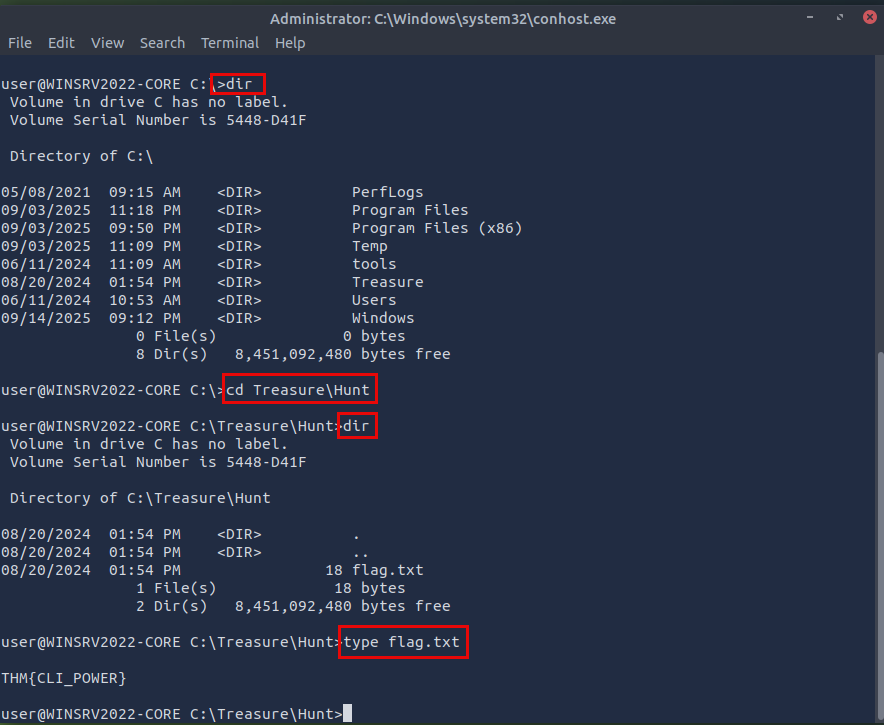
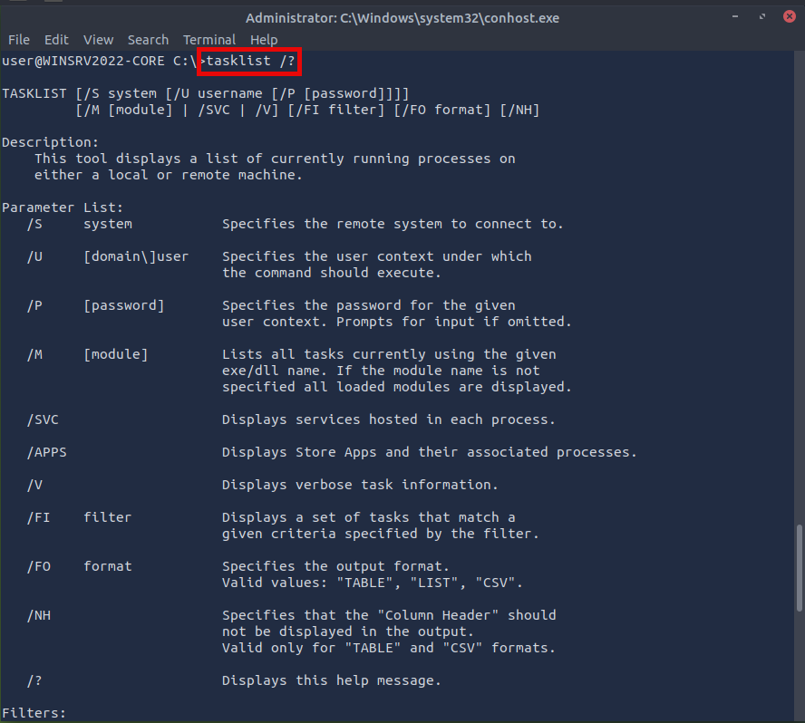
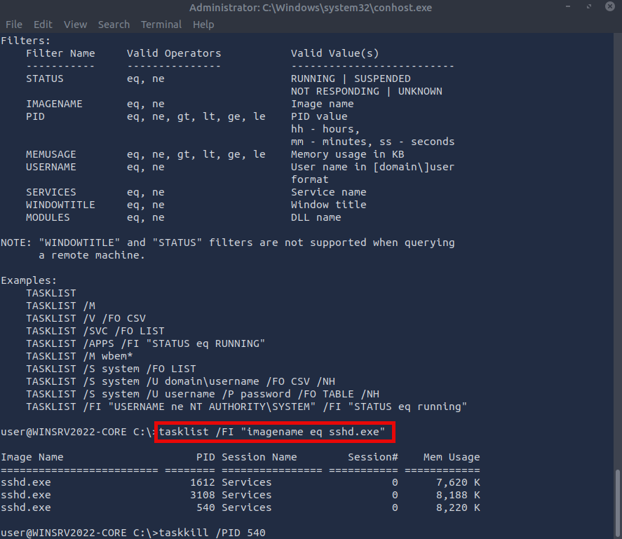
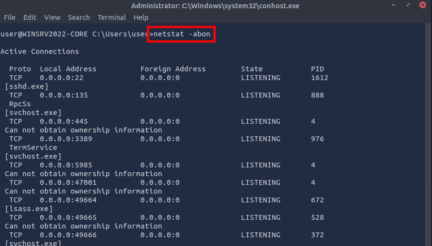

# Process and Network Triage Using Windows CLI (CMD) + PowerShell

### Overview

This execution documents how I performed endpoint triage using native Windows command-line utilities and PowerShell. The objective was to identify suspicious artifacts on disk, determine whether those artifacts were actively running, and evaluate whether they created network exposure on the host.

During execution, I used filesystem enumeration to locate artifacts, process inspection to identify active executables, and network correlation to determine which processes were exposing listening services. I then performed targeted containment and verified system state afterward to confirm the impact of remediation actions.

The execution demonstrates how native Windows tooling can be used to investigate suspicious activity, validate host exposure, and support containment decisions during early-stage incident response.

> **Workflow vs Execution vs Writeup (Terminology Used Here)**  
> - **Workflows** refer to operational tasks such as onboarding telemetry and validating parsing behavior.  
> - **Executions** refer to hands-on configuration and validation using real data and Splunk services.  
> - **Writeups** document configuration decisions, troubleshooting steps, and validation results.

> 👉 For a **detailed, step-by-step walkthrough of how this workflow was executed — complete with screenshots**, see the **[Step-by-Step Execution Walkthrough](#step-by-step-execution)** section below.

---

### Purpose and Analyst Focus

#### ▶ Purpose

The purpose of this execution is to demonstrate how to perform structured endpoint triage using only native Windows tools. The focus is on identifying suspicious files, correlating them to running processes, mapping those processes to network services, and validating containment actions.

This execution shows how analysts can quickly determine whether suspicious components are actively contributing to risk, even when advanced forensic or EDR tooling is unavailable.

#### ▶ Analyst Focus

The analyst focus during this execution is on validating host activity through layered evidence correlation. This includes confirming whether artifacts on disk are executing in memory, determining whether those processes expose network services, and verifying containment results after remediation.

The execution reflects how SOC analysts and incident responders perform early-stage triage, prioritize suspicious activity, and confirm that containment actions reduce host exposure without disrupting unrelated services.
Why This Version Works (Portfolio Strategy)

---

### What This Workflow Demonstrates

This workflow demonstrates how analysts can move methodically through multiple evidence layers on an endpoint to validate whether suspicious artifacts are actively contributing to host exposure. Rather than treating filesystem, process, and network analysis as separate activities, the workflow models how analysts:

- Begin with on-disk artifact discovery
- Pivot to memory by identifying related running processes
- Correlate those processes to listening ports and network services
- Perform targeted containment actions
- Re-validate system state after remediation

Each phase builds on findings from the previous phase, reinforcing an investigative pattern of: **enumerate → correlate → validate → contain → re-validate**

This reflects real-world triage methodology where analysts must confirm not only the presence of suspicious components, but whether those components are actively contributing to risk.

---

### Investigation and Detection Relevance

In enterprise SOC and incident response environments, analysts frequently rely on native command-line utilities when:

- EDR tooling is unavailable or unreliable
- Systems are isolated from management consoles
- Rapid triage is required before forensic acquisition

The techniques demonstrated in this workflow directly map to operational tasks such as:

- Identifying unauthorized services or backdoors
- Detecting externally exposed processes
- Confirming whether suspicious binaries are actively executing
- Validating whether containment actions have altered host behavior

These same data sources — process creation, service activity, and network listeners — also drive many host-based detection rules and SIEM correlations, making this workflow equally relevant to both triage and detection engineering contexts.

---

### Environment and Execution Context

This section documents the technical environment, access method, and operational constraints under which the workflow was executed, providing important context for how commands and investigative steps behaved during analysis.

**Note:** Each section is collapsible. Click the ▶ arrow to expand and view details on software, tools, environment, data sources, and more.

<details>
<summary><strong>▶ Environment & Platform</strong><br>
</summary><br>

All activity was performed on a Windows endpoint accessed through terminal-based command execution using both CMD and PowerShell. The environment reflects a workstation-style system representative of endpoints commonly investigated during SOC triage.

The execution context simulates scenarios where analysts have:

- Command-line access to the host
- Administrative privileges
- No access to graphical forensic tooling

Environment characteristics:

- **Operating System:** Windows workstation environment  
- **Execution Interfaces:** CMD shell and PowerShell session  
- **User Context:** Local administrator privileges  
- **Access Method:** Terminal-based interaction  

This setup mirrors real-world containment and triage phases where analysts must quickly assess host state before escalating to deeper forensic acquisition or remediation.

</details>

<details>
<summary><strong>▶ Tooling and Constraints</strong><br>
</summary><br>

All investigative actions were performed using native Windows utilities and PowerShell cmdlets only.

No third-party tools, endpoint detection platforms, or external scripts were used. All filtering, correlation, and validation was performed using:

- Built-in command-line tools
- PowerShell object pipelines
- Standard system utilities

This constraint ensures that:

- All techniques are portable across managed Windows systems
- Investigations remain feasible in restricted enterprise environments
- Analysts are not dependent on specialized tooling to perform meaningful triage

The workflow also demonstrates how CMD and PowerShell complement each other, with CMD providing quick system enumeration and PowerShell supporting more structured inspection when needed.

</details>

<details>
<summary><strong>▶ Data Sources Analyzed</strong><br>
</summary><br>

The workflow inspects multiple categories of live endpoint telemetry, including:

- **Filesystem artifacts** — used to identify suspicious files and validate their locations  
- **Running processes** — used to determine whether artifacts are actively executing  
- **Process identifiers (PIDs)** — used as pivots between execution and network telemetry  
- **Network listeners and connections** — used to identify externally exposed services  

Each data source contributes to forming a complete picture of host exposure rather than relying on a single indicator of compromise.

By correlating across these domains, the workflow validates whether suspicious artifacts are merely present on disk or actively contributing to attack surface and persistence.

</details>

<details>
<summary><strong>▶ Workflow Map (High-Level)</strong><br>
</summary><br>

The workflow follows a progressive investigative sequence designed to reflect real-world triage methodology:

1. Identify potentially suspicious files or artifacts on disk  
2. Enumerate running processes and isolate target executables  
3. Correlate executables to listening ports and network exposure  
4. Perform targeted containment actions using process IDs  
5. Re-validate system state to confirm containment effectiveness  

Each phase is grouped by investigative objective rather than by individual command usage, reinforcing that investigations are driven by analytical questions, not tools.

</details>

---

### Step-by-Step Execution

This section walks through how I performed endpoint triage using native Windows command-line tools and PowerShell. I begin by identifying suspicious files on disk, then pivot to process enumeration to determine whether those files are actively running. Next, I correlate running processes to listening ports and network exposure using PID mapping.

After establishing process-to-network relationships, I perform targeted containment by terminating a specific process and then re-validate system state to confirm the impact of that action. Each step shows the commands used, the results observed, and how those results informed the next investigative decision.

**Note:** Each section is collapsible. Click the ▶ arrow to expand and view the detailed steps.

<details>
<summary><strong>▶ 1) — File System Enumeration and Artifact Discovery</strong><br>
→ identifying potentially suspicious files and confirm locations on disk.
</summary><br>

**Goal:** Identify potentially suspicious files and confirm their locations on disk.

I began by reviewing directory contents to identify files that did not match expected naming patterns or locations. This mirrors real investigations where attackers may stage payloads in user-accessible directories.

##### 🔷 1.1 — Enumerating directory contents and validating file artifacts

Using CMD, I listed directory contents to establish visibility into the current working directory and then pivoted into a subdirectory that appeared relevant.

**Commands**
```
dir
cd Treasure\Hunt
dir
type flag.txt
```

<p align="left">
  <br>
  <em>Figure 1</em>
</p>

This confirmed that a file artifact existed in the directory and that it could be read directly from the command line. In real investigations, this same pattern is used to quickly inspect dropped notes, scripts, or configuration files without opening additional tools.

This step established an initial anchor artifact that could later be correlated with process activity and network behavior if needed.

</details>


<details>
<summary><strong>▶ 2) — Process Enumeration and PID Identification</strong><br>
→ identifying active processes on systems and isolating processes associated with executables of interest.
</summary><br>

**Goal:** Identify active processes on the system and isolate processes associated with specific executables of interest.

After identifying artifacts on disk, the next step in triage is to understand what is currently executing in memory. This helps determine whether suspicious files are actively running or whether they may represent dormant persistence or staging.

##### 🔷 2.1 — Reviewing active processes using tasklist

I started by reviewing the full list of running processes to understand the general state of the system.

```cmd
tasklist /?
```

<p align="left">
  <br>
  <em>Figure 2</em>
</p>

This provided a high-level snapshot of all active processes, including system services and user-launched applications.

##### 🔷 2.2 — Filtering processes by executable name

To reduce noise and focus on a specific executable, I filtered the process list for instances of `sshd.exe`.

```
tasklist /FI "imagename eq sshd.exe"
```

This confirmed multiple running instances of `sshd.exe` and displayed their associated PIDs. Example PIDs observed during this session included:

- `1612`
- `3108`
- `540`

These PIDs become critical pivots for correlating to network connections and determining which instance is responsible for listening services.

<p align="left">
  <br>
  <em>Figure 3</em>
</p>

This objective narrowed system activity from "everything running" to a specific executable of interest, enabling precise network correlation in the next phase.

</details>


<details>
<summary><strong>▶ 3) — Network Enumeration and Process-to-Port Correlation</strong><br>
→ understanding and confirming baseline system information through command-line enumeration
</summary><br>

**Goal:** Identify listening ports and correlate them to owning processes using PIDs obtained during process enumeration.

Network activity provides strong context for whether a process is acting as a service, accepting inbound connections, or communicating externally.

##### 🔷 3.1 — Enumerating connections and listeners with netstat

To correlate open and listening ports with owning processes, I used `netstat` with a consolidated set of flags:

```cmd
netstat -abon
```

#### Why these flags matter

- **`-a`** — show **all** connections and **listening** ports  
- **`-b`** — show the **executable** (e.g., `[sshd.exe]`) that created each connection  
- **`-o`** — show the **owning PID** (lets us tie the port to a process ID)  
- **`-n`** — show addresses/ports in **numeric** form (faster, avoids DNS lookups)

Using these flags together allows direct mapping between:

- Port number
- Executable name
- Process ID

<p align="left">
  <br>
  <em>Figure 4</em>
</p>

**Note:** On Windows, `netstat` does **not** have a `-d` switch; the common combo is `-a b o n`. You can run `netstat -h` to view complete usage and available flags on your system.

##### 🔷 3.2 — Interpreting network results

During review of the output, I observed:

- `TCP 0.0.0.0:22` in **LISTENING** state, owned by **[sshd.exe]**, PID **1612**  
- Additional services listening (e.g., `RpcSs` on `135`, `TermService` on `3389`), each with their associated PID

<p align="left">
  <br>
  <em>Figure 5</em>
</p>

Additional services such as `RpcSs` on port `135` and `TermService` on port `3389` were also visible, each mapped to their own service processes.

This step is critical during triage because it establishes whether a process is externally exposed and whether that exposure aligns with expected services.

</details>

<details>
<summary><strong>▶ 4) — Containment Validation via Targeted Process Termination</strong><br>
→ terminating a specific process and validating post-action system state
</summary><br>

**Goal:** Demonstrate controlled containment by terminating a specific process and validating post-action system state.

Containment actions in real investigations must be deliberate and verifiable. Terminating the wrong process can disrupt business services or erase evidence.

##### 🔷 4.1 — Terminating a specific process by PID

After confirming target PIDs, I terminated one instance of `sshd.exe` using its PID.

```cmd
taskkill /PID 540
```

This command targets only the specified process rather than stopping all instances of the service, which is important when multiple legitimate service processes may exist.

##### 🔷 4.2 — Post-containment validation

After termination, I revalidated system state using:

```cmd
tasklist /FI "imagename eq sshd.exe"
netstat -abon
```

Re‑running either of the following verifies state after the kill.

In my session, port 22 remained listening under a different PID (`1612`), which is expected if another valid service instance persists. In a real investigation, we would confirm **which** instance is malicious or unauthorized before broader remediation (e.g., stopping the service, revoking keys, or disabling startup).

This confirmed that port 22 remained in listening state under a different PID (`1612`). This behavior is expected when another legitimate service instance continues to operate.

In real investigations, this validation step is essential to ensure that:

- The intended process was terminated
- Other unrelated services were not disrupted
- Network exposure reflects expected service configuration

Broader remediation actions, such as stopping the service entirely, revoking credentials, or modifying startup configuration, would be considered only after confirming which instance was unauthorized.

</details>

---

### Results & Interpretation

The workflow successfully demonstrated how native Windows command-line utilities and PowerShell can be used together to perform meaningful endpoint triage without relying on third-party tooling. Starting from filesystem discovery, I was able to identify on-disk artifacts, then pivot into memory by enumerating running processes, and finally correlate those processes with listening network services.

The most important analytical outcome was the ability to map:

- A discovered artifact on disk  
- To a running executable in memory  
- To an externally exposed network port  

This correlation confirms whether an artifact is merely present or actively contributing to host exposure. By validating that `sshd.exe` was bound to port 22 and identifying its owning PID, I was able to assess which service instance was responsible for inbound connectivity and confirm that containment actions affected only the intended process.

The post-termination validation steps further confirmed that service exposure persisted under a different PID, demonstrating why containment actions must always be followed by state verification rather than assuming success based on command execution alone.

---

### Operational & Defensive Takeaways

This workflow reinforces several operational principles that apply directly to SOC triage and incident response:

- Filesystem enumeration should precede process and network analysis so that investigators understand what artifacts exist before assuming what is active.
- Process filtering by executable name is an effective way to quickly narrow scope when multiple services are running.
- Network inspection using `netstat -abon` provides a fast, reliable method to correlate listening ports to both executables and PIDs without relying on EDR tooling.
- Targeted containment actions should be performed by PID when possible to avoid disrupting unrelated services.
- Validation after containment is mandatory to confirm that exposure has actually changed and that the correct process was affected.

These patterns align with real-world triage workflows where analysts must move quickly, avoid unnecessary disruption, and maintain confidence that actions taken had the intended effect.

---

### Reuse Pack (Quick Reference)

#### ▶ Filesystem Discovery

```cmd
dir
cd <path>
type <file>
```
Used to quickly enumerate directories, pivot into suspicious locations, and inspect text-based artifacts without launching additional tools.

#### ▶ Process Enumeration

```cmd
tasklist
tasklist /FI "imagename eq <process.exe>"
```

Used to establish baseline process activity and isolate specific executables for further correlation and containment.

#### ▶ Network Correlation

```cmd
netstat -abon
```

Used to map open and listening ports to owning executables and PIDs. This is critical when determining whether a process is externally exposed or communicating unexpectedly.

#### ▶ Targeted Containment

```cmd
taskkill /PID <pid>
```

Used to terminate a specific process instance while minimizing impact on other services or system functions.

#### ▶ Validation

```cmd
tasklist /FI "imagename eq <process.exe>"
netstat -abon
```

Used after containment to confirm system state and verify whether exposure or process activity has changed as expected.


#### ▶ Reuse Pack Summary
- `dir`, `cd`, and `type` enable quick **file discovery** and validation from the CLI.  
- `tasklist` (with filters) is ideal for **process discovery** and narrowing to a target executable.  
- `netstat -abon` is a powerful one‑liner to correlate **ports ↔ processes ↔ PIDs** without DNS noise.  
- `taskkill /PID <id>` provides precise **process termination**; always validate state after action.  
- Use `netstat -h` to review flags on the host you’re working in.

---

### What I Learned (Skills Demonstrated)

This workflow strengthened my ability to conduct structured endpoint triage using only native Windows tooling. It reinforced how to:

- Pivot from filesystem artifacts to active processes.
- Correlate processes to network exposure using PID mapping.
- Perform targeted containment actions without destabilizing the host.
- Validate remediation steps using independent evidence sources.

It also reinforced the importance of disciplined investigation flow: enumerate first, correlate across telemetry layers, and validate after action. These skills directly support SOC-level incident triage, host containment, and early-stage investigation when visibility is limited and rapid decision-making is required.

## Next Steps
- Expand to **PowerShell** for scripted process/port correlation and logging.  
- Add detection/containment steps as a mini **playbook** (e.g., confirm SSH configuration, review auth logs, disable/lock accounts if necessary).

#### ▶ Additional Tools Awareness

In addition to the commands I demonstrated in this workflow execution (`tasklist`, `taskkill`, `netstat`, `dir`, etc.), I am aware of several other built-in Windows utilities that could also be leveraged during endpoint triage:

- **`chkdsk`**  
  Checks the file system and disk volumes for errors and bad sectors.  
  If during investigation I suspect data corruption from malware or sudden crashes, I could run `chkdsk` to validate disk health and rule out hardware or file system integrity issues before deeper forensics.

- **`driverquery`**  
  Displays a list of installed device drivers.  
  Useful when investigating persistence or suspicious kernel-level activity. An attacker might install a rogue driver to maintain access. Running `driverquery` lets me quickly review and confirm whether only legitimate drivers are loaded.

- **`sfc /scannow`**  
  Scans system files for corruption and repairs them if possible.  
  After identifying suspicious behavior or unexpected crashes, I could use this to check for modified or corrupted system files. This helps ensure the endpoint remains stable after containment and recovery.


#### ▶ Why This Matters
While these commands weren’t the focus of this workflow, being aware of them strengthens my ability to perform **holistic endpoint triage**. They complement the discovery and remediation steps I practiced with `tasklist` and `netstat`, and show readiness to expand my toolkit for more advanced SOC workflows.


