# Microsoft Entra ID — User and Group Management, License Assignment, and User Lifecycle Operations

This workflow demonstrates hands-on identity and access management operations in **Microsoft Entra ID** (formerly Azure Active Directory), covering user account creation, security group and Microsoft 365 group creation, license assignment at both the group and individual levels, and user lifecycle operations including account deletion and restoration.

The main tools used are: the **Microsoft Entra admin center** (`entra.microsoft.com`) and the **Microsoft 365 admin center** (`admin.microsoft.com`). See the **[Environment and Execution Context](#environment-and-execution-context)** section below.

---

### Overview

This project focused on four operational areas of Microsoft Entra ID identity administration, performed in sequence against the same Entra tenant.

1. The first portion involved **User and Group Creation** — creating a cloud identity user account (`Chris Green`) in Microsoft Entra ID, creating a security group (`Marketing`) and assigning a license to it, and creating a Microsoft 365 group (`Northwest Sales`) with an owner and a member.

2. The second portion involved **License Assignment to a Group** — navigating to the Microsoft 365 admin center to assign an available license to the `Marketing` security group, making all current and future group members eligible for that license automatically.

3. The third portion involved **License Assignment to an Individual User** — creating a second user account (`Dominique Koch`) in Microsoft Entra ID, then navigating to the Microsoft 365 admin center to assign a license directly to that individual user account.

4. The fourth portion involved **User Lifecycle Operations** — deleting a user account (`Chris Green`) through the Microsoft Entra admin center, viewing the deleted users list, restoring the account within the 30-day recovery window, and verifying the restoration.

This workflow demonstrates that identity administration in Microsoft Entra ID covers more than just creating accounts — it spans directory object management, license lifecycle management, and user account recovery operations.

> **Workflow vs Execution vs Writeup (Terminology Used Here)**
> - **Workflows** refer to repeatable Entra ID administration tasks such as user provisioning, group management, and license assignment.
> - **Executions** refer to the hands-on administration performed using the Microsoft Entra admin center and the Microsoft 365 admin center.
> - **Writeups** document configuration steps, analyst observations, and administrative reasoning.

> 👉 For a **detailed, step-by-step walkthrough of how this workflow was executed — complete with screenshot placeholders**, see the **[Step-by-Step Execution](#step-by-step-execution)** section below.

---

### Purpose and Analyst Focus

#### ▶ Purpose

The purpose of this workflow is to demonstrate practical administration of Microsoft Entra ID across user provisioning, group management, license lifecycle management, and user account recovery.

The user and group creation portion focused on provisioning a cloud identity user account, creating a security group, and creating a Microsoft 365 group with an owner and member. This matters because user accounts and groups are the foundation of identity and access management in any cloud environment — every permission, license, and access policy in Microsoft 365 and Azure is ultimately attached to a user or a group.

The group-based license assignment portion focused on assigning a license to a security group rather than to individual users. This matters because group-based licensing is the scalable, maintainable approach used in real organizations — rather than manually assigning licenses user by user, administrators assign them to groups so that membership changes automatically propagate license eligibility, reducing manual overhead and the risk of forgotten provisioning or deprovisioning.

The individual license assignment portion focused on assigning a license to a specific user account directly. This matters because while group-based assignment is preferred at scale, individual assignment is still used in smaller environments or edge cases where group membership isn't the right mechanism — and understanding both paths is essential for complete license administration coverage.

The user lifecycle operations portion focused on deleting an account, reviewing the deleted users list, restoring the account within the 30-day recovery window, and confirming restoration. This matters because accidental deletions happen in real environments, and knowing how and when Entra ID allows restoration — and what the hard limits are — is a critical part of identity lifecycle management.

#### ▶ Analyst Focus

The analyst focus is on understanding not just how to click through each screen, but what each action actually does to the directory and why it matters operationally.

This includes:

- understanding what a cloud identity is and how it differs from directory-synced and guest identities,
- understanding the difference between a Security group and a Microsoft 365 group, and when each is appropriate,
- understanding how membership type (Assigned vs. Dynamic) affects who gets into a group and what that means for license administration,
- understanding why group-based license assignment is the preferred approach at organizational scale,
- understanding what happens to a deleted user account (the 30-day suspended state, what's recoverable, and what's not),
- understanding why permanently deleted users cannot be restored and why that matters for identity operations.

The goal is to understand each concept well enough to explain why an organization would perform these tasks and what operational or security need each one addresses.

---

### What This Workflow Demonstrates

This workflow demonstrates how to:

- Create a cloud user account in Microsoft Entra ID with a specified username, display name, and usage location.
- Create a Security group and a Microsoft 365 group in Microsoft Entra ID with appropriate membership types.
- Assign an available license to a group using the Microsoft 365 admin center.
- Assign an available license to an individual user using the Microsoft 365 admin center.
- Verify license assignment on a user account's profile within the Microsoft Entra admin center.
- Delete a user account from Microsoft Entra ID.
- Access the Deleted Users list and understand the 30-day recovery window.
- Restore a recently deleted user account and verify the restoration.

This workflow also demonstrates the relationship between the **Microsoft Entra admin center** (where identity objects are created and managed) and the **Microsoft 365 admin center** (where license assignment lives), and why some identity operations require navigating between both portals.

---

### Investigation and Security Operations Relevance

Microsoft Entra ID is the identity foundation for Microsoft 365, Azure, and an increasing number of enterprise applications. How it is configured — who has accounts, what groups they're in, what licenses they hold, and how quickly stale access is removed — directly affects an organization's exposure to unauthorized access, over-provisioning, and identity-based attacks.

This workflow can help answer questions such as:

- What are the three types of user identities in Entra ID, and why does the distinction matter?
- Why is group-based license assignment preferred over individual assignment at organizational scale?
- What happens to a user account when it's deleted, and what is the recovery window?
- Why can't permanently deleted users be restored, and why does that matter for identity operations?
- What is the difference between a Security group and a Microsoft 365 group, and which is used for license assignment?
- What does Membership Type (Assigned vs. Dynamic) mean for group administration?

The table below summarizes the role of each configuration area in this workflow:

| Area | What Was Configured | Why It Matters |
|---|---|---|
| Cloud User Account | `Chris Green` and `Dominique Koch` created in Entra ID | Core identity provisioning — every access decision in M365/Azure requires a user object |
| Security Group | `Marketing` group created | Used as the target for group-based license assignment |
| Microsoft 365 Group | `Northwest Sales` group created with owner and member | Provides collaboration tools (mailbox, calendar, SharePoint) alongside group membership |
| Group-Based License Assignment | License assigned to `Marketing` group | Scalable license management — membership drives eligibility automatically |
| Individual License Assignment | License assigned to `Dominique Koch` directly | Direct assignment path for individual or edge-case provisioning |
| User Deletion | `Chris Green` deleted | Demonstrates the account removal process and the resulting 30-day suspended state |
| User Restoration | `Chris Green` restored from deleted users list | Demonstrates the recovery path within the 30-day window |

---

### Environment and Execution Context

This section documents the tools, tenant, and execution environment used during the workflow.

**Note:** Each section is collapsible. Click the ▶ arrow to expand and view details.

<details>
<summary><strong>▶ Environment & Platform</strong><br>
</summary><br>

The workflow was performed against a **Microsoft Entra ID tenant** accessed via a free trial Microsoft 365/Azure subscription. Administrative actions were performed through two web-based portals:

```text
Microsoft Entra admin center    — entra.microsoft.com
Microsoft 365 admin center      — admin.microsoft.com
```

The account used to perform these actions held at minimum **User Administrator** rights in the Entra tenant.

</details>

<details>
<summary><strong>▶ Identity Objects Created or Modified</strong><br>
</summary><br>

| Object Type | Name(s) |
|---|---|
| User Accounts | `Chris Green` (ChrisG), `Dominique Koch` (DominiqueK) |
| Security Group | `Marketing` (Assigned membership) |
| Microsoft 365 Group | `Northwest Sales` (Assigned membership) |
| Licenses Assigned | One available license → `Marketing` group; one available license → `Dominique Koch` |
| Deleted Users | `Chris Green` (deleted then restored) |

</details>

<details>
<summary><strong>▶ Tooling Used</strong><br>
</summary><br>

The tools and portals used during execution included:

- **Microsoft Entra admin center** (`entra.microsoft.com`) — used for user account creation, group creation, and user deletion and restoration.
- **Microsoft 365 admin center** (`admin.microsoft.com`) — used for license assignment to both a group and an individual user.

</details>

<details>
<summary><strong>▶ Workflow Scope</strong><br>
</summary><br>

This workflow focused on foundational Microsoft Entra ID identity administration tasks performed through the graphical admin portals.

Out-of-scope activities included:

- configuring dynamic group membership rules,
- configuring custom security attributes,
- configuring SCIM-based automatic user provisioning,
- managing guest (B2B) user accounts,
- performing these tasks via the Microsoft Graph API or PowerShell,
- configuring multi-factor authentication or Conditional Access policies.

Those activities could occur in later, more advanced Entra ID administration or identity security workflows.

</details>

<details>
<summary><strong>▶ Workflow Map (High-Level)</strong><br>
</summary><br>

**Exercise 1 — User and Group Creation, License Assignment to Group**
1. Create user account `Chris Green` (ChrisG) in Microsoft Entra ID.
2. Create Security group `Marketing` with Assigned membership.
3. Assign an available license to the `Marketing` group via Microsoft 365 admin center.

**Exercise 2 — Restore or Remove a Recently Deleted User**
4. Delete `Chris Green` from Microsoft Entra ID.
5. Navigate to Deleted Users and restore `Chris Green`.
6. Verify `Chris Green` appears in the All Users list.

**Exercise 3 — Create a Microsoft 365 Group**
7. Create Microsoft 365 group `Northwest Sales` with an owner and a member.
8. Verify `Northwest Sales` appears in the All groups list.

**Exercise 4 — Change User License Assignments**
9. Create user account `Dominique Koch` (DominiqueK) in Microsoft Entra ID.
10. Assign an available license directly to `Dominique Koch` via Microsoft 365 admin center.
11. Verify the license appears on Dominique Koch's profile in the Entra admin center.

</details>

---

### Step-by-Step Execution

This section documents the workflow in the order the exercises were performed.

**Note:** Each section is collapsible. Click the ▶ arrow to expand and view the detailed steps.

<details>
<summary><strong>▶ Phase 1 — Create a User Account, Create a Security Group, and Assign a License to a Group</strong><br>
→ provisioning a cloud identity, creating a security group, and assigning a license at the group level
</summary><br>

This phase focused on creating the first user account (`Chris Green`) in Microsoft Entra ID, creating a security group (`Marketing`) with Assigned membership, and assigning an available license to that group through the Microsoft 365 admin center.

##### 🔷 Phase 1.1 — Create the Chris Green user account

In the **Microsoft Entra admin center** (`entra.microsoft.com`), I navigated to **Identity → Users → All Users** and selected **+ New user → Create new user**.

**What this does:** This opens a multi-tab user creation wizard for provisioning a new **cloud identity** directly in Microsoft Entra ID. A cloud identity exists only in the Entra directory — it is not synchronized from an on-premises Active Directory (that would be a directory-synchronized identity) and is not an external guest account. This is the most direct way to create a user in a cloud-first or cloud-only environment.

**Why this matters:** Every person who needs to access Microsoft 365 services, Azure resources, or applications connected to Entra ID must have a user object in the directory first. Without a user account, there's no identity to assign permissions, licenses, or group memberships to — the user account is the anchor for everything else that comes after.

The creation wizard has four tabs — **Basics**, **Properties**, **Assignments**, and **Review + create** — and is completed in sequence.


**Tab 1 — Basics**

The Basics tab captures the core identity fields required to create the account. I completed the following:

| Setting | Value |
|---|---|
| User principal name | ChrisG |
| Display name | Chris Green |
| Password | (unique password configured) |
| Account enabled | Yes (checked by default) |

**User principal name (UPN):** This is the account's login identity — what the user will type when signing in to Microsoft 365 or Azure services. The UPN is made up of a prefix (here: `ChrisG`) and the tenant domain (here: `@peterjihyunahngmail.on...`). The full UPN would be something like `ChrisG@yourtenant.onmicrosoft.com`. This must be unique within the tenant.

**Mail nickname:** This field auto-populates based on the UPN prefix and is used as the account's email alias. The "Derive from user principal name" checkbox was left enabled, so it populated automatically as `ChrisG`.

**Password:** I set a unique password manually. Alternatively, the **Auto-generate password** checkbox would have Entra generate a random password and display it once — useful when provisioning accounts in bulk where you don't want to manually set individual passwords. The user would then be prompted to change it at first login if the force-change-at-next-login option is configured.

**Account enabled:** Left checked. An unchecked account would be created in a disabled state, meaning it exists in the directory but cannot authenticate. This is occasionally useful when pre-provisioning accounts before a start date.

<p align="left">
  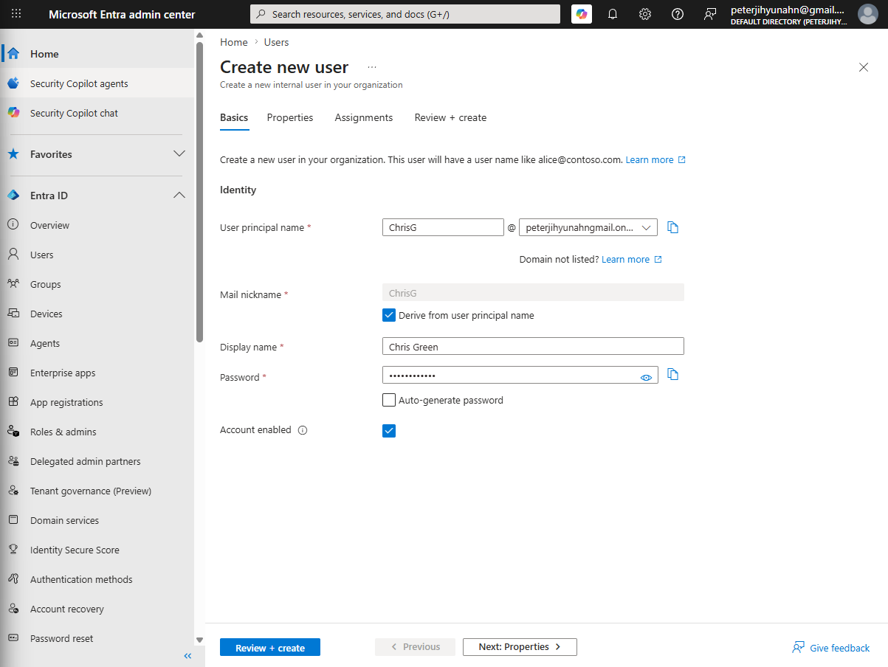<br>
  <em>Figure 1: Basics tab — entering the user principal name (ChrisG), display name (Chris Green), and password for the new account.</em>
</p>


**Tab 2 — Properties**

The Properties tab captures additional identity attributes. Most fields here are optional — they enrich the user's profile but are not required to create the account. I completed the following:

| Setting | Value |
|---|---|
| First name | Chris |
| Last name | Green |
| User type | Member |
| Usage location | United States |

**User type:** The dropdown shows **Member** (selected here) or **Guest**. Member is a standard internal user account — someone who belongs to your organization. Guest is reserved for external identities (contractors, partners, or other-organization users) who are invited into the tenant for collaboration purposes. Since `Chris Green` is an internal user, **Member** is correct.

**Job information fields (left blank):** Fields like Job title, Department, Company name, Employee ID, and Employee hire date are available here. These are standard Active Directory-style attributes carried over into Entra ID. Populating them is useful for dynamic group rules (for example, automatically adding all users with Department = "Marketing" to a group), for directory search, and for auditing. They were left blank for this exercise.

**Usage location:** This is the most operationally important field on this tab. I set it to **United States**. Microsoft requires a usage location before any license can be assigned to a user — the location determines which Microsoft 365 service plan components are legally permitted to be provisioned based on regional availability and data sovereignty regulations. If this field is left blank, any subsequent license assignment attempt for this account will fail.

**Other sections visible but not completed:** The Properties tab also contains Contact Information (address, phone), Parental Controls, and Settings sections. These were not populated for this exercise — they are optional fields that would typically be populated either at account creation or through HR system integration.

<p align="left">
  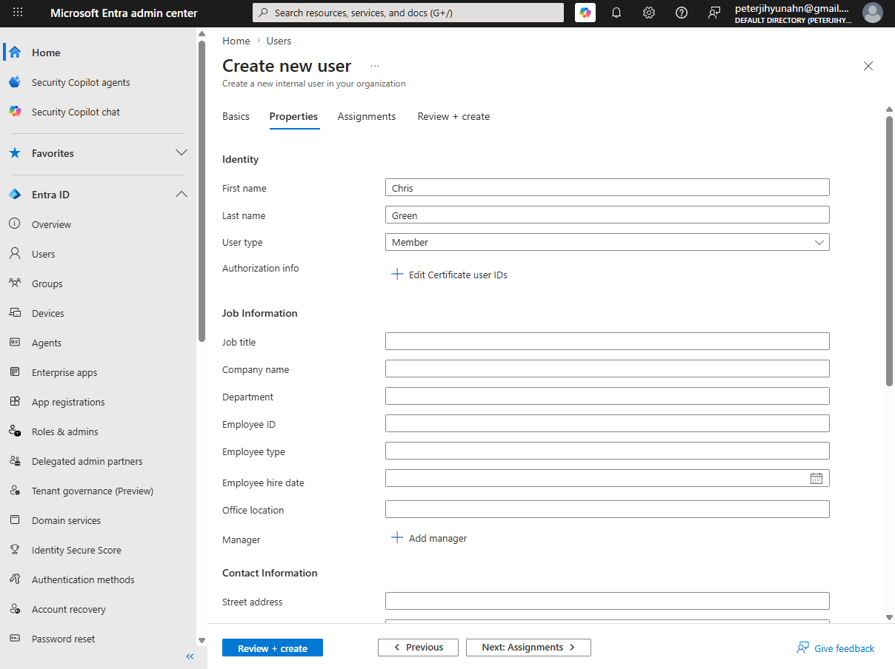<br>
  <em>Figure 2: Properties tab — entering first name, last name, and user type. Usage location (United States) was set further down this same tab under Settings.</em>
</p>

**Tab 3 — Assignments**

The Assignments tab allows you to add the new user to groups or assign directory roles at account creation time, rather than doing so afterward. The tab shows three options: **Add administrative unit**, **Add group**, and **Add role**.

For this exercise, I did not make any assignments during account creation — `Chris Green` was added to the `Marketing` group through the group management interface afterward (which is the more common workflow in real environments where groups already exist and users are provisioned into them after the fact).

**What you would do here if needed:** If you wanted to add the new user to an existing group at creation time, you would select **+ Add group**, search for the group by name, and select it. The user would be a member of that group from the moment the account is created. Similarly, **+ Add role** would assign a directory role (such as User Administrator or Security Reader) directly to the account — useful when provisioning admin accounts where the role assignment needs to be in place immediately.

**Administrative units** are a more advanced concept — they allow a tenant to be partitioned into sub-scopes for delegation purposes (for example, giving a regional IT admin rights only over users in their region's administrative unit, not the whole tenant). This was not used in this exercise.

<p align="left">
  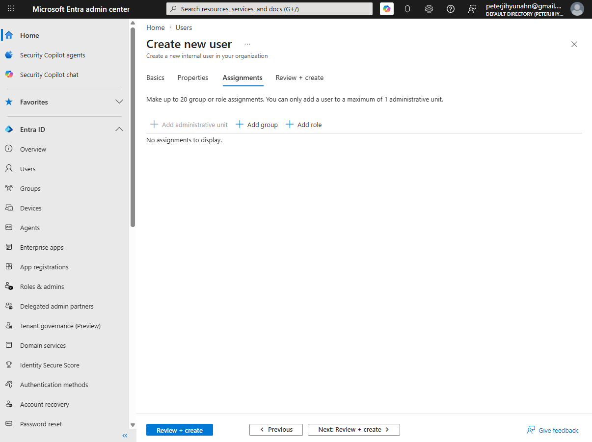<br>
  <em>Figure 3: Assignments tab — no group or role assignments were made at account creation time. Group membership was managed afterward through the Groups interface.</em>
</p>


After completing the Basics, Properties, and Assignments tabs, I selected **Review + create** to review the configured settings, then selected **Create** to provision the account. I returned to **Identity → Users → All Users** and confirmed that `Chris Green` appeared in the active users list.

<p align="left">
  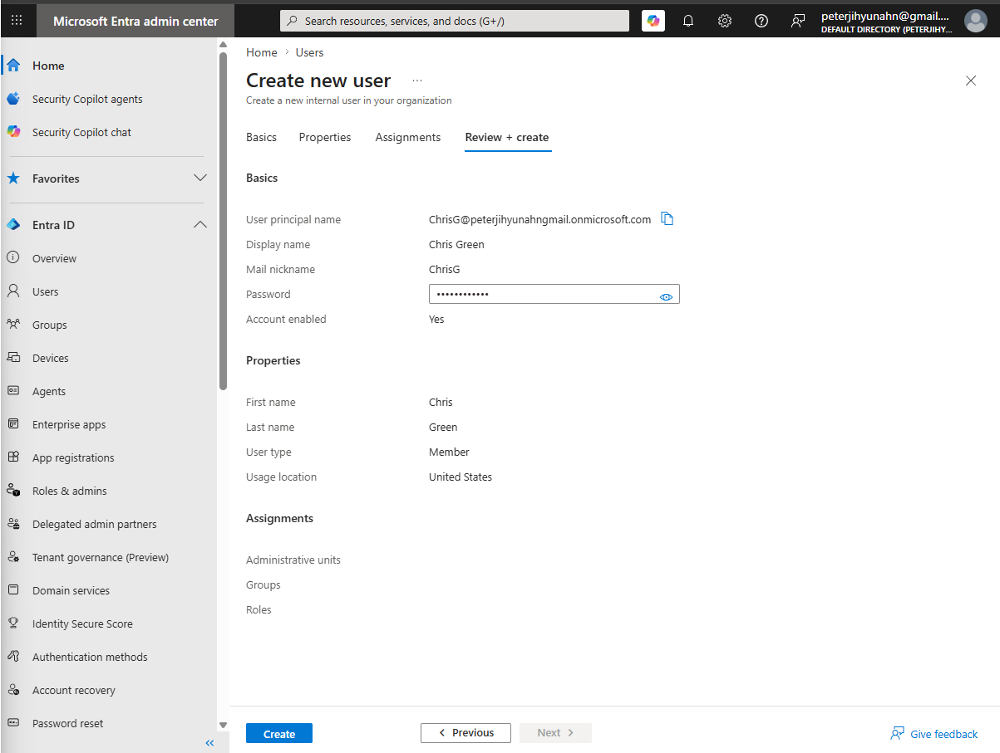<br>
  <em>Figure 4: Review + create tab summarizing the configured settings — UPN, display name, and usage location — before finalizing account creation.</em>
</p>

After selecting **Create**, I navigated back to **Identity → Users → All Users** to verify the account was successfully provisioned. `Chris Green` appeared in the active users list, confirming the cloud identity was created in the directory.

<p align="left">
  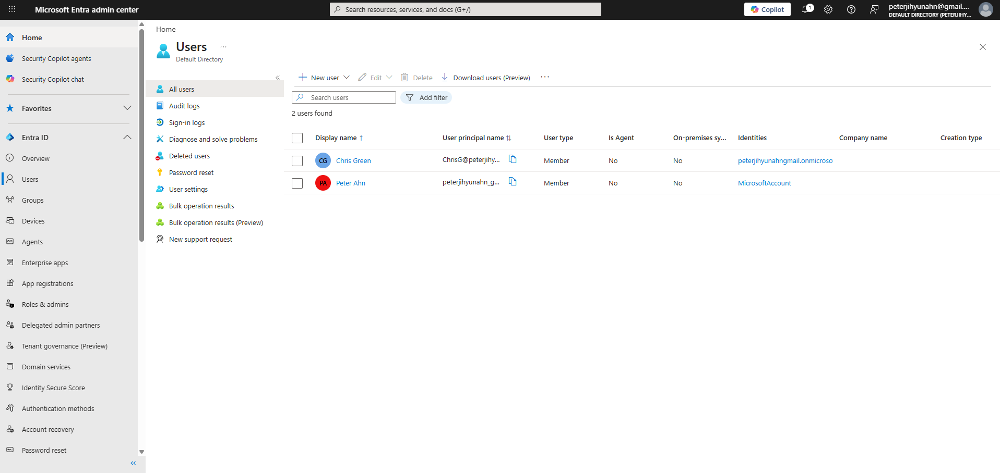<br>
  <em>Figure 5: All Users list confirming Chris Green's account is active in the directory after creation.</em>
</p>

##### 🔷 Phase 1.2 — Create the Marketing security group

I navigated to **Identity → Groups → All groups** and selected **New group**.

**What this does:** This opens the group creation form. Microsoft Entra ID supports two group types: **Security** groups (used to manage access to resources, assign licenses, and apply policies) and **Microsoft 365** groups (which provide collaboration tools like a shared mailbox, calendar, and SharePoint site in addition to group membership). This step creates a Security group — the correct type for license assignment.

I created the group using the following settings:

| Setting | Value |
|---|---|
| Group type | Security |
| Group name | Marketing |
| Membership type | Assigned |
| Owners | Peter Ahn (me) |
| Members | Chris Green (created just earlier) |

**What Membership type means:** The **Assigned** membership type means group members are added and removed manually by an administrator. This is the simplest and most common membership type. The alternative — **Dynamic User** — would allow Entra ID to automatically add and remove users based on rules that evaluate user attributes (for example, automatically adding every user whose Department attribute equals "Marketing"). Dynamic membership requires a Microsoft Entra ID P1 license and is used when the group's intended membership is large, changes frequently, or can be defined by a reliable attribute-based rule.

<p align="left">
  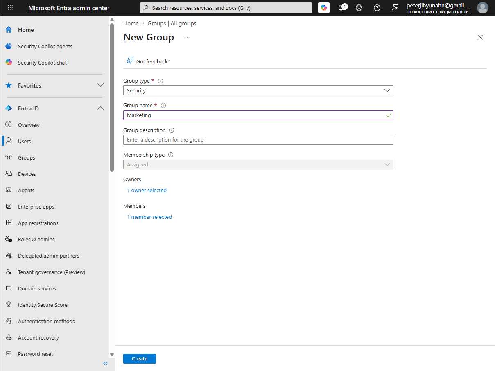<br>
  <em>Figure 6: Creating the Marketing security group with Group type set to Security and Membership type set to Assigned.</em>
</p>

After selecting **Create**, I confirmed that `Marketing` appeared in the **All groups** list.

<p align="left">
  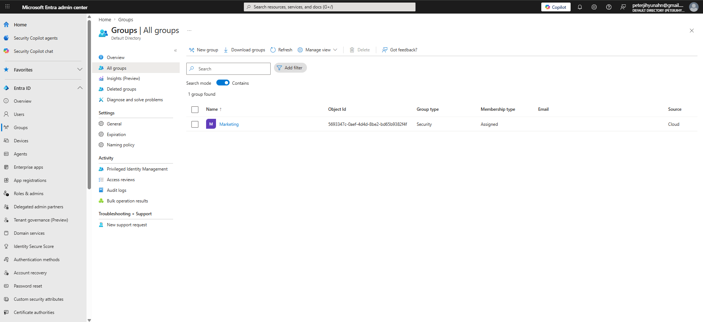<br>
  <em>Figure 7: Marketing group confirmed in the All Groups list.</em>
</p>

##### 🔷 Phase 1.3 — Assign a license to the Marketing group

License assignment to groups is managed through the **Microsoft 365 admin center** (`admin.microsoft.com`), not the Entra admin center.

**Why this matters:** This is an important distinction. The Microsoft Entra admin center is where identity objects (users, groups, applications) are created and managed. The Microsoft 365 admin center is where subscription and license management lives. For group-based license assignment, you must navigate to the M365 admin center — the option is not available directly from the Entra portal for group objects.

I navigated to **Billing → Licenses**, selected an available license from the list.

<p align="left">
  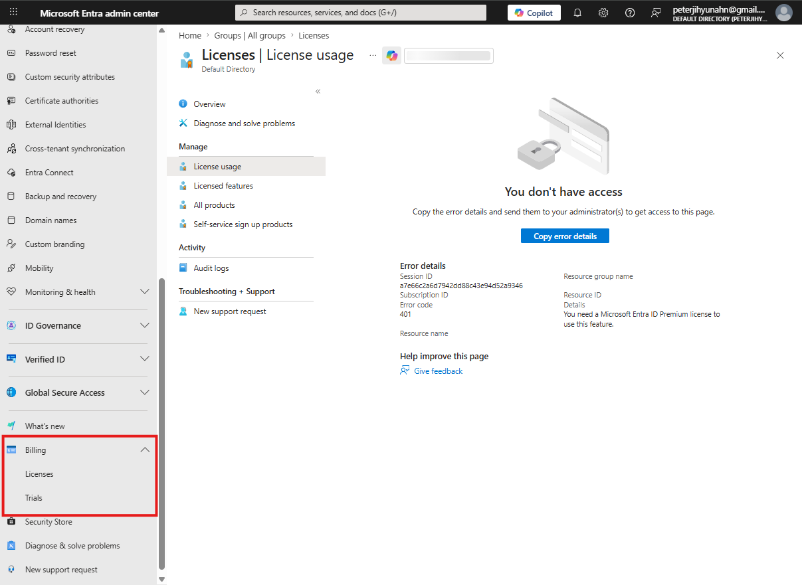 Licenses in the Microsoft 365 admin center"
       style="border: 2px solid #444; border-radius: 6px;"
       width="900"><br>
  <em>Figure 8: Navigating to Billing → Licenses and selecting an available license in the Microsoft 365 admin center.</em>
</p>

I then selected the **Groups** tab near the top of the screen and selected **+ Assign license**.

**What this does:** Assigning a license to a group enables **group-based licensing** — a feature that automatically applies the assigned license to every current and future member of the group. When a new user is added to `Marketing`, they automatically receive the license. When a user is removed from the group, the license is automatically reclaimed. This means the group's membership list *is* the license assignment list — no separate manual step is needed each time membership changes.

**Why this matters:** In an organization with hundreds or thousands of users, manually assigning and revoking licenses user by user is error-prone and unsustainable. Group-based licensing shifts the administrative model: instead of managing individual license assignments, administrators manage group memberships, and the licensing follows. This also reduces the risk of "orphaned" licenses — where a user who left the organization still holds a license because someone forgot to revoke it individually.

I searched for and selected the `Marketing` group, then selected **Assign**.

##### 🔷 Phase 1.4 — Phase 1 findings

| Task | Outcome |
|---|---|
| User account created | `Chris Green` (ChrisG) — cloud identity in Entra ID |
| Security group created | `Marketing` — Assigned membership |
| License assigned | Available license → `Marketing` group via M365 admin center |

</details>

<details>
<summary><strong>▶ Phase 2 — Delete and Restore a User Account</strong><br>
→ removing a user, reviewing the deleted users list, restoring within the 30-day window, and verifying restoration
</summary><br>

This phase focused on deleting `Chris Green`, viewing the deleted users list, restoring the account, and verifying it returned to the active All Users list.

##### 🔷 Phase 2.1 — Delete the Chris Green user account

In the **Microsoft Entra admin center**, I navigated to **Identity → Users → All Users**, selected the checkbox next to `Chris Green`, and selected **Delete user** from the menu.

**What this does:** Selecting Delete user does not immediately and permanently remove the account. Instead, it moves it into a **suspended state** in Entra ID's deleted users container, where it remains for up to **30 days**. During this window, the account retains all of its original attributes, group memberships, and configuration — it simply can no longer be used to authenticate. After the 30-day window expires, the permanent deletion process runs automatically and the account and all associated data are removed.

**Why this matters:** Understanding this suspended-state behavior is important for two reasons. First, it means accidental deletions are recoverable — there's a meaningful window to catch and reverse the mistake. Second, it means a "deleted" user account is still a real object consuming directory space for 30 days, which is relevant in environments where compliance, audit logs, or license reclamation timing matters. The 30-day window is also why immediately checking the deleted users list (as in the next step) is a valid recovery path — the account isn't gone yet.

<p align="left">
  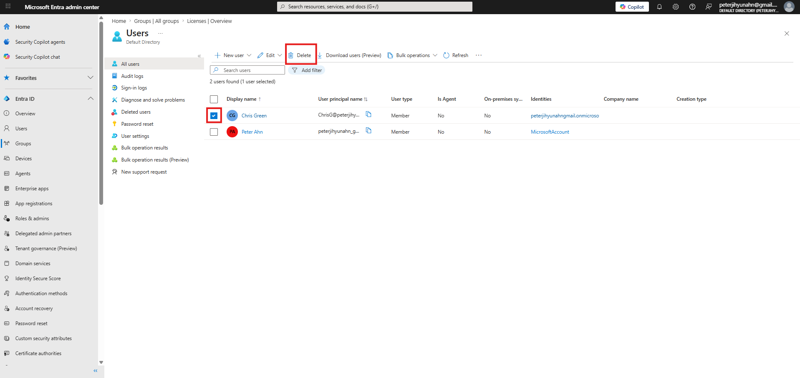<br>
  <em>Figure 9: Selecting Chris Green in the All Users list and selecting Delete user.</em>
</p>

##### 🔷 Phase 2.2 — View the deleted users list

After confirming the deletion, I navigated to **Identity → Users → Deleted users** in the left navigation panel.

**What this does:** This view shows all user accounts that have been deleted within the last 30 days and are still within their recovery window. Each entry in this list represents an account that can still be restored in full — attributes, group memberships, and directory properties intact.

**What happens after 30 days:** After the 30-day window expires, the account moves out of this list and into a permanently deleted state. At that point, **restoration is no longer possible** — not through the portal, not through PowerShell, and not through Microsoft support. This is an important hard limit: once permanently deleted, the identity data is gone. Re-creating an account with the same username is possible, but it would be a brand-new object with a new SID and no inherited properties or history from the original.

**Who can restore:** To restore or permanently delete users from this list, the account performing the action must hold one of the following roles: Global Administrator, Partner Tier-1 Support, Partner Tier-2 Support, or User Administrator.

<p align="left">
  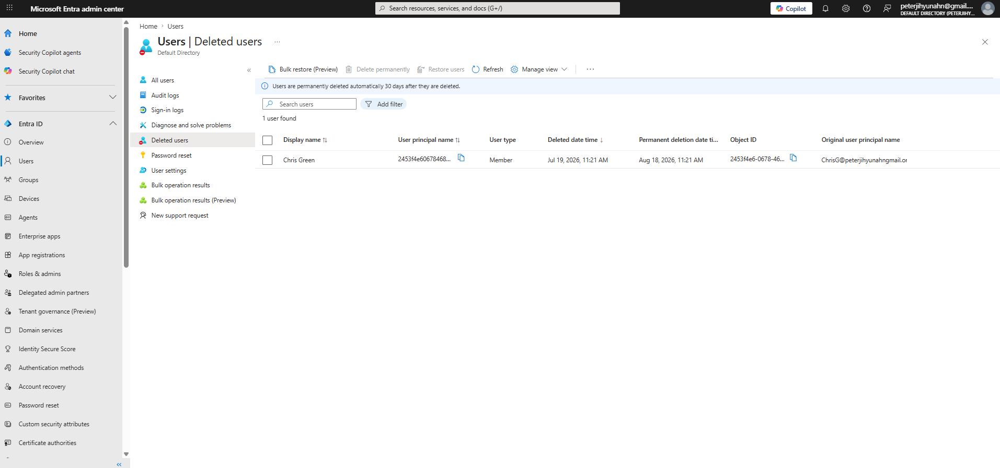<br>
  <em>Figure 10: Deleted Users list showing Chris Green available for restoration.</em>
</p>

##### 🔷 Phase 2.3 — Restore the deleted user

I selected `Chris Green` from the deleted users list and chose **Restore user** from the menu.

<p align="left">
  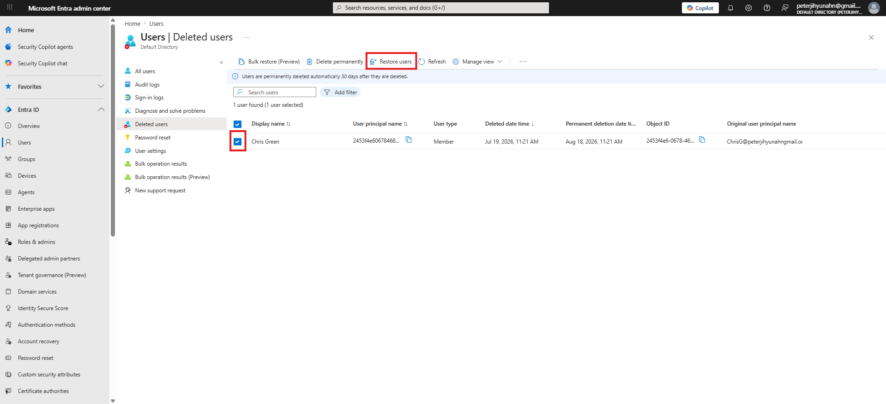<br>
  <em>Figure 11: Selecting Restore user for the Chris Green account from the Deleted Users list.</em>
</p>

I confirmed the restoration dialog.

**What this does:** This moves the account back from the deleted state into an active state in the directory. The restoration is performed with the original account's attributes, group memberships, and directory properties intact — the restored account is functionally identical to the account that existed before it was deleted.

**Why this matters:** Being comfortable with the deletion and restoration lifecycle is a core identity operations skill. In real environments, accidental deletions happen — a bulk operation that catches the wrong accounts, a helpdesk error, or an automation script with a bad filter. Knowing where deleted accounts live, how long the window lasts, and how to restore them is the operational knowledge that prevents what could be a multi-hour manual recreation effort from becoming a 30-second fix.

<p align="left">
  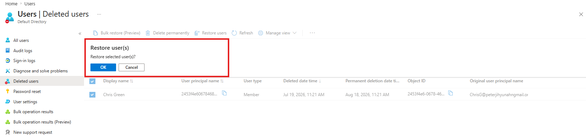<br>
  <em>Figure 12: Confirming the restoration dialog.</em>
</p>

##### 🔷 Phase 2.4 — Verify the restoration

I navigated back to **Identity → Users → All Users** and confirmed `Chris Green` appeared in the active users list.

<p align="left">
  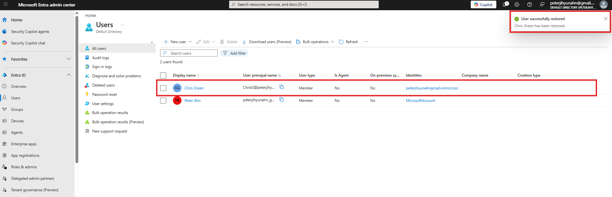<br>
  <em>Figure 13: Chris Green confirmed in the All Users list after restoration.</em>
</p>

##### 🔷 Phase 2.5 — Phase 2 findings

| Task | Outcome |
|---|---|
| User deleted | `Chris Green` moved to deleted users (30-day suspended state) |
| Deleted users list reviewed | `Chris Green` visible and restorable |
| User restored | `Chris Green` restored with original attributes |
| Restoration verified | `Chris Green` confirmed in All Users list |

</details>

<details>
<summary><strong>▶ Phase 3 — Create a Microsoft 365 Group</strong><br>
→ creating a collaboration group with an owner and a member
</summary><br>

This phase focused on creating a **Microsoft 365 group** (`Northwest Sales`) with an assigned owner and at least one member, then verifying it appeared in the All groups list.

##### 🔷 Phase 3.1 — Create the Northwest Sales Microsoft 365 group

I navigated to **Identity → Groups → All groups** and selected **New group**.

**What this does:** This opens the same group creation form used in Phase 1.2, but this time the Group type selected is **Microsoft 365** rather than Security. This distinction is important: a Microsoft 365 group is not just a membership container — it also automatically provisions a shared set of collaboration resources, including a shared mailbox, a shared calendar, a SharePoint document library, and a Microsoft Teams workspace (if Teams integration is active in the tenant). These resources are created and tied to the group automatically at creation time.

**Microsoft 365 group vs. Security group:**

| Feature | Security Group | Microsoft 365 Group |
|---|---|---|
| Access control and license assignment | ✅ | ✅ |
| Shared mailbox and calendar | ❌ | ✅ |
| SharePoint site | ❌ | ✅ |
| External (guest) member support | Limited | ✅ |
| Dynamic device membership | ✅ | ❌ |
| Created by | Admins only | Admins and users (if allowed) |

I created the group using the following settings:

| Setting | Value |
|---|---|
| Group type | Microsoft 365 |
| Group name | Northwest Sales |
| Membership type | Assigned |
| Owners | Administrator account (own account assigned as owner) - Peter Ahn (me) |
| Members | At least one member assigned - Chris Green (new user) |

**What the Owner role does:** An owner of a Microsoft 365 group can manage group membership, settings, and in some cases the associated SharePoint site and mailbox — without needing to be a full tenant administrator. This is a delegation model: giving a business unit leader ownership of their own group so they can manage its membership without IT involvement for every change.

<p align="left">
  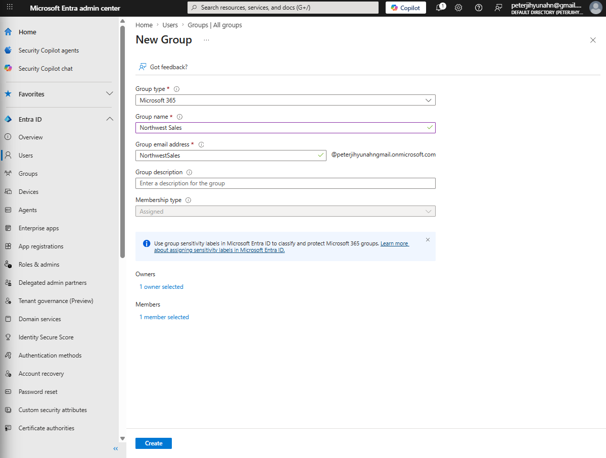<br>
  <em>Figure 14: Configuring the Northwest Sales Microsoft 365 group with Group type, Group name, Membership type, owner, and member.</em>
</p>

After selecting **Create**, the group may take a moment to appear. I refreshed the All groups list until `Northwest Sales` was visible.

<p align="left">
  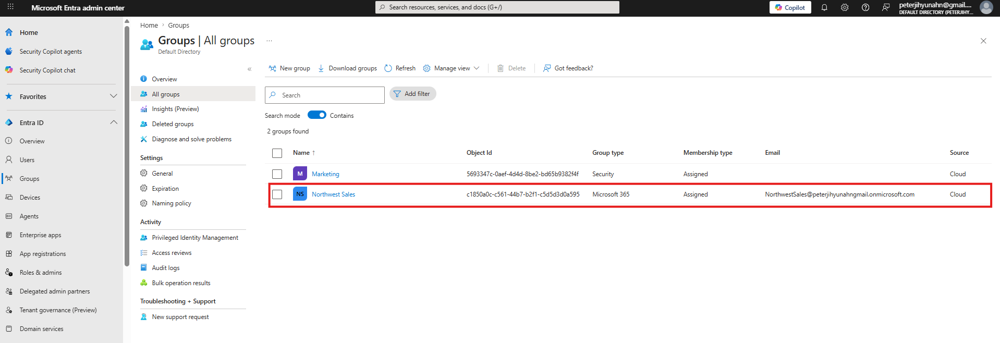<br>
  <em>Figure 15: Northwest Sales confirmed in the All Groups list after creation.</em>
</p>

##### 🔷 Phase 3.2 — Phase 3 findings

| Task | Outcome |
|---|---|
| Microsoft 365 group created | `Northwest Sales` — Assigned membership, with owner and member |
| Group confirmed | `Northwest Sales` visible in All groups list |

</details>

<details>
<summary><strong>▶ Phase 4 — Create a User and Assign a License Directly to That User</strong><br>
→ provisioning a second user account and assigning a license at the individual level
</summary><br>

This phase focused on creating a second user account (`Dominique Koch`) in Microsoft Entra ID, then assigning a license directly to that individual user through the Microsoft 365 admin center.

##### 🔷 Phase 4.1 — Create the Dominique Koch user account

In the **Microsoft Entra admin center**, I navigated to **Identity → Users → All Users → + New user → Create new user** and created the account following the same multi-tab process as Phase 1.1. I completed the Basics tab (UPN: DominiqueK, Display name: Dominique Koch, password), the Properties tab (First name: Dominique, Last name: Koch, Usage location: United States), and proceeded through Assignments without making any assignments at creation time.

| Setting | Value |
|---|---|
| User principal name | DominiqueK |
| Display name | Dominique Koch |
| First name | Dominique |
| Last name | Koch |
| Password | (unique password configured) |
| Usage location | United States |

The usage location was again required to allow license assignment in the next step.

<p align="left">
  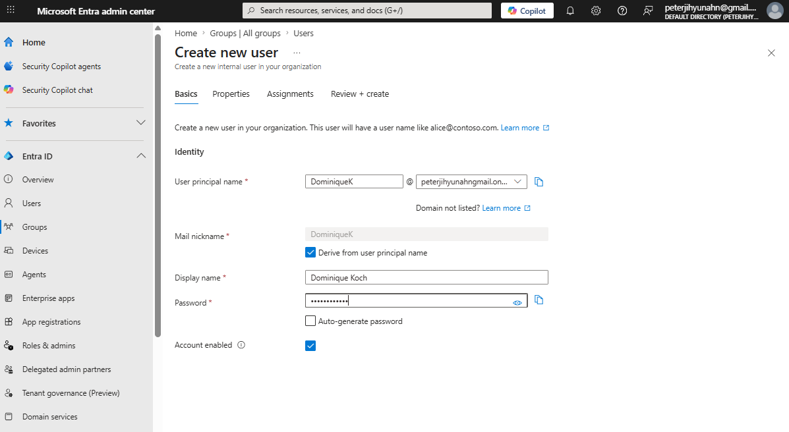<br>
  <em>Figure 16: Basics tab showing the UPN (DominiqueK) and display name (Dominique Koch) for the new account.</em>
</p>

<p align="left">
  <br>
  <em>Figure 17: Properties tab (Dominique Koch) for the new account.</em>
</p>

After completing all tabs and selecting **Review + create → Create**, I confirmed `Dominique Koch` appeared in the All Users list.

<p align="left">
  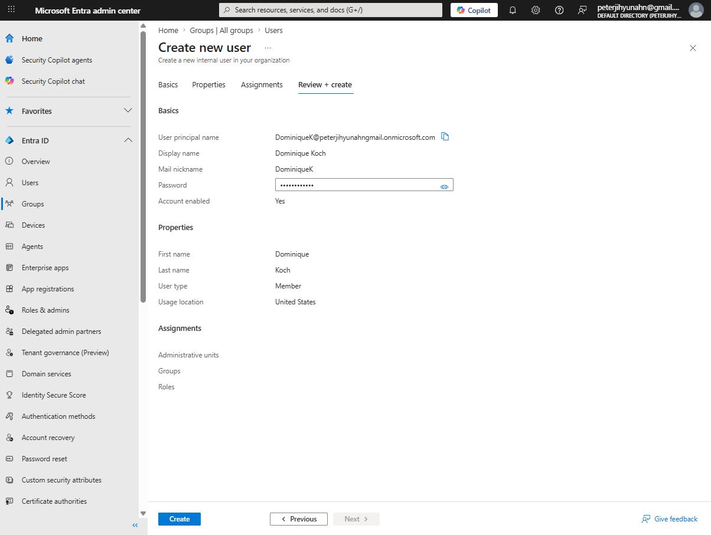<br>
  <em>Figure 18: Dominique Koch confirmed in the All Users list after account creation.</em>
</p>

##### 🔷 Phase 4.2 — Assign a license directly to Dominique Koch

I navigated to the **Microsoft 365 admin center** (`admin.microsoft.com`), selected **Billing → Licenses**, and selected an available license from the list. I then selected **Licensed users** from the menu near the top of the page and selected **+ Assign licenses**.

**Why Licensed users, not Groups:** Phase 1.3 used the **Groups** tab to assign a license to a group. This step uses the **Licensed users** tab to assign directly to an individual. Both paths exist within the same Licenses view in the M365 admin center — the Groups tab manages group-based assignments, and the Licensed users tab manages individual user assignments.

**Individual vs. group-based assignment:** Individual assignment is simpler to understand but harder to scale. If the same license needs to be assigned to 200 users, individual assignment means 200 separate actions. Group assignment means adding all 200 users to one group and letting Entra handle the rest. For a single user in a specific scenario (an exception, an executive, a temporary contractor), individual assignment is perfectly appropriate.

I searched for and selected `Dominique Koch`, then selected **Assign** at the bottom of the dialog.


##### 🔷 Phase 4.3 — Verify the license on Dominique Koch's profile

I returned to the **Microsoft Entra admin center**, navigated to **Identity → Users**, selected `Dominique Koch`, and opened the **Licenses** section of her profile to confirm the assigned license appeared.

**Why this verification step matters:** Confirming the license in the Entra admin center (rather than only in the M365 admin center where it was assigned) validates that the license assignment actually propagated to the user's identity object in the directory. In a production environment, this kind of cross-portal verification is a routine part of confirming that a provisioning action completed successfully.


##### 🔷 Phase 4.4 — Phase 4 findings

| Task | Outcome |
|---|---|
| User account created | `Dominique Koch` (DominiqueK) — cloud identity in Entra ID |
| License assigned | Available license → `Dominique Koch` directly via M365 admin center |
| License verified | Confirmed on Dominique Koch's profile in Entra admin center |

</details>

---

### Evidence Examination Summary

| Task | Portal/Tool | Object(s) Affected | Outcome |
|---|---|---|---|
| Create user account | Entra admin center | `Chris Green` | Cloud identity created in Entra ID |
| Create security group | Entra admin center | `Marketing` | Security group with Assigned membership created |
| Assign license to group | M365 admin center | `Marketing` group | License assigned; group-based licensing active |
| Delete user account | Entra admin center | `Chris Green` | Account moved to 30-day suspended state |
| View deleted users | Entra admin center | `Chris Green` | Account visible in Deleted Users list |
| Restore deleted user | Entra admin center | `Chris Green` | Account restored with original attributes |
| Verify restoration | Entra admin center | `Chris Green` | Account confirmed in All Users list |
| Create Microsoft 365 group | Entra admin center | `Northwest Sales` | M365 group created with owner and member |
| Create user account | Entra admin center | `Dominique Koch` | Cloud identity created in Entra ID |
| Assign license to user | M365 admin center | `Dominique Koch` | License assigned directly to individual user |
| Verify license assignment | Entra admin center | `Dominique Koch` | License confirmed on user's Licenses profile page |

---

### What I Learned (Skills Demonstrated)

Through this workflow, I learned how to:

- Create cloud identity user accounts in Microsoft Entra ID and understand how they differ from directory-synced and guest identities.
- Create Security groups and Microsoft 365 groups with Assigned membership, and understand the distinct purpose of each group type.
- Understand how Membership type (Assigned vs. Dynamic) affects how group members are added and managed.
- Assign a license to a security group using the Microsoft 365 admin center, and understand why group-based licensing is the preferred approach at organizational scale.
- Assign a license directly to an individual user using the Microsoft 365 admin center, and understand when individual assignment is appropriate.
- Verify license assignment on a user's profile within the Microsoft Entra admin center.
- Delete a user account and understand the resulting 30-day suspended state.
- Navigate to the Deleted Users list and understand the difference between recoverable and permanently deleted accounts.
- Restore a deleted user account within the 30-day window and verify the restoration.
- Understand the relationship between the Microsoft Entra admin center (identity management) and the Microsoft 365 admin center (license management) and why some tasks require navigating between both portals.

---

### Key Takeaways

This workflow showed that Microsoft Entra ID identity administration involves a set of related but distinct operational tasks that span multiple Microsoft portals.

It involves a sequence of operational decisions:

```text
Provision the identity (create user account with correct attributes)
      ↓
Organize identities into groups (Security or Microsoft 365, depending on purpose)
      ↓
Assign licenses at the appropriate level (group for scale, individual for exceptions)
      ↓
Verify provisioning outcomes across portals
      ↓
Manage the identity lifecycle (monitor, delete when no longer needed, restore if accidentally deleted)
```

The most important lesson from this workflow is that identity administration in Entra ID is not just about creating accounts — it's about understanding the full lifecycle of an identity from creation through deprovisioning, and knowing which tool handles which part of that lifecycle. The Microsoft Entra admin center owns the identity objects; the Microsoft 365 admin center owns license assignment; and the relationship between groups, memberships, and licenses is what makes scalable identity management possible.

Understanding where each operation lives, why group-based licensing exists, and what the 30-day deletion window actually means are the kinds of operational details that separate someone who can follow a checklist from someone who understands what they're doing and why.