# Threat Intelligence Research and Analysis Using MISP

This workflow demonstrates practical threat intelligence research and analysis using MISP (Malware Information Sharing Platform) to investigate ransomware operations, threat actor activity, DDoS infrastructure, malware campaigns, and ransomware-related exploitation activity. It highlights how analysts use threat intelligence platforms to pivot across events, indicators, ATT&CK mappings, external reporting, and malware intelligence to support operational awareness and investigative reporting.

The main tools I've used are: MISP, MITRE ATT&CK, VirusTotal, Reddit, and external intelligence reports referenced within MISP events. See **[Environment and Execution Context](#environment-and-execution-context)** section below.

### Overview

This project focused on using MISP (Malware Information Sharing Platform) as a threat intelligence platform to investigate multiple real-world malware, ransomware, and DDoS-related events. Throughout the investigation, event data, operational indicators, external intelligence references, malware samples, infrastructure indicators, and contextual adversary intelligence were reviewed to better understand how threat intelligence platforms support security operations and incident response activities.

This workflow documents practical threat intelligence analysis performed within MISP to investigate multiple cyber threat categories and adversary operations. The workflow focuses on using MISP event data, ATT&CK mappings, tags, galaxies, indicators, malware references, and linked intelligence reports to identify operational details associated with ransomware groups, phishing campaigns, DDoS malware, and exploitation activity.

The analysis progresses through structured investigative phases beginning with broad event searches and continuing into event-level investigation, ATT&CK analysis, malware artifact review, external intelligence enrichment, and threat actor correlation. The workflow demonstrates how analysts use TIP platforms not only to store intelligence, but also to pivot between related campaigns, malware families, infrastructure indicators, and adversary behavior.

> **Workflow vs Execution vs Writeup (Terminology Used Here)**  
> - **Workflows** refer to operational threat intelligence tasks such as ransomware research, ATT&CK mapping analysis, IOC review, and adversary investigation.  
> - **Executions** refer to hands-on use of MISP to perform event searches, review indicators, analyze tags and galaxies, and pivot through related intelligence.  
> - **Writeups** document investigative findings, analyst reasoning, intelligence pivots, and threat research conclusions.

> 👉 For a **detailed, step-by-step walkthrough of how this workflow was executed — complete with screenshots**, see the **[Step-by-Step Execution](#step-by-step-execution)** section below.

---

### Purpose and Analyst Focus

#### ▶ Purpose

The purpose of this workflow is to perform operational threat intelligence analysis using MISP by researching ransomware groups, threat actors, DDoS malware campaigns, and exploitation activity associated with real-world attacks. The workflow focuses on understanding how threat intelligence platforms centralize indicators, ATT&CK mappings, malware references, and external intelligence reporting into a searchable investigation environment.

The workflow demonstrates how intelligence analysts use MISP to identify threat actor behavior, review malware artifacts, analyze campaign infrastructure, and correlate information across multiple intelligence events. It emphasizes how structured intelligence platforms improve analyst visibility into evolving cyber threats and support investigative reporting workflows.

#### ▶ Analyst Focus

The analyst focus is on using MISP to investigate adversary operations, pivot through related intelligence, and extract actionable findings from threat intelligence events. This includes reviewing ATT&CK tactics and techniques, analyzing malware-related indicators, validating campaign infrastructure, reviewing linked external reporting, and correlating threat actor activity across multiple intelligence events.

The workflow reflects responsibilities commonly performed by Threat Intelligence Analysts, SOC Analysts, Incident Responders, and Detection Engineers when researching adversaries, tracking malware campaigns, and identifying operational indicators that may impact enterprise environments.

---

### What This Workflow Demonstrates

This workflow demonstrates an end-to-end threat intelligence research process using MISP. Specifically, it demonstrates how to:

- Search MISP events for ransomware-related intelligence.
- Investigate ransomware families and extract indicators from associated events.
- Review YARA rules to identify malware behaviors and ransomware artifact creation.
- Analyze MITRE ATT&CK tactic mappings associated with threat actor campaigns.
- Use MISP galaxies and tags to pivot between related threat actor events.
- Investigate phishing campaigns associated with Turla Group activity.
- Research DDoS malware and booter infrastructure using intelligence events.
- Review malware upload references and external intelligence reporting.
- Investigate command-and-control infrastructure associated with malware campaigns.
- Research CVE exploitation activity and affected software versions.
- Analyze ransomware-related persistence artifacts and malware hashes.
- Use linked intelligence reporting to support operational conclusions.

---

### Investigation and Detection Relevance

Threat intelligence platforms play a major role in modern security operations because they centralize indicators, adversary behaviors, malware intelligence, and investigative reporting into a searchable operational environment.

This workflow demonstrates how intelligence analysis supports:

- ransomware monitoring,
- adversary tracking,
- ATT&CK-based behavioral analysis,
- malware infrastructure research,
- IOC enrichment,
- phishing campaign investigation,
- vulnerability exploitation awareness,
- operational threat reporting.

The workflow’s steps map directly to common security questions, including:

- What ransomware groups are currently active?
- What indicators are associated with recent ransomware campaigns?
- Which ATT&CK tactics and techniques are associated with a threat actor?
- What infrastructure or malware artifacts are linked to a campaign?
- What software vulnerabilities are actively being exploited?
- What malware behaviors or persistence mechanisms should defenders monitor?

By documenting repeatable intelligence workflows for event review, ATT&CK analysis, indicator extraction, and adversary pivoting, this workflow supports collaboration and repeatable threat intelligence operations.

---

### Environment and Execution Context

This section documents the tools, intelligence sources, and investigative environment used during the workflow.

**Note:** Each section is collapsible. Click the ▶ arrow to expand and view details on software, tools, environment, intelligence sources, and more.

<details>
<summary><strong>▶ Environment & Platform</strong><br>
</summary><br>

Threat intelligence analysis was performed using MISP hosted within the BTL1 guided lab environment. MISP was accessed through a browser using a private lab IP address and authenticated using analyst credentials provided within the lab environment.

</details>

<details>
<summary><strong>▶ Tooling and Intelligence Sources</strong><br>
</summary><br>

- **Primary TIP platform:** MISP (Malware Information Sharing Platform)  
- **Threat behavior framework:** MITRE ATT&CK  
- **External malware validation:** VirusTotal  
- **Community intelligence reporting:** Reddit-linked reports  
- **External threat reports:** Arctic Wolf and linked intelligence articles within MISP events  

The workflow intentionally focuses on operational use of MISP event data rather than fully automated enrichment pipelines so that investigative reasoning and intelligence pivoting can be understood manually.

</details>

<details>
<summary><strong>▶ Data Sources Analyzed</strong><br>
</summary><br>

The workflow used the following intelligence sources:

- **MISP threat intelligence events**
- **MITRE ATT&CK mappings**
- **Threat actor galaxy tags**
- **YARA rules**
- **Malware indicators and hashes**
- **External intelligence report references**
- **VirusTotal malware upload references**
- **Community reporting sources**
- **CVE-related intelligence**

</details>

<details>
<summary><strong>▶ Workflow Map (High-Level)</strong><br>
</summary><br>

1. Search MISP for ransomware-related events and indicators.
2. Investigate Lockbit ransomware indicators and Babuk YARA rules.
3. Analyze Turla-related ATT&CK mappings and campaign events.
4. Review phishing campaign artifacts associated with Turla operations.
5. Investigate DDoS booter infrastructure and malware-related events.
6. Analyze malware upload references and command-and-control infrastructure.
7. Research MiVoice exploitation activity and associated ransomware operations.
8. Review linked intelligence reports, persistence mechanisms, and malware hashes.
9. Correlate intelligence findings to support operational reporting conclusions.

</details>

---

### Step-by-Step Execution

This section documents the workflow in the same order an analyst would realistically perform operational threat intelligence research using MISP within a controlled virtual lab environment. The analysis was performed from a lab workstation hosted in a virtualized environment, where I connected to a preconfigured MISP server hosted internally at `10.0.11.23`. The process begins with broad intelligence searches and progresses into deeper event-level analysis, ATT&CK review, malware investigation, infrastructure analysis, and external intelligence correlation.

<p align="left">
  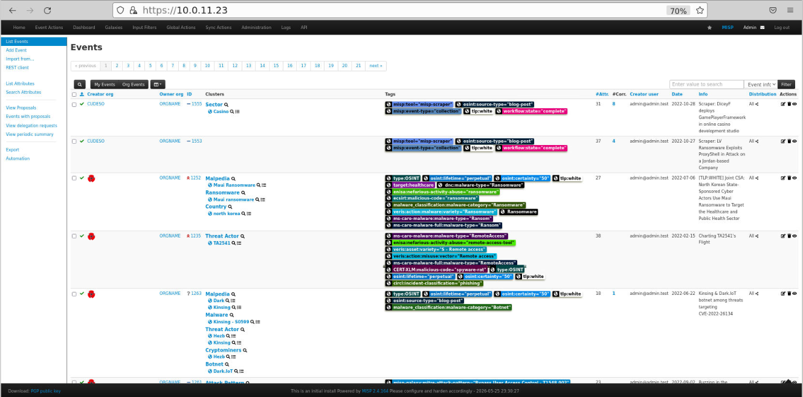<br>
  <em>Figure 1"</em>
</p>

The workflow focused on navigating existing intelligence already populated within the MISP instance rather than building or administering the platform itself. This allowed the investigation to focus primarily on operational threat intelligence analysis, indicator review, adversary tracking, and investigative pivoting using real-world intelligence data contained within the environment.

Each phase captures both the technical actions performed and the investigative reasoning behind those actions. The workflow intentionally progresses from broad threat awareness into targeted intelligence analysis, mirroring how analysts conduct operational threat intelligence investigations within enterprise environments.

**Note:** Each section is collapsible. Click the ▶ arrow to expand and view the detailed steps.

<details>
<summary><strong>▶ Phase 1 — Ransomware Intelligence Research and Event Investigation</strong><br>
→ investigating ransomware-related events, indicators, and malware artifacts
</summary><br>

This phase focused on using MISP search functionality to identify ransomware-related intelligence events and investigate specific ransomware families and malware artifacts within the virtual lab environment.

<blockquote>
I started with broad ransomware event searches because ransomware remains one of the most operationally impactful threat categories for organizations. I wanted to understand how MISP organizes ransomware intelligence and how indicators, malware references, and YARA rules are structured within events. Since the MISP instance was already configured and populated with intelligence data, I was able to focus directly on operational analysis and investigative pivoting rather than platform deployment or administration.
</blockquote>

##### 🔷 Phase 1.1 — Search MISP events for ransomware-related intelligence

The MISP event search functionality was used to identify events containing ransomware-related intelligence. To begin the investigation, I entered the keyword `ransomware` into the MISP search field and selected **Event info** as the search type before applying the filter.

I specifically used the **Event info** search type because I wanted MISP to search against the main event titles and descriptions rather than every individual attribute or IOC contained within the platform. This helped narrow the results to intelligence events primarily focused on ransomware activity instead of returning unrelated indicators that may only reference ransomware somewhere within a larger dataset.

<p align="left">
  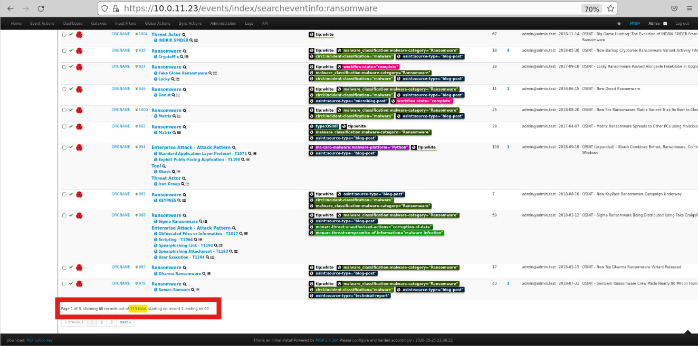<br>
  <em>Figure 2: Searching MISP event information for ransomware-related intelligence events"</em>
</p>

After applying the filter, I reviewed the returned event list to identify notable ransomware-related intelligence entries and better understand the volume of ransomware reporting present within the MISP environment. I then scrolled to the bottom of the event list and observed the red boxed summary text, which displayed the total number of matching results returned by the search query.

This step is operationally important because threat intelligence platforms often contain multiple overlapping events associated with ransomware campaigns, affiliates, malware infrastructure, intrusion activity, and malware variants. Reviewing the total number of matching intelligence events provides analysts with a quick understanding of how extensively a threat category is represented within the platform and helps establish investigative scope before pivoting into deeper event-level analysis.

##### 🔷 Phase 1.2 — Investigate Lockbit ransomware event indicators

After searching for `lockbit` using the **Event info** search type, I identified and opened the most recent Lockbit-related intelligence event titled **"Back in Black: Unlocking a LockBit 3.0 Ransomware Attack."** I selected the **Event info** search option specifically because I wanted MISP to search against the primary event names and descriptions rather than every individual attribute or IOC stored within the platform. This helped narrow the results to events directly focused on Lockbit ransomware activity instead of unrelated indicators that may only mention Lockbit somewhere within a larger dataset.

<p align="left">
  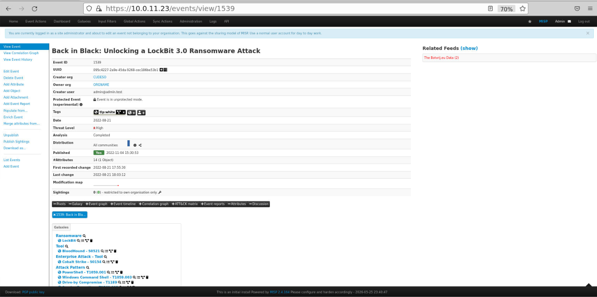<br>
  <em>Figure 3: Reviewing the primary Lockbit ransomware intelligence event within MISP.</em>
</p>

Once the event was opened, I first reviewed the high-level event summary fields at the top of the page to better understand the overall intelligence context before pivoting into the indicators themselves. These fields provide important operational metadata about the intelligence event and help analysts determine the relevance, severity, and scope of the reporting.

Key fields reviewed included:

- **Event ID** — the unique identifier assigned to the intelligence event within MISP  
- **UUID** — the globally unique event identifier used for correlation and sharing  
- **Creator Org / Owner Org** — identifies the organization responsible for creating or maintaining the event  
- **Date** — indicates when the intelligence event was created or associated with observed activity  
- **Threat Level** — reflects the assessed severity or operational impact of the threat activity  
- **Analysis** — indicates the status of the investigation or intelligence review  
- **Distribution** — defines how widely the intelligence can be shared across organizations  
- **Tags and ATT&CK mappings** — provide operational context related to ransomware classification, tooling, adversary behavior, and associated ATT&CK techniques  

Reviewing these fields first helped establish the overall context of the ransomware campaign before examining the specific indicators contained within the event.

After reviewing the event overview, I scrolled further down into the event’s **Attributes** table to investigate the actual indicators and infrastructure artifacts associated with the Lockbit campaign.

<p align="left">
  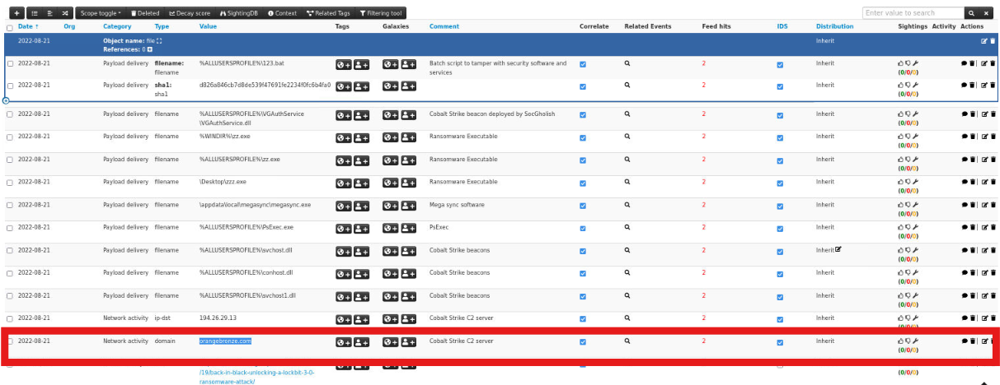<br>
  <em>Figure 4: Reviewing Lockbit-associated indicators and infrastructure artifacts within the Attributes table.</em>
</p>

The Attributes table represents the core intelligence data associated with the event and contains structured indicators such as:

- filenames,
- hashes,
- IP addresses,
- domains,
- URLs,
- malware-related artifacts,
- network activity indicators.

I focused specifically on the **Type** and **Value** columns because those fields identify both the kind of indicator being observed and the actual observable artifact itself.

For example:

- The **Type** column categorizes the indicator (`filename`, `sha1`, `ip-dst`, `domain`, etc.)
- The **Value** column contains the actual observable IOC or artifact associated with that category

I specifically looked for entries where the **Type** column was labeled `domain` because the investigation question required identifying a domain observed within the Lockbit intelligence event. Once located, the corresponding **Value** field revealed the associated domain indicator tied to the ransomware campaign infrastructure.

This step is operationally important because ransomware intelligence events frequently contain:

- malicious domains,
- C2 infrastructure,
- phishing-related indicators,
- malware delivery mechanisms,
- operational infrastructure associated with ransomware campaigns.

<blockquote>
I wanted to focus specifically on infrastructure-related indicators within the Lockbit event because threat intelligence becomes much more actionable when tied directly to observable artifacts that defenders can monitor, block, enrich, or correlate across environments. Reviewing the structured Attributes table also reinforced how MISP organizes intelligence into clearly categorized IOC types, making it easier to pivot between malware artifacts, network infrastructure, and adversary behaviors during investigation workflows.
</blockquote>

##### 🔷 Phase 1.3 — Review Babuk YARA rule and ransomware artifact behavior

A Babuk-related intelligence event was investigated to review associated YARA rules and identify malware-specific artifacts related to ransomware behavior and file creation activity. Babuk is a ransomware family known for encrypting victim systems and deploying ransom notes that instruct victims on how to recover their files or contact the attackers.

To begin the investigation, I searched for `babuk` within MISP and reviewed the returned intelligence events associated with the ransomware family. During review of the event attributes, I identified an entry where the **Type** field was labeled `yara`, indicating that the event contained a YARA detection rule associated with Babuk ransomware activity.

<p align="left">
  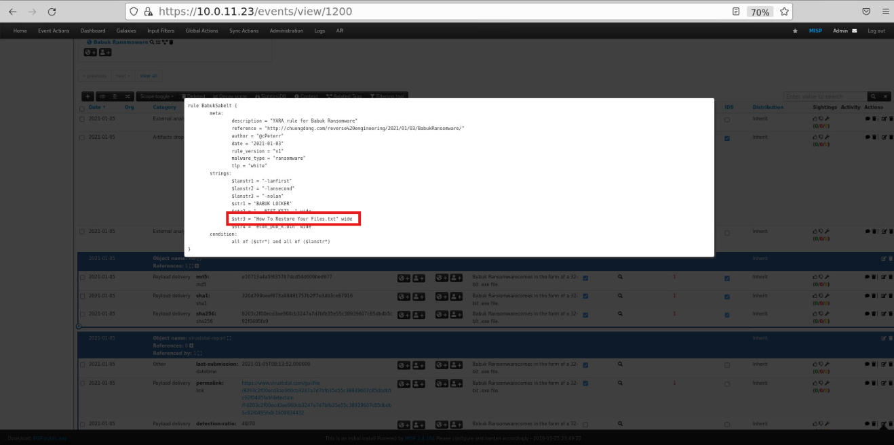<br>
  <em>Figure 5: Reviewing the Babuk ransomware YARA rule within MISP.</em>
</p>

I then selected the **"show all"** option within the **Value** field to open and review the full YARA rule contents. This step was important because YARA rules frequently contain identifiable malware strings, filenames, behavioral references, and detection logic that can reveal operational details about how malware behaves on infected systems.

YARA is commonly used by defenders, malware analysts, and threat intelligence teams to identify malicious files or malware families based on specific characteristics such as:

- embedded strings,
- filenames,
- code patterns,
- binary structures,
- behavioral indicators,
- encryption-related artifacts.

Rather than functioning like a traditional antivirus signature alone, YARA rules allow analysts to define custom detection logic that identifies malware based on multiple related properties and operational behaviors.

While reviewing the YARA rule, I focused specifically on the `strings` section because this portion of the rule defines text patterns and identifiable artifacts associated with the malware sample. Within the strings section, I identified the field:

```text
$str3 = "How To Restore Your Files.txt" wide

</details>

<details>
<summary><strong>▶ Phase 2 — Turla Threat Actor Investigation and ATT&CK Analysis</strong><br>
→ investigating Turla-related intelligence events, ATT&CK mappings, and phishing campaign activity
</summary><br>

This phase focused on investigating Turla Group activity using ATT&CK mappings, galaxy tags, and related campaign events within MISP.

<blockquote>
Once I completed the ransomware-related research, I shifted toward adversary-focused analysis because MISP allows analysts to pivot between indicators, ATT&CK mappings, and broader threat actor operations.
</blockquote>

##### 🔷 Phase 2.1 — Review ATT&CK Matrix mappings associated with Turla activity

A Turla-related intelligence event was opened and analyzed using the MITRE ATT&CK Enterprise Matrix to identify the higher-level adversary tactics and associated techniques mapped to the campaign. To begin the investigation, I searched for `986` within the MISP search field and selected the **ID/UUID** search type before opening the event using the eye icon.

I specifically used the **ID/UUID** search type because the investigation task referenced a specific event number rather than a keyword, malware family, or IOC. Searching directly by event ID allowed me to immediately access the exact Turla-related intelligence event without returning unrelated results that may have also referenced Turla activity elsewhere within the platform.

The event opened as **"Turla Outlook White Paper,"** which contained operational intelligence associated with the Turla threat actor group, including ATT&CK mappings, campaign metadata, adversary tags, and associated intelligence context.

After reviewing the event overview and associated tags, I navigated to the **+ATT&CK matrix** tab located within the event navigation bar. This opened the MITRE ATT&CK Enterprise Matrix view associated with the event.

<p align="left">
  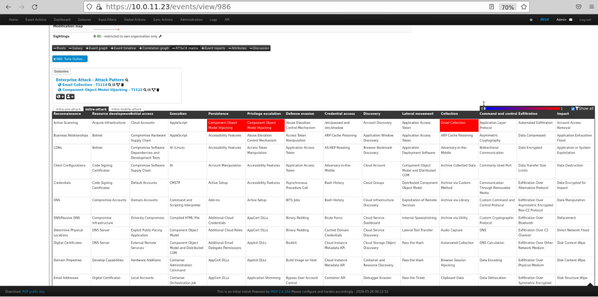<br>
  <em>Figure 6: Reviewing MITRE ATT&CK tactic and technique mappings associated with the Turla threat actor campaign.</em>
</p>

The MITRE ATT&CK Enterprise Matrix provides a structured visual representation of adversary behaviors observed during real-world attacks. Rather than organizing intelligence around malware names or isolated indicators alone, ATT&CK focuses on the actual tactics and techniques attackers use throughout the intrusion lifecycle.

Within the matrix:

- The **top column headers** represent high-level ATT&CK **Tactics**, which describe broader attacker objectives or phases of an intrusion.
- The **highlighted red boxes** underneath those columns represent specific ATT&CK **Techniques** mapped to the observed Turla activity.

Examples of these tactics include:

- Persistence
- Privilege Escalation
- Collection
- Discovery
- Command and Control
- Lateral Movement

The highlighted techniques observed in this event included:

- `Component Object Model Hijacking`
- `Email Collection`

Rather than focusing only on the individual technique names, I specifically focused on identifying which higher-level tactic columns contained highlighted techniques because the investigation task required determining the broader ATT&CK tactic categories associated with the campaign.

For example:

- `Component Object Model Hijacking` appeared under both the **Persistence** and **Privilege Escalation** tactics.
- `Email Collection` appeared under the **Collection** tactic.

By identifying which tactic columns contained highlighted techniques, I was able to determine the broader operational categories associated with Turla’s observed activity rather than simply reviewing isolated ATT&CK technique names.

This step is operationally important because ATT&CK mappings help analysts understand:

- adversary objectives,
- operational behaviors,
- intrusion lifecycle activity,
- likely attack progression,
- defensive monitoring opportunities,
- behavioral detection coverage.

The Enterprise ATT&CK Matrix also provides higher-level operational visibility into how a threat actor conducts campaigns across different phases of intrusion activity. This allows defenders to move beyond simple IOC-based analysis and instead understand attacker behavior patterns at a much broader operational level.

Reviewing the matrix also helps support:

- threat hunting,
- detection engineering,
- ATT&CK-based alert mapping,
- adversary emulation,
- behavioral analytics development.

<blockquote>
I focused specifically on the ATT&CK tactic columns because they provide a much more strategic view of adversary behavior than individual indicators alone. Instead of simply identifying malware names or isolated artifacts, the matrix helped show which broader phases of the attack lifecycle Turla activity was associated with, including persistence-related activity, privilege escalation behavior, and collection-focused operations. This reinforced how ATT&CK mappings help translate technical threat intelligence into operational understanding that defenders can use for detection engineering, threat hunting, and incident response planning.
</blockquote>

<blockquote>

Analyst Note — Threat Intelligence Platforms vs Live SIEM Telemetry

During this phase of the investigation, I also developed a better understanding of how Threat Intelligence Platforms (TIPs) such as MISP differ from traditional SIEM platforms and how the two technologies complement each other operationally within enterprise security environments.

Unlike a SIEM, which primarily collects and analyzes live telemetry and log data from endpoints, servers, firewalls, cloud platforms, and network devices, MISP functions primarily as a centralized threat intelligence repository and correlation platform. Rather than ingesting raw operational logs directly from enterprise systems, MISP stores structured intelligence associated with:

- threat actors,
- malware families,
- indicators of compromise (IOCs),
- adversary infrastructure,
- ATT&CK mappings,
- YARA rules,
- vulnerability intelligence,
- external threat reporting,
- campaign relationships.

The Turla intelligence event analyzed during this workflow represents previously researched and documented adversary activity rather than a live attack occurring within the environment itself. The event contains curated intelligence collected and shared by security researchers or intelligence contributors who previously investigated Turla-related campaigns and imported those findings into the MISP platform.

This means the workflow focused less on reviewing live endpoint or firewall logs and more on understanding how analysts operationalize threat intelligence to:

- identify adversary infrastructure,
- understand attacker behavior,
- map techniques to ATT&CK,
- correlate malware artifacts,
- research campaigns,
- identify potential detection opportunities.

The ATT&CK Matrix view specifically reinforced how intelligence analysis can move beyond static indicators such as hashes or IP addresses and instead focus on broader attacker behaviors across the intrusion lifecycle. In this case, the highlighted ATT&CK tactics and techniques represented observed Turla behaviors that researchers previously mapped during investigation of the campaign.

Although MISP itself is not functioning as a live SIEM within this lab environment, platforms like MISP are frequently integrated operationally with SIEMs, EDR platforms, SOAR solutions, and detection pipelines within enterprise environments. For example:

- threat intelligence indicators stored in MISP may be exported into SIEM detection rules,
- malicious domains or IPs may be used for alert enrichment,
- ATT&CK mappings may support detection engineering workflows,
- known adversary infrastructure may be correlated against firewall, DNS, proxy, or EDR telemetry.

In real-world SOC environments, threat intelligence platforms and SIEM/EDR telemetry work together to help defenders identify whether enterprise systems may be communicating with known malicious infrastructure or exhibiting behaviors associated with previously documented adversary campaigns.

</blockquote>

##### 🔷 Phase 2.2 — Pivot through threat actor galaxy tags

The event’s threat actor galaxy tag was reviewed to identify additional intelligence events associated with Turla Group activity. Within the event’s **Tags** section, I identified the green galaxy tag labeled:

```text
misp-galaxy:threat-actor="Turla Group"
```

<p align="left">
  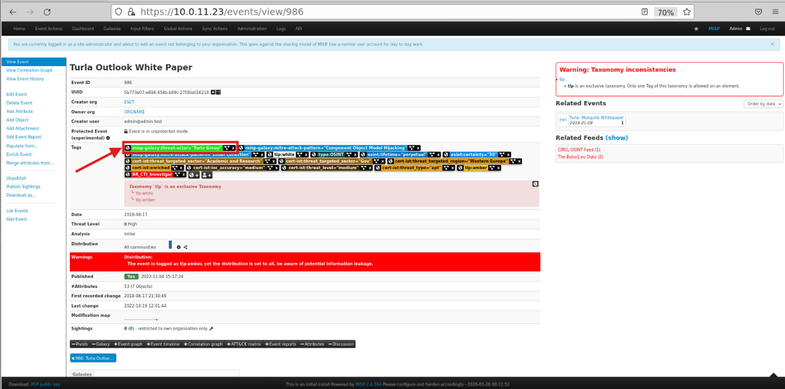<br>
  <em>Figure 7: Reviewing MITRE ATT&CK tactic and technique mappings associated with the Turla threat actor campaign.</em>
</p>

I specifically focused on the `misp-galaxy:threat-actor` tag because galaxy tags within MISP are used to create structured relationships between intelligence events and broader operational entities such as:

- threat actors
- malware families
- intrusion sets
- ransomware groups
- attack patterns
- campaigns
- operational tooling

Unlike standard classification or contextual tags such as:

- `tlp:white`
- `osint`
- `certainty`
- `targeted-sector`
- `targeted-region`
- `threat-level`

which primarily describe sharing permissions, confidence levels, targeting context, or intelligence categorization, the `misp-galaxy:threat-actor` tag specifically associates the event with a known adversary group. In this case, the event was linked directly to the Turla threat actor group.

I clicked directly on the `Turla Group` galaxy tag in order to pivot into additional intelligence events associated with the same adversary. This type of intelligence pivoting is operationally important because threat actors rarely conduct only a single isolated operation. Instead, adversaries often reuse:

- malware,
- infrastructure,
- phishing themes,
- targeting strategies,
- ATT&CK techniques,
- operational tooling

across multiple campaigns over extended periods of time.

After selecting the tag, MISP opened a filtered event view displaying all intelligence events associated with Turla Group activity.

<p align="left">
  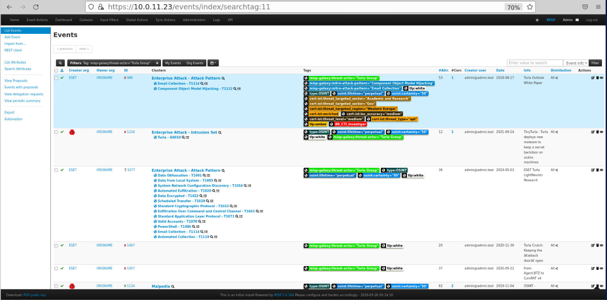<br>
  <em>Figure 8: Reviewing additional intelligence events associated with the Turla Group threat actor tag</em>
</p>

I then reviewed the returned event list and scrolled to the bottom of the page to identify the total number of matching intelligence events associated with the actor. The event summary at the bottom displayed:

`showing 16 records out of 16 total`

This allowed me to determine how many intelligence events within the MISP environment were associated with the Turla Group threat actor tag.

Galaxy tags are operationally useful because they provide structured relationships between:

- threat actors,
- malware families,
- campaigns,
- attack patterns,
- related intelligence events.

This type of structured intelligence tagging allows analysts to move beyond isolated indicators and instead investigate how adversaries operate across multiple campaigns and operational contexts over time.

<blockquote>
I used the galaxy tags because they allow intelligence analysis to move beyond isolated events and into broader adversary tracking workflows. Rather than viewing the Turla Outlook White Paper event as a single standalone intelligence report, pivoting through the Turla Group galaxy tag helped show how MISP connects related intelligence together across multiple campaigns, malware samples, operational reports, and historical activity associated with the same threat actor.
</blockquote>

##### 🔷 Phase 2.3 — Investigate phishing campaign artifacts associated with Turla

Additional Turla-related intelligence events were reviewed to investigate phishing-related artifacts and identify the decoy document used during the campaign. This phase of the investigation focused on understanding how adversaries use socially engineered lure files during phishing operations and how those artifacts are represented within MISP intelligence events.

While reviewing the broader set of Turla-tagged events, I identified a blue tag labeled:

```text
misp-galaxy:mitre-intrusion-set="Turla"
```

<p align="left">
  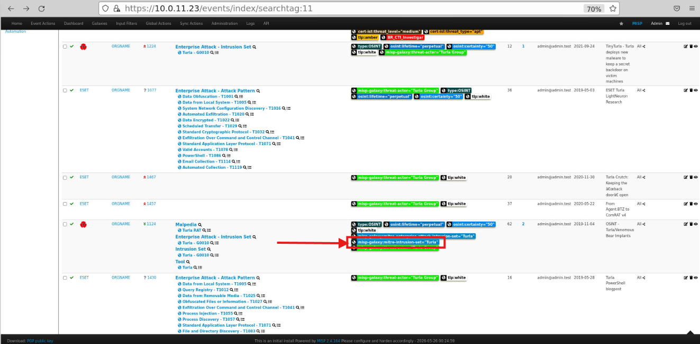<br>
  <em>Figure 9: Identifying the MITRE intrusion set tag associated with Turla activity</em>
</p>

I specifically selected this tag because the investigation required identifying events associated with the `mitre-intrusion-set=turla` label. Unlike the broader `misp-galaxy:threat-actor="Turla Group"` tag used earlier, the `mitre-intrusion-set` tag maps the activity directly to a MITRE ATT&CK intrusion set classification. Intrusion sets represent grouped adversary operations, campaigns, and behaviors associated with a specific threat actor or operational cluster.

Clicking this tag opened a filtered event view showing all events associated with the Turla intrusion set.

<p align="left">
  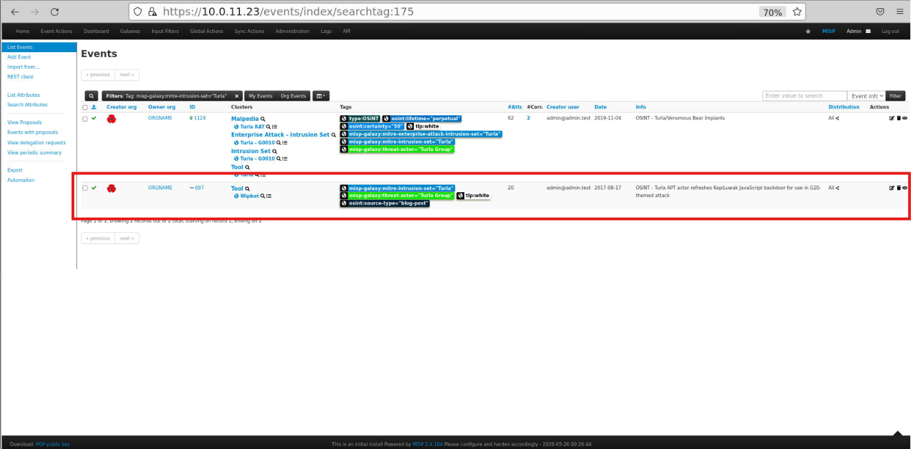<br>
  <em>Figure 10: Reviewing events associated with the Turla MITRE intrusion set tag</em>
</p>

The filtered results displayed two matching events associated with the Turla intrusion set. The investigation task specifically instructed reviewing the oldest event, so I compared the event dates shown within the results table.

The older event was dated: `2017-08-17`, and titled: `OSINT - Turla APT actor refreshes KopiLuwak JavaScript backdoor for use in G20-themed attack`

I opened this older event because older campaign events can provide valuable insight into earlier phishing methods, lure themes, malware deployment approaches, and adversary operational behavior associated with the threat actor.

<p align="left">
  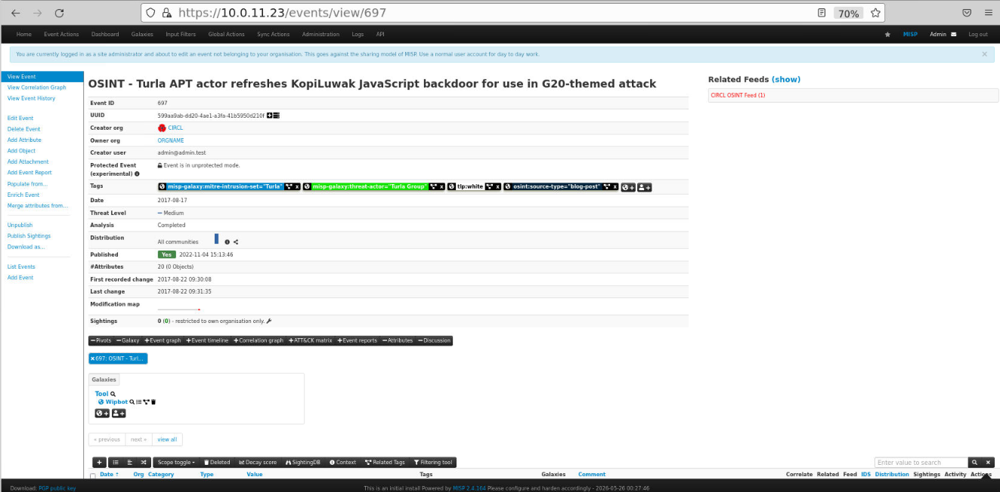<br>
  <em>Figure 11: Reviewing the older Turla phishing-related intelligence event</em>
</p>

After opening the event, I scrolled down into the event’s Attributes table to review the indicators, payload artifacts, malware references, URLs, and phishing-related files associated with the campaign.

Within the Attributes table, I focused specifically on the following columns:

- `Category` — describes the general purpose or classification of the artifact
- `Type` — describes the specific IOC or artifact type
- `Value` — contains the actual observable artifact or indicator
- `Comment` — provides additional analyst context describing the artifact’s purpose or relevance

<p align="left">
  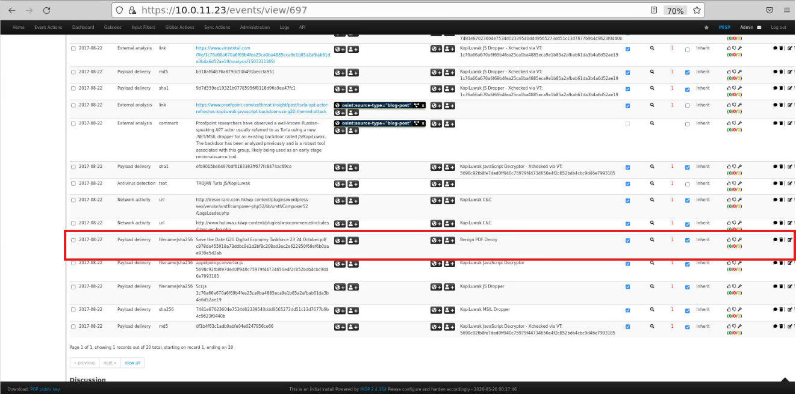<br>
  <em>Figure 12: Reviewing phishing-related payload artifacts and identifying the benign PDF decoy document</em>
</p>

While reviewing the attributes, I identified a row containing the filename:

`Save the Date G20 Digital Economy Taskforce 23 24 October.pdf`

This artifact stood out from the surrounding entries because:

- it was a human-readable PDF document name,
- it matched the G20-themed phishing context referenced in the event title,
- it appeared as a legitimate-looking document rather than malware or scripting content,
- the associated comment explicitly labeled it as: `Benign PDF Decoy`

This was important because phishing campaigns frequently use benign-looking decoy documents to socially engineer victims into opening malicious attachments, trusting attacker communications, or triggering malware execution chains.

Other nearby artifacts within the table represented:

- hashes,
- malware droppers,
- JavaScript payloads,
- URLs,
- malware decryptors,
- infrastructure references.

For example:

- Run.exe
- JavaScript droppers
- SHA1/MD5 hashes
- malicious URLs

represent malware or supporting payload infrastructure rather than the phishing lure document itself.

The PDF decoy file was different because it represented the actual socially engineered document intended to appear legitimate to the victim. In phishing operations, these lure documents are often themed around:

- government meetings,
- conferences,
- invoices,
- schedules,
- corporate communications,
- geopolitical topics.

In this case, the document leveraged a G20-themed topic to increase the likelihood that targeted users would trust and open the attachment.

This step is operationally important because phishing campaigns frequently rely on operationally themed lure documents designed to:

- increase user interaction,
- establish initial access,
- build trust with victims,
- disguise malicious activity within legitimate-looking content.

Reviewing decoy document names can also provide:

- campaign context,
- social engineering themes,
- targeting insight,
- geopolitical relevance,
- victim profiling information.

<blockquote> This phase reinforced how threat intelligence analysis frequently combines technical indicators with contextual campaign details to better understand adversary operations. Rather than focusing only on malware hashes or infrastructure, reviewing the phishing decoy document helped show how attackers socially engineer victims during the early stages of intrusion activity. It also reinforced the importance of distinguishing between actual malware payloads and benign-looking lure documents designed to facilitate user interaction and initial compromise. </blockquote>

</details>

<details>
<summary><strong>▶ Phase 3 — DDoS Malware and Booter Infrastructure Investigation</strong><br>
→ researching DDoS-related infrastructure, malware campaigns, and command-and-control behavior
</summary><br>

This phase focused on investigating DDoS-related intelligence events involving booter infrastructure, malware uploads, and botnet-related communications.

<blockquote>
I shifted into DDoS-related intelligence because telecommunications environments are highly dependent on service availability, making DDoS operations operationally significant from both security and business continuity perspectives.
</blockquote>

##### 🔷 Phase 3.1 — Investigate DDoS booter infrastructure events

Events related to DDoS booters were reviewed to identify associated IP addresses and infrastructure indicators tied to DDoS-for-hire operations. This phase of the investigation focused on understanding how threat intelligence platforms document malicious infrastructure associated with botnet-enabled denial-of-service activity.

To begin the investigation, I searched for the keyword using the `Event info` search type within MISP:

```text
booter
```
<p align="left">
  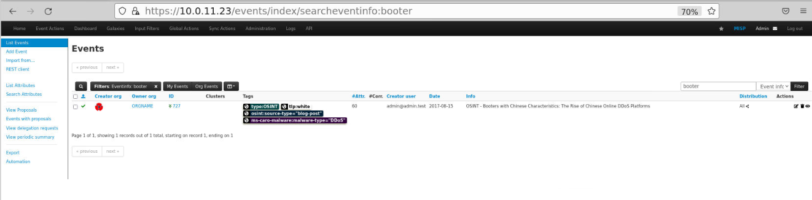<br>
  <em>Figure 13: Searching MISP for DDoS booter-related intelligence events</em>
</p>

I specifically used the `Event info` search type because I wanted MISP to search against the primary event titles and intelligence descriptions rather than every individual indicator stored within the platform. This helped narrow the results to intelligence events directly focused on DDoS booter activity instead of unrelated indicators that may have referenced the word somewhere within a larger dataset.

The returned event titled: `OSINT - Booters with Chinese Characteristics: The Rise of Chinese Online DDoS Platforms`. This was then opened for review.

<p align="left">
  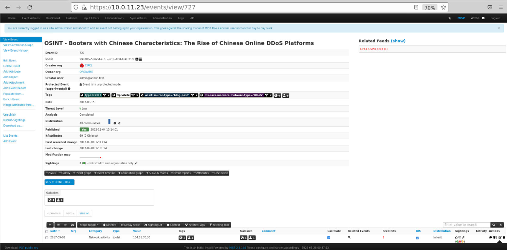<br>
  <em>Figure 14: Reviewing the DDoS booter intelligence event within MISP</em>
</p>

At the top of the event, I first reviewed the high-level event metadata and tags to better understand the overall intelligence context before reviewing the indicators themselves.

The event title indicated that the intelligence report focused on online DDoS booter platforms associated with Chinese-language infrastructure or operational characteristics.

DDoS booters, sometimes referred to as “stressers,” are online services that allow users to launch Distributed Denial of Service (DDoS) attacks by renting access to botnet infrastructure. These services often operate similarly to commercial platforms where attackers pay for temporary access to systems capable of flooding targets with malicious traffic.

In many cases, the infrastructure behind these services includes:

- compromised systems,
- rented servers,
- malware-infected devices,
- command-and-control infrastructure,
- distributed attack nodes.

The tags associated with the event also provided additional operational context. For example:

- `type:OSINT` indicated the intelligence originated from open-source reporting
- `tlp:white` indicated the intelligence was broadly shareable
- `osint-source-type='blog-post'` identified the original intelligence source type
- `ms-caro-malware:malware-type='DDoS'` classified the activity as DDoS-related malware or infrastructure activity

Reviewing this metadata helped establish that the event represented curated threat intelligence associated with known DDoS infrastructure and operational reporting rather than live telemetry from a SIEM or active enterprise environment.

<p align="left">
  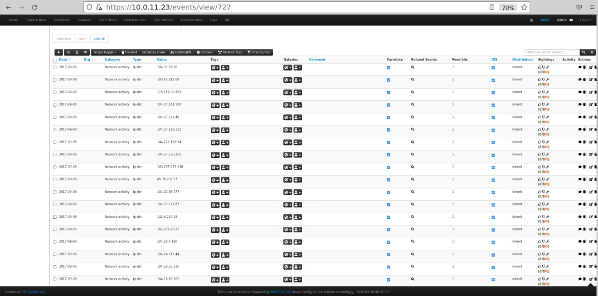<br>
  <em>Figure 15: Reviewing DDoS-related IP infrastructure indicators within the event Attributes table</em>
</p>

Within the Attributes table, I focused specifically on entries where:

The `ip-dst` field represents a destination IP address associated with the event. In threat intelligence contexts, these IPs often represent:

- malicious infrastructure,
- botnet nodes,
- DDoS-related servers,
- attack infrastructure,
- systems associated with adversary operations.

I specifically counted the `ip-dst` entries because the investigation should require to know how many IP addresses were provided within the event. Each row containing `Type = ip-dst` represented a distinct IP indicator associated with the DDoS booter intelligence report.

While reviewing the indicators, I counted a total of: `24`

IP address entries associated with the event.

This step is operationally important because DDoS booter services often rely on distributed infrastructure used to coordinate or facilitate attacks against target systems. Reviewing IP indicators associated with these services helps analysts:

- identify malicious infrastructure,
- enrich detection pipelines,
- support firewall blocking,
- correlate network telemetry,
- monitor known adversary infrastructure,
- support threat hunting workflows.

Indicators reviewed during this phase included:

- IP addresses,
- infrastructure references,
- malware-related indicators,
- associated operational notes.

<blockquote> This phase reinforced how threat intelligence platforms such as MISP are used to organize and operationalize infrastructure intelligence associated with known adversary activity. Although the event was not connected to live SIEM telemetry, the IP indicators represented previously researched infrastructure associated with DDoS booter operations that could later be used operationally within SIEM, firewall, IDS, EDR, or threat hunting workflows to identify systems communicating with known malicious infrastructure. </blockquote>


##### 🔷 Phase 3.2 — Investigate CoalaBot malware upload references

An event related to CoalaBot malware was reviewed to identify external malware upload references such as VirusTotal links and associated original filenames. This phase of the investigation focused on understanding how threat intelligence platforms such as MISP store malware intelligence and how analysts pivot from intelligence records into external malware analysis platforms for deeper investigation.

To begin the investigation, I searched for the keyword using the `Event info` search type within MISP:

```text
coalabot
```

<p align="left">
  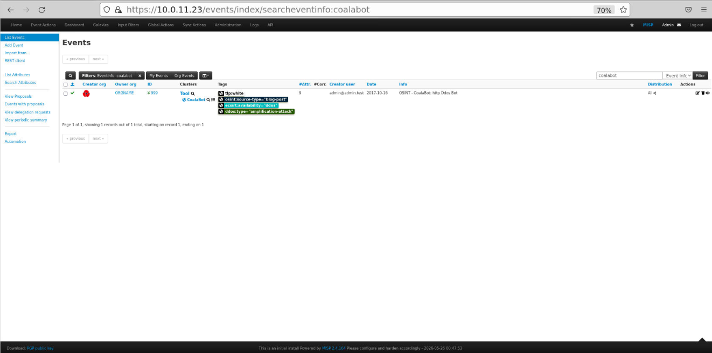<br>
  <em>Figure 16: Searching MISP for CoalaBot-related malware intelligence events</em>
</p>

I specifically used the `Event info` search type because I wanted MISP to search against the actual intelligence event titles and summaries rather than every individual indicator stored inside the platform.

This is important because MISP contains thousands of individual indicators such as:

- IP addresses,
- domains,
- file hashes,
- malware samples,
- URLs,
- filenames,
- email artifacts.

If I had searched all attributes instead, I could have received unrelated results where “CoalaBot” was only briefly mentioned somewhere inside a larger investigation. Searching the `Event info` field instead narrowed the results specifically to intelligence events primarily focused on CoalaBot malware activity.

The returned event was titled: `OSINT - CoalaBot: http Ddos Bot`. This was then opened for investigation.

<p align="left">
  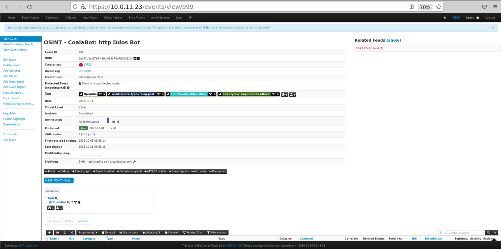<br>
  <em>Figure 17: Reviewing the CoalaBot malware intelligence event within MISP</em>
</p>

At the top of the event, I first reviewed the high-level event metadata and intelligence tags before looking at the actual indicators themselves.

This step matters because the top section of a MISP event essentially explains the overall “story” or intelligence context surrounding the indicators contained within the event. Before analyzing technical artifacts, analysts first want to understand:

- what the malware is,
- what type of activity occurred,
- where the intelligence came from,
- how reliable or shareable the intelligence is,
- what operational category the activity falls under.

The event title indicated that the intelligence report focused on CoalaBot malware associated with HTTP-based Distributed Denial-of-Service (DDoS) activity.

In simple terms, CoalaBot appears to be malware designed to infect systems and allow them to participate in coordinated denial-of-service attacks. In many malware campaigns like this, infected systems become part of a botnet. A botnet is simply a collection of compromised systems remotely controlled by an attacker. The attacker can then command many infected devices simultaneously to flood targets with malicious traffic.

The tags associated with the event provided additional operational context. For example:

- `type:OSINT` indicated the intelligence originated from open-source reporting rather than internal enterprise telemetry
- `tlp:white` indicated the intelligence was broadly shareable
- `osint-source-type='blog-post'` identified the original intelligence source as a public research article
- `ecsirt:availability='ddos'` classified the activity as targeting system availability
- `ddos:type='amplification-attack'` suggested the malware was associated with amplification-style DDoS operations


Reviewing these tags helped establish that this event represented curated threat intelligence gathered from external research rather than live SIEM data or active network monitoring.

After reviewing the overall intelligence context, I moved into the Attributes section of the event to investigate the actual malware-related artifacts contained within the report.

<p align="left">
  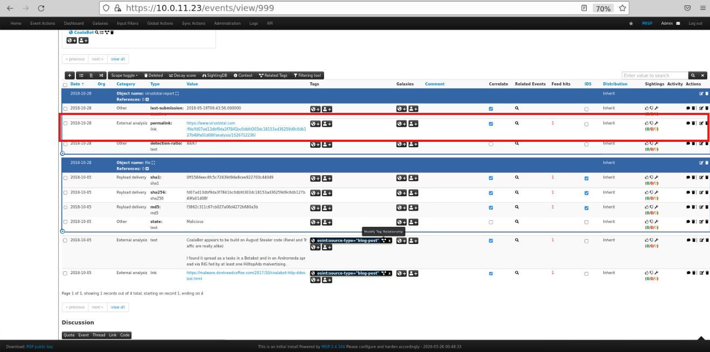<br>
  <em>Figure 18: Reviewing the event Attributes table and identifying the VirusTotal external analysis permalink</em>
</p>

Within the Attributes table, I specifically focused on entries categorized as: `External analysis`

The reason for looking at these entries is because they often contain references to third-party malware analysis platforms such as:

- VirusTotal,
- Hybrid Analysis,
- MalwareBazaar,
- URLScan.

Threat intelligence investigations commonly involve “pivoting” into these external platforms because they provide much deeper visibility into malware samples than MISP alone.

At this point, what I was actually looking at was not the malware file itself, but rather intelligence references associated with the malware investigation. The VirusTotal permalink represented a reference to a malware sample that had previously been uploaded and analyzed externally.

One of the attributes contained a VirusTotal permalink associated with the malware sample. Although the isolated lab VM itself did not have internet access, the URL could still be copied manually into a normal browser outside the lab environment.

The purpose of opening the VirusTotal link was to retrieve additional malware sample metadata that was not directly visible inside MISP itself.

After following the permalink externally, additional malware sample details became visible.

<p align="left">
  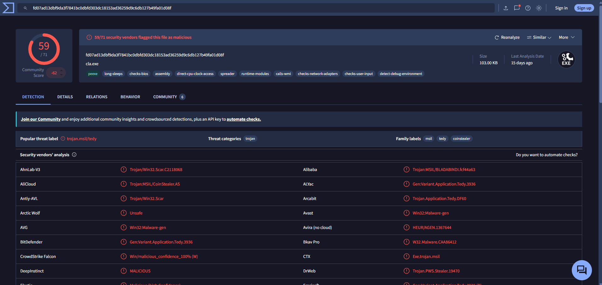<br>
  <em>Figure 19: Reviewing the uploaded malware sample on VirusTotal to identify the original filename and malware metadata</em>
</p>

The VirusTotal page displayed additional malware analysis information associated with the uploaded sample, including:

- antivirus detections,
- malware classifications,
- behavioral tags,
- sample metadata,
- uploaded file details,
- the original filename.

The original filename identified during the investigation was: `cla.exe`

The reason the original filename matters is because malware filenames often provide useful investigative context. Analysts may use filenames to:

- correlate related malware campaigns,
- identify reused malware tooling,
- search SIEM or EDR telemetry,
- locate infected files on endpoints,
- pivot across threat intelligence platforms,
- identify malware delivery patterns.

This process demonstrates how MISP functions as a centralized threat intelligence repository rather than a live detection platform itself. The event stored structured intelligence related to the malware campaign, while VirusTotal provided deeper visibility into the actual malware sample that had been uploaded during prior analysis.

<blockquote> What I was actually doing here was pivoting from a threat intelligence event into a malware analysis platform to gather deeper information about the malware sample itself. MISP provided the structured intelligence record describing the campaign and associated artifacts, while VirusTotal provided additional visibility into the actual uploaded malware sample, including its filename, detections, and malware analysis metadata. This reflects a very common real-world threat intelligence workflow where analysts move between intelligence repositories and malware analysis platforms to enrich investigations and better understand adversary tooling and malware behavior. </blockquote>


##### 🔷 Phase 3.3 — Investigate Rhombus malware command-and-control infrastructure

<p align="left">
  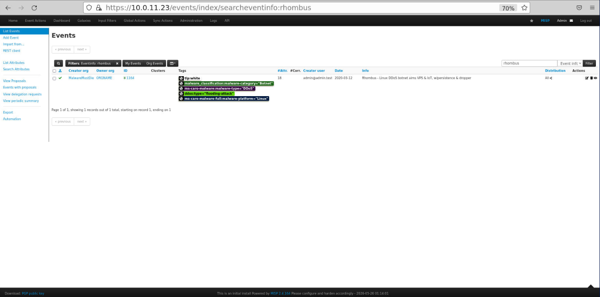<br>
  <em>Figure 20: Searching MISP for intelligence events related to the Rhombus malware family</em>
</p>

The investigation began by searching MISP for the keyword “Rhombus” using the `Event Info` search field. 

This search method was important because the `Event Info` field typically contains the main title or summary of an intelligence investigation. Instead of searching for a single IP address, malware hash, or filename immediately, searching by `Event Info` helps locate the full threat intelligence report associated with a malware campaign or malware family.

The search returned a single event titled: `“Rhombus - Linux DDoS botnet aims VPS & IoT, w/persistence & dropper”`

Even from the title alone, the event already reveals important operational information about the threat.

<ul>
<li><strong>Linux DDoS botnet</strong> indicates the malware is designed to infect Linux systems and use them in distributed denial-of-service attacks</li>
<li><strong>VPS & IoT</strong> suggests the malware targets internet-facing virtual servers and embedded internet-connected devices</li>
<li><strong>Persistence</strong> means the malware attempts to survive system reboots and remain active after infection</li>
<li><strong>Dropper</strong> means the malware installs or deploys another malicious payload onto the infected system</li>
</ul>

This phase demonstrated that MISP events are not simply “alerts” or raw logs, but organized intelligence reports designed to explain malware behavior, attacker infrastructure, operational goals, and associated indicators.

<p align="left">
  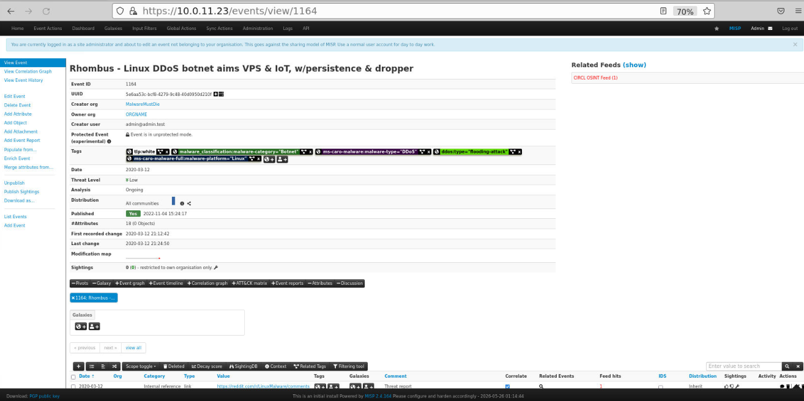<br>
  <em>Figure 21: Reviewing the Rhombus malware event overview and associated intelligence taxonomy tags</em>
</p>

After opening the event, the overview section and associated taxonomy tags were reviewed to better understand the malware’s purpose and classification.

Several tags immediately provided operational context:

<ul>
<li><strong>malware-category="Botnet"</strong> indicates infected systems become remotely controlled bots</li>
<li><strong>malware-type="DDoS"</strong> identifies the malware’s primary function as denial-of-service activity</li>
<li><strong>ddos-type="flooding-attack"</strong> indicates the malware performs network flooding attacks against targets</li>
<li><strong>malware-platform="Linux"</strong> identifies the operating system platform targeted by the malware</li>
</ul>

This matters because analysts often need to quickly understand what a threat does before performing deeper analysis. Structured intelligence tags allow defenders to rapidly classify malware behavior, affected platforms, and attacker objectives without manually reverse engineering every sample.

This also reinforced an important concept about MISP itself.

MISP is not functioning like a live SIEM collecting logs directly from endpoints in real time. Instead, MISP acts as a threat intelligence platform used to organize and investigate known malicious indicators, malware campaigns, adversary infrastructure, research findings, and intelligence reports collected from external and internal sources.

In other words, the analyst is reviewing documented intelligence about known threats rather than actively monitoring live endpoint telemetry.

<p align="left">
  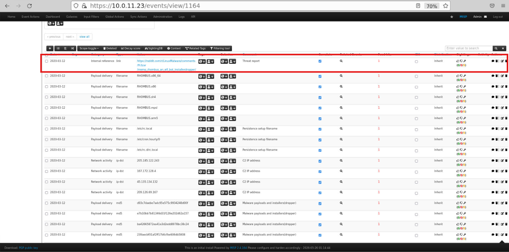<br>
  <em>Figure 22: Reviewing the Internal Reference link associated with the Rhombus malware investigation</em>
</p>

While reviewing the Attributes section of the event, an “Internal reference” link pointing to a Reddit analysis thread was identified.

At first glance, it may seem strange that a Reddit post would appear inside a professional threat intelligence platform. However, this is actually very common in real-world intelligence analysis workflows.

Threat intelligence investigations frequently reference:

<ul>
<li>security research blogs,</li>
<li>reverse engineering writeups,</li>
<li>GitHub investigations,</li>
<li>community research threads,</li>
<li>VirusTotal submissions,</li>
<li>Reddit malware analysis discussions,</li>
<li>threat researcher notes.</li>
</ul>

The reason for this is that malware analysis is often collaborative. Researchers publish findings publicly so defenders can understand how malware behaves, how infections occur, what infrastructure is used, and what indicators defenders should monitor for.

In this case, the Reddit post functioned as the original external malware analysis report explaining how the Rhombus malware operates after infecting systems.

This step was important because the original question specifically asked how defenders could identify whether systems are compromised. That means the analyst needed to move beyond simple indicators and review behavioral analysis explaining what the malware does after infection.

<p align="left">
  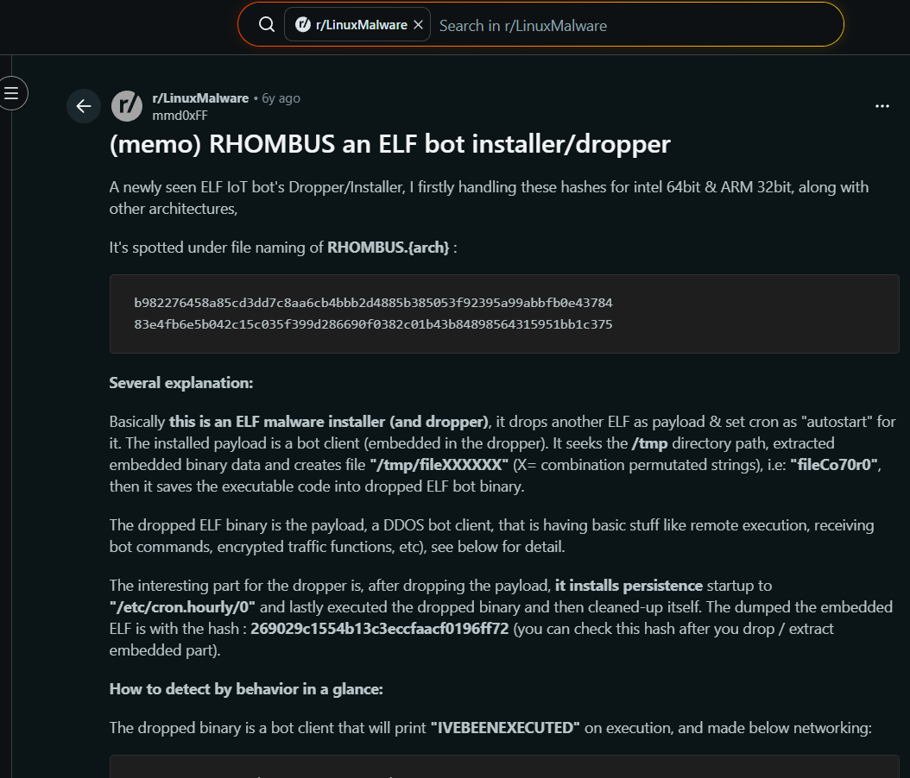<br>
  <em>Figure 23: Reviewing the external malware analysis report describing the Rhombus ELF bot installer and dropper behavior</em>
</p>

After opening the Reddit analysis thread, the report was reviewed to understand the malware’s infection flow and operational behavior.

The post explains that Rhombus is an ELF malware installer and dropper targeting Linux systems and IoT devices.

The report describes how the malware:

<ul>
<li>drops an embedded malicious payload onto the system,</li>
<li>creates persistence mechanisms using cron startup entries,</li>
<li>executes the dropped payload,</li>
<li>turns the infected device into a remotely controlled DDoS bot.</li>
</ul>

The malware also establishes communication with attacker-controlled infrastructure after infection.

This is extremely important operationally because malware rarely acts alone. Once infected, compromised systems often communicate with external infrastructure controlled by attackers. This infrastructure is commonly called <strong>command-and-control (C2)</strong> infrastructure.

C2 servers are used to:

<ul>
<li>register newly infected systems,</li>
<li>send commands to infected hosts,</li>
<li>coordinate DDoS attacks,</li>
<li>download additional malware,</li>
<li>manage botnet operations remotely.</li>
</ul>

The Reddit post also explains how the malware maintains persistence through cron jobs such as:

<ul>
<li><strong>/etc/cron.hourly/0</strong></li>
</ul>

This means the malware attempts to automatically restart itself after reboot so the infected system remains part of the botnet long-term.

The report additionally describes how the malware creates temporary dropped payload files such as:

<ul>
<li><strong>/tmp/fileXXXXXX</strong></li>
</ul>

This level of detail is valuable because defenders can use these behaviors as detection opportunities during forensic investigations or threat hunting activities.

<p align="left">
  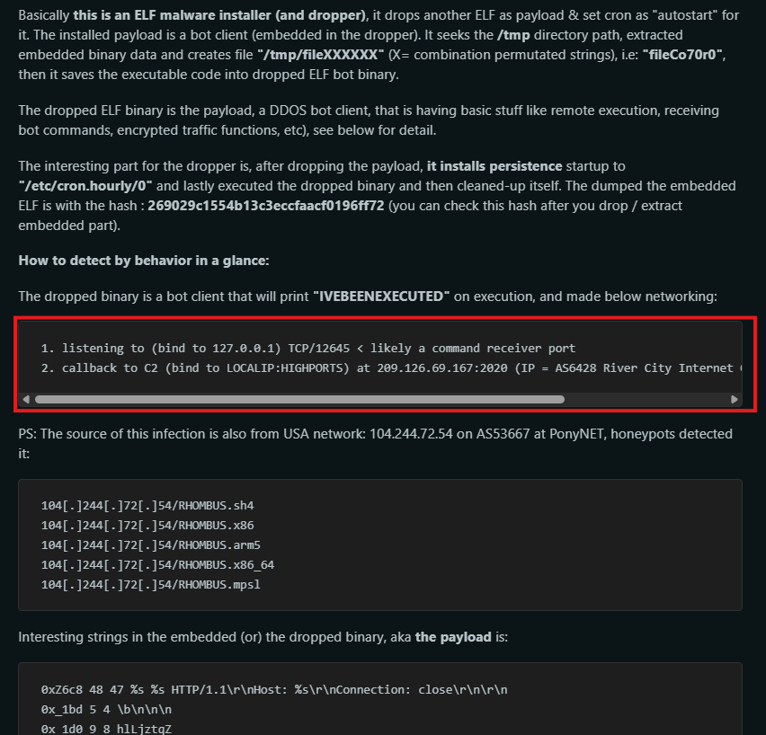<br>
  <em>Figure 24: Identifying the command-and-control callback infrastructure used by the Rhombus malware botnet</em>
</p>

While reviewing the behavioral analysis section of the report, the malware’s callback communication behavior was identified.

The report specifically stated:

<ul>
<li><strong>“callback to C2 ... at 209.126.69.167:2020”</strong></li>
</ul>

This was identified as the correct answer because the question specifically asked for:

<ul>
<li>an IP address and port that infected systems communicate to after compromise.</li>
</ul>

The term “callback” refers to the infected system initiating outbound communication to attacker-controlled infrastructure after infection occurs.

The malware essentially “phones home” to the attacker’s command-and-control server.

The identified indicator:

<ul>
<li><strong>209.126.69.167:2020</strong></li>
</ul>

represents the command-and-control destination used by the malware bot client after infection.

This matters because defenders can use this information operationally for:

<ul>
<li>firewall blocking,</li>
<li>IDS/IPS detections,</li>
<li>SIEM correlation rules,</li>
<li>threat hunting queries,</li>
<li>network traffic analysis,</li>
<li>incident response investigations.</li>
</ul>

If defenders observe internal systems communicating with known malicious C2 infrastructure such as 209.126.69.167:2020, it may indicate active malware infection or compromised systems participating in botnet activity.

This investigation therefore shifted from simply identifying malware files into understanding real adversary infrastructure and post-compromise communication behavior.

<blockquote>
This phase reinforced how threat intelligence analysis often involves pivoting from structured intelligence events into external research reports to better understand malware behavior, persistence mechanisms, botnet operations, and command-and-control communication patterns that defenders can monitor for within enterprise environments.
</blockquote>


<details>
<summary><strong>▶ Phase 4 — MiVoice Exploitation and Lorenz Ransomware Intelligence Analysis</strong><br>
→ investigating ransomware exploitation activity, affected software versions, and persistence artifacts
</summary><br>

This phase focused on reviewing intelligence related to MiVoice exploitation activity and associated Lorenz ransomware operations.

<blockquote>
I moved into vulnerability exploitation analysis because ransomware operations frequently begin with exploitation of externally exposed services, making software version awareness and exploitation visibility operationally important.
</blockquote>

##### 🔷 Phase 4.1 — Investigate MiVoice-related CVE exploitation activity

MiVoice-related intelligence events were reviewed to identify the CVE associated with active exploitation activity and determine which software versions were affected.

A MISP intelligence search was performed using the keyword `mivoice` within the Event Info field to identify events related to MiVoice exploitation activity and associated ransomware operations.


<p align="left">
  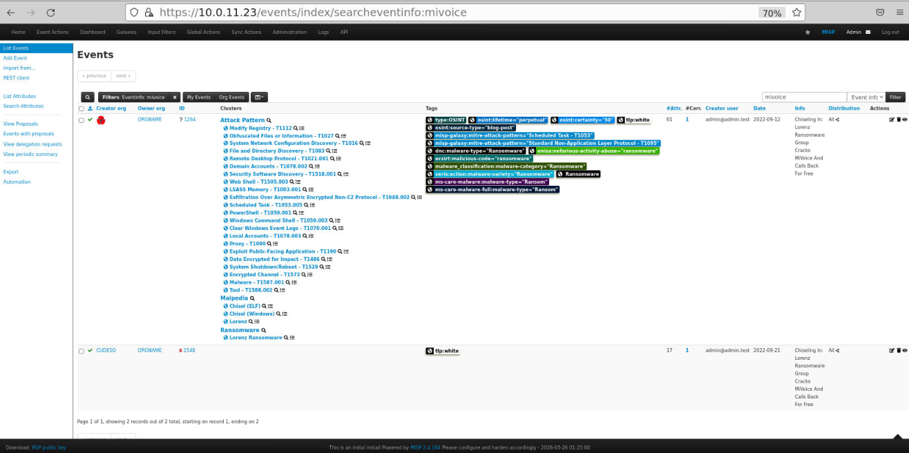<br>
  <em>Figure 25: Searching MISP Event Info entries for MiVoice-related intelligence events</em>
</p>

The search returned multiple events associated with MiVoice activity. The primary event selected for investigation was titled: `Chiseling In: Lorenz Ransomware Group Cracks MiVoice And Calls Back For Free`.

This event was selected because it contained significantly more ATT&CK mappings, ransomware classifications, behavioral tags, and operational context than the other result. In intelligence analysis, events containing richer tagging and more mapped techniques typically provide stronger investigative value because they contain additional indicators, tactics, and campaign context that analysts can pivot from during research.

<p align="left">
  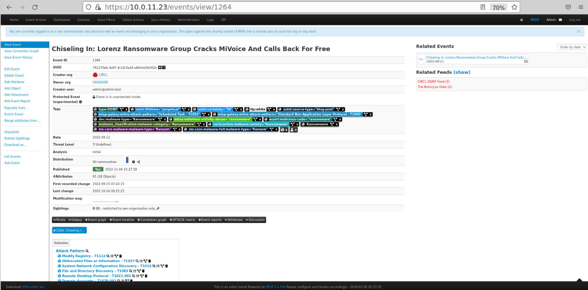<br>
  <em>Figure 26: Reviewing the MiVoice ransomware intelligence event and associated ATT&amp;CK mappings</em>
</p>

The event itself described a ransomware intrusion involving the Lorenz ransomware group and exploitation activity targeting Mitel MiVoice systems. The tags and ATT&CK mappings indicated techniques associated with ransomware deployment, remote access, encrypted communications, PowerShell activity, lateral movement, and exploitation of public-facing applications.

At this stage, MISP was functioning as an intelligence pivot point rather than the direct source of the final answer. The event provided the campaign context and identified the affected technology, but the vulnerable software versions themselves required external research. This reflects a common real-world threat intelligence workflow where analysts use MISP events to identify relevant campaigns, then pivot into vendor advisories, CVE documentation, and external research sources to gather deeper vulnerability information.

Additional research was then performed externally using searches for: `CVE-2022-29499` and `CVE-2022-29499 MiVoice vulnerable versions`

This research identified the exploited vulnerability as: `CVE-2022-29499`

Further review of vulnerability advisories and external reporting revealed that the affected MiVoice Connect versions included: `R19.2 SP3 and earlier`

This phase demonstrated how threat intelligence investigations frequently extend beyond the intelligence platform itself. MISP provided the operational lead and campaign context, while external vulnerability research was required to determine exactly which software versions were vulnerable and potentially exposed to exploitation.

This step is important because threat intelligence reporting often links exploitation activity directly to:

- vulnerable software versions,
- exploit availability,
- adversary targeting trends,
- operational risk exposure.

Reviewing affected versions also supports:

- vulnerability prioritization,
- patch management awareness,
- exposure assessment.

##### 🔷 Phase 4.2 — Review Arctic Wolf reporting and persistence-related artifacts

The MiVoice ransomware event contained several external references and detection artifacts, including Suricata rules, GitHub resources, and external research links. During review of the event Attributes table, attention was focused on the linked Arctic Wolf report because it was directly related to the ransomware intrusion itself and appeared to contain deeper incident-response and threat-hunting details beyond basic detection content.

<p align="left">
  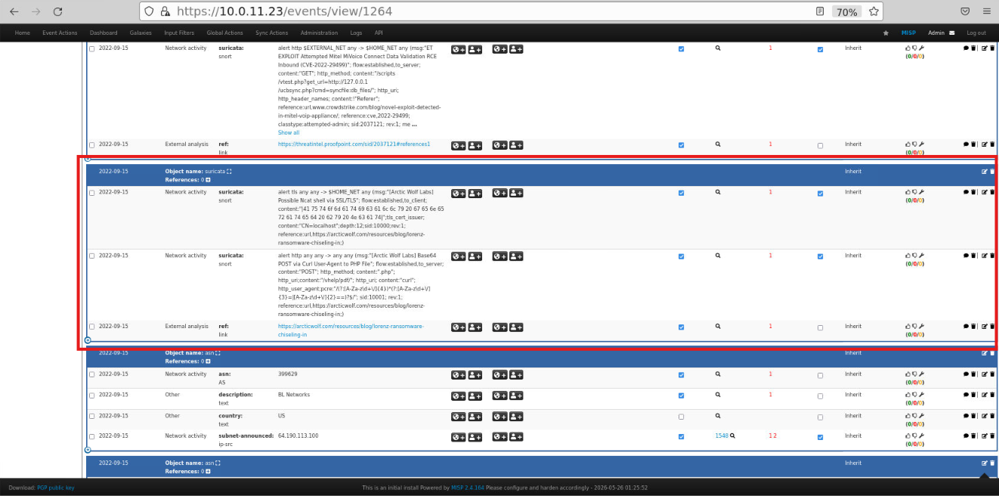<br>
  <em>Figure 27: Reviewing the MiVoice ransomware intelligence event and associated ATT&CK mappings</em>
</p>

The surrounding entries in the event primarily consisted of Suricata IDS detection rules and GitHub-hosted detection content. Those resources were operationally useful for identifying malicious network traffic and building detections, but they did not fully explain how the attackers maintained access after the initial compromise. The Arctic Wolf report was selected because it represented a full incident-response investigation documenting attacker behavior, persistence activity, malware deployment, and post-exploitation actions observed during the ransomware intrusion.

The linked Arctic Wolf report was then reviewed externally to identify persistence-related artifacts associated with the attack. During analysis of the “Technical Analysis” section, the report described how the attackers returned to the compromised Mitel MiVoice device after the initial exploitation phase and interacted with a malicious webshell deployed onto the system.


<p align="left">
  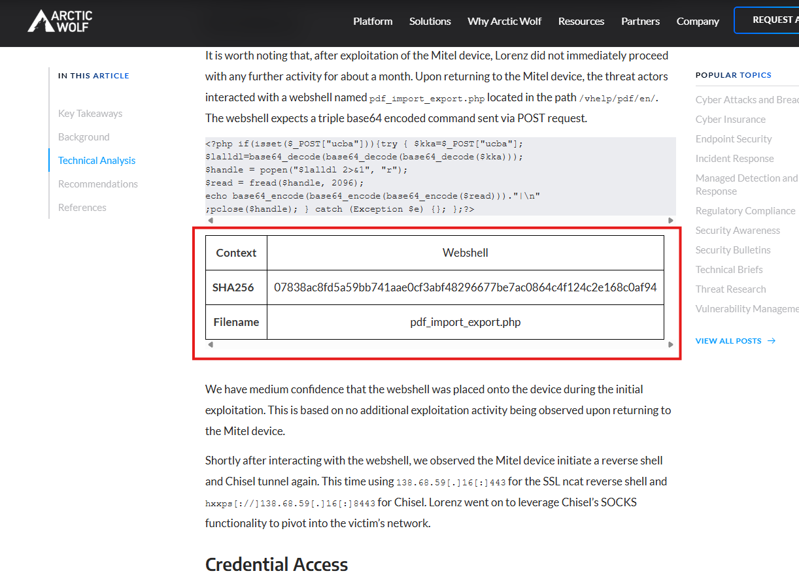<br>
  <em>Figure 28: Reviewing persistence-related webshell artifacts and associated SHA256 hash values within the Arctic Wolf technical analysis report</em>
</p>


The report identified the malicious persistence artifact as: `pdf_import_export.php`

with the associated SHA256 hash: `07838ac8fd5a59bb741aae0cf3abf48296677be7ac0864c4f124c2e168c0af94`

This file was important because it functioned as a webshell, which is a malicious server-side script that allows attackers to remotely execute commands on a compromised web server or application appliance. In this case, the attackers deployed the PHP-based webshell onto the MiVoice device after exploiting the vulnerable service. The report explained that the webshell accepted attacker-supplied commands through HTTP POST requests and enabled the threat actors to regain access to the compromised system later without needing to repeat the original exploitation process.

The SHA256 hash was equally important because cryptographic hashes uniquely identify specific malware or malicious files. Defenders commonly use hashes during incident response, EDR investigations, SIEM correlation, IOC matching, malware blocking, and threat hunting operations to determine whether identical malicious files exist elsewhere in the environment.

Reviewing persistence-related reporting was operationally valuable because persistence artifacts frequently provide some of the strongest detection and containment opportunities during post-compromise investigations. Unlike high-level campaign summaries, persistence artifacts expose the exact files, scripts, hashes, and techniques adversaries rely on to maintain long-term access within victim environments.

<blockquote> I prioritized the Arctic Wolf reporting because it provided a detailed incident-response investigation explaining how the attackers exploited the vulnerable MiVoice system, established persistence, and maintained access after the initial compromise. Unlike the GitHub Sigma and Suricata references, which mainly focused on detection logic and alerting, the Arctic Wolf article exposed the actual operational artifacts used during the intrusion, including the malicious webshell filename and associated SHA256 hash. Reviewing these persistence-related artifacts was important because they provide defenders with concrete indicators that can be used for threat hunting, IOC matching, forensic analysis, malware blocking, and identifying compromised systems across an environment. </blockquote>


##### 🔷 Phase 4.3 — Review Lorenz ransomware galaxy information

The Lorenz ransomware galaxy entry within MISP was reviewed to identify historical and contextual intelligence associated with the ransomware group, including when the group first became operationally active.

<p align="left">
  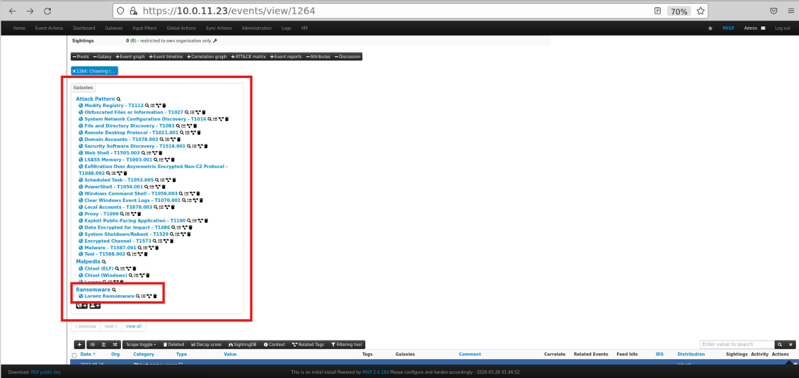<br>
  <em>Figure 29: Reviewing the Galaxies section within the Lorenz ransomware MiVoice event and selecting the Lorenz Ransomware galaxy entry</em>
</p>

Unlike the Attributes section, which mainly stores operational indicators such as IP addresses, hashes, filenames, URLs, and detection rules, the Galaxies section in MISP provides higher-level contextual threat intelligence. In MISP terminology, a “Galaxy” is essentially a structured intelligence profile used to categorize and track broader threat concepts such as ransomware groups, malware families, threat actors, attack patterns, tools, or campaigns.

In this case, the Lorenz Ransomware galaxy entry represented a contextual intelligence profile for the Lorenz ransomware group itself rather than a single indicator or artifact. Reviewing this information helped provide background on the threat actor behind the MiVoice attacks, including when the ransomware operation was first observed and how long it had been active.

<p align="left">
  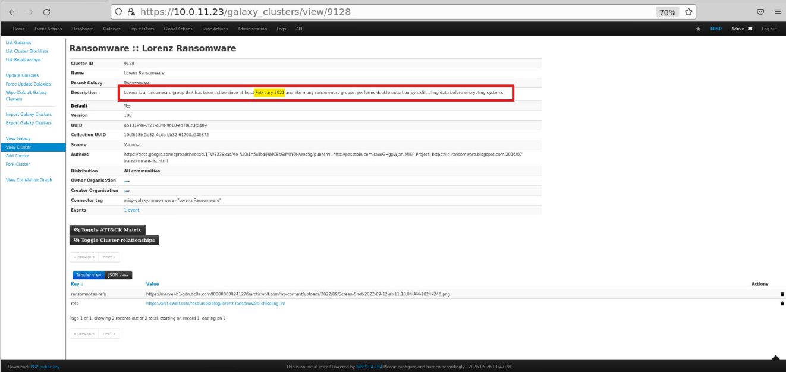<br>
  <em>Figure 30: Reviewing the Lorenz Ransomware galaxy details to identify the group’s historical activity timeline and contextual threat intelligence</em>
</p>

The galaxy details indicated that Lorenz had been active since at least February 2021. This type of information is operationally valuable because analysts are not only trying to identify technical indicators during an investigation, but also attempting to understand the broader adversary ecosystem surrounding an attack. Knowing when a ransomware group first appeared helps analysts evaluate campaign maturity, track long-term activity trends, correlate related incidents over time, and better understand how a threat actor evolves operationally.

<blockquote> Reviewing the ransomware galaxy details clarified how MISP combines low-level operational indicators with higher-level adversary intelligence. While earlier investigation steps focused on concrete artifacts like hashes, filenames, IP addresses, and malware samples, the Galaxy section provided broader context about the actual ransomware group behind the activity, including its historical timeline, operational background, and long-term threat relevance. </blockquote>

</details>

---

### Threat Intelligence Investigation Summary

The investigation began by reviewing DDoS “booter” infrastructure events. Booters are illegal DDoS-for-hire services that allow users to rent botnets in order to launch distributed denial-of-service attacks against targets. Within the associated MISP event, the Attributes table contained multiple `ip-dst` indicators representing infrastructure associated with the booter ecosystem. Reviewing these indicators demonstrated how MISP stores operational threat intelligence artifacts such as malicious IP addresses, malware-related infrastructure, and network activity indicators that analysts can use for detection, blocking, enrichment, and threat hunting purposes.

Additional event analysis focused on the CoalaBot malware event, where external malware analysis references were reviewed. The event contained a VirusTotal permalink associated with a malware sample upload. By pivoting from the MISP event into the VirusTotal analysis page, the original malware filename was identified. This demonstrated how MISP events frequently act as centralized intelligence aggregation points that connect analysts to external malware analysis platforms, sandbox reports, malware repositories, and additional investigative resources. The investigation also reinforced how hashes, filenames, and malware upload references help analysts correlate malware campaigns and identify reused malware artifacts across environments.

Further investigation centered on the Rhombus Linux DDoS botnet malware event. The event contained an Internal Reference link pointing to a Reddit-based malware analysis report. Reviewing the report revealed behavioral details regarding the malware installer, persistence mechanisms, payload delivery process, command-and-control communications, and DDoS functionality. Most importantly, the analysis identified the C2 infrastructure address `209.126.69.167:2020`, which infected systems attempted to contact after compromise. This portion of the lab demonstrated how threat intelligence often extends beyond simple indicators and includes analyst-written technical reporting that explains malware behavior, infection chains, persistence methods, and attacker infrastructure in operational detail.

The investigation then shifted toward ransomware-related threat intelligence involving the Lorenz ransomware group and MiVoice exploitation activity. The associated MISP event referenced public reporting describing attacks against vulnerable Mitel MiVoice Connect systems. Through external research correlated with the event data, the exploited vulnerability was identified as `CVE-2022-29499`, a critical remote code execution vulnerability affecting vulnerable MiVoice Connect deployments. Additional research identified affected software versions, including `R19.2 SP3 (22.20.2300.0) and earlier` as well as `R14.x and earlier`. This phase demonstrated how analysts often combine MISP intelligence with external vendor advisories, vulnerability databases, and public reporting to fully understand exploited vulnerabilities and affected technologies.

The same MiVoice/Lorenz event was also used to review linked Arctic Wolf incident response reporting. Unlike earlier indicators and malware references, the Arctic Wolf article provided deeper operational context regarding attacker persistence techniques, deployed webshells, and post-exploitation behavior. During review of the report, the malicious persistence file `pdf_import_export.php` and its associated SHA256 hash were identified. This portion of the investigation highlighted how external threat research reports frequently provide highly valuable operational intelligence beyond what exists directly inside a MISP event, including persistence artifacts, attacker tradecraft, malware deployment methods, and forensic detection opportunities.

Finally, the investigation concluded with review of the MISP Galaxy entry associated with Lorenz Ransomware. Unlike Attributes, which primarily contain technical indicators such as hashes, IP addresses, filenames, and URLs, the Galaxy section provided higher-level contextual intelligence about the ransomware group itself. Reviewing the Lorenz Ransomware galaxy entry revealed that the group had been active since at least February 2021. This demonstrated how MISP combines both low-level operational indicators and broader adversary intelligence to support long-term threat tracking, campaign attribution, ransomware profiling, and strategic threat analysis.

Overall, the lab demonstrated how modern threat intelligence investigations involve far more than simply collecting indicators of compromise. Analysts continuously pivot between operational artifacts, malware reports, vulnerability research, ransomware intelligence, behavioral analysis, external reporting, and adversary context in order to build a complete understanding of malicious activity and improve detection, threat hunting, incident response, and defensive decision-making capabilities.

---

### What I Learned (Skills Demonstrated)

Through this workflow, I learned how to:

- Use MISP to perform operational threat intelligence research and event analysis.
- Investigate ransomware campaigns and extract operational indicators from intelligence events.
- Analyze YARA rules and malware-related behavioral artifacts.
- Use ATT&CK mappings to better understand adversary tactics and operational behavior.
- Pivot through galaxy tags and related events to investigate threat actor activity.
- Research phishing campaigns, malware infrastructure, and command-and-control behavior.
- Review malware upload references and external intelligence reporting.
- Investigate vulnerability exploitation activity and associated software exposure.
- Correlate indicators, intelligence reporting, and malware artifacts into operational threat analysis findings.

Overall, this workflow exercise strengthened my understanding of how Threat Intelligence Platforms support operational security analysis and gave me more confidence navigating MISP events, ATT&CK mappings, malware intelligence, and adversary research workflows during real-world threat intelligence investigations.
